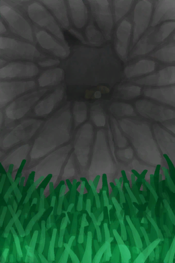

# Area  
## Outdoor  
> [ Outdoor](outdoor.md)
  

<a href="AcidLake.md" style="color:black">Acid Lake</a>

<a href="Atoll.md" style="color:black">Atoll</a>

<a href="Bay.md" style="color:black">Bay</a>

<a href="Beach.md" style="color:black">Beach</a>

<a href="BirdRock.md" style="color:black">Bird Rock</a>

<a href="DeepJungle.md" style="color:black">Deep Jungle</a>

<a href="DesolateBeach.md" style="color:black">Desolate Beach</a>

<a href="GrasslandsE.md" style="color:black">Eastern Grasslands</a>

<a href="HighlandsEastern.md" style="color:black">Eastern Highlands</a>

<a href="Enclosure.md" style="color:black">Enclosure</a>

<a href="HighlandHole.md" style="color:black">Highland Hole</a>

<a href="Jungle.md" style="color:black">Jungle</a>

<a href="JungleHighlands.md" style="color:black">Jungle Highlands</a>

<a href="Outskirts.md" style="color:black">Jungle Outskirts</a>

<a href="Mangroves.md" style="color:black">Mangrove Forest</a>

<a href="Raft.md" style="color:black">Raft</a>

<a href="Rocks.md" style="color:black">Rocks</a>

<a href="Cove.md" style="color:black">Secret Cove</a>

<a href="SecretValley.md" style="color:black">Secret Valley</a>

<a href="Volcano.md" style="color:black">Volcano</a>

<a href="GrasslandsW.md" style="color:black">Western Grasslands</a>

<a href="HighlandsWestern.md" style="color:black">Western Highlands</a>

<a href="Wetlands.md" style="color:black">Wetland Jungle</a>

  
  
## Indoor  
> [ Indoor](tag_EnvIndoors.md)
  

<a href="CaveBats.md" style="color:black">Bat Cave</a>

<a href="Cellar.md" style="color:black">Cellar</a>

<a href="DarkCave.md" style="color:black">Dark Cave</a>

<a href="CaveGrasslands.md" style="color:black">Grasslands Cave</a>

<a href="MacaqueDen.md" style="color:black">Macaque Den</a>

<a href="MudHut.md" style="color:black">Mud Hut</a>

<a href="MudHutRuins.md" style="color:black">Mud Hut</a>

<a href="PlaneCrash.md" style="color:black">Plane Crash</a>

<a href="CaveSea.md" style="color:black">Sea Cave</a>

<a href="Shed.md" style="color:black">Shed</a>

<a href="StoneHut.md" style="color:black">Stone Hut</a>

<a href="CaveTidal.md" style="color:black">Tidal Cave</a>

  
  
## Cave System  
  

<a href="CrystalChamber.md" style="color:black">Crystal Chamber</a>

<a href="DampChamber.md" style="color:black">Damp Chamber</a>

<a href="DarkChamber.md" style="color:black">Darkness</a>

<a href="FloodedChamber.md" style="color:black">Flooded Chamber</a>

<a href="HighChamber.md" style="color:black">High Chamber</a>

<a href="LowChamber.md" style="color:black">Low Chamber</a>

<a href="MidChamber.md" style="color:black">Medium Chamber</a>

<a href="NarrowTunnel.md" style="color:black">Narrow Tunnel</a>

<a href="Tunnel.md" style="color:black">Tunnel</a>

  
  

