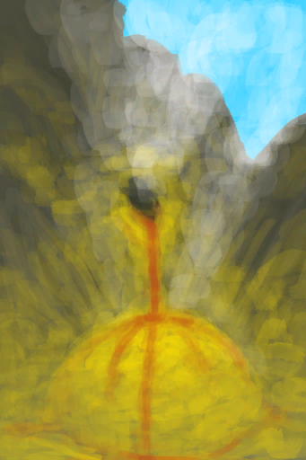
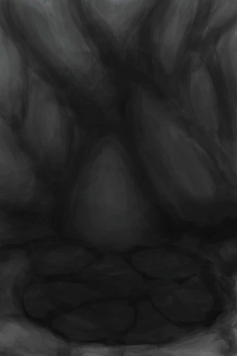
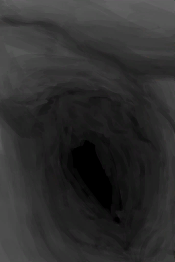
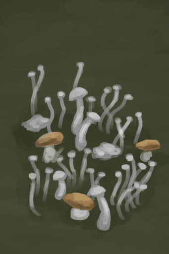
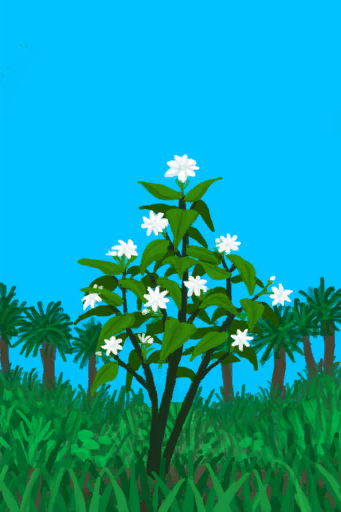
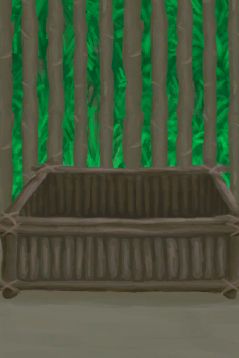
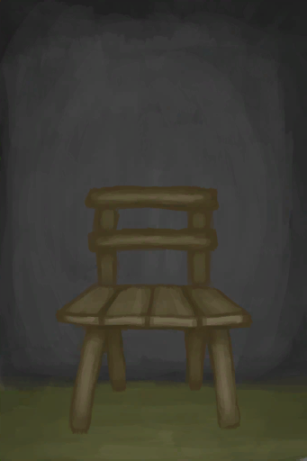
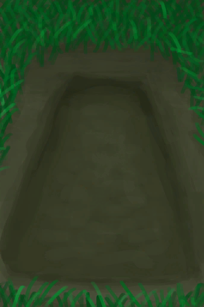
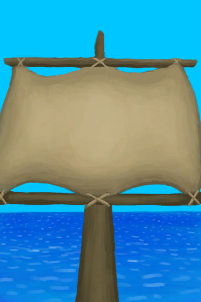
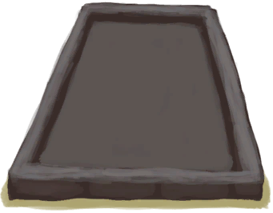

# Location Cards  
## Area  

<a href="BatColony.md" style="color:black">Bat Colony</a>

<a href="Path_CoveToBirdRock.md" style="color:black">Bird Rock</a>

<a href="Path_DesolateBeachToBirdRock.md" style="color:black">Bird Rock</a>

<a href="VentBrimstone.md" style="color:black">Brimstone Vent</a>

<a href="TunnelEntranceClosed.md" style="color:black">Collapsed Tunnel Entrance</a>

<a href="CopperVein.md" style="color:black">Copper Vein</a>

<a href="DampChamberEntrance.md" style="color:black">Damp Chamber</a>

<a href="Debris.md" style="color:black">Debris</a>

<a href="Path_BirdRockToDesolateBeach.md" style="color:black">Desolate Beach</a>

<a href="AcidLakePuddle.md" style="color:black">Dry Acid Lake</a>

<a href="CavePond.md" style="color:black">Dry Cave Pond</a>

<a href="CavePuddle.md" style="color:black">Dry Puddle</a>

<a href="Puddle.md" style="color:black">Dry Puddle</a>

<a href="TidePoolFlooded.md" style="color:black">Flooded Tide Pool</a>

<a href="HighlandHoleNoRope.md" style="color:black">Hole</a>

<a href="MacaqueDenEntrance.md" style="color:black">Macaque Den</a>

<a href="CrystalChamberEntranceClosed.md" style="color:black">Narrow Passage</a>

<a href="DarkCaveCaveEntranceClosed.md" style="color:black">Narrow Passage</a>

<a href="DarkChamberCaveEntranceClosed.md" style="color:black">Narrow Passage</a>

<a href="FloodedChamberEntranceClosed.md" style="color:black">Narrow Passage</a>

<a href="HighChamberEntranceClosed.md" style="color:black">Narrow Passage</a>

<a href="NarrowTunnelEntrance.md" style="color:black">Narrow Tunnel</a>

<a href="Path_BirdRockToRocks.md" style="color:black">Rocks</a>

<a href="SandSource.md" style="color:black">Sand</a>

<a href="Sea_Atoll.md" style="color:black">Sea</a>

<a href="Sea_Bay.md" style="color:black">Sea</a>

<a href="Sea_Beach.md" style="color:black">Sea</a>

<a href="Sea_Cove.md" style="color:black">Sea</a>

<a href="Sea_DesolateBeach.md" style="color:black">Sea</a>

<a href="Sea_Mangroves.md" style="color:black">Sea</a>

<a href="Sea_Rocks.md" style="color:black">Sea</a>

<a href="Sea_Cave.md" style="color:black">Seawater</a>

<a href="ShaftHighChamberToMidChamber.md" style="color:black">Shaft</a>

<a href="ShaftMidChamberToLowChamber.md" style="color:black">Shaft</a>

<a href="Shipwreck.md" style="color:black">Shipwreck</a>

<a href="Skeleton.md" style="color:black">Skeleton</a>

<a href="TidePool.md" style="color:black">Tide Pool</a>

<a href="WallScratchings.md" style="color:black">Wall Scratchings</a>

  
  
## Container  

<a href="BasketPlaced.md" style="color:black">Basket</a>

<a href="Bookshelf.md" style="color:black">Bookshelf</a>

<a href="ClayPotCoolerOff.md" style="color:black">Clay Pot Cooler</a>

<a href="ClayPotCoolerOn.md" style="color:black">Clay Pot Cooler</a>

<a href="LifeRaftDeflated.md" style="color:black">Deflated Life Raft</a>

<a href="LuggageAPlaced.md" style="color:black">Luggage</a>

<a href="LuggageCPlaced.md" style="color:black">Luggage</a>

<a href="Shelf.md" style="color:black">Shelf</a>

<a href="ChestFarmer.md" style="color:black">Storage Chest</a>

<a href="ChestPlaced.md" style="color:black">Storage Chest</a>

<a href="TrunkPerkPlaced.md" style="color:black">Super Survival Trunk 2000</a>

<a href="SupplyChestRaft.md" style="color:black">Supply Chest</a>

<a href="TentDeployed.md" style="color:black">Tent</a>

<a href="TrunkPlaced.md" style="color:black">Trunk</a>

  
  
## Farm  

<a href="CropPlotAlmondTree.md" style="color:black">Almond Tree Crop Plot</a>

<a href="CropPlotAloeVera.md" style="color:black">Aloe Vera Crop Plot</a>

<a href="MushroomBedAssorted.md" style="color:black">Assorted Mushrooms Bed</a>

<a href="CropPlotBananaTree.md" style="color:black">Banana Crop Plot</a>

<a href="CropPlotChilies.md" style="color:black">Chili Crop Plot</a>

<a href="CropPlotChinaRose.md" style="color:black">China Rose Crop Plot</a>

<a href="CropPlotCinchonaTree.md" style="color:black">Cinchona Crop Plot</a>

<a href="CropPlotCoffee.md" style="color:black">Coffee Crop Plot</a>

<a href="CropPlotEmpty.md" style="color:black">Empty Crop Plot</a>

<a href="MushroomBedEmpty.md" style="color:black">Empty Mushroom Bed</a>

<a href="CropPlotGinger.md" style="color:black">Ginger Crop Plot</a>

<a href="CropPlotJasmine.md" style="color:black">Jasmine Crop Plot</a>

<a href="CropPlotKava.md" style="color:black">Kava Crop Plot</a>

<a href="CropPlotLemonGrass.md" style="color:black">Lemon Grass Crop Plot</a>

<a href="MushroomBedMagic.md" style="color:black">Magic Mushroom Bed</a>

<a href="CropPlotMangoTree.md" style="color:black">Mango Crop Plot</a>

<a href="CropPlotNipaPalm.md" style="color:black">Nipa Palm Crop Plot</a>

<a href="CropPlotPalmBush.md" style="color:black">Palm Bush Crop Plot</a>

<a href="CropPlotPalmTree.md" style="color:black">Palm Tree Crop Plot</a>

<a href="MushroomBedPuffballs.md" style="color:black">Puffball Bed</a>

<a href="CropPlotRice.md" style="color:black">Rice Crop Plot</a>

<a href="RicePaddy.md" style="color:black">Rice Paddy</a>

<a href="CropPlotRuined.md" style="color:black">Ruined Crop Plot</a>

<a href="CropPlotSagoPalm.md" style="color:black">Sago Palm Crop Plot</a>

<a href="CropPlotSnakeGrass.md" style="color:black">Snake Grass Crop Plot</a>

<a href="CropPlotSpiderLily.md" style="color:black">Spider Lily Crop Plot</a>

<a href="CropPlotWeevilLily.md" style="color:black">Weevil Lily Crop Plot</a>

<a href="CropPlotWildJujube.md" style="color:black">Wild Jujube Crop Plot</a>

<a href="CropPlotYam.md" style="color:black">Yam Crop Plot</a>

  
  
## Plant  

<a href="AloeVera.md" style="color:black">Aloe Vera</a>

<a href="AssortedMushroomsPlant.md" style="color:black">Assorted Mushrooms</a>

<a href="BananaTree.md" style="color:black">Banana Tree</a>

<a href="ChiliPlant.md" style="color:black">Chilli Plant</a>

<a href="ChinaRosePlant.md" style="color:black">China Rose</a>

<a href="CinchonaTree.md" style="color:black">Cinchona Tree</a>

<a href="BananaTreeCleared.md" style="color:black">Cleared Banana Tree</a>

<a href="CinchonaTreeCleared.md" style="color:black">Cleared Cinchona Tree</a>

<a href="MangoTreeCleared.md" style="color:black">Cleared Mango Tree</a>

<a href="PalmTreeCleared.md" style="color:black">Cleared Palm Tree</a>

<a href="TropicalAlmondTreeCleared.md" style="color:black">Cleared Tropical Almond Tree</a>

<a href="WildJujubeCleared.md" style="color:black">Cleared Wild Jujube</a>

<a href="CoffeePlant.md" style="color:black">Coffee Bush</a>

<a href="CropPlotDry.md" style="color:black">Dry Crop Plot</a>

<a href="MushroomBedDry.md" style="color:black">Dry Mushroom Bed</a>

<a href="LargeTreeFelled.md" style="color:black">Felled Large Tree</a>

<a href="PalmTreeFelled.md" style="color:black">Felled Palm Tree</a>

<a href="SagoPalmFelled.md" style="color:black">Felled Sago Palm</a>

<a href="GingerPlant.md" style="color:black">Ginger Plant</a>

<a href="JasminePlant.md" style="color:black">Jasmine Flowers</a>

<a href="KavaPlant.md" style="color:black">Kava Plant</a>

<a href="LargeTree.md" style="color:black">Large Tree</a>

<a href="Lemongrass.md" style="color:black">Lemongrass</a>

<a href="MagicMushroomsPlant.md" style="color:black">Magic Mushrooms</a>

<a href="MangoTree.md" style="color:black">Mango Tree</a>

<a href="NipaPalm.md" style="color:black">Nipa Palm</a>

<a href="NipaSapStation.md" style="color:black">Nipa Palm</a>

<a href="PalmBush.md" style="color:black">Palm Bush</a>

<a href="PalmTreeNew.md" style="color:black">Palm Tree</a>

<a href="PuffballsPlant.md" style="color:black">Puffballs</a>

<a href="RicePlant.md" style="color:black">Rice</a>

<a href="SagoPalm.md" style="color:black">Sago Palm</a>

<a href="SmallPalm.md" style="color:black">Small Palm</a>

<a href="SmallTree.md" style="color:black">Small Tree</a>

<a href="SnakegrassPatch.md" style="color:black">Snakegrass Patch</a>

<a href="SpiderLily.md" style="color:black">Spider Lily</a>

<a href="TropicalAlmondTree.md" style="color:black">Tropical Almond Tree</a>

<a href="WeevilLily.md" style="color:black">Weevil Lily</a>

<a href="WildJujube.md" style="color:black">Wild Jujube</a>

<a href="YamPlant.md" style="color:black">Wild Yam</a>

<a href="TropicalAlmondTreeYoung.md" style="color:black">Young Almond Tree</a>

<a href="MangoTreeYoung.md" style="color:black">Young Mango Tree</a>

<a href="PalmTreeYoung.md" style="color:black">Young palm Tree</a>

  
  
##   

<a href="BeeSkep.md" style="color:black">Bee Skep</a>

<a href="BoarFeeder.md" style="color:black">Boar Feeder</a>

<a href="BoarFeederEmpty.md" style="color:black">Boar Feeder</a>

<a href="GoatFeeder.md" style="color:black">Goat Feeder</a>

<a href="GoatFeederEmpty.md" style="color:black">Goat Feeder</a>

<a href="PartridgeFeeder.md" style="color:black">Partridge Feeder</a>

<a href="PartridgeFeederEmpty.md" style="color:black">Partridge Feeder</a>

<a href="BeeSkepSwarming.md" style="color:black">Swarming Bee Skep</a>

<a href="WateringTrough.md" style="color:black">Watering Trough</a>

  
  
##   

<a href="CageTrapPlaced.md" style="color:black">Cage Trap</a>

<a href="DeadfallTrap.md" style="color:black">Deadfall Trap</a>

<a href="DeadfallTrapTriggered.md" style="color:black">Deadfall Trap</a>

<a href="CageTrapPlacedTriggered.md" style="color:black">Disarmed Cage Trap</a>

<a href="CageTrapPlacedTriggeredPartridgeFemale.md" style="color:black">Disarmed Cage Trap</a>

<a href="CageTrapPlacedTriggeredPartridgeMale.md" style="color:black">Disarmed Cage Trap</a>

<a href="CageTrapPlacedTriggeredSeagull.md" style="color:black">Disarmed Cage Trap</a>

<a href="FishTrapDeployed.md" style="color:black">Fish Trap</a>

<a href="RaftFishTrap.md" style="color:black">Fish Trap</a>

<a href="LogTrap.md" style="color:black">Log Trap</a>

<a href="LogTrapTriggered.md" style="color:black">Log Trap</a>

<a href="SnareTrap.md" style="color:black">Snare Trap</a>

<a href="SnareTrapTriggered.md" style="color:black">Snare Trap</a>

<a href="TrappingPit.md" style="color:black">Trapping Pit</a>

<a href="TrappingPitTriggered.md" style="color:black">Trapping Pit</a>

  
  
## Other  

<a href="KilnAdvanced.md" style="color:black">Advanced Kiln</a>

<a href="KilnAdvancedExtinguished.md" style="color:black">Advanced Kiln</a>

<a href="AlembicOff.md" style="color:black">Alembic</a>

<a href="AlembicOn.md" style="color:black">Alembic</a>

<a href="AlienGrowthCleared.md" style="color:black">Alien Growth</a>

<a href="BananaStump.md" style="color:black">Banana Tree Stump</a>

<a href="Beehive.md" style="color:black">Beehive</a>

<a href="Path_RocksToBirdRock.md" style="color:black">Bird Rock</a>

<a href="AlienGrowth.md" style="color:black">Blooming Alien Growth</a>

<a href="SailBroken_Raft.md" style="color:black">Broken Sail</a>

<a href="Campfire.md" style="color:black">Campfire</a>

<a href="CampfireExtinguished.md" style="color:black">Campfire</a>

<a href="Cesspool.md" style="color:black">Cesspool</a>

<a href="ChairPlaced.md" style="color:black">Chair</a>

<a href="Cistern.md" style="color:black">Cistern</a>

<a href="CompostBin.md" style="color:black">Compost Bin</a>

<a href="AlienCrater.md" style="color:black">Crater</a>

<a href="ParachuteDeployed.md" style="color:black">Deployed Parachute</a>

<a href="DryingRack.md" style="color:black">Drying Rack</a>

<a href="RicePaddyEmpty.md" style="color:black">Empty Rice Paddy</a>

<a href="HighlandHoleExit.md" style="color:black">Exit</a>

<a href="Fire.md" style="color:black">Fire</a>

<a href="FireExtinguished.md" style="color:black">Fire</a>

<a href="FloatingDebris.md" style="color:black">Floating Debris</a>

<a href="Forge.md" style="color:black">Forge</a>

<a href="ForgeExtinguished.md" style="color:black">Forge</a>

<a href="Grandfather.md" style="color:black">Grandfather</a>

<a href="GrandfatherHealthy.md" style="color:black">Grandfather</a>

<a href="Hammock.md" style="color:black">Hammock</a>

<a href="HighlandHoleEntrance.md" style="color:black">Hole</a>

<a href="Kiln.md" style="color:black">Kiln</a>

<a href="KilnExtinguished.md" style="color:black">Kiln</a>

<a href="LeafBed.md" style="color:black">Leaf Bed</a>

<a href="Loom.md" style="color:black">Loom</a>

<a href="LoomEmpty.md" style="color:black">Loom (Empty)</a>

<a href="NarrowTunnelExit.md" style="color:black">Low Chamber</a>

<a href="SailDown_Raft.md" style="color:black">Lowered Sail</a>

<a href="MermaidNest.md" style="color:black">Mermaid nest</a>

<a href="MudDeposit.md" style="color:black">Mud Deposit</a>

<a href="DampChamberExit.md" style="color:black">Narrow Tunnel</a>

<a href="NiterBed.md" style="color:black">Niter Bed</a>

<a href="PalmTreeNewMultiEventOld.md" style="color:black">Palm Tree</a>

<a href="PassingShip.md" style="color:black">Passing Ship</a>

<a href="PotteryWheel.md" style="color:black">Pottery Wheel</a>

<a href="RaftShelter.md" style="color:black">Raft Shelter</a>

<a href="RainCatcher.md" style="color:black">Rain Catcher</a>

<a href="SailUp_Raft.md" style="color:black">Raised Sail</a>

<a href="WaterReservoir.md" style="color:black">Reservoir</a>

<a href="WaterReservoirFull.md" style="color:black">Reservoir</a>

<a href="WaterReservoirIrrigating.md" style="color:black">Reservoir (irrigating)</a>

<a href="BedRustic.md" style="color:black">Rustic Bed</a>

<a href="SaltBed.md" style="color:black">Salt Bed</a>

<a href="Scarecrow.md" style="color:black">Scarecrow</a>

<a href="Sea_Raft.md" style="color:black">Sea</a>

<a href="SeagullNest.md" style="color:black">Seagull Nest</a>

<a href="SeatAttached.md" style="color:black">Seat</a>

<a href="SeatPlaced.md" style="color:black">Seat</a>

<a href="Path_BirdRockToCove.md" style="color:black">Secret Cove</a>

<a href="ShaftCrystalChamberToFloodedChamber.md" style="color:black">Shaft</a>

<a href="ShaftFloodedChamberToCrystalChamber.md" style="color:black">Shaft</a>

<a href="ShaftLowChamberToMidChamber.md" style="color:black">Shaft</a>

<a href="ShaftMidChamberToHighChamber.md" style="color:black">Shaft</a>

<a href="SharkVisitor.md" style="color:black">Shark</a>

<a href="Shelter.md" style="color:black">Shelter</a>

<a href="ShelteredLeafBed.md" style="color:black">Sheltered Leaf Bed</a>

<a href="Shower.md" style="color:black">Shower</a>

<a href="SolarStill.md" style="color:black">Solar Still</a>

<a href="SagoSplitLog.md" style="color:black">Split Log</a>

<a href="Start_Raft.md" style="color:black">Start Journey</a>

<a href="Start_RaftAtoll.md" style="color:black">Start Journey</a>

<a href="Stove.md" style="color:black">Stove</a>

<a href="StoveExtinguished.md" style="color:black">Stove</a>

<a href="Table.md" style="color:black">Table</a>

<a href="UnderwaterEntrance.md" style="color:black">Underwater Cave</a>

<a href="UnderwaterExit.md" style="color:black">Underwater Exit</a>

<a href="WaterFilter.md" style="color:black">Water Filter</a>

<a href="Well.md" style="color:black">Well</a>

<a href="BedWooden.md" style="color:black">Wooden Bed</a>

  
  

