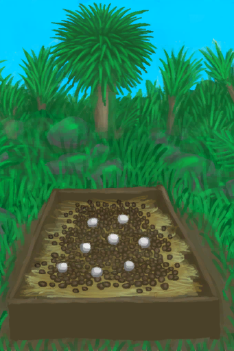

# Popular  

[

 Food Value](food_value.md)

[

 Special Event](event.md)

[

  Bag](tag_Bag.md)

[

  Water Container](tag_WaterContainer.md)

[

  Indoor](tag_EnvIndoors.md)

[

  Outdoor](outdoor.md)

[

  Crop](crop.md)

[

  Biome](biome.md)

[

  Lost](event_lost.md)

[

 存档查看](SaveDataEditor.md)

  
  
  
# Simulator  

[

 Bee Skep](BeeSkep_sim.md)

[

 Sow](BoarEnclosureFemale_sim.md)

[

 Goat](GoatEnclosureFemale_sim.md)

[

 Lactating Goat](GoatEnclosureLactating_sim.md)

[

 Partridge](PartridgeFemaleEnclosure_sim.md)

[

 Almond Tree Crop Plot](CropPlotAlmondTree_sim.md)

[

 Aloe Vera Crop Plot](CropPlotAloeVera_sim.md)

[

 Banana Crop Plot](CropPlotBananaTree_sim.md)

[

 Chili Crop Plot](CropPlotChilies_sim.md)

[

 China Rose Crop Plot](CropPlotChinaRose_sim.md)

[

 Cinchona Crop Plot](CropPlotCinchonaTree_sim.md)

[

 Coffee Crop Plot](CropPlotCoffee_sim.md)

[

 Ginger Crop Plot](CropPlotGinger_sim.md)

[

 Jasmine Crop Plot](CropPlotJasmine_sim.md)

[

 Kava Crop Plot](CropPlotKava_sim.md)

[

 Lemon Grass Crop Plot](CropPlotLemonGrass_sim.md)

[

 Mango Crop Plot](CropPlotMangoTree_sim.md)

[

 Nipa Palm Crop Plot](CropPlotNipaPalm_sim.md)

[

 Palm Bush Crop Plot](CropPlotPalmBush_sim.md)

[

 Palm Tree Crop Plot](CropPlotPalmTree_sim.md)

[

 Rice Crop Plot](CropPlotRice_sim.md)

[

 Sago Palm Crop Plot](CropPlotSagoPalm_sim.md)

[

 Snake Grass Crop Plot](CropPlotSnakeGrass_sim.md)

[

 Spider Lily Crop Plot](CropPlotSpiderLily_sim.md)

[

 Weevil Lily Crop Plot](CropPlotWeevilLily_sim.md)

[

 Wild Jujube Crop Plot](CropPlotWildJujube_sim.md)

[

 Yam Crop Plot](CropPlotYam_sim.md)

[

 Assorted Mushrooms Bed](MushroomBedAssorted_sim.md)

[

 Magic Mushroom Bed](MushroomBedMagic_sim.md)

[

 Puffball Bed](MushroomBedPuffballs_sim.md)

  
  

