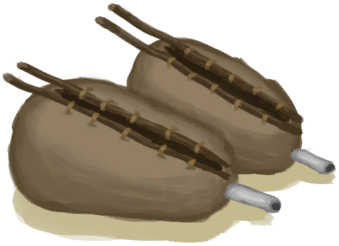

# “Shoulder Item”  

<a href="Bellows.md" style="color:black">Bellows</a>

<a href="CopperBottle.md" style="color:black">Copper Bottle</a>

<a href="Waterskin.md" style="color:black">Waterskin</a>

<a href="Satchel.md" style="color:black">Satchel</a>

<a href="SatchelHunter.md" style="color:black">Satchel</a>

<a href="LizardDrum.md" style="color:black">Lizard Drum</a>

<a href="Rope.md" style="color:black">Rope</a>

<a href="HarpoonBone.md" style="color:black">Harpoon</a>

<a href="Oxygen.md" style="color:black">Oxygen Respirator</a>

<a href="SpearCopper.md" style="color:black">Copper Spear</a>

<a href="SpearFlint.md" style="color:black">Flint Spear</a>

<a href="SpearObsidian.md" style="color:black">Obsidian Spear</a>

<a href="SpearScrap.md" style="color:black">Scrap Spear</a>

  
  

