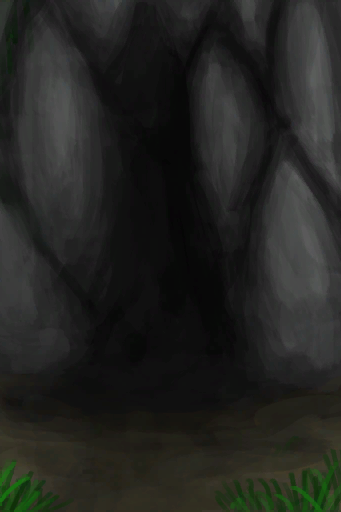

# 环境  
  

[

 [Atoll](Env_Atoll.md)](Env_Atoll.md)

[

 [Bat Cave](Env_CaveBats.md)](Env_CaveBats.md)

[

 [Bay](Env_Bay.md)](Env_Bay.md)

[

 [Beach](Env_Beach.md)](Env_Beach.md)

[

 [Bird Rock](Env_BirdRock.md)](Env_BirdRock.md)

[Cave(Environment)](Env_CaveGrasslands.md)

[Cave(Environment)](Env_CaveSea.md)

[

 [Cellar](Env_Cellar.md)](Env_Cellar.md)

[

 [Crashed Plane](Env_CrashedPlane.md)](Env_CrashedPlane.md)

[

 [Damp Chamber](Env_DampChamber.md)](Env_DampChamber.md)

[

 [Dark Cave](Env_CaveDark.md)](Env_CaveDark.md)

[

 [Dark Chamber](Env_DarkChamber.md)](Env_DarkChamber.md)

[

 [Desolate Beach](Env_DesolateBeach.md)](Env_DesolateBeach.md)

[

 [Eastern Grasslands](Env_GrasslandsE.md)](Env_GrasslandsE.md)

[

 [Eastern Highlands](Env_HighlandsEastern.md)](Env_HighlandsEastern.md)

[

 [Enclosure](Env_Enclosure.md)](Env_Enclosure.md)

[

 [Flooded Chamber](Env_FloodedChamber.md)](Env_FloodedChamber.md)

[

 [High Chamber](Env_CrystalChamber.md)](Env_CrystalChamber.md)

[

 [High Chamber](Env_HighChamber.md)](Env_HighChamber.md)

[

 [High Chamber](Env_LowChamber.md)](Env_LowChamber.md)

[

 [High Chamber](Env_MidChamber.md)](Env_MidChamber.md)

[

 [High Chamber](Env_NarrowTunnel.md)](Env_NarrowTunnel.md)

[Hole(Environment)](Env_HighlandHole.md)

[

 [Jungle](Env_DeepJungle.md)](Env_DeepJungle.md)

[

 [Jungle](Env_Jungle.md)](Env_Jungle.md)

[

 [Jungle Highlands](Env_JungleHighlands.md)](Env_JungleHighlands.md)

[

 [Macaque Den](Env_MacaqueDen.md)](Env_MacaqueDen.md)

[

 [Mangrove Forest](Env_Mangroves.md)](Env_Mangroves.md)

[

 [Mud Hut](Env_MudHut.md)](Env_MudHut.md)

[

 [Mud Hut](Env_MudHutRuins.md)](Env_MudHutRuins.md)

[

 [Outskirts](Env_Outskirts.md)](Env_Outskirts.md)

[

 [Raft](Env_Raft.md)](Env_Raft.md)

[

 [Rocks](Env_Rocks.md)](Env_Rocks.md)

[

 [Secret Cove](Env_Cove.md)](Env_Cove.md)

[

 [Secret Valley](Env_SecretValley.md)](Env_SecretValley.md)

[

 [Shed](Env_Shed.md)](Env_Shed.md)

[

 [Stone Hut](Env_StoneHut.md)](Env_StoneHut.md)

[Tidal Cave(Environment)](Env_CaveTidal.md)

[

 [Tunnel](Env_Tunnel.md)](Env_Tunnel.md)

[

 [Volcano](Env_AcidLake.md)](Env_AcidLake.md)

[

 [Volcano](Env_Volcano.md)](Env_Volcano.md)

[

 [Western Grasslands](Env_GrasslandsW.md)](Env_GrasslandsW.md)

[

 [Western Highlands](Env_HighlandsWestern.md)](Env_HighlandsWestern.md)

[

 [Wetlands](Env_Wetlands.md)](Env_Wetlands.md)

  
  

