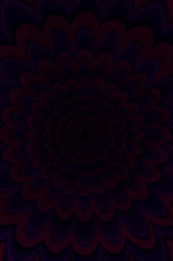
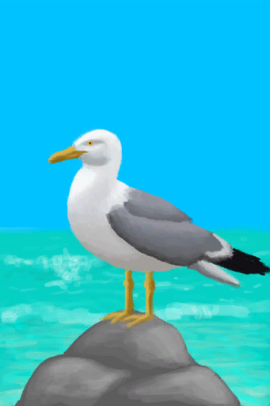
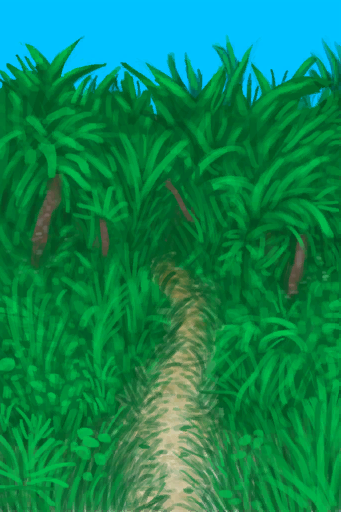

# Event  
## Special Event  

<a href="#!Group_Event_Hunter.md">Hunter</a>

<a href="#!Group_Event_Enemy.md">Enemy</a>

<a href="#!Group_Event_GodExperience.md">GodExperience</a>

<a href="#!Group_Event_VoidExperience.md">VoidExperience</a>

<a href="#!Group_Event_WatchedExperience.md">WatchedExperience</a>

  
  
# 
  
## Fight  

<a href="#!Group_Event_MacaqueFight.md">Macaque</a>

<a href="#!Group_Event_BoarFight.md">Boaar</a>

<a href="#!Group_Event_MonitorFight.md">Monitor</a>

<a href="#!Group_Event_GoatFight.md">Goat</a>

<a href="#!Group_Event_CobraFight.md">Cobra</a>

<a href="#!Group_Event_DroneFight.md">Drone</a>

<a href="#!Group_Event_MacaqueDenFight.md">MacaqueDen</a>

<a href="#!Group_Event_SharkFight.md">Shark</a>

<a href="#!Group_Event_SeagullFight.md">Seagull</a>

<a href="#!Group_Event_PartridgeFight.md">Partridge</a>

<a href="#!Group_Event_Explore_Other.md">Other</a>

  
  
# 
  
## Raid  

<a href="#!Group_Event_BoarFightRaid.md">野猪入侵</a>

<a href="#!Group_Event_MonitorRaid.md">Monitor</a>

<a href="#!Group_Event_MacaqueRaid.md">Macaque</a>

<a href="#!Group_Event_SeahoundFight.md">Seahound</a>

<a href="#!Group_Event_SeagullRaid.md">Seagull</a>

<a href="#!Group_Event_SeagullRaidCrop.md">Seagull Crop</a>

  
  
# 
  
## Talk  

<a href="#!Group_Captain.md">Caption</a>

<a href="#!Group_Weston.md">Weston</a>

<a href="#!Group_Event_CaptainSpecial1a.md">Caption Special</a>

<a href="#!Group_Event_WestonSpecial1a.md">Weston Special</a>

  
  
# 
  
## Skill Improved  

<a href="#!Group_Event_SkillArchery.md">Archery</a>

<a href="#!Group_Event_SkillCooking.md">Cooking</a>

<a href="#!Group_Event_SkillCrafting.md">Crafting</a>

<a href="#!Group_Event_SkillFishing.md">Fishing</a>

<a href="#!Group_Event_SkillHerbology.md">Herbology</a>

<a href="#!Group_Event_SkillInsight.md">You had an epiphany!</a>

<a href="#!Group_Event_SkillKnapping.md">Knapping</a>

<a href="#!Group_Event_SkillMetalworking.md">Metalworking</a>

<a href="#!Group_Event_SkillPercussion.md">Percussion</a>

<a href="#!Group_Event_SkillSpearFighting.md">Spear Fighting</a>

<a href="#!Group_Event_SkillSpearFishing.md">Spear Fishing</a>

<a href="#!Group_Event_SkillTailoring.md">Tailoring</a>

<a href="#!Group_Event_SkillTrapping.md">Trapping</a>

<a href="#!Group_Event_SkillWindInstruments.md">Wind Instruments</a>

<a href="#!Group_Event_SkillWoodworking.md">Woodworking</a>

  
  
# 
  
## 曲调  

<a href="#!Group_Event_FluteTunes.md">曲调选集</a>

<a href="#!Group_Event_NewTune.md">新曲调</a>

  
  
# 
  
## Other  

<a href="#!Group_Event_Raft.md">木筏事件</a>

<a href="#!Group_Event_Intro.md">Opening</a>

<a href="#!Group_Event_SpecialDamage.md">Damage</a>

<a href="#!Group_Event_Body.md">Body</a>

<a href="#!Group_Event_Pet.md">Pet</a>

<a href="#!Group_Event_OutroFarmer.md">OutroFarmer</a>

<a href="#!Group_Event_FoundFrom.md">Explore Found</a>

<a href="#!Group_Event_Explored.md">Explored</a>

<a href="#!Group_Event_PalmTree.md">PalmTree</a>

<a href="#!Group_Event_Fall.md">Fall</a>

<a href="#!Group_Event_Other.md">Other</a>

  
  
# 
  
## Unused  

<a href="#!Group_Event_TVNerveDamageDead.md">Unused</a>

  
  
# 
  

