# Event Lost  
<table class="table table-bordered" data-toggle="table"  ><thead style=""><tr ><th  style="width:14%;text-align:left;vertical-align:top;"  >Event</th><th  style="text-align:left;vertical-align:top;"  >May lost</th></tr></thead><tr ><td  style="width:14%;text-align:left;vertical-align:top;"  >
[

 [Wild Boar!](Event_BoarRummagingCrops.md)](Event_BoarRummagingCrops.md)
</td><td  style="text-align:left;vertical-align:top;"  >** Location Cards** [

[Yam Crop Plot](CropPlotYam.md)](CropPlotYam.md)</td></tr><tr ><td  style="width:14%;text-align:left;vertical-align:top;"  >
[

 [Wild Boar!](Event_BoarRummagingFeed.md)](Event_BoarRummagingFeed.md)
</td><td  style="text-align:left;vertical-align:top;"  >** Base Cards** [

[Yam](Yam.md)](Yam.md), [

[Boiled Yam](YamBoiled.md)](YamBoiled.md), [

[Cut Yam](YamCut.md)](YamCut.md) ** Base Cards** [“Feed”](tag_Feed.md)</td></tr><tr ><td  style="width:14%;text-align:left;vertical-align:top;"  >
[

 [Wild Boar!](Event_BoarRummagingYamPlants.md)](Event_BoarRummagingYamPlants.md)
</td><td  style="text-align:left;vertical-align:top;"  >** Location Cards** [
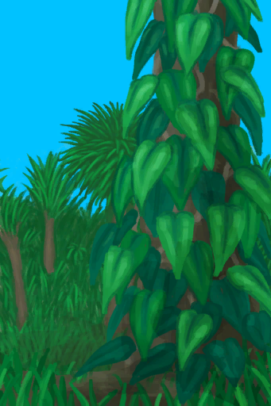
[Wild Yam](YamPlant.md)](YamPlant.md)</td></tr><tr ><td  style="width:14%;text-align:left;vertical-align:top;"  >
[

 [Macaque](Event_MacaqueRaidRummaging.md)](Event_MacaqueRaidRummaging.md)
</td><td  style="text-align:left;vertical-align:top;"  >** Base Cards** [“Feed”](tag_Feed.md) ** Base Cards** [

[Simple Arrow](ArrowSimple.md)](ArrowSimple.md), [

[Backpack](BackpackTourist.md)](BackpackTourist.md), [

[Banana](Banana.md)](Banana.md), [

[Military Belt](BeltMilitary.md)](BeltMilitary.md), [

[Broom](Broom.md)](Broom.md), [

[Candle(Off)](CandleOff.md)](CandleOff.md), [

[Canteen](Canteen.md)](Canteen.md), [

[Coconut Sandals](CoconutSandals.md)](CoconutSandals.md), [
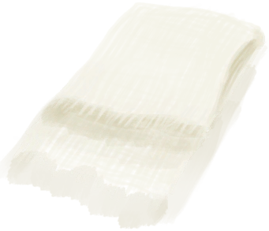
[Cloth](Cloth.md)](Cloth.md), [

[Large Cloth](ClothLarge.md)](ClothLarge.md), [

[Small Cloth](ClothSmall.md)](ClothSmall.md), [

[Fishing Line](FishingLineRustic.md)](FishingLineRustic.md), [

[Fishing Line (baited)](FishingLineRusticBait.md)](FishingLineRusticBait.md), [

[Fishing Line](FishingLine.md)](FishingLine.md), [

[Fishing Line (baited)](FishingLineBait.md)](FishingLineBait.md), [

[Flipflops](Flipflops.md)](Flipflops.md), [

[Flower Necklace](FlowerNecklace.md)](FlowerNecklace.md), [

[Antibiotics](Antibiotics.md)](Antibiotics.md), [

[Anti-Diarrhoea Pills](AntiDiarrhoeaPills.md)](AntiDiarrhoeaPills.md), [

[Glasses](Glasses.md)](Glasses.md), [

[Gun](Gun.md)](Gun.md), [

[Empty Gun(Empty)](GunEmpty.md)](GunEmpty.md), [

[Hand Drill](HandDrill.md)](HandDrill.md), [
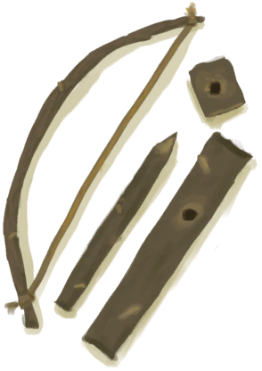
[Bow Drill](BowDrill.md)](BowDrill.md), [

[Bone Knife](KnifeBone.md)](KnifeBone.md), [

[Copper Knife](KnifeCopper.md)](KnifeCopper.md), [

[Blunt Knife](KnifeCopperBlunt.md)](KnifeCopperBlunt.md), [

[Military Knife](KnifeMilitary.md)](KnifeMilitary.md), [

[Blunt Knife](KnifeMilitaryBlunt.md)](KnifeMilitaryBlunt.md), [

[Scrap Knife](KnifeScrap.md)](KnifeScrap.md), [
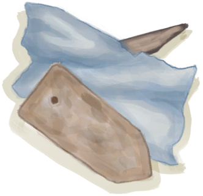
[Metal Scrap](MetalScrap.md)](MetalScrap.md), [

[Painkillers](Painkillers.md)](Painkillers.md), [
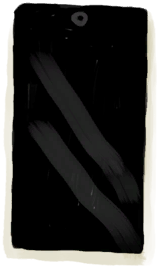
[Phone(Off)](PhoneOff.md)](PhoneOff.md), [

[Phone(On)](PhoneOn.md)](PhoneOn.md), [

[Phone](PhoneOnLight.md)](PhoneOnLight.md), [

[Plastic Bottle](PlasticBottle.md)](PlasticBottle.md), [
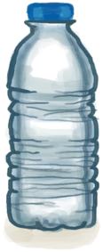
[Plastic Bottle(Full)](PlasticBottleFull.md)](PlasticBottleFull.md), [

[Jasmine Flowers](PlasticBottleJasmine.md)](PlasticBottleJasmine.md), [

[Quiver](Quiver.md)](Quiver.md), [
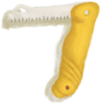
[Safety Knife](SafetyKnife.md)](SafetyKnife.md), [

[Satchel](Satchel.md)](Satchel.md), [

[Sling](Sling.md)](Sling.md), [

[Spear Head](SpearHead.md)](SpearHead.md), [

[Blunt Spear Head](SpearHeadBlunt.md)](SpearHeadBlunt.md), [

[Spindle](Spindle.md)](Spindle.md), [

[Spindled Cord](SpindleFiber.md)](SpindleFiber.md), [

[Water Purification Tablets](WaterPurificationTablets.md)](WaterPurificationTablets.md), [

[Waterskin](Waterskin.md)](Waterskin.md), [

[Yarn](YarnFiber.md)](YarnFiber.md), [

[Pearl](Pearl.md)](Pearl.md), [

[Pearl Necklace](PearlNecklace.md)](PearlNecklace.md), [

[Bee Suit](BeeSuit.md)](BeeSuit.md), [

[Collar](CollarTV.md)](CollarTV.md), [

[Copper Necklace](CopperNecklace.md)](CopperNecklace.md), [

[Foot Wrappings](FootWrappings.md)](FootWrappings.md), [

[Gas Mask](GasMaskRustic.md)](GasMaskRustic.md), [

[Hand Wrappings](HandWrappings.md)](HandWrappings.md), [

[Survival Hat](HatSurvival.md)](HatSurvival.md), [

[Woven Palm Hat](HatWoven.md)](HatWoven.md), [

[Hawaiian Shirt](HawaiianShirt.md)](HawaiianShirt.md), [

[Head Wrappings](HeadWrappings.md)](HeadWrappings.md), [

[Hoodie](HoodieRetromation.md)](HoodieRetromation.md), [

[Leaf Skirt](LeafSKirt.md)](LeafSKirt.md), [

[Leather Gloves](LeatherGloves.md)](LeatherGloves.md), [

[Leather Pants](LeatherPants.md)](LeatherPants.md), [

[Leather Shoes](LeatherShoes.md)](LeatherShoes.md), [

[Makeshift Mask](MaskMakeshift.md)](MaskMakeshift.md), [

[Military Boots](MilitaryBoots.md)](MilitaryBoots.md), [

[Military Pants](MilitaryPants.md)](MilitaryPants.md), [Cloth Pants](PantsCloth.md), [

[Raincoat](Raincoat.md)](Raincoat.md), [

[Seagull Charm](SeagullCharm.md)](SeagullCharm.md), [

[Seashell Necklace](SeashellNecklace.md)](SeashellNecklace.md), [

[Shark Headpiece](SharkHeadpiece.md)](SharkHeadpiece.md), [

[Shirt](ShirtFiber.md)](ShirtFiber.md), [

[Shorts](Shorts.md)](Shorts.md), [

[Sneakers](Sneakers.md)](Sneakers.md), [

[Socks](Socks.md)](Socks.md), [

[Straw Cape](StrawCape.md)](StrawCape.md), [

[T-Shirt](T-Shirt.md)](T-Shirt.md), [

[Underwear](Underwear.md)](Underwear.md), [

[Calcite Crystal](Calcite.md)](Calcite.md), [

[Jasmine Flowers](ClayJarJasmine.md)](ClayJarJasmine.md), [

[Copper Bottle](CopperBottle.md)](CopperBottle.md), [

[Copper Jar](CopperJar.md)](CopperJar.md), [
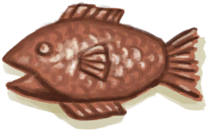
[Copper Fish](CopperDecoration_Fish.md)](CopperDecoration_Fish.md), [
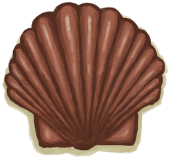
[Copper Seashell](CopperDecoration_Seashell.md)](CopperDecoration_Seashell.md), [

[Copper Turtle](CopperDecoration_Turtle.md)](CopperDecoration_Turtle.md), [

[Coral](Coral.md)](Coral.md), [

[Eating Utensils](EatingUtensilsCopper.md)](EatingUtensilsCopper.md), [

[Eating Utensils](EatingUtensilsWooden.md)](EatingUtensilsWooden.md), [

[Bone Flute](FluteBone.md)](FluteBone.md), [

[Wooden Flute](FluteWooden.md)](FluteWooden.md), [
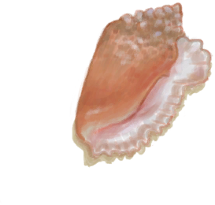
[Giant Conch](GiantConch.md)](GiantConch.md), [

[Goat Figure](WoodCarving_Goat.md)](WoodCarving_Goat.md), [

[Man Figure](WoodCarving_Man.md)](WoodCarving_Man.md), [

[Spirit Figure](WoodCarving_Monster.md)](WoodCarving_Monster.md), [
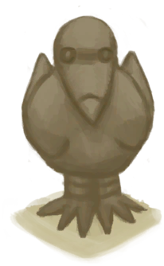
[Seagull Figure](WoodCarving_Seagull.md)](WoodCarving_Seagull.md), [

[Woman Figure](WoodCarving_Woman.md)](WoodCarving_Woman.md), [

[Conch](Conch.md)](Conch.md), [

[Clay Bowl](ClayBowl.md)](ClayBowl.md), [

[Clay Jar](ClayJar.md)](ClayJar.md), [
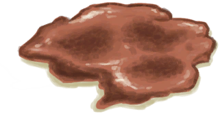
[Copper Mess](CopperDecoration_Failed.md)](CopperDecoration_Failed.md), [

[Flint](Flint.md)](Flint.md), [

[Obsidian](Obsidian.md)](Obsidian.md), [

[Pretty Seashells](SeashellsPretty.md)](SeashellsPretty.md), [

[Ceremonial Dagger](CeremonialDagger.md)](CeremonialDagger.md), [

[Flint Knife](KnifeFlint.md)](KnifeFlint.md), [
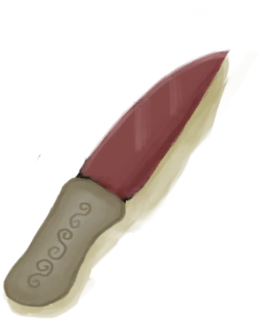
[Grandfather's Knife](KnifeGrandpa.md)](KnifeGrandpa.md), [

[Grandfather's Blunt Knife](KnifeGrandpaBlunt.md)](KnifeGrandpaBlunt.md), [

[Obsidian Knife](KnifeObsidian.md)](KnifeObsidian.md), [

[Sharpened Stone](StoneSharpened.md)](StoneSharpened.md), [

[Gnome Figurine](TuskCarving_GnomeFemale.md)](TuskCarving_GnomeFemale.md), [

[Gnome Figurine](TuskCarving_GnomeMale.md)](TuskCarving_GnomeMale.md), [

[Weston](Weston.md)](Weston.md)</td></tr><tr ><td  style="width:14%;text-align:left;vertical-align:top;"  >
[

 [Monitor Lizard](Event_MonitorRummaging.md)](Event_MonitorRummaging.md)
</td><td  style="text-align:left;vertical-align:top;"  >** Base Cards** [“Feed”](tag_Meat.md)</td></tr><tr ><td  style="width:14%;text-align:left;vertical-align:top;"  >
[

 [Seagull](Event_SeagullRaidRummaging.md)](Event_SeagullRaidRummaging.md)
</td><td  style="text-align:left;vertical-align:top;"  >** Base Cards** [“Feed”](tag_Feed.md)</td></tr><tr ><td  style="width:14%;text-align:left;vertical-align:top;"  >
[

 [Mouse Damage](Event_MouseDamage.md)](Event_MouseDamage.md)
</td><td  style="text-align:left;vertical-align:top;"  >** Base Cards** [“Feed”](tag_Feed.md)</td></tr><tr ><td  style="width:14%;text-align:left;vertical-align:top;"  >
[

 [Storm Damage](Event_StormDamage.md)](Event_StormDamage.md)
</td><td  style="text-align:left;vertical-align:top;"  >All ** Base Cards**, Except ~~[“Heavy”](tag_Heavy.md)~~/~~[“Large”](tag_Large.md)~~/~~[

[Weston](Weston.md)](Weston.md)~~ ** Location Cards** [

[Leaf Bed](LeafBed.md)](LeafBed.md), [

[Shelter](Shelter.md)](Shelter.md), [

[Sheltered Leaf Bed](ShelteredLeafBed.md)](ShelteredLeafBed.md), [

[Rain Catcher](RainCatcher.md)](RainCatcher.md), [

[Solar Still](SolarStill.md)](SolarStill.md), [

[Hammock](Hammock.md)](Hammock.md), [
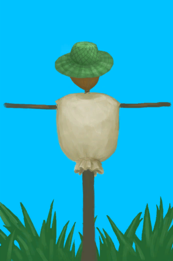
[Scarecrow](Scarecrow.md)](Scarecrow.md), [

[Tent](TentDeployed.md)](TentDeployed.md), [
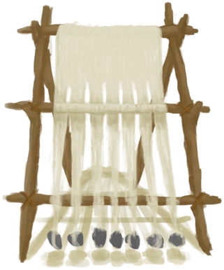
[Loom](Loom.md)](Loom.md), [

[Loom (Empty)(Empty)](LoomEmpty.md)](LoomEmpty.md), [

[Drying Rack](DryingRack.md)](DryingRack.md), [

[Deadfall Trap](DeadfallTrap.md)](DeadfallTrap.md), [

[Snare Trap](SnareTrap.md)](SnareTrap.md), [

[Fish Trap](FishTrapDeployed.md)](FishTrapDeployed.md)</td></tr><tr ><td  style="width:14%;text-align:left;vertical-align:top;"  >
[

 [The wind is too strong!](Event_Storm.md)](Event_Storm.md)
</td><td  style="text-align:left;vertical-align:top;"  >All ** Base Cards**, Except ~~[“Heavy”](tag_Heavy.md)~~/~~[“Large”](tag_Large.md)~~/~~[

[Weston](Weston.md)](Weston.md)~~ ** Location Cards** [

[Leaf Bed](LeafBed.md)](LeafBed.md), [

[Shelter](Shelter.md)](Shelter.md), [

[Sheltered Leaf Bed](ShelteredLeafBed.md)](ShelteredLeafBed.md), [

[Rain Catcher](RainCatcher.md)](RainCatcher.md), [

[Solar Still](SolarStill.md)](SolarStill.md), [

[Hammock](Hammock.md)](Hammock.md), [

[Scarecrow](Scarecrow.md)](Scarecrow.md), [

[Tent](TentDeployed.md)](TentDeployed.md), [

[Loom](Loom.md)](Loom.md), [

[Loom (Empty)(Empty)](LoomEmpty.md)](LoomEmpty.md), [

[Drying Rack](DryingRack.md)](DryingRack.md), [

[Deadfall Trap](DeadfallTrap.md)](DeadfallTrap.md), [

[Snare Trap](SnareTrap.md)](SnareTrap.md), [

[Fish Trap](FishTrapDeployed.md)](FishTrapDeployed.md)</td></tr><tr ><td  style="width:14%;text-align:left;vertical-align:top;"  >
[

 [A huge wave strikes the raft!](Event_Wave.md)](Event_Wave.md)
</td><td  style="text-align:left;vertical-align:top;"  >All ** Base Cards** All ** Hand Cards** All ** Base Cards** ** Location Cards** [

[Leaf Bed](LeafBed.md)](LeafBed.md), [

[Shelter](Shelter.md)](Shelter.md), [

[Sheltered Leaf Bed](ShelteredLeafBed.md)](ShelteredLeafBed.md), [

[Enclosure](EnclosureEntrance.md)](EnclosureEntrance.md), [

[Mud Hut](MudHutEntrance.md)](MudHutEntrance.md), [

[Rain Catcher](RainCatcher.md)](RainCatcher.md), [

[Reservoir](WaterReservoir.md)](WaterReservoir.md), [

[Basket](BasketPlaced.md)](BasketPlaced.md), [

[Tent](TentDeployed.md)](TentDeployed.md)</td></tr></tbody></table>  
  

