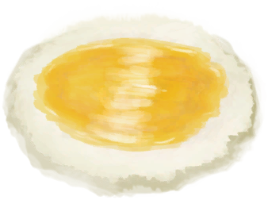
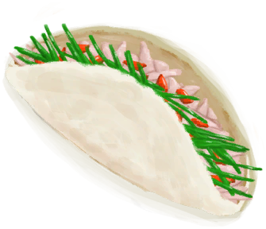
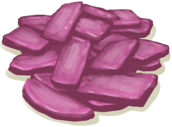
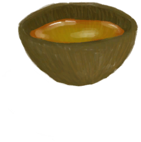
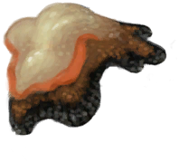
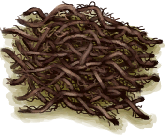

# Food Value  
  
<table class="table table-bordered" data-toggle="table" data-search="true" data-height="500" ><thead style=""><tr ><th  style="text-align:left;vertical-align:top;"  > </th><th  style="text-align:left;vertical-align:top;"  data-sortable="true"  >[

[Satiation](Satiation.md)](Satiation.md)</th><th  style="text-align:left;vertical-align:top;"  data-sortable="true"  >[

[Stomach](Stomach.md)](Stomach.md)</th><th  style="text-align:left;vertical-align:top;"  data-sortable="true"  >[

[Hydration ](Hydration.md)](Hydration.md)</th><th  style="text-align:left;vertical-align:top;"  data-sortable="true"  >[

[Morale](Morale.md)](Morale.md)</th><th  style="text-align:left;vertical-align:top;"  data-sortable="true"  >[

[Stool Liquidity](Diarrhoea.md)](Diarrhoea.md)</th><th  style="text-align:left;vertical-align:top;"  data-sortable="true"  >[

[Stress](Stress.md)](Stress.md)</th><th  style="text-align:left;vertical-align:top;"  data-sortable="true"  >[

[Mental Structure](Structure.md)](Structure.md)</th><th  style="text-align:left;vertical-align:top;"  data-sortable="true"  >[

[Capsaicin](Capsaicin.md)](Capsaicin.md)</th><th  style="text-align:left;vertical-align:top;"  data-sortable="true"  >增脂效率</th></tr></thead><tr ><td  style="text-align:left;vertical-align:top;"  >[

[Fish N' Chips](FishNChips.md)](FishNChips.md) 🥩🥬</td><td  style="text-align:left;vertical-align:top;"  >80</td><td  style="text-align:left;vertical-align:top;"  >93</td><td  style="text-align:left;vertical-align:top;"  >10</td><td  style="text-align:left;vertical-align:top;"  >15</td><td  style="text-align:left;vertical-align:top;"  ></td><td  style="text-align:left;vertical-align:top;"  >-20</td><td  style="text-align:left;vertical-align:top;"  >30</td><td  style="text-align:left;vertical-align:top;"  ></td><td  style="text-align:left;vertical-align:top;"  >1.16</td></tr><tr ><td  style="text-align:left;vertical-align:top;"  >[

[Hearty Feast](HeartyFeast.md)](HeartyFeast.md) 🥩</td><td  style="text-align:left;vertical-align:top;"  >60</td><td  style="text-align:left;vertical-align:top;"  >102</td><td  style="text-align:left;vertical-align:top;"  >22</td><td  style="text-align:left;vertical-align:top;"  >25</td><td  style="text-align:left;vertical-align:top;"  ></td><td  style="text-align:left;vertical-align:top;"  >-20</td><td  style="text-align:left;vertical-align:top;"  >30</td><td  style="text-align:left;vertical-align:top;"  ></td><td  style="text-align:left;vertical-align:top;"  >1.7</td></tr><tr ><td  style="text-align:left;vertical-align:top;"  >[

[Honey Glazed Pork](HoneyGlazedPork.md)](HoneyGlazedPork.md) 🥩</td><td  style="text-align:left;vertical-align:top;"  >60</td><td  style="text-align:left;vertical-align:top;"  >102</td><td  style="text-align:left;vertical-align:top;"  >22</td><td  style="text-align:left;vertical-align:top;"  >35</td><td  style="text-align:left;vertical-align:top;"  ></td><td  style="text-align:left;vertical-align:top;"  >-20</td><td  style="text-align:left;vertical-align:top;"  >30</td><td  style="text-align:left;vertical-align:top;"  ></td><td  style="text-align:left;vertical-align:top;"  >1.7</td></tr><tr ><td  style="text-align:left;vertical-align:top;"  >[

[Lizard Fry](LizardFry.md)](LizardFry.md)(2) 🥩</td><td  style="text-align:left;vertical-align:top;"  >60</td><td  style="text-align:left;vertical-align:top;"  >95</td><td  style="text-align:left;vertical-align:top;"  >4</td><td  style="text-align:left;vertical-align:top;"  >15</td><td  style="text-align:left;vertical-align:top;"  ></td><td  style="text-align:left;vertical-align:top;"  >-10</td><td  style="text-align:left;vertical-align:top;"  >15</td><td  style="text-align:left;vertical-align:top;"  >12</td><td  style="text-align:left;vertical-align:top;"  >1.58</td></tr><tr ><td  style="text-align:left;vertical-align:top;"  >[

[Yam Curry](YamCurry.md)](YamCurry.md)(2) 🥬</td><td  style="text-align:left;vertical-align:top;"  >60</td><td  style="text-align:left;vertical-align:top;"  >95</td><td  style="text-align:left;vertical-align:top;"  >4</td><td  style="text-align:left;vertical-align:top;"  >15</td><td  style="text-align:left;vertical-align:top;"  ></td><td  style="text-align:left;vertical-align:top;"  >-10</td><td  style="text-align:left;vertical-align:top;"  >15</td><td  style="text-align:left;vertical-align:top;"  >12</td><td  style="text-align:left;vertical-align:top;"  >1.58</td></tr><tr ><td  style="text-align:left;vertical-align:top;"  >[

[Fried Puffballs](FriedPuffballs.md)](FriedPuffballs.md) 🥬</td><td  style="text-align:left;vertical-align:top;"  >55</td><td  style="text-align:left;vertical-align:top;"  >70</td><td  style="text-align:left;vertical-align:top;"  >14</td><td  style="text-align:left;vertical-align:top;"  >15</td><td  style="text-align:left;vertical-align:top;"  ></td><td  style="text-align:left;vertical-align:top;"  >-10</td><td  style="text-align:left;vertical-align:top;"  >15</td><td  style="text-align:left;vertical-align:top;"  ></td><td  style="text-align:left;vertical-align:top;"  >1.27</td></tr><tr ><td  style="text-align:left;vertical-align:top;"  >[

[Island Chicken](IslandChicken.md)](IslandChicken.md) 🥩</td><td  style="text-align:left;vertical-align:top;"  >55</td><td  style="text-align:left;vertical-align:top;"  >70</td><td  style="text-align:left;vertical-align:top;"  >14</td><td  style="text-align:left;vertical-align:top;"  >15</td><td  style="text-align:left;vertical-align:top;"  ></td><td  style="text-align:left;vertical-align:top;"  >-10</td><td  style="text-align:left;vertical-align:top;"  >15</td><td  style="text-align:left;vertical-align:top;"  ></td><td  style="text-align:left;vertical-align:top;"  >1.27</td></tr><tr ><td  style="text-align:left;vertical-align:top;"  >[

[Chocolate](Chocolate.md)](Chocolate.md) 🥬</td><td  style="text-align:left;vertical-align:top;"  >50</td><td  style="text-align:left;vertical-align:top;"  >30</td><td  style="text-align:left;vertical-align:top;"  >1</td><td  style="text-align:left;vertical-align:top;"  >10</td><td  style="text-align:left;vertical-align:top;"  ></td><td  style="text-align:left;vertical-align:top;"  >-30</td><td  style="text-align:left;vertical-align:top;"  >25</td><td  style="text-align:left;vertical-align:top;"  ></td><td  style="text-align:left;vertical-align:top;"  >0.6</td></tr><tr ><td  style="text-align:left;vertical-align:top;"  >[

[Egg Fried Rice](EggFriedRice.md)](EggFriedRice.md)(2) </td><td  style="text-align:left;vertical-align:top;"  >50</td><td  style="text-align:left;vertical-align:top;"  >50</td><td  style="text-align:left;vertical-align:top;"  >4</td><td  style="text-align:left;vertical-align:top;"  >15</td><td  style="text-align:left;vertical-align:top;"  ></td><td  style="text-align:left;vertical-align:top;"  >-10</td><td  style="text-align:left;vertical-align:top;"  >15</td><td  style="text-align:left;vertical-align:top;"  ></td><td  style="text-align:left;vertical-align:top;"  >1</td></tr><tr ><td  style="text-align:left;vertical-align:top;"  >[

[Fish Omelette](FishOmelette.md)](FishOmelette.md) 🥩</td><td  style="text-align:left;vertical-align:top;"  >50</td><td  style="text-align:left;vertical-align:top;"  >40</td><td  style="text-align:left;vertical-align:top;"  >4</td><td  style="text-align:left;vertical-align:top;"  >10</td><td  style="text-align:left;vertical-align:top;"  ></td><td  style="text-align:left;vertical-align:top;"  ></td><td  style="text-align:left;vertical-align:top;"  >15</td><td  style="text-align:left;vertical-align:top;"  ></td><td  style="text-align:left;vertical-align:top;"  >0.8</td></tr><tr ><td  style="text-align:left;vertical-align:top;"  >[

[Macaque Skewers](MacaqueSkewers.md)](MacaqueSkewers.md) 🥩</td><td  style="text-align:left;vertical-align:top;"  >50</td><td  style="text-align:left;vertical-align:top;"  >65</td><td  style="text-align:left;vertical-align:top;"  >4</td><td  style="text-align:left;vertical-align:top;"  >10</td><td  style="text-align:left;vertical-align:top;"  ></td><td  style="text-align:left;vertical-align:top;"  >-15</td><td  style="text-align:left;vertical-align:top;"  >20</td><td  style="text-align:left;vertical-align:top;"  >10</td><td  style="text-align:left;vertical-align:top;"  >1.3</td></tr><tr ><td  style="text-align:left;vertical-align:top;"  >[

[Food Ration](FoodRation.md)](FoodRation.md) </td><td  style="text-align:left;vertical-align:top;"  >50</td><td  style="text-align:left;vertical-align:top;"  >40</td><td  style="text-align:left;vertical-align:top;"  >1</td><td  style="text-align:left;vertical-align:top;"  ></td><td  style="text-align:left;vertical-align:top;"  ></td><td  style="text-align:left;vertical-align:top;"  ></td><td  style="text-align:left;vertical-align:top;"  ></td><td  style="text-align:left;vertical-align:top;"  ></td><td  style="text-align:left;vertical-align:top;"  >0.8</td></tr><tr ><td  style="text-align:left;vertical-align:top;"  >[

[Sago Flatbread with Honey](SagoFlatbreadHoney.md)](SagoFlatbreadHoney.md) 🥬</td><td  style="text-align:left;vertical-align:top;"  >50</td><td  style="text-align:left;vertical-align:top;"  >58</td><td  style="text-align:left;vertical-align:top;"  >0</td><td  style="text-align:left;vertical-align:top;"  >5</td><td  style="text-align:left;vertical-align:top;"  ></td><td  style="text-align:left;vertical-align:top;"  >-20</td><td  style="text-align:left;vertical-align:top;"  ></td><td  style="text-align:left;vertical-align:top;"  ></td><td  style="text-align:left;vertical-align:top;"  >1.16</td></tr><tr ><td  style="text-align:left;vertical-align:top;"  >[

[Sago Flatbread with Jam](SagoFlatbreadJam.md)](SagoFlatbreadJam.md) 🥬</td><td  style="text-align:left;vertical-align:top;"  >50</td><td  style="text-align:left;vertical-align:top;"  >64</td><td  style="text-align:left;vertical-align:top;"  >0</td><td  style="text-align:left;vertical-align:top;"  >5</td><td  style="text-align:left;vertical-align:top;"  ></td><td  style="text-align:left;vertical-align:top;"  >-20</td><td  style="text-align:left;vertical-align:top;"  ></td><td  style="text-align:left;vertical-align:top;"  ></td><td  style="text-align:left;vertical-align:top;"  >1.28</td></tr><tr ><td  style="text-align:left;vertical-align:top;"  >[

[Chicken Sandwich](ChickenSandwich.md)](ChickenSandwich.md) 🥩</td><td  style="text-align:left;vertical-align:top;"  >45</td><td  style="text-align:left;vertical-align:top;"  >77</td><td  style="text-align:left;vertical-align:top;"  >6</td><td  style="text-align:left;vertical-align:top;"  >5</td><td  style="text-align:left;vertical-align:top;"  ></td><td  style="text-align:left;vertical-align:top;"  ></td><td  style="text-align:left;vertical-align:top;"  >15</td><td  style="text-align:left;vertical-align:top;"  ></td><td  style="text-align:left;vertical-align:top;"  >1.71</td></tr><tr ><td  style="text-align:left;vertical-align:top;"  >[

[Coconut Fish](CoconutFish.md)](CoconutFish.md) 🥩</td><td  style="text-align:left;vertical-align:top;"  >45</td><td  style="text-align:left;vertical-align:top;"  >44</td><td  style="text-align:left;vertical-align:top;"  >22</td><td  style="text-align:left;vertical-align:top;"  >15</td><td  style="text-align:left;vertical-align:top;"  >10</td><td  style="text-align:left;vertical-align:top;"  >-10</td><td  style="text-align:left;vertical-align:top;"  >15</td><td  style="text-align:left;vertical-align:top;"  ></td><td  style="text-align:left;vertical-align:top;"  >0.98</td></tr><tr ><td  style="text-align:left;vertical-align:top;"  >[

[Drunken Crab](DrunkenCrab.md)](DrunkenCrab.md) 🥩</td><td  style="text-align:left;vertical-align:top;"  >45</td><td  style="text-align:left;vertical-align:top;"  >43</td><td  style="text-align:left;vertical-align:top;"  >44</td><td  style="text-align:left;vertical-align:top;"  >15</td><td  style="text-align:left;vertical-align:top;"  >5</td><td  style="text-align:left;vertical-align:top;"  >-10</td><td  style="text-align:left;vertical-align:top;"  >15</td><td  style="text-align:left;vertical-align:top;"  ></td><td  style="text-align:left;vertical-align:top;"  >0.96</td></tr><tr ><td  style="text-align:left;vertical-align:top;"  >[

[Jungle Salad](JungleSalad.md)](JungleSalad.md) 🥬</td><td  style="text-align:left;vertical-align:top;"  >45</td><td  style="text-align:left;vertical-align:top;"  >35</td><td  style="text-align:left;vertical-align:top;"  >22</td><td  style="text-align:left;vertical-align:top;"  >5</td><td  style="text-align:left;vertical-align:top;"  >30</td><td  style="text-align:left;vertical-align:top;"  ></td><td  style="text-align:left;vertical-align:top;"  >15</td><td  style="text-align:left;vertical-align:top;"  ></td><td  style="text-align:left;vertical-align:top;"  >0.78</td></tr><tr ><td  style="text-align:left;vertical-align:top;"  >[

[Sago Cake](SagoCake.md)](SagoCake.md)(3) 🥬🌰</td><td  style="text-align:left;vertical-align:top;"  >45</td><td  style="text-align:left;vertical-align:top;"  >70</td><td  style="text-align:left;vertical-align:top;"  >4</td><td  style="text-align:left;vertical-align:top;"  >12</td><td  style="text-align:left;vertical-align:top;"  >5</td><td  style="text-align:left;vertical-align:top;"  >-20</td><td  style="text-align:left;vertical-align:top;"  >25</td><td  style="text-align:left;vertical-align:top;"  ></td><td  style="text-align:left;vertical-align:top;"  >1.56</td></tr><tr ><td  style="text-align:left;vertical-align:top;"  >[

[Candied Ginger](CandiedGinger.md)](CandiedGinger.md) 🥬</td><td  style="text-align:left;vertical-align:top;"  >40</td><td  style="text-align:left;vertical-align:top;"  >47</td><td  style="text-align:left;vertical-align:top;"  >1</td><td  style="text-align:left;vertical-align:top;"  >10</td><td  style="text-align:left;vertical-align:top;"  ></td><td  style="text-align:left;vertical-align:top;"  >-30</td><td  style="text-align:left;vertical-align:top;"  >30</td><td  style="text-align:left;vertical-align:top;"  ></td><td  style="text-align:left;vertical-align:top;"  >1.18</td></tr><tr ><td  style="text-align:left;vertical-align:top;"  >[

[Goat Cheese](Cheese.md)](Cheese.md) </td><td  style="text-align:left;vertical-align:top;"  >40</td><td  style="text-align:left;vertical-align:top;"  >48</td><td  style="text-align:left;vertical-align:top;"  >5</td><td  style="text-align:left;vertical-align:top;"  >5</td><td  style="text-align:left;vertical-align:top;"  ></td><td  style="text-align:left;vertical-align:top;"  >-10</td><td  style="text-align:left;vertical-align:top;"  >15</td><td  style="text-align:left;vertical-align:top;"  ></td><td  style="text-align:left;vertical-align:top;"  >1.2</td></tr><tr ><td  style="text-align:left;vertical-align:top;"  >[

[Goat Stew](GoatStew.md)](GoatStew.md)(2) 🥩</td><td  style="text-align:left;vertical-align:top;"  >40</td><td  style="text-align:left;vertical-align:top;"  >80</td><td  style="text-align:left;vertical-align:top;"  >25</td><td  style="text-align:left;vertical-align:top;"  >5</td><td  style="text-align:left;vertical-align:top;"  ></td><td  style="text-align:left;vertical-align:top;"  ></td><td  style="text-align:left;vertical-align:top;"  ></td><td  style="text-align:left;vertical-align:top;"  ></td><td  style="text-align:left;vertical-align:top;"  >2</td></tr><tr ><td  style="text-align:left;vertical-align:top;"  >[

[Fish Taco](FishTaco.md)](FishTaco.md) 🥩</td><td  style="text-align:left;vertical-align:top;"  >40</td><td  style="text-align:left;vertical-align:top;"  >45</td><td  style="text-align:left;vertical-align:top;"  >5</td><td  style="text-align:left;vertical-align:top;"  >4</td><td  style="text-align:left;vertical-align:top;"  ></td><td  style="text-align:left;vertical-align:top;"  ></td><td  style="text-align:left;vertical-align:top;"  >15</td><td  style="text-align:left;vertical-align:top;"  >12</td><td  style="text-align:left;vertical-align:top;"  >1.13</td></tr><tr ><td  style="text-align:left;vertical-align:top;"  >[

[Oil](LQ_Oil.md)](LQ_Oil.md) 🥬🌰</td><td  style="text-align:left;vertical-align:top;"  >40</td><td  style="text-align:left;vertical-align:top;"  >45</td><td  style="text-align:left;vertical-align:top;"  >5</td><td  style="text-align:left;vertical-align:top;"  >-10</td><td  style="text-align:left;vertical-align:top;"  >150</td><td  style="text-align:left;vertical-align:top;"  ></td><td  style="text-align:left;vertical-align:top;"  ></td><td  style="text-align:left;vertical-align:top;"  ></td><td  style="text-align:left;vertical-align:top;"  >1.13</td></tr><tr ><td  style="text-align:left;vertical-align:top;"  >[

[Citronella Oil](LQ_OilCitronella.md)](LQ_OilCitronella.md) 🥬🌰</td><td  style="text-align:left;vertical-align:top;"  >40</td><td  style="text-align:left;vertical-align:top;"  >45</td><td  style="text-align:left;vertical-align:top;"  >5</td><td  style="text-align:left;vertical-align:top;"  >-10</td><td  style="text-align:left;vertical-align:top;"  >150</td><td  style="text-align:left;vertical-align:top;"  ></td><td  style="text-align:left;vertical-align:top;"  ></td><td  style="text-align:left;vertical-align:top;"  ></td><td  style="text-align:left;vertical-align:top;"  >1.13</td></tr><tr ><td  style="text-align:left;vertical-align:top;"  >[

[Citronella Oil Mix](LQ_OilCitronellaMix.md)](LQ_OilCitronellaMix.md) 🥬🌰</td><td  style="text-align:left;vertical-align:top;"  >40</td><td  style="text-align:left;vertical-align:top;"  >45</td><td  style="text-align:left;vertical-align:top;"  >5</td><td  style="text-align:left;vertical-align:top;"  >-10</td><td  style="text-align:left;vertical-align:top;"  >150</td><td  style="text-align:left;vertical-align:top;"  ></td><td  style="text-align:left;vertical-align:top;"  ></td><td  style="text-align:left;vertical-align:top;"  ></td><td  style="text-align:left;vertical-align:top;"  >1.13</td></tr><tr ><td  style="text-align:left;vertical-align:top;"  >[

[Jasmine Oil](LQ_OilJasmine.md)](LQ_OilJasmine.md) 🥬🌰</td><td  style="text-align:left;vertical-align:top;"  >40</td><td  style="text-align:left;vertical-align:top;"  >45</td><td  style="text-align:left;vertical-align:top;"  >5</td><td  style="text-align:left;vertical-align:top;"  >-10</td><td  style="text-align:left;vertical-align:top;"  >150</td><td  style="text-align:left;vertical-align:top;"  ></td><td  style="text-align:left;vertical-align:top;"  ></td><td  style="text-align:left;vertical-align:top;"  ></td><td  style="text-align:left;vertical-align:top;"  >1.13</td></tr><tr ><td  style="text-align:left;vertical-align:top;"  >[

[Jasmine Oil Mix](LQ_OilJasmineMix.md)](LQ_OilJasmineMix.md) 🥬🌰</td><td  style="text-align:left;vertical-align:top;"  >40</td><td  style="text-align:left;vertical-align:top;"  >45</td><td  style="text-align:left;vertical-align:top;"  >5</td><td  style="text-align:left;vertical-align:top;"  >-10</td><td  style="text-align:left;vertical-align:top;"  >150</td><td  style="text-align:left;vertical-align:top;"  ></td><td  style="text-align:left;vertical-align:top;"  ></td><td  style="text-align:left;vertical-align:top;"  ></td><td  style="text-align:left;vertical-align:top;"  >1.13</td></tr><tr ><td  style="text-align:left;vertical-align:top;"  >[

[Cooked Boar Meat](BoarMeatCooked.md)](BoarMeatCooked.md) 🥩</td><td  style="text-align:left;vertical-align:top;"  >35</td><td  style="text-align:left;vertical-align:top;"  >50</td><td  style="text-align:left;vertical-align:top;"  >4</td><td  style="text-align:left;vertical-align:top;"  >5</td><td  style="text-align:left;vertical-align:top;"  ></td><td  style="text-align:left;vertical-align:top;"  >-10</td><td  style="text-align:left;vertical-align:top;"  ></td><td  style="text-align:left;vertical-align:top;"  ></td><td  style="text-align:left;vertical-align:top;"  >1.43</td></tr><tr ><td  style="text-align:left;vertical-align:top;"  >[

[Seafood Cup](SeafoodCup.md)](SeafoodCup.md) 🥩🐚</td><td  style="text-align:left;vertical-align:top;"  >35</td><td  style="text-align:left;vertical-align:top;"  >30</td><td  style="text-align:left;vertical-align:top;"  >48</td><td  style="text-align:left;vertical-align:top;"  >15</td><td  style="text-align:left;vertical-align:top;"  ></td><td  style="text-align:left;vertical-align:top;"  ></td><td  style="text-align:left;vertical-align:top;"  ></td><td  style="text-align:left;vertical-align:top;"  ></td><td  style="text-align:left;vertical-align:top;"  >0.86</td></tr><tr ><td  style="text-align:left;vertical-align:top;"  >[

[Cooked Goat Meat](GoatMeatCooked.md)](GoatMeatCooked.md) 🥩</td><td  style="text-align:left;vertical-align:top;"  >35</td><td  style="text-align:left;vertical-align:top;"  >50</td><td  style="text-align:left;vertical-align:top;"  >4</td><td  style="text-align:left;vertical-align:top;"  >5</td><td  style="text-align:left;vertical-align:top;"  ></td><td  style="text-align:left;vertical-align:top;"  >-10</td><td  style="text-align:left;vertical-align:top;"  ></td><td  style="text-align:left;vertical-align:top;"  ></td><td  style="text-align:left;vertical-align:top;"  >1.43</td></tr><tr ><td  style="text-align:left;vertical-align:top;"  >[

[Cooked Macaque Meat](MacaqueMeatCooked.md)](MacaqueMeatCooked.md) 🥩</td><td  style="text-align:left;vertical-align:top;"  >35</td><td  style="text-align:left;vertical-align:top;"  >50</td><td  style="text-align:left;vertical-align:top;"  >4</td><td  style="text-align:left;vertical-align:top;"  >5</td><td  style="text-align:left;vertical-align:top;"  ></td><td  style="text-align:left;vertical-align:top;"  >-10</td><td  style="text-align:left;vertical-align:top;"  ></td><td  style="text-align:left;vertical-align:top;"  ></td><td  style="text-align:left;vertical-align:top;"  >1.43</td></tr><tr ><td  style="text-align:left;vertical-align:top;"  >[

[Cooked Snake Meat](SnakeCooked.md)](SnakeCooked.md) 🥩</td><td  style="text-align:left;vertical-align:top;"  >35</td><td  style="text-align:left;vertical-align:top;"  >25</td><td  style="text-align:left;vertical-align:top;"  >4</td><td  style="text-align:left;vertical-align:top;"  >3</td><td  style="text-align:left;vertical-align:top;"  ></td><td  style="text-align:left;vertical-align:top;"  ></td><td  style="text-align:left;vertical-align:top;"  ></td><td  style="text-align:left;vertical-align:top;"  ></td><td  style="text-align:left;vertical-align:top;"  >0.71</td></tr><tr ><td  style="text-align:left;vertical-align:top;"  >[

[Yam Jam](YamJam.md)](YamJam.md)(3) 🥬🌰</td><td  style="text-align:left;vertical-align:top;"  >34</td><td  style="text-align:left;vertical-align:top;"  >39</td><td  style="text-align:left;vertical-align:top;"  >2</td><td  style="text-align:left;vertical-align:top;"  >5</td><td  style="text-align:left;vertical-align:top;"  ></td><td  style="text-align:left;vertical-align:top;"  >-20</td><td  style="text-align:left;vertical-align:top;"  >15</td><td  style="text-align:left;vertical-align:top;"  ></td><td  style="text-align:left;vertical-align:top;"  >1.15</td></tr><tr ><td  style="text-align:left;vertical-align:top;"  >[

[Honeycomb](BeeHoneycomb.md)](BeeHoneycomb.md) 🥬</td><td  style="text-align:left;vertical-align:top;"  >30</td><td  style="text-align:left;vertical-align:top;"  >30</td><td  style="text-align:left;vertical-align:top;"  ></td><td  style="text-align:left;vertical-align:top;"  >1</td><td  style="text-align:left;vertical-align:top;"  ></td><td  style="text-align:left;vertical-align:top;"  >-20</td><td  style="text-align:left;vertical-align:top;"  ></td><td  style="text-align:left;vertical-align:top;"  ></td><td  style="text-align:left;vertical-align:top;"  >1</td></tr><tr ><td  style="text-align:left;vertical-align:top;"  >[

[Boar Meat](BoarMeat.md)](BoarMeat.md) 🥩</td><td  style="text-align:left;vertical-align:top;"  >30</td><td  style="text-align:left;vertical-align:top;"  >40</td><td  style="text-align:left;vertical-align:top;"  >4</td><td  style="text-align:left;vertical-align:top;"  >-2</td><td  style="text-align:left;vertical-align:top;"  ></td><td  style="text-align:left;vertical-align:top;"  ></td><td  style="text-align:left;vertical-align:top;"  ></td><td  style="text-align:left;vertical-align:top;"  ></td><td  style="text-align:left;vertical-align:top;"  >1.33</td></tr><tr ><td  style="text-align:left;vertical-align:top;"  >[

[Dried Boar Meat](BoarMeatDried.md)](BoarMeatDried.md) 🥩</td><td  style="text-align:left;vertical-align:top;"  >30</td><td  style="text-align:left;vertical-align:top;"  >50</td><td  style="text-align:left;vertical-align:top;"  >4</td><td  style="text-align:left;vertical-align:top;"  >7</td><td  style="text-align:left;vertical-align:top;"  ></td><td  style="text-align:left;vertical-align:top;"  ></td><td  style="text-align:left;vertical-align:top;"  ></td><td  style="text-align:left;vertical-align:top;"  ></td><td  style="text-align:left;vertical-align:top;"  >1.67</td></tr><tr ><td  style="text-align:left;vertical-align:top;"  >[

[Cured Boar Meat](BoarMeatSalted.md)](BoarMeatSalted.md) 🥩</td><td  style="text-align:left;vertical-align:top;"  >30</td><td  style="text-align:left;vertical-align:top;"  >50</td><td  style="text-align:left;vertical-align:top;"  >4</td><td  style="text-align:left;vertical-align:top;"  >7</td><td  style="text-align:left;vertical-align:top;"  ></td><td  style="text-align:left;vertical-align:top;"  ></td><td  style="text-align:left;vertical-align:top;"  ></td><td  style="text-align:left;vertical-align:top;"  ></td><td  style="text-align:left;vertical-align:top;"  >1.67</td></tr><tr ><td  style="text-align:left;vertical-align:top;"  >[

[Drying Boar Meat](BoarMeatSaltedDrying.md)](BoarMeatSaltedDrying.md) 🥩</td><td  style="text-align:left;vertical-align:top;"  >30</td><td  style="text-align:left;vertical-align:top;"  >50</td><td  style="text-align:left;vertical-align:top;"  >4</td><td  style="text-align:left;vertical-align:top;"  >5</td><td  style="text-align:left;vertical-align:top;"  ></td><td  style="text-align:left;vertical-align:top;"  ></td><td  style="text-align:left;vertical-align:top;"  ></td><td  style="text-align:left;vertical-align:top;"  ></td><td  style="text-align:left;vertical-align:top;"  >1.67</td></tr><tr ><td  style="text-align:left;vertical-align:top;"  >[

[Smoked Boar Meat](BoarMeatSmoked.md)](BoarMeatSmoked.md) 🥩</td><td  style="text-align:left;vertical-align:top;"  >30</td><td  style="text-align:left;vertical-align:top;"  >50</td><td  style="text-align:left;vertical-align:top;"  >4</td><td  style="text-align:left;vertical-align:top;"  >5</td><td  style="text-align:left;vertical-align:top;"  ></td><td  style="text-align:left;vertical-align:top;"  >-10</td><td  style="text-align:left;vertical-align:top;"  ></td><td  style="text-align:left;vertical-align:top;"  ></td><td  style="text-align:left;vertical-align:top;"  >1.67</td></tr><tr ><td  style="text-align:left;vertical-align:top;"  >[

[Butter](Butter.md)](Butter.md)(3) 🥩</td><td  style="text-align:left;vertical-align:top;"  >30</td><td  style="text-align:left;vertical-align:top;"  >40</td><td  style="text-align:left;vertical-align:top;"  >2</td><td  style="text-align:left;vertical-align:top;"  >-3</td><td  style="text-align:left;vertical-align:top;"  ></td><td  style="text-align:left;vertical-align:top;"  ></td><td  style="text-align:left;vertical-align:top;"  ></td><td  style="text-align:left;vertical-align:top;"  ></td><td  style="text-align:left;vertical-align:top;"  >1.33</td></tr><tr ><td  style="text-align:left;vertical-align:top;"  >[

[Bone Broth](BoneBroth.md)](BoneBroth.md)(2) 🥩</td><td  style="text-align:left;vertical-align:top;"  >30</td><td  style="text-align:left;vertical-align:top;"  >5</td><td  style="text-align:left;vertical-align:top;"  >40</td><td  style="text-align:left;vertical-align:top;"  ></td><td  style="text-align:left;vertical-align:top;"  ></td><td  style="text-align:left;vertical-align:top;"  ></td><td  style="text-align:left;vertical-align:top;"  ></td><td  style="text-align:left;vertical-align:top;"  ></td><td  style="text-align:left;vertical-align:top;"  >0.17</td></tr><tr ><td  style="text-align:left;vertical-align:top;"  >[

[Fat](Fat.md)](Fat.md)(3) 🥩</td><td  style="text-align:left;vertical-align:top;"  >30</td><td  style="text-align:left;vertical-align:top;"  >40</td><td  style="text-align:left;vertical-align:top;"  >2</td><td  style="text-align:left;vertical-align:top;"  >-3</td><td  style="text-align:left;vertical-align:top;"  ></td><td  style="text-align:left;vertical-align:top;"  ></td><td  style="text-align:left;vertical-align:top;"  ></td><td  style="text-align:left;vertical-align:top;"  ></td><td  style="text-align:left;vertical-align:top;"  >1.33</td></tr><tr ><td  style="text-align:left;vertical-align:top;"  >[

[Goat Meat](GoatMeat.md)](GoatMeat.md) 🥩</td><td  style="text-align:left;vertical-align:top;"  >30</td><td  style="text-align:left;vertical-align:top;"  >40</td><td  style="text-align:left;vertical-align:top;"  >4</td><td  style="text-align:left;vertical-align:top;"  >-2</td><td  style="text-align:left;vertical-align:top;"  ></td><td  style="text-align:left;vertical-align:top;"  ></td><td  style="text-align:left;vertical-align:top;"  ></td><td  style="text-align:left;vertical-align:top;"  ></td><td  style="text-align:left;vertical-align:top;"  >1.33</td></tr><tr ><td  style="text-align:left;vertical-align:top;"  >[

[Dried Goat Meat](GoatMeatDried.md)](GoatMeatDried.md) 🥩</td><td  style="text-align:left;vertical-align:top;"  >30</td><td  style="text-align:left;vertical-align:top;"  >50</td><td  style="text-align:left;vertical-align:top;"  >4</td><td  style="text-align:left;vertical-align:top;"  >5</td><td  style="text-align:left;vertical-align:top;"  ></td><td  style="text-align:left;vertical-align:top;"  ></td><td  style="text-align:left;vertical-align:top;"  ></td><td  style="text-align:left;vertical-align:top;"  ></td><td  style="text-align:left;vertical-align:top;"  >1.67</td></tr><tr ><td  style="text-align:left;vertical-align:top;"  >[

[Cured Goat Meat](GoatMeatSalted.md)](GoatMeatSalted.md) 🥩</td><td  style="text-align:left;vertical-align:top;"  >30</td><td  style="text-align:left;vertical-align:top;"  >50</td><td  style="text-align:left;vertical-align:top;"  >4</td><td  style="text-align:left;vertical-align:top;"  >5</td><td  style="text-align:left;vertical-align:top;"  ></td><td  style="text-align:left;vertical-align:top;"  ></td><td  style="text-align:left;vertical-align:top;"  ></td><td  style="text-align:left;vertical-align:top;"  ></td><td  style="text-align:left;vertical-align:top;"  >1.67</td></tr><tr ><td  style="text-align:left;vertical-align:top;"  >[

[Drying Goat Meat](GoatMeatSaltedDrying.md)](GoatMeatSaltedDrying.md) 🥩</td><td  style="text-align:left;vertical-align:top;"  >30</td><td  style="text-align:left;vertical-align:top;"  >50</td><td  style="text-align:left;vertical-align:top;"  >4</td><td  style="text-align:left;vertical-align:top;"  >5</td><td  style="text-align:left;vertical-align:top;"  ></td><td  style="text-align:left;vertical-align:top;"  ></td><td  style="text-align:left;vertical-align:top;"  ></td><td  style="text-align:left;vertical-align:top;"  ></td><td  style="text-align:left;vertical-align:top;"  >1.67</td></tr><tr ><td  style="text-align:left;vertical-align:top;"  >[

[Smoked Goat Meat](GoatMeatSmoked.md)](GoatMeatSmoked.md) 🥩</td><td  style="text-align:left;vertical-align:top;"  >30</td><td  style="text-align:left;vertical-align:top;"  >50</td><td  style="text-align:left;vertical-align:top;"  >4</td><td  style="text-align:left;vertical-align:top;"  >5</td><td  style="text-align:left;vertical-align:top;"  ></td><td  style="text-align:left;vertical-align:top;"  >-10</td><td  style="text-align:left;vertical-align:top;"  ></td><td  style="text-align:left;vertical-align:top;"  ></td><td  style="text-align:left;vertical-align:top;"  >1.67</td></tr><tr ><td  style="text-align:left;vertical-align:top;"  >[

[Honey Candy](HoneyCandy.md)](HoneyCandy.md) 🥬</td><td  style="text-align:left;vertical-align:top;"  >30</td><td  style="text-align:left;vertical-align:top;"  >30</td><td  style="text-align:left;vertical-align:top;"  >1</td><td  style="text-align:left;vertical-align:top;"  >10</td><td  style="text-align:left;vertical-align:top;"  ></td><td  style="text-align:left;vertical-align:top;"  >-30</td><td  style="text-align:left;vertical-align:top;"  >25</td><td  style="text-align:left;vertical-align:top;"  ></td><td  style="text-align:left;vertical-align:top;"  >1</td></tr><tr ><td  style="text-align:left;vertical-align:top;"  >[

[Macaque Meat](MacaqueMeat.md)](MacaqueMeat.md) 🥩</td><td  style="text-align:left;vertical-align:top;"  >30</td><td  style="text-align:left;vertical-align:top;"  >40</td><td  style="text-align:left;vertical-align:top;"  >4</td><td  style="text-align:left;vertical-align:top;"  >-2</td><td  style="text-align:left;vertical-align:top;"  ></td><td  style="text-align:left;vertical-align:top;"  ></td><td  style="text-align:left;vertical-align:top;"  ></td><td  style="text-align:left;vertical-align:top;"  ></td><td  style="text-align:left;vertical-align:top;"  >1.33</td></tr><tr ><td  style="text-align:left;vertical-align:top;"  >[

[Dried Macaque Meat](MacaqueMeatDried.md)](MacaqueMeatDried.md) 🥩</td><td  style="text-align:left;vertical-align:top;"  >30</td><td  style="text-align:left;vertical-align:top;"  >50</td><td  style="text-align:left;vertical-align:top;"  >4</td><td  style="text-align:left;vertical-align:top;"  >5</td><td  style="text-align:left;vertical-align:top;"  ></td><td  style="text-align:left;vertical-align:top;"  ></td><td  style="text-align:left;vertical-align:top;"  ></td><td  style="text-align:left;vertical-align:top;"  ></td><td  style="text-align:left;vertical-align:top;"  >1.67</td></tr><tr ><td  style="text-align:left;vertical-align:top;"  >[

[Cured Macaque Meat](MacaqueMeatSalted.md)](MacaqueMeatSalted.md) 🥩</td><td  style="text-align:left;vertical-align:top;"  >30</td><td  style="text-align:left;vertical-align:top;"  >50</td><td  style="text-align:left;vertical-align:top;"  >4</td><td  style="text-align:left;vertical-align:top;"  >5</td><td  style="text-align:left;vertical-align:top;"  ></td><td  style="text-align:left;vertical-align:top;"  ></td><td  style="text-align:left;vertical-align:top;"  ></td><td  style="text-align:left;vertical-align:top;"  ></td><td  style="text-align:left;vertical-align:top;"  >1.67</td></tr><tr ><td  style="text-align:left;vertical-align:top;"  >[

[Drying Macaque Meat](MacaqueMeatSaltedDrying.md)](MacaqueMeatSaltedDrying.md) 🥩</td><td  style="text-align:left;vertical-align:top;"  >30</td><td  style="text-align:left;vertical-align:top;"  >50</td><td  style="text-align:left;vertical-align:top;"  >4</td><td  style="text-align:left;vertical-align:top;"  >5</td><td  style="text-align:left;vertical-align:top;"  ></td><td  style="text-align:left;vertical-align:top;"  ></td><td  style="text-align:left;vertical-align:top;"  ></td><td  style="text-align:left;vertical-align:top;"  ></td><td  style="text-align:left;vertical-align:top;"  >1.67</td></tr><tr ><td  style="text-align:left;vertical-align:top;"  >[

[Smoked Macaque Meat](MacaqueMeatSmoked.md)](MacaqueMeatSmoked.md) 🥩</td><td  style="text-align:left;vertical-align:top;"  >30</td><td  style="text-align:left;vertical-align:top;"  >50</td><td  style="text-align:left;vertical-align:top;"  >4</td><td  style="text-align:left;vertical-align:top;"  >5</td><td  style="text-align:left;vertical-align:top;"  ></td><td  style="text-align:left;vertical-align:top;"  >-10</td><td  style="text-align:left;vertical-align:top;"  ></td><td  style="text-align:left;vertical-align:top;"  ></td><td  style="text-align:left;vertical-align:top;"  >1.67</td></tr><tr ><td  style="text-align:left;vertical-align:top;"  >[

[Cured Meat](MeatSaltedDried.md)](MeatSaltedDried.md) 🥩</td><td  style="text-align:left;vertical-align:top;"  >30</td><td  style="text-align:left;vertical-align:top;"  >50</td><td  style="text-align:left;vertical-align:top;"  >4</td><td  style="text-align:left;vertical-align:top;"  >7</td><td  style="text-align:left;vertical-align:top;"  ></td><td  style="text-align:left;vertical-align:top;"  ></td><td  style="text-align:left;vertical-align:top;"  ></td><td  style="text-align:left;vertical-align:top;"  ></td><td  style="text-align:left;vertical-align:top;"  >1.67</td></tr><tr ><td  style="text-align:left;vertical-align:top;"  >[

[Drying Meat](MeatSaltedDrying.md)](MeatSaltedDrying.md) 🥩</td><td  style="text-align:left;vertical-align:top;"  >30</td><td  style="text-align:left;vertical-align:top;"  >50</td><td  style="text-align:left;vertical-align:top;"  >4</td><td  style="text-align:left;vertical-align:top;"  >5</td><td  style="text-align:left;vertical-align:top;"  ></td><td  style="text-align:left;vertical-align:top;"  ></td><td  style="text-align:left;vertical-align:top;"  ></td><td  style="text-align:left;vertical-align:top;"  ></td><td  style="text-align:left;vertical-align:top;"  >1.67</td></tr><tr ><td  style="text-align:left;vertical-align:top;"  >[

[Lizard Meat](MonitorMeat.md)](MonitorMeat.md) 🥩</td><td  style="text-align:left;vertical-align:top;"  >30</td><td  style="text-align:left;vertical-align:top;"  >25</td><td  style="text-align:left;vertical-align:top;"  >4</td><td  style="text-align:left;vertical-align:top;"  >-2</td><td  style="text-align:left;vertical-align:top;"  ></td><td  style="text-align:left;vertical-align:top;"  ></td><td  style="text-align:left;vertical-align:top;"  ></td><td  style="text-align:left;vertical-align:top;"  ></td><td  style="text-align:left;vertical-align:top;"  >0.83</td></tr><tr ><td  style="text-align:left;vertical-align:top;"  >[

[Cooked Lizard Meat](MonitorMeatCooked.md)](MonitorMeatCooked.md) 🥩</td><td  style="text-align:left;vertical-align:top;"  >30</td><td  style="text-align:left;vertical-align:top;"  >30</td><td  style="text-align:left;vertical-align:top;"  >4</td><td  style="text-align:left;vertical-align:top;"  >5</td><td  style="text-align:left;vertical-align:top;"  ></td><td  style="text-align:left;vertical-align:top;"  ></td><td  style="text-align:left;vertical-align:top;"  ></td><td  style="text-align:left;vertical-align:top;"  ></td><td  style="text-align:left;vertical-align:top;"  >1</td></tr><tr ><td  style="text-align:left;vertical-align:top;"  >[

[Dried Lizard Meat](MonitorMeatDried.md)](MonitorMeatDried.md) 🥩</td><td  style="text-align:left;vertical-align:top;"  >30</td><td  style="text-align:left;vertical-align:top;"  >25</td><td  style="text-align:left;vertical-align:top;"  >4</td><td  style="text-align:left;vertical-align:top;"  >7</td><td  style="text-align:left;vertical-align:top;"  ></td><td  style="text-align:left;vertical-align:top;"  ></td><td  style="text-align:left;vertical-align:top;"  ></td><td  style="text-align:left;vertical-align:top;"  ></td><td  style="text-align:left;vertical-align:top;"  >0.83</td></tr><tr ><td  style="text-align:left;vertical-align:top;"  >[

[Cured Lizard Meat](MonitorMeatSalted.md)](MonitorMeatSalted.md) 🥩</td><td  style="text-align:left;vertical-align:top;"  >30</td><td  style="text-align:left;vertical-align:top;"  >25</td><td  style="text-align:left;vertical-align:top;"  >4</td><td  style="text-align:left;vertical-align:top;"  >7</td><td  style="text-align:left;vertical-align:top;"  ></td><td  style="text-align:left;vertical-align:top;"  ></td><td  style="text-align:left;vertical-align:top;"  ></td><td  style="text-align:left;vertical-align:top;"  ></td><td  style="text-align:left;vertical-align:top;"  >0.83</td></tr><tr ><td  style="text-align:left;vertical-align:top;"  >[

[Drying Lizard Meat](MonitorMeatSaltedDrying.md)](MonitorMeatSaltedDrying.md) 🥩</td><td  style="text-align:left;vertical-align:top;"  >30</td><td  style="text-align:left;vertical-align:top;"  >25</td><td  style="text-align:left;vertical-align:top;"  >4</td><td  style="text-align:left;vertical-align:top;"  >5</td><td  style="text-align:left;vertical-align:top;"  ></td><td  style="text-align:left;vertical-align:top;"  ></td><td  style="text-align:left;vertical-align:top;"  ></td><td  style="text-align:left;vertical-align:top;"  ></td><td  style="text-align:left;vertical-align:top;"  >0.83</td></tr><tr ><td  style="text-align:left;vertical-align:top;"  >[

[Smoked Lizard Meat](MonitorMeatSmoked.md)](MonitorMeatSmoked.md) 🥩</td><td  style="text-align:left;vertical-align:top;"  >30</td><td  style="text-align:left;vertical-align:top;"  >30</td><td  style="text-align:left;vertical-align:top;"  >4</td><td  style="text-align:left;vertical-align:top;"  >5</td><td  style="text-align:left;vertical-align:top;"  ></td><td  style="text-align:left;vertical-align:top;"  ></td><td  style="text-align:left;vertical-align:top;"  ></td><td  style="text-align:left;vertical-align:top;"  ></td><td  style="text-align:left;vertical-align:top;"  >1</td></tr><tr ><td  style="text-align:left;vertical-align:top;"  >[

[Protein Bar](ProteinBar.md)](ProteinBar.md) </td><td  style="text-align:left;vertical-align:top;"  >30</td><td  style="text-align:left;vertical-align:top;"  >50</td><td  style="text-align:left;vertical-align:top;"  >7</td><td  style="text-align:left;vertical-align:top;"  >5</td><td  style="text-align:left;vertical-align:top;"  >6</td><td  style="text-align:left;vertical-align:top;"  ></td><td  style="text-align:left;vertical-align:top;"  >5</td><td  style="text-align:left;vertical-align:top;"  ></td><td  style="text-align:left;vertical-align:top;"  >1.67</td></tr><tr ><td  style="text-align:left;vertical-align:top;"  >[

[Rice](RiceCooked.md)](RiceCooked.md) 🥬</td><td  style="text-align:left;vertical-align:top;"  >30</td><td  style="text-align:left;vertical-align:top;"  >25</td><td  style="text-align:left;vertical-align:top;"  >-1</td><td  style="text-align:left;vertical-align:top;"  >1</td><td  style="text-align:left;vertical-align:top;"  ></td><td  style="text-align:left;vertical-align:top;"  >-7</td><td  style="text-align:left;vertical-align:top;"  ></td><td  style="text-align:left;vertical-align:top;"  ></td><td  style="text-align:left;vertical-align:top;"  >0.83</td></tr><tr ><td  style="text-align:left;vertical-align:top;"  >[

[Sugar](Sugar.md)](Sugar.md) 🥬</td><td  style="text-align:left;vertical-align:top;"  >30</td><td  style="text-align:left;vertical-align:top;"  >30</td><td  style="text-align:left;vertical-align:top;"  ></td><td  style="text-align:left;vertical-align:top;"  >1</td><td  style="text-align:left;vertical-align:top;"  ></td><td  style="text-align:left;vertical-align:top;"  >-20</td><td  style="text-align:left;vertical-align:top;"  ></td><td  style="text-align:left;vertical-align:top;"  ></td><td  style="text-align:left;vertical-align:top;"  >1</td></tr><tr ><td  style="text-align:left;vertical-align:top;"  >[

[Sushi](Sushi.md)](Sushi.md) 🥬</td><td  style="text-align:left;vertical-align:top;"  >30</td><td  style="text-align:left;vertical-align:top;"  >35</td><td  style="text-align:left;vertical-align:top;"  >-1</td><td  style="text-align:left;vertical-align:top;"  >10</td><td  style="text-align:left;vertical-align:top;"  ></td><td  style="text-align:left;vertical-align:top;"  >-10</td><td  style="text-align:left;vertical-align:top;"  ></td><td  style="text-align:left;vertical-align:top;"  ></td><td  style="text-align:left;vertical-align:top;"  >1.17</td></tr><tr ><td  style="text-align:left;vertical-align:top;"  >[

[Boiled Yam](YamBoiled.md)](YamBoiled.md) 🥬</td><td  style="text-align:left;vertical-align:top;"  >30</td><td  style="text-align:left;vertical-align:top;"  >35</td><td  style="text-align:left;vertical-align:top;"  >5</td><td  style="text-align:left;vertical-align:top;"  >0</td><td  style="text-align:left;vertical-align:top;"  ></td><td  style="text-align:left;vertical-align:top;"  ></td><td  style="text-align:left;vertical-align:top;"  ></td><td  style="text-align:left;vertical-align:top;"  ></td><td  style="text-align:left;vertical-align:top;"  >1.17</td></tr><tr ><td  style="text-align:left;vertical-align:top;"  >[

[Honey](LQ_Honey.md)](LQ_Honey.md) </td><td  style="text-align:left;vertical-align:top;"  >30</td><td  style="text-align:left;vertical-align:top;"  >24</td><td  style="text-align:left;vertical-align:top;"  >5</td><td  style="text-align:left;vertical-align:top;"  >10</td><td  style="text-align:left;vertical-align:top;"  ></td><td  style="text-align:left;vertical-align:top;"  ></td><td  style="text-align:left;vertical-align:top;"  ></td><td  style="text-align:left;vertical-align:top;"  ></td><td  style="text-align:left;vertical-align:top;"  >0.8</td></tr><tr ><td  style="text-align:left;vertical-align:top;"  >[

[Fried Banana](FriedBanana.md)](FriedBanana.md) 🥬</td><td  style="text-align:left;vertical-align:top;"  >25</td><td  style="text-align:left;vertical-align:top;"  >55</td><td  style="text-align:left;vertical-align:top;"  >1</td><td  style="text-align:left;vertical-align:top;"  >10</td><td  style="text-align:left;vertical-align:top;"  ></td><td  style="text-align:left;vertical-align:top;"  >-20</td><td  style="text-align:left;vertical-align:top;"  >20</td><td  style="text-align:left;vertical-align:top;"  ></td><td  style="text-align:left;vertical-align:top;"  >2.2</td></tr><tr ><td  style="text-align:left;vertical-align:top;"  >[

[Puffballs](Puffballs.md)](Puffballs.md) 🥬</td><td  style="text-align:left;vertical-align:top;"  >25</td><td  style="text-align:left;vertical-align:top;"  >8</td><td  style="text-align:left;vertical-align:top;"  >2</td><td  style="text-align:left;vertical-align:top;"  >1</td><td  style="text-align:left;vertical-align:top;"  ></td><td  style="text-align:left;vertical-align:top;"  ></td><td  style="text-align:left;vertical-align:top;"  ></td><td  style="text-align:left;vertical-align:top;"  ></td><td  style="text-align:left;vertical-align:top;"  >0.32</td></tr><tr ><td  style="text-align:left;vertical-align:top;"  >[

[Skinned Snake](SnakeSkinned.md)](SnakeSkinned.md) 🥩</td><td  style="text-align:left;vertical-align:top;"  >25</td><td  style="text-align:left;vertical-align:top;"  >20</td><td  style="text-align:left;vertical-align:top;"  >4</td><td  style="text-align:left;vertical-align:top;"  >-2</td><td  style="text-align:left;vertical-align:top;"  ></td><td  style="text-align:left;vertical-align:top;"  ></td><td  style="text-align:left;vertical-align:top;"  ></td><td  style="text-align:left;vertical-align:top;"  ></td><td  style="text-align:left;vertical-align:top;"  >0.8</td></tr><tr ><td  style="text-align:left;vertical-align:top;"  >[

[Cut Yam](YamCut.md)](YamCut.md) 🥬</td><td  style="text-align:left;vertical-align:top;"  >25</td><td  style="text-align:left;vertical-align:top;"  >25</td><td  style="text-align:left;vertical-align:top;"  >5</td><td  style="text-align:left;vertical-align:top;"  >-10</td><td  style="text-align:left;vertical-align:top;"  ></td><td  style="text-align:left;vertical-align:top;"  ></td><td  style="text-align:left;vertical-align:top;"  ></td><td  style="text-align:left;vertical-align:top;"  ></td><td  style="text-align:left;vertical-align:top;"  >1</td></tr><tr ><td  style="text-align:left;vertical-align:top;"  >[

[Alien Nodule](AlienNodule.md)](AlienNodule.md) </td><td  style="text-align:left;vertical-align:top;"  >20</td><td  style="text-align:left;vertical-align:top;"  >20</td><td  style="text-align:left;vertical-align:top;"  >8</td><td  style="text-align:left;vertical-align:top;"  >5</td><td  style="text-align:left;vertical-align:top;"  ></td><td  style="text-align:left;vertical-align:top;"  >-10</td><td  style="text-align:left;vertical-align:top;"  ></td><td  style="text-align:left;vertical-align:top;"  ></td><td  style="text-align:left;vertical-align:top;"  >1</td></tr><tr ><td  style="text-align:left;vertical-align:top;"  >[

[Banana](Banana.md)](Banana.md) 🥬</td><td  style="text-align:left;vertical-align:top;"  >20</td><td  style="text-align:left;vertical-align:top;"  >10</td><td  style="text-align:left;vertical-align:top;"  >1</td><td  style="text-align:left;vertical-align:top;"  >2</td><td  style="text-align:left;vertical-align:top;"  >-5</td><td  style="text-align:left;vertical-align:top;"  >-10</td><td  style="text-align:left;vertical-align:top;"  ></td><td  style="text-align:left;vertical-align:top;"  ></td><td  style="text-align:left;vertical-align:top;"  >0.5</td></tr><tr ><td  style="text-align:left;vertical-align:top;"  >[

[Cooked Bird Meat](BirdMeatCooked.md)](BirdMeatCooked.md) 🥩</td><td  style="text-align:left;vertical-align:top;"  >20</td><td  style="text-align:left;vertical-align:top;"  >25</td><td  style="text-align:left;vertical-align:top;"  >4</td><td  style="text-align:left;vertical-align:top;"  >3</td><td  style="text-align:left;vertical-align:top;"  ></td><td  style="text-align:left;vertical-align:top;"  ></td><td  style="text-align:left;vertical-align:top;"  ></td><td  style="text-align:left;vertical-align:top;"  ></td><td  style="text-align:left;vertical-align:top;"  >1.25</td></tr><tr ><td  style="text-align:left;vertical-align:top;"  >[

[Smoked Bird Meat](BirdMeatSmoked.md)](BirdMeatSmoked.md) 🥩</td><td  style="text-align:left;vertical-align:top;"  >20</td><td  style="text-align:left;vertical-align:top;"  >25</td><td  style="text-align:left;vertical-align:top;"  >4</td><td  style="text-align:left;vertical-align:top;"  >3</td><td  style="text-align:left;vertical-align:top;"  ></td><td  style="text-align:left;vertical-align:top;"  ></td><td  style="text-align:left;vertical-align:top;"  ></td><td  style="text-align:left;vertical-align:top;"  ></td><td  style="text-align:left;vertical-align:top;"  >1.25</td></tr><tr ><td  style="text-align:left;vertical-align:top;"  >[

[Cooked Bonefish](BonefishCooked.md)](BonefishCooked.md) 🥩</td><td  style="text-align:left;vertical-align:top;"  >20</td><td  style="text-align:left;vertical-align:top;"  >18</td><td  style="text-align:left;vertical-align:top;"  >4</td><td  style="text-align:left;vertical-align:top;"  >3</td><td  style="text-align:left;vertical-align:top;"  ></td><td  style="text-align:left;vertical-align:top;"  ></td><td  style="text-align:left;vertical-align:top;"  ></td><td  style="text-align:left;vertical-align:top;"  ></td><td  style="text-align:left;vertical-align:top;"  >0.9</td></tr><tr ><td  style="text-align:left;vertical-align:top;"  >[

[Smoked Bonefish](BonefishSmoked.md)](BonefishSmoked.md) 🥩</td><td  style="text-align:left;vertical-align:top;"  >20</td><td  style="text-align:left;vertical-align:top;"  >18</td><td  style="text-align:left;vertical-align:top;"  >4</td><td  style="text-align:left;vertical-align:top;"  >3</td><td  style="text-align:left;vertical-align:top;"  ></td><td  style="text-align:left;vertical-align:top;"  ></td><td  style="text-align:left;vertical-align:top;"  ></td><td  style="text-align:left;vertical-align:top;"  ></td><td  style="text-align:left;vertical-align:top;"  >0.9</td></tr><tr ><td  style="text-align:left;vertical-align:top;"  >[

[Chillies](Chilies.md)](Chilies.md) 🥬</td><td  style="text-align:left;vertical-align:top;"  >20</td><td  style="text-align:left;vertical-align:top;"  >5</td><td  style="text-align:left;vertical-align:top;"  >1</td><td  style="text-align:left;vertical-align:top;"  >2</td><td  style="text-align:left;vertical-align:top;"  ></td><td  style="text-align:left;vertical-align:top;"  ></td><td  style="text-align:left;vertical-align:top;"  ></td><td  style="text-align:left;vertical-align:top;"  >12</td><td  style="text-align:left;vertical-align:top;"  >0.25</td></tr><tr ><td  style="text-align:left;vertical-align:top;"  >[

[Dried Chilies](ChiliesDried.md)](ChiliesDried.md) 🥬</td><td  style="text-align:left;vertical-align:top;"  >20</td><td  style="text-align:left;vertical-align:top;"  >5</td><td  style="text-align:left;vertical-align:top;"  >-4</td><td  style="text-align:left;vertical-align:top;"  >0</td><td  style="text-align:left;vertical-align:top;"  ></td><td  style="text-align:left;vertical-align:top;"  ></td><td  style="text-align:left;vertical-align:top;"  ></td><td  style="text-align:left;vertical-align:top;"  >12</td><td  style="text-align:left;vertical-align:top;"  >0.25</td></tr><tr ><td  style="text-align:left;vertical-align:top;"  >[

[Cooked Goatfish](GoatfishCooked.md)](GoatfishCooked.md) 🥩</td><td  style="text-align:left;vertical-align:top;"  >20</td><td  style="text-align:left;vertical-align:top;"  >18</td><td  style="text-align:left;vertical-align:top;"  >4</td><td  style="text-align:left;vertical-align:top;"  >3</td><td  style="text-align:left;vertical-align:top;"  ></td><td  style="text-align:left;vertical-align:top;"  ></td><td  style="text-align:left;vertical-align:top;"  ></td><td  style="text-align:left;vertical-align:top;"  ></td><td  style="text-align:left;vertical-align:top;"  >0.9</td></tr><tr ><td  style="text-align:left;vertical-align:top;"  >[

[Smoked Goatfish](GoatfishSmoked.md)](GoatfishSmoked.md) 🥩</td><td  style="text-align:left;vertical-align:top;"  >20</td><td  style="text-align:left;vertical-align:top;"  >18</td><td  style="text-align:left;vertical-align:top;"  >4</td><td  style="text-align:left;vertical-align:top;"  >3</td><td  style="text-align:left;vertical-align:top;"  ></td><td  style="text-align:left;vertical-align:top;"  ></td><td  style="text-align:left;vertical-align:top;"  ></td><td  style="text-align:left;vertical-align:top;"  ></td><td  style="text-align:left;vertical-align:top;"  >0.9</td></tr><tr ><td  style="text-align:left;vertical-align:top;"  >[

[Cooked Grouper](GrouperMeatCooked.md)](GrouperMeatCooked.md) 🥩</td><td  style="text-align:left;vertical-align:top;"  >20</td><td  style="text-align:left;vertical-align:top;"  >18</td><td  style="text-align:left;vertical-align:top;"  >4</td><td  style="text-align:left;vertical-align:top;"  >3</td><td  style="text-align:left;vertical-align:top;"  ></td><td  style="text-align:left;vertical-align:top;"  ></td><td  style="text-align:left;vertical-align:top;"  ></td><td  style="text-align:left;vertical-align:top;"  ></td><td  style="text-align:left;vertical-align:top;"  >0.9</td></tr><tr ><td  style="text-align:left;vertical-align:top;"  >[

[Smoked Grouper](GrouperMeatSmoked.md)](GrouperMeatSmoked.md) 🥩</td><td  style="text-align:left;vertical-align:top;"  >20</td><td  style="text-align:left;vertical-align:top;"  >18</td><td  style="text-align:left;vertical-align:top;"  >4</td><td  style="text-align:left;vertical-align:top;"  >3</td><td  style="text-align:left;vertical-align:top;"  ></td><td  style="text-align:left;vertical-align:top;"  ></td><td  style="text-align:left;vertical-align:top;"  ></td><td  style="text-align:left;vertical-align:top;"  ></td><td  style="text-align:left;vertical-align:top;"  >0.9</td></tr><tr ><td  style="text-align:left;vertical-align:top;"  >[

[Cooked Herring](HerringCooked.md)](HerringCooked.md) 🥩</td><td  style="text-align:left;vertical-align:top;"  >20</td><td  style="text-align:left;vertical-align:top;"  >18</td><td  style="text-align:left;vertical-align:top;"  >4</td><td  style="text-align:left;vertical-align:top;"  >3</td><td  style="text-align:left;vertical-align:top;"  ></td><td  style="text-align:left;vertical-align:top;"  ></td><td  style="text-align:left;vertical-align:top;"  ></td><td  style="text-align:left;vertical-align:top;"  ></td><td  style="text-align:left;vertical-align:top;"  >0.9</td></tr><tr ><td  style="text-align:left;vertical-align:top;"  >[

[Smoked Herring](HerringSmoked.md)](HerringSmoked.md) 🥩</td><td  style="text-align:left;vertical-align:top;"  >20</td><td  style="text-align:left;vertical-align:top;"  >18</td><td  style="text-align:left;vertical-align:top;"  >4</td><td  style="text-align:left;vertical-align:top;"  >3</td><td  style="text-align:left;vertical-align:top;"  ></td><td  style="text-align:left;vertical-align:top;"  ></td><td  style="text-align:left;vertical-align:top;"  ></td><td  style="text-align:left;vertical-align:top;"  ></td><td  style="text-align:left;vertical-align:top;"  >0.9</td></tr><tr ><td  style="text-align:left;vertical-align:top;"  >[

[Mango](Mango.md)](Mango.md) 🥬</td><td  style="text-align:left;vertical-align:top;"  >20</td><td  style="text-align:left;vertical-align:top;"  >6</td><td  style="text-align:left;vertical-align:top;"  >8</td><td  style="text-align:left;vertical-align:top;"  >3</td><td  style="text-align:left;vertical-align:top;"  ></td><td  style="text-align:left;vertical-align:top;"  >-10</td><td  style="text-align:left;vertical-align:top;"  ></td><td  style="text-align:left;vertical-align:top;"  ></td><td  style="text-align:left;vertical-align:top;"  >0.3</td></tr><tr ><td  style="text-align:left;vertical-align:top;"  >[

[Cooked Parrot Fish](ParrotFishCooked.md)](ParrotFishCooked.md) 🥩</td><td  style="text-align:left;vertical-align:top;"  >20</td><td  style="text-align:left;vertical-align:top;"  >18</td><td  style="text-align:left;vertical-align:top;"  >4</td><td  style="text-align:left;vertical-align:top;"  >3</td><td  style="text-align:left;vertical-align:top;"  ></td><td  style="text-align:left;vertical-align:top;"  ></td><td  style="text-align:left;vertical-align:top;"  ></td><td  style="text-align:left;vertical-align:top;"  ></td><td  style="text-align:left;vertical-align:top;"  >0.9</td></tr><tr ><td  style="text-align:left;vertical-align:top;"  >[

[Smoked Parrot Fish](ParrotFishSmoked.md)](ParrotFishSmoked.md) 🥩</td><td  style="text-align:left;vertical-align:top;"  >20</td><td  style="text-align:left;vertical-align:top;"  >18</td><td  style="text-align:left;vertical-align:top;"  >4</td><td  style="text-align:left;vertical-align:top;"  >3</td><td  style="text-align:left;vertical-align:top;"  ></td><td  style="text-align:left;vertical-align:top;"  ></td><td  style="text-align:left;vertical-align:top;"  ></td><td  style="text-align:left;vertical-align:top;"  ></td><td  style="text-align:left;vertical-align:top;"  >0.9</td></tr><tr ><td  style="text-align:left;vertical-align:top;"  >[

[Sago Flatbread](SagoFlatbread.md)](SagoFlatbread.md) 🥬</td><td  style="text-align:left;vertical-align:top;"  >20</td><td  style="text-align:left;vertical-align:top;"  >25</td><td  style="text-align:left;vertical-align:top;"  >-1</td><td  style="text-align:left;vertical-align:top;"  >1</td><td  style="text-align:left;vertical-align:top;"  ></td><td  style="text-align:left;vertical-align:top;"  >-10</td><td  style="text-align:left;vertical-align:top;"  ></td><td  style="text-align:left;vertical-align:top;"  ></td><td  style="text-align:left;vertical-align:top;"  >1.25</td></tr><tr ><td  style="text-align:left;vertical-align:top;"  >[

[Sago Flour](SagoFlour.md)](SagoFlour.md) 🥬</td><td  style="text-align:left;vertical-align:top;"  >20</td><td  style="text-align:left;vertical-align:top;"  >25</td><td  style="text-align:left;vertical-align:top;"  >-5</td><td  style="text-align:left;vertical-align:top;"  >-5</td><td  style="text-align:left;vertical-align:top;"  ></td><td  style="text-align:left;vertical-align:top;"  ></td><td  style="text-align:left;vertical-align:top;"  ></td><td  style="text-align:left;vertical-align:top;"  ></td><td  style="text-align:left;vertical-align:top;"  >1.25</td></tr><tr ><td  style="text-align:left;vertical-align:top;"  >[

[Cooked Seahound](SeahoundCooked.md)](SeahoundCooked.md) 🥩</td><td  style="text-align:left;vertical-align:top;"  >20</td><td  style="text-align:left;vertical-align:top;"  >25</td><td  style="text-align:left;vertical-align:top;"  >4</td><td  style="text-align:left;vertical-align:top;"  >5</td><td  style="text-align:left;vertical-align:top;"  ></td><td  style="text-align:left;vertical-align:top;"  ></td><td  style="text-align:left;vertical-align:top;"  ></td><td  style="text-align:left;vertical-align:top;"  ></td><td  style="text-align:left;vertical-align:top;"  >1.25</td></tr><tr ><td  style="text-align:left;vertical-align:top;"  >[

[Seahound Meat](Seahoundmeat.md)](Seahoundmeat.md) 🥩</td><td  style="text-align:left;vertical-align:top;"  >20</td><td  style="text-align:left;vertical-align:top;"  >20</td><td  style="text-align:left;vertical-align:top;"  >4</td><td  style="text-align:left;vertical-align:top;"  >-2</td><td  style="text-align:left;vertical-align:top;"  ></td><td  style="text-align:left;vertical-align:top;"  ></td><td  style="text-align:left;vertical-align:top;"  ></td><td  style="text-align:left;vertical-align:top;"  ></td><td  style="text-align:left;vertical-align:top;"  >1</td></tr><tr ><td  style="text-align:left;vertical-align:top;"  >[

[Cooked Shark](SharkCooked.md)](SharkCooked.md) 🥩</td><td  style="text-align:left;vertical-align:top;"  >20</td><td  style="text-align:left;vertical-align:top;"  >18</td><td  style="text-align:left;vertical-align:top;"  >4</td><td  style="text-align:left;vertical-align:top;"  >3</td><td  style="text-align:left;vertical-align:top;"  ></td><td  style="text-align:left;vertical-align:top;"  ></td><td  style="text-align:left;vertical-align:top;"  ></td><td  style="text-align:left;vertical-align:top;"  ></td><td  style="text-align:left;vertical-align:top;"  >0.9</td></tr><tr ><td  style="text-align:left;vertical-align:top;"  >[

[Smoked Shark](SharkSmoked.md)](SharkSmoked.md) 🥩</td><td  style="text-align:left;vertical-align:top;"  >20</td><td  style="text-align:left;vertical-align:top;"  >18</td><td  style="text-align:left;vertical-align:top;"  >4</td><td  style="text-align:left;vertical-align:top;"  >3</td><td  style="text-align:left;vertical-align:top;"  ></td><td  style="text-align:left;vertical-align:top;"  ></td><td  style="text-align:left;vertical-align:top;"  ></td><td  style="text-align:left;vertical-align:top;"  ></td><td  style="text-align:left;vertical-align:top;"  >0.9</td></tr><tr ><td  style="text-align:left;vertical-align:top;"  >[

[Cooked Threadfin](ThreadfinCooked.md)](ThreadfinCooked.md) 🥩</td><td  style="text-align:left;vertical-align:top;"  >20</td><td  style="text-align:left;vertical-align:top;"  >18</td><td  style="text-align:left;vertical-align:top;"  >4</td><td  style="text-align:left;vertical-align:top;"  >3</td><td  style="text-align:left;vertical-align:top;"  ></td><td  style="text-align:left;vertical-align:top;"  ></td><td  style="text-align:left;vertical-align:top;"  ></td><td  style="text-align:left;vertical-align:top;"  ></td><td  style="text-align:left;vertical-align:top;"  >0.9</td></tr><tr ><td  style="text-align:left;vertical-align:top;"  >[

[Smoked Threadfin](ThreadfinSmoked.md)](ThreadfinSmoked.md) 🥩</td><td  style="text-align:left;vertical-align:top;"  >20</td><td  style="text-align:left;vertical-align:top;"  >18</td><td  style="text-align:left;vertical-align:top;"  >4</td><td  style="text-align:left;vertical-align:top;"  >3</td><td  style="text-align:left;vertical-align:top;"  ></td><td  style="text-align:left;vertical-align:top;"  ></td><td  style="text-align:left;vertical-align:top;"  ></td><td  style="text-align:left;vertical-align:top;"  ></td><td  style="text-align:left;vertical-align:top;"  >0.9</td></tr><tr ><td  style="text-align:left;vertical-align:top;"  >[

[Bird Meat](BirdMeat.md)](BirdMeat.md) 🥩</td><td  style="text-align:left;vertical-align:top;"  >18</td><td  style="text-align:left;vertical-align:top;"  >16</td><td  style="text-align:left;vertical-align:top;"  >4</td><td  style="text-align:left;vertical-align:top;"  >2</td><td  style="text-align:left;vertical-align:top;"  ></td><td  style="text-align:left;vertical-align:top;"  ></td><td  style="text-align:left;vertical-align:top;"  ></td><td  style="text-align:left;vertical-align:top;"  ></td><td  style="text-align:left;vertical-align:top;"  >0.89</td></tr><tr ><td  style="text-align:left;vertical-align:top;"  >[

[Aloe Vera Gel](AloeVeraGel.md)](AloeVeraGel.md) 🥬</td><td  style="text-align:left;vertical-align:top;"  >15</td><td  style="text-align:left;vertical-align:top;"  >2</td><td  style="text-align:left;vertical-align:top;"  >20</td><td  style="text-align:left;vertical-align:top;"  >-2</td><td  style="text-align:left;vertical-align:top;"  >35</td><td  style="text-align:left;vertical-align:top;"  ></td><td  style="text-align:left;vertical-align:top;"  ></td><td  style="text-align:left;vertical-align:top;"  ></td><td  style="text-align:left;vertical-align:top;"  >0.13</td></tr><tr ><td  style="text-align:left;vertical-align:top;"  >[

[Bonefish Meat](BonefishMeat.md)](BonefishMeat.md) 🥩</td><td  style="text-align:left;vertical-align:top;"  >15</td><td  style="text-align:left;vertical-align:top;"  >14</td><td  style="text-align:left;vertical-align:top;"  >4</td><td  style="text-align:left;vertical-align:top;"  >-2</td><td  style="text-align:left;vertical-align:top;"  ></td><td  style="text-align:left;vertical-align:top;"  ></td><td  style="text-align:left;vertical-align:top;"  ></td><td  style="text-align:left;vertical-align:top;"  ></td><td  style="text-align:left;vertical-align:top;"  >0.93</td></tr><tr ><td  style="text-align:left;vertical-align:top;"  >[

[Coconut Meat](CoconutMeat.md)](CoconutMeat.md) 🥬🌰</td><td  style="text-align:left;vertical-align:top;"  >15</td><td  style="text-align:left;vertical-align:top;"  >12</td><td  style="text-align:left;vertical-align:top;"  >4</td><td  style="text-align:left;vertical-align:top;"  >2</td><td  style="text-align:left;vertical-align:top;"  >15</td><td  style="text-align:left;vertical-align:top;"  ></td><td  style="text-align:left;vertical-align:top;"  ></td><td  style="text-align:left;vertical-align:top;"  ></td><td  style="text-align:left;vertical-align:top;"  >0.8</td></tr><tr ><td  style="text-align:left;vertical-align:top;"  >[

[Roasted Coconut Meat](CoconutMeatCooked.md)](CoconutMeatCooked.md) 🥬🌰</td><td  style="text-align:left;vertical-align:top;"  >15</td><td  style="text-align:left;vertical-align:top;"  >13</td><td  style="text-align:left;vertical-align:top;"  >3</td><td  style="text-align:left;vertical-align:top;"  >2</td><td  style="text-align:left;vertical-align:top;"  >14</td><td  style="text-align:left;vertical-align:top;"  ></td><td  style="text-align:left;vertical-align:top;"  ></td><td  style="text-align:left;vertical-align:top;"  ></td><td  style="text-align:left;vertical-align:top;"  >0.87</td></tr><tr ><td  style="text-align:left;vertical-align:top;"  >[

[Coffee Berries](CoffeeBerries.md)](CoffeeBerries.md) 🥬</td><td  style="text-align:left;vertical-align:top;"  >15</td><td  style="text-align:left;vertical-align:top;"  >2</td><td  style="text-align:left;vertical-align:top;"  >1</td><td  style="text-align:left;vertical-align:top;"  >1</td><td  style="text-align:left;vertical-align:top;"  ></td><td  style="text-align:left;vertical-align:top;"  ></td><td  style="text-align:left;vertical-align:top;"  ></td><td  style="text-align:left;vertical-align:top;"  ></td><td  style="text-align:left;vertical-align:top;"  >0.13</td></tr><tr ><td  style="text-align:left;vertical-align:top;"  >[

[Coffee Berry Pulp](CoffeeBerryPulp.md)](CoffeeBerryPulp.md) 🥬</td><td  style="text-align:left;vertical-align:top;"  >15</td><td  style="text-align:left;vertical-align:top;"  >2</td><td  style="text-align:left;vertical-align:top;"  >1</td><td  style="text-align:left;vertical-align:top;"  >1</td><td  style="text-align:left;vertical-align:top;"  ></td><td  style="text-align:left;vertical-align:top;"  ></td><td  style="text-align:left;vertical-align:top;"  ></td><td  style="text-align:left;vertical-align:top;"  ></td><td  style="text-align:left;vertical-align:top;"  >0.13</td></tr><tr ><td  style="text-align:left;vertical-align:top;"  >[

[Dried Fish](FishDried.md)](FishDried.md) 🥩</td><td  style="text-align:left;vertical-align:top;"  >15</td><td  style="text-align:left;vertical-align:top;"  >10</td><td  style="text-align:left;vertical-align:top;"  >0</td><td  style="text-align:left;vertical-align:top;"  >0</td><td  style="text-align:left;vertical-align:top;"  ></td><td  style="text-align:left;vertical-align:top;"  ></td><td  style="text-align:left;vertical-align:top;"  ></td><td  style="text-align:left;vertical-align:top;"  ></td><td  style="text-align:left;vertical-align:top;"  >0.67</td></tr><tr ><td  style="text-align:left;vertical-align:top;"  >[

[Salted Fish](FishSalted.md)](FishSalted.md) 🥩</td><td  style="text-align:left;vertical-align:top;"  >15</td><td  style="text-align:left;vertical-align:top;"  >10</td><td  style="text-align:left;vertical-align:top;"  >0</td><td  style="text-align:left;vertical-align:top;"  >0</td><td  style="text-align:left;vertical-align:top;"  ></td><td  style="text-align:left;vertical-align:top;"  ></td><td  style="text-align:left;vertical-align:top;"  ></td><td  style="text-align:left;vertical-align:top;"  ></td><td  style="text-align:left;vertical-align:top;"  >0.67</td></tr><tr ><td  style="text-align:left;vertical-align:top;"  >[

[Drying Salted Fish](FishSaltedDrying.md)](FishSaltedDrying.md) 🥩</td><td  style="text-align:left;vertical-align:top;"  >15</td><td  style="text-align:left;vertical-align:top;"  >14</td><td  style="text-align:left;vertical-align:top;"  >4</td><td  style="text-align:left;vertical-align:top;"  >-10</td><td  style="text-align:left;vertical-align:top;"  ></td><td  style="text-align:left;vertical-align:top;"  ></td><td  style="text-align:left;vertical-align:top;"  ></td><td  style="text-align:left;vertical-align:top;"  ></td><td  style="text-align:left;vertical-align:top;"  >0.93</td></tr><tr ><td  style="text-align:left;vertical-align:top;"  >[

[Goatfish](Goatfish.md)](Goatfish.md) 🥩</td><td  style="text-align:left;vertical-align:top;"  >15</td><td  style="text-align:left;vertical-align:top;"  >14</td><td  style="text-align:left;vertical-align:top;"  >4</td><td  style="text-align:left;vertical-align:top;"  >-2</td><td  style="text-align:left;vertical-align:top;"  ></td><td  style="text-align:left;vertical-align:top;"  ></td><td  style="text-align:left;vertical-align:top;"  ></td><td  style="text-align:left;vertical-align:top;"  ></td><td  style="text-align:left;vertical-align:top;"  >0.93</td></tr><tr ><td  style="text-align:left;vertical-align:top;"  >[

[Grouper Meat](GrouperMeat.md)](GrouperMeat.md) 🥩</td><td  style="text-align:left;vertical-align:top;"  >15</td><td  style="text-align:left;vertical-align:top;"  >14</td><td  style="text-align:left;vertical-align:top;"  >4</td><td  style="text-align:left;vertical-align:top;"  >-2</td><td  style="text-align:left;vertical-align:top;"  ></td><td  style="text-align:left;vertical-align:top;"  ></td><td  style="text-align:left;vertical-align:top;"  ></td><td  style="text-align:left;vertical-align:top;"  ></td><td  style="text-align:left;vertical-align:top;"  >0.93</td></tr><tr ><td  style="text-align:left;vertical-align:top;"  >[

[Herring](Herring.md)](Herring.md) 🥩</td><td  style="text-align:left;vertical-align:top;"  >15</td><td  style="text-align:left;vertical-align:top;"  >14</td><td  style="text-align:left;vertical-align:top;"  >4</td><td  style="text-align:left;vertical-align:top;"  >-2</td><td  style="text-align:left;vertical-align:top;"  ></td><td  style="text-align:left;vertical-align:top;"  ></td><td  style="text-align:left;vertical-align:top;"  ></td><td  style="text-align:left;vertical-align:top;"  ></td><td  style="text-align:left;vertical-align:top;"  >0.93</td></tr><tr ><td  style="text-align:left;vertical-align:top;"  >[

[Lemongrass](LemongrassStalks.md)](LemongrassStalks.md) 🥬</td><td  style="text-align:left;vertical-align:top;"  >15</td><td  style="text-align:left;vertical-align:top;"  >2</td><td  style="text-align:left;vertical-align:top;"  >4</td><td  style="text-align:left;vertical-align:top;"  >0</td><td  style="text-align:left;vertical-align:top;"  ></td><td  style="text-align:left;vertical-align:top;"  ></td><td  style="text-align:left;vertical-align:top;"  ></td><td  style="text-align:left;vertical-align:top;"  ></td><td  style="text-align:left;vertical-align:top;"  >0.13</td></tr><tr ><td  style="text-align:left;vertical-align:top;"  >[

[Nipa Seeds](NipaSeeds.md)](NipaSeeds.md) 🥬🌰</td><td  style="text-align:left;vertical-align:top;"  >15</td><td  style="text-align:left;vertical-align:top;"  >22</td><td  style="text-align:left;vertical-align:top;"  >4</td><td  style="text-align:left;vertical-align:top;"  >1</td><td  style="text-align:left;vertical-align:top;"  >15</td><td  style="text-align:left;vertical-align:top;"  ></td><td  style="text-align:left;vertical-align:top;"  ></td><td  style="text-align:left;vertical-align:top;"  ></td><td  style="text-align:left;vertical-align:top;"  >1.47</td></tr><tr ><td  style="text-align:left;vertical-align:top;"  >[

[Butter Baked Oyster](OysterMeatBaked.md)](OysterMeatBaked.md) 🥩🐚</td><td  style="text-align:left;vertical-align:top;"  >15</td><td  style="text-align:left;vertical-align:top;"  >12</td><td  style="text-align:left;vertical-align:top;"  >4</td><td  style="text-align:left;vertical-align:top;"  >7</td><td  style="text-align:left;vertical-align:top;"  ></td><td  style="text-align:left;vertical-align:top;"  >-10</td><td  style="text-align:left;vertical-align:top;"  ></td><td  style="text-align:left;vertical-align:top;"  ></td><td  style="text-align:left;vertical-align:top;"  >0.8</td></tr><tr ><td  style="text-align:left;vertical-align:top;"  >[

[Parrot Fish](ParrotFish.md)](ParrotFish.md) 🥩</td><td  style="text-align:left;vertical-align:top;"  >15</td><td  style="text-align:left;vertical-align:top;"  >14</td><td  style="text-align:left;vertical-align:top;"  >4</td><td  style="text-align:left;vertical-align:top;"  >-2</td><td  style="text-align:left;vertical-align:top;"  ></td><td  style="text-align:left;vertical-align:top;"  ></td><td  style="text-align:left;vertical-align:top;"  ></td><td  style="text-align:left;vertical-align:top;"  ></td><td  style="text-align:left;vertical-align:top;"  >0.93</td></tr><tr ><td  style="text-align:left;vertical-align:top;"  >[

[Sago Sawdust](SagoSawdust.md)](SagoSawdust.md) 🥬</td><td  style="text-align:left;vertical-align:top;"  >15</td><td  style="text-align:left;vertical-align:top;"  >5</td><td  style="text-align:left;vertical-align:top;"  >2</td><td  style="text-align:left;vertical-align:top;"  >-6</td><td  style="text-align:left;vertical-align:top;"  ></td><td  style="text-align:left;vertical-align:top;"  ></td><td  style="text-align:left;vertical-align:top;"  ></td><td  style="text-align:left;vertical-align:top;"  ></td><td  style="text-align:left;vertical-align:top;"  >0.33</td></tr><tr ><td  style="text-align:left;vertical-align:top;"  >[

[Sago Slime](SagoSlime.md)](SagoSlime.md) 🥬</td><td  style="text-align:left;vertical-align:top;"  >15</td><td  style="text-align:left;vertical-align:top;"  >15</td><td  style="text-align:left;vertical-align:top;"  >6</td><td  style="text-align:left;vertical-align:top;"  ></td><td  style="text-align:left;vertical-align:top;"  ></td><td  style="text-align:left;vertical-align:top;"  ></td><td  style="text-align:left;vertical-align:top;"  ></td><td  style="text-align:left;vertical-align:top;"  ></td><td  style="text-align:left;vertical-align:top;"  >1</td></tr><tr ><td  style="text-align:left;vertical-align:top;"  >[

[Seaweed](Seaweed.md)](Seaweed.md) 🥬</td><td  style="text-align:left;vertical-align:top;"  >15</td><td  style="text-align:left;vertical-align:top;"  >2</td><td  style="text-align:left;vertical-align:top;"  >5</td><td  style="text-align:left;vertical-align:top;"  ></td><td  style="text-align:left;vertical-align:top;"  ></td><td  style="text-align:left;vertical-align:top;"  ></td><td  style="text-align:left;vertical-align:top;"  ></td><td  style="text-align:left;vertical-align:top;"  ></td><td  style="text-align:left;vertical-align:top;"  >0.13</td></tr><tr ><td  style="text-align:left;vertical-align:top;"  >[

[Shark Meat](SharkMeat.md)](SharkMeat.md) 🥩</td><td  style="text-align:left;vertical-align:top;"  >15</td><td  style="text-align:left;vertical-align:top;"  >14</td><td  style="text-align:left;vertical-align:top;"  >4</td><td  style="text-align:left;vertical-align:top;"  >-2</td><td  style="text-align:left;vertical-align:top;"  ></td><td  style="text-align:left;vertical-align:top;"  ></td><td  style="text-align:left;vertical-align:top;"  ></td><td  style="text-align:left;vertical-align:top;"  ></td><td  style="text-align:left;vertical-align:top;"  >0.93</td></tr><tr ><td  style="text-align:left;vertical-align:top;"  >[

[Threadfin Meat](ThreadfinMeat.md)](ThreadfinMeat.md) 🥩</td><td  style="text-align:left;vertical-align:top;"  >15</td><td  style="text-align:left;vertical-align:top;"  >14</td><td  style="text-align:left;vertical-align:top;"  >4</td><td  style="text-align:left;vertical-align:top;"  >-2</td><td  style="text-align:left;vertical-align:top;"  ></td><td  style="text-align:left;vertical-align:top;"  ></td><td  style="text-align:left;vertical-align:top;"  ></td><td  style="text-align:left;vertical-align:top;"  ></td><td  style="text-align:left;vertical-align:top;"  >0.93</td></tr><tr ><td  style="text-align:left;vertical-align:top;"  >[

[Tropical Almond Kernels](TropicalAlmondKernels.md)](TropicalAlmondKernels.md) 🥬🌰</td><td  style="text-align:left;vertical-align:top;"  >15</td><td  style="text-align:left;vertical-align:top;"  >10</td><td  style="text-align:left;vertical-align:top;"  >4</td><td  style="text-align:left;vertical-align:top;"  >1</td><td  style="text-align:left;vertical-align:top;"  ></td><td  style="text-align:left;vertical-align:top;"  >-10</td><td  style="text-align:left;vertical-align:top;"  ></td><td  style="text-align:left;vertical-align:top;"  ></td><td  style="text-align:left;vertical-align:top;"  >0.67</td></tr><tr ><td  style="text-align:left;vertical-align:top;"  >[

[Roasted Tropical Almond](TropicalAlmondsRoasted.md)](TropicalAlmondsRoasted.md) 🥬🌰</td><td  style="text-align:left;vertical-align:top;"  >15</td><td  style="text-align:left;vertical-align:top;"  >12</td><td  style="text-align:left;vertical-align:top;"  >4</td><td  style="text-align:left;vertical-align:top;"  >2</td><td  style="text-align:left;vertical-align:top;"  ></td><td  style="text-align:left;vertical-align:top;"  >-10</td><td  style="text-align:left;vertical-align:top;"  ></td><td  style="text-align:left;vertical-align:top;"  ></td><td  style="text-align:left;vertical-align:top;"  >0.8</td></tr><tr ><td  style="text-align:left;vertical-align:top;"  >[

[Cooked Urchin](UrchinMeatCooked.md)](UrchinMeatCooked.md) 🥩🐚</td><td  style="text-align:left;vertical-align:top;"  >15</td><td  style="text-align:left;vertical-align:top;"  >8</td><td  style="text-align:left;vertical-align:top;"  >2</td><td  style="text-align:left;vertical-align:top;"  >4</td><td  style="text-align:left;vertical-align:top;"  ></td><td  style="text-align:left;vertical-align:top;"  ></td><td  style="text-align:left;vertical-align:top;"  ></td><td  style="text-align:left;vertical-align:top;"  ></td><td  style="text-align:left;vertical-align:top;"  >0.53</td></tr><tr ><td  style="text-align:left;vertical-align:top;"  >[

[Whole Milk](LQ_MilkWhole.md)](LQ_MilkWhole.md) </td><td  style="text-align:left;vertical-align:top;"  >12</td><td  style="text-align:left;vertical-align:top;"  >24</td><td  style="text-align:left;vertical-align:top;"  >30</td><td  style="text-align:left;vertical-align:top;"  >4</td><td  style="text-align:left;vertical-align:top;"  ></td><td  style="text-align:left;vertical-align:top;"  ></td><td  style="text-align:left;vertical-align:top;"  ></td><td  style="text-align:left;vertical-align:top;"  ></td><td  style="text-align:left;vertical-align:top;"  >2</td></tr><tr ><td  style="text-align:left;vertical-align:top;"  >[

[Dead Bat](Bat.md)](Bat.md) 🥩</td><td  style="text-align:left;vertical-align:top;"  >10</td><td  style="text-align:left;vertical-align:top;"  >4</td><td  style="text-align:left;vertical-align:top;"  >4</td><td  style="text-align:left;vertical-align:top;"  >-15</td><td  style="text-align:left;vertical-align:top;"  ></td><td  style="text-align:left;vertical-align:top;"  ></td><td  style="text-align:left;vertical-align:top;"  ></td><td  style="text-align:left;vertical-align:top;"  ></td><td  style="text-align:left;vertical-align:top;"  >0.4</td></tr><tr ><td  style="text-align:left;vertical-align:top;"  >[

[Roasted Bat](BatCooked.md)](BatCooked.md) 🥩</td><td  style="text-align:left;vertical-align:top;"  >10</td><td  style="text-align:left;vertical-align:top;"  >6</td><td  style="text-align:left;vertical-align:top;"  >2</td><td  style="text-align:left;vertical-align:top;"  >2</td><td  style="text-align:left;vertical-align:top;"  ></td><td  style="text-align:left;vertical-align:top;"  ></td><td  style="text-align:left;vertical-align:top;"  ></td><td  style="text-align:left;vertical-align:top;"  ></td><td  style="text-align:left;vertical-align:top;"  >0.6</td></tr><tr ><td  style="text-align:left;vertical-align:top;"  >[

[Charred Remains](CharredRemains.md)](CharredRemains.md) </td><td  style="text-align:left;vertical-align:top;"  >10</td><td  style="text-align:left;vertical-align:top;"  >1</td><td  style="text-align:left;vertical-align:top;"  >-5</td><td  style="text-align:left;vertical-align:top;"  >-15</td><td  style="text-align:left;vertical-align:top;"  >-7</td><td  style="text-align:left;vertical-align:top;"  ></td><td  style="text-align:left;vertical-align:top;"  ></td><td  style="text-align:left;vertical-align:top;"  ></td><td  style="text-align:left;vertical-align:top;"  >0.1</td></tr><tr ><td  style="text-align:left;vertical-align:top;"  >[

[Conch Meat](ConchMeat.md)](ConchMeat.md) 🥩🐚</td><td  style="text-align:left;vertical-align:top;"  >10</td><td  style="text-align:left;vertical-align:top;"  >4</td><td  style="text-align:left;vertical-align:top;"  >3</td><td  style="text-align:left;vertical-align:top;"  >-1</td><td  style="text-align:left;vertical-align:top;"  ></td><td  style="text-align:left;vertical-align:top;"  ></td><td  style="text-align:left;vertical-align:top;"  ></td><td  style="text-align:left;vertical-align:top;"  ></td><td  style="text-align:left;vertical-align:top;"  >0.4</td></tr><tr ><td  style="text-align:left;vertical-align:top;"  >[

[Soft Conch Meat](ConchMeatSoft.md)](ConchMeatSoft.md) 🥩🐚</td><td  style="text-align:left;vertical-align:top;"  >10</td><td  style="text-align:left;vertical-align:top;"  >4</td><td  style="text-align:left;vertical-align:top;"  >3</td><td  style="text-align:left;vertical-align:top;"  ></td><td  style="text-align:left;vertical-align:top;"  ></td><td  style="text-align:left;vertical-align:top;"  ></td><td  style="text-align:left;vertical-align:top;"  ></td><td  style="text-align:left;vertical-align:top;"  ></td><td  style="text-align:left;vertical-align:top;"  >0.4</td></tr><tr ><td  style="text-align:left;vertical-align:top;"  >[

[Cooked Soft Conch Meat](ConchMeatSoftCooked.md)](ConchMeatSoftCooked.md) 🥩🐚</td><td  style="text-align:left;vertical-align:top;"  >10</td><td  style="text-align:left;vertical-align:top;"  >6</td><td  style="text-align:left;vertical-align:top;"  >4</td><td  style="text-align:left;vertical-align:top;"  >3</td><td  style="text-align:left;vertical-align:top;"  ></td><td  style="text-align:left;vertical-align:top;"  ></td><td  style="text-align:left;vertical-align:top;"  ></td><td  style="text-align:left;vertical-align:top;"  ></td><td  style="text-align:left;vertical-align:top;"  >0.6</td></tr><tr ><td  style="text-align:left;vertical-align:top;"  >[

[Crab](Crab.md)](Crab.md) 🥩🐚</td><td  style="text-align:left;vertical-align:top;"  >10</td><td  style="text-align:left;vertical-align:top;"  >4</td><td  style="text-align:left;vertical-align:top;"  >4</td><td  style="text-align:left;vertical-align:top;"  ></td><td  style="text-align:left;vertical-align:top;"  ></td><td  style="text-align:left;vertical-align:top;"  ></td><td  style="text-align:left;vertical-align:top;"  ></td><td  style="text-align:left;vertical-align:top;"  ></td><td  style="text-align:left;vertical-align:top;"  >0.4</td></tr><tr ><td  style="text-align:left;vertical-align:top;"  >[

[Cooked Crab](CrabCooked.md)](CrabCooked.md) 🥩🐚</td><td  style="text-align:left;vertical-align:top;"  >10</td><td  style="text-align:left;vertical-align:top;"  >6</td><td  style="text-align:left;vertical-align:top;"  >2</td><td  style="text-align:left;vertical-align:top;"  >2</td><td  style="text-align:left;vertical-align:top;"  ></td><td  style="text-align:left;vertical-align:top;"  ></td><td  style="text-align:left;vertical-align:top;"  ></td><td  style="text-align:left;vertical-align:top;"  ></td><td  style="text-align:left;vertical-align:top;"  >0.6</td></tr><tr ><td  style="text-align:left;vertical-align:top;"  >[

[Egg](Egg.md)](Egg.md) 🥩</td><td  style="text-align:left;vertical-align:top;"  >10</td><td  style="text-align:left;vertical-align:top;"  >6</td><td  style="text-align:left;vertical-align:top;"  >6</td><td  style="text-align:left;vertical-align:top;"  >-1</td><td  style="text-align:left;vertical-align:top;"  ></td><td  style="text-align:left;vertical-align:top;"  ></td><td  style="text-align:left;vertical-align:top;"  ></td><td  style="text-align:left;vertical-align:top;"  ></td><td  style="text-align:left;vertical-align:top;"  >0.6</td></tr><tr ><td  style="text-align:left;vertical-align:top;"  >[

[Boiled Egg](EggBoiled.md)](EggBoiled.md) 🥩</td><td  style="text-align:left;vertical-align:top;"  >10</td><td  style="text-align:left;vertical-align:top;"  >6</td><td  style="text-align:left;vertical-align:top;"  >1</td><td  style="text-align:left;vertical-align:top;"  >1</td><td  style="text-align:left;vertical-align:top;"  ></td><td  style="text-align:left;vertical-align:top;"  ></td><td  style="text-align:left;vertical-align:top;"  ></td><td  style="text-align:left;vertical-align:top;"  ></td><td  style="text-align:left;vertical-align:top;"  >0.6</td></tr><tr ><td  style="text-align:left;vertical-align:top;"  >[

[Roasted Egg](EggCooked.md)](EggCooked.md) 🥩</td><td  style="text-align:left;vertical-align:top;"  >10</td><td  style="text-align:left;vertical-align:top;"  >6</td><td  style="text-align:left;vertical-align:top;"  >2</td><td  style="text-align:left;vertical-align:top;"  >2</td><td  style="text-align:left;vertical-align:top;"  ></td><td  style="text-align:left;vertical-align:top;"  ></td><td  style="text-align:left;vertical-align:top;"  ></td><td  style="text-align:left;vertical-align:top;"  ></td><td  style="text-align:left;vertical-align:top;"  >0.6</td></tr><tr ><td  style="text-align:left;vertical-align:top;"  >[

[Fertilized Egg](EggPartridgeFertilized.md)](EggPartridgeFertilized.md) 🥩</td><td  style="text-align:left;vertical-align:top;"  >10</td><td  style="text-align:left;vertical-align:top;"  >6</td><td  style="text-align:left;vertical-align:top;"  >6</td><td  style="text-align:left;vertical-align:top;"  >-1</td><td  style="text-align:left;vertical-align:top;"  ></td><td  style="text-align:left;vertical-align:top;"  ></td><td  style="text-align:left;vertical-align:top;"  ></td><td  style="text-align:left;vertical-align:top;"  ></td><td  style="text-align:left;vertical-align:top;"  >0.6</td></tr><tr ><td  style="text-align:left;vertical-align:top;"  >[

[Ginger](Ginger.md)](Ginger.md) 🥬</td><td  style="text-align:left;vertical-align:top;"  >10</td><td  style="text-align:left;vertical-align:top;"  >4</td><td  style="text-align:left;vertical-align:top;"  >1</td><td  style="text-align:left;vertical-align:top;"  ></td><td  style="text-align:left;vertical-align:top;"  ></td><td  style="text-align:left;vertical-align:top;"  ></td><td  style="text-align:left;vertical-align:top;"  ></td><td  style="text-align:left;vertical-align:top;"  ></td><td  style="text-align:left;vertical-align:top;"  >0.4</td></tr><tr ><td  style="text-align:left;vertical-align:top;"  >[

[Dried Ginger](GingerDried.md)](GingerDried.md) 🥬</td><td  style="text-align:left;vertical-align:top;"  >10</td><td  style="text-align:left;vertical-align:top;"  >4</td><td  style="text-align:left;vertical-align:top;"  >1</td><td  style="text-align:left;vertical-align:top;"  ></td><td  style="text-align:left;vertical-align:top;"  ></td><td  style="text-align:left;vertical-align:top;"  ></td><td  style="text-align:left;vertical-align:top;"  ></td><td  style="text-align:left;vertical-align:top;"  ></td><td  style="text-align:left;vertical-align:top;"  >0.4</td></tr><tr ><td  style="text-align:left;vertical-align:top;"  >[

[Ground Ginger](GingerGround.md)](GingerGround.md) 🥬</td><td  style="text-align:left;vertical-align:top;"  >10</td><td  style="text-align:left;vertical-align:top;"  >4</td><td  style="text-align:left;vertical-align:top;"  >1</td><td  style="text-align:left;vertical-align:top;"  ></td><td  style="text-align:left;vertical-align:top;"  ></td><td  style="text-align:left;vertical-align:top;"  ></td><td  style="text-align:left;vertical-align:top;"  ></td><td  style="text-align:left;vertical-align:top;"  ></td><td  style="text-align:left;vertical-align:top;"  >0.4</td></tr><tr ><td  style="text-align:left;vertical-align:top;"  >[

[Jasmine Flowers](JasmineFlowers.md)](JasmineFlowers.md) 🥬</td><td  style="text-align:left;vertical-align:top;"  >10</td><td  style="text-align:left;vertical-align:top;"  >2</td><td  style="text-align:left;vertical-align:top;"  ></td><td  style="text-align:left;vertical-align:top;"  >-3</td><td  style="text-align:left;vertical-align:top;"  ></td><td  style="text-align:left;vertical-align:top;"  ></td><td  style="text-align:left;vertical-align:top;"  ></td><td  style="text-align:left;vertical-align:top;"  ></td><td  style="text-align:left;vertical-align:top;"  >0.2</td></tr><tr ><td  style="text-align:left;vertical-align:top;"  >[

[Ground Jasmine Flowers](JasmineFlowersGround.md)](JasmineFlowersGround.md) 🥬</td><td  style="text-align:left;vertical-align:top;"  >10</td><td  style="text-align:left;vertical-align:top;"  >2</td><td  style="text-align:left;vertical-align:top;"  ></td><td  style="text-align:left;vertical-align:top;"  >-3</td><td  style="text-align:left;vertical-align:top;"  ></td><td  style="text-align:left;vertical-align:top;"  ></td><td  style="text-align:left;vertical-align:top;"  ></td><td  style="text-align:left;vertical-align:top;"  ></td><td  style="text-align:left;vertical-align:top;"  >0.2</td></tr><tr ><td  style="text-align:left;vertical-align:top;"  >[

[Jujube Fruits](JujubeFruits.md)](JujubeFruits.md) 🥬</td><td  style="text-align:left;vertical-align:top;"  >10</td><td  style="text-align:left;vertical-align:top;"  >3</td><td  style="text-align:left;vertical-align:top;"  >3</td><td  style="text-align:left;vertical-align:top;"  >2</td><td  style="text-align:left;vertical-align:top;"  ></td><td  style="text-align:left;vertical-align:top;"  >-5</td><td  style="text-align:left;vertical-align:top;"  ></td><td  style="text-align:left;vertical-align:top;"  ></td><td  style="text-align:left;vertical-align:top;"  >0.3</td></tr><tr ><td  style="text-align:left;vertical-align:top;"  >[

[Kava Root](KavaRoot.md)](KavaRoot.md) 🥬</td><td  style="text-align:left;vertical-align:top;"  >10</td><td  style="text-align:left;vertical-align:top;"  >2</td><td  style="text-align:left;vertical-align:top;"  >0</td><td  style="text-align:left;vertical-align:top;"  >1</td><td  style="text-align:left;vertical-align:top;"  ></td><td  style="text-align:left;vertical-align:top;"  >-10</td><td  style="text-align:left;vertical-align:top;"  ></td><td  style="text-align:left;vertical-align:top;"  ></td><td  style="text-align:left;vertical-align:top;"  >0.2</td></tr><tr ><td  style="text-align:left;vertical-align:top;"  >[

[Dried Kava Root](KavaRootDried.md)](KavaRootDried.md) 🥬</td><td  style="text-align:left;vertical-align:top;"  >10</td><td  style="text-align:left;vertical-align:top;"  >2</td><td  style="text-align:left;vertical-align:top;"  >-3</td><td  style="text-align:left;vertical-align:top;"  >-1</td><td  style="text-align:left;vertical-align:top;"  ></td><td  style="text-align:left;vertical-align:top;"  ></td><td  style="text-align:left;vertical-align:top;"  ></td><td  style="text-align:left;vertical-align:top;"  ></td><td  style="text-align:left;vertical-align:top;"  >0.2</td></tr><tr ><td  style="text-align:left;vertical-align:top;"  >[

[Ground Kava Root](KavaRootGround.md)](KavaRootGround.md) 🥬</td><td  style="text-align:left;vertical-align:top;"  >10</td><td  style="text-align:left;vertical-align:top;"  >2</td><td  style="text-align:left;vertical-align:top;"  >0</td><td  style="text-align:left;vertical-align:top;"  >2</td><td  style="text-align:left;vertical-align:top;"  ></td><td  style="text-align:left;vertical-align:top;"  >-10</td><td  style="text-align:left;vertical-align:top;"  ></td><td  style="text-align:left;vertical-align:top;"  ></td><td  style="text-align:left;vertical-align:top;"  >0.2</td></tr><tr ><td  style="text-align:left;vertical-align:top;"  >[

[Ground Lemongrass](LemonGrassGround.md)](LemonGrassGround.md) 🥬</td><td  style="text-align:left;vertical-align:top;"  >10</td><td  style="text-align:left;vertical-align:top;"  >2</td><td  style="text-align:left;vertical-align:top;"  >4</td><td  style="text-align:left;vertical-align:top;"  >-10</td><td  style="text-align:left;vertical-align:top;"  >10</td><td  style="text-align:left;vertical-align:top;"  ></td><td  style="text-align:left;vertical-align:top;"  ></td><td  style="text-align:left;vertical-align:top;"  ></td><td  style="text-align:left;vertical-align:top;"  >0.2</td></tr><tr ><td  style="text-align:left;vertical-align:top;"  >[

[Lizard](Lizard.md)](Lizard.md) 🥩</td><td  style="text-align:left;vertical-align:top;"  >10</td><td  style="text-align:left;vertical-align:top;"  >4</td><td  style="text-align:left;vertical-align:top;"  >4</td><td  style="text-align:left;vertical-align:top;"  >-6</td><td  style="text-align:left;vertical-align:top;"  ></td><td  style="text-align:left;vertical-align:top;"  ></td><td  style="text-align:left;vertical-align:top;"  ></td><td  style="text-align:left;vertical-align:top;"  ></td><td  style="text-align:left;vertical-align:top;"  >0.4</td></tr><tr ><td  style="text-align:left;vertical-align:top;"  >[

[Roasted Lizard](LizardCooked.md)](LizardCooked.md) 🥩</td><td  style="text-align:left;vertical-align:top;"  >10</td><td  style="text-align:left;vertical-align:top;"  >6</td><td  style="text-align:left;vertical-align:top;"  >2</td><td  style="text-align:left;vertical-align:top;"  >2</td><td  style="text-align:left;vertical-align:top;"  ></td><td  style="text-align:left;vertical-align:top;"  ></td><td  style="text-align:left;vertical-align:top;"  ></td><td  style="text-align:left;vertical-align:top;"  ></td><td  style="text-align:left;vertical-align:top;"  >0.6</td></tr><tr ><td  style="text-align:left;vertical-align:top;"  >[

[Dead Mouse](Mouse.md)](Mouse.md) 🥩</td><td  style="text-align:left;vertical-align:top;"  >10</td><td  style="text-align:left;vertical-align:top;"  >4</td><td  style="text-align:left;vertical-align:top;"  >4</td><td  style="text-align:left;vertical-align:top;"  >-15</td><td  style="text-align:left;vertical-align:top;"  ></td><td  style="text-align:left;vertical-align:top;"  ></td><td  style="text-align:left;vertical-align:top;"  ></td><td  style="text-align:left;vertical-align:top;"  ></td><td  style="text-align:left;vertical-align:top;"  >0.4</td></tr><tr ><td  style="text-align:left;vertical-align:top;"  >[

[Roasted Mouse](MouseCooked.md)](MouseCooked.md) 🥩</td><td  style="text-align:left;vertical-align:top;"  >10</td><td  style="text-align:left;vertical-align:top;"  >6</td><td  style="text-align:left;vertical-align:top;"  >2</td><td  style="text-align:left;vertical-align:top;"  >2</td><td  style="text-align:left;vertical-align:top;"  ></td><td  style="text-align:left;vertical-align:top;"  ></td><td  style="text-align:left;vertical-align:top;"  ></td><td  style="text-align:left;vertical-align:top;"  ></td><td  style="text-align:left;vertical-align:top;"  >0.6</td></tr><tr ><td  style="text-align:left;vertical-align:top;"  >[

[Skinned Mouse](MouseSkinned.md)](MouseSkinned.md) 🥩</td><td  style="text-align:left;vertical-align:top;"  >10</td><td  style="text-align:left;vertical-align:top;"  >4</td><td  style="text-align:left;vertical-align:top;"  >4</td><td  style="text-align:left;vertical-align:top;"  >-15</td><td  style="text-align:left;vertical-align:top;"  ></td><td  style="text-align:left;vertical-align:top;"  ></td><td  style="text-align:left;vertical-align:top;"  ></td><td  style="text-align:left;vertical-align:top;"  ></td><td  style="text-align:left;vertical-align:top;"  >0.4</td></tr><tr ><td  style="text-align:left;vertical-align:top;"  >[

[Mudskipper](Mudskipper.md)](Mudskipper.md) 🥩</td><td  style="text-align:left;vertical-align:top;"  >10</td><td  style="text-align:left;vertical-align:top;"  >4</td><td  style="text-align:left;vertical-align:top;"  >4</td><td  style="text-align:left;vertical-align:top;"  >-6</td><td  style="text-align:left;vertical-align:top;"  ></td><td  style="text-align:left;vertical-align:top;"  ></td><td  style="text-align:left;vertical-align:top;"  ></td><td  style="text-align:left;vertical-align:top;"  ></td><td  style="text-align:left;vertical-align:top;"  >0.4</td></tr><tr ><td  style="text-align:left;vertical-align:top;"  >[

[Roasted Mudskipper](MudskipperCooked.md)](MudskipperCooked.md) 🥩</td><td  style="text-align:left;vertical-align:top;"  >10</td><td  style="text-align:left;vertical-align:top;"  >6</td><td  style="text-align:left;vertical-align:top;"  >2</td><td  style="text-align:left;vertical-align:top;"  >2</td><td  style="text-align:left;vertical-align:top;"  ></td><td  style="text-align:left;vertical-align:top;"  ></td><td  style="text-align:left;vertical-align:top;"  ></td><td  style="text-align:left;vertical-align:top;"  ></td><td  style="text-align:left;vertical-align:top;"  >0.6</td></tr><tr ><td  style="text-align:left;vertical-align:top;"  >[

[Oyster Meat](OysterMeat.md)](OysterMeat.md) 🥩🐚</td><td  style="text-align:left;vertical-align:top;"  >10</td><td  style="text-align:left;vertical-align:top;"  >4</td><td  style="text-align:left;vertical-align:top;"  >3</td><td  style="text-align:left;vertical-align:top;"  ></td><td  style="text-align:left;vertical-align:top;"  ></td><td  style="text-align:left;vertical-align:top;"  ></td><td  style="text-align:left;vertical-align:top;"  ></td><td  style="text-align:left;vertical-align:top;"  ></td><td  style="text-align:left;vertical-align:top;"  >0.4</td></tr><tr ><td  style="text-align:left;vertical-align:top;"  >[

[Cooked Oyster](OysterMeatCooked.md)](OysterMeatCooked.md) 🥩🐚</td><td  style="text-align:left;vertical-align:top;"  >10</td><td  style="text-align:left;vertical-align:top;"  >6</td><td  style="text-align:left;vertical-align:top;"  >4</td><td  style="text-align:left;vertical-align:top;"  >3</td><td  style="text-align:left;vertical-align:top;"  ></td><td  style="text-align:left;vertical-align:top;"  ></td><td  style="text-align:left;vertical-align:top;"  ></td><td  style="text-align:left;vertical-align:top;"  ></td><td  style="text-align:left;vertical-align:top;"  >0.6</td></tr><tr ><td  style="text-align:left;vertical-align:top;"  >[

[Dead Chick](PartridgeChickDead.md)](PartridgeChickDead.md) 🥩</td><td  style="text-align:left;vertical-align:top;"  >10</td><td  style="text-align:left;vertical-align:top;"  >4</td><td  style="text-align:left;vertical-align:top;"  >4</td><td  style="text-align:left;vertical-align:top;"  >-6</td><td  style="text-align:left;vertical-align:top;"  ></td><td  style="text-align:left;vertical-align:top;"  ></td><td  style="text-align:left;vertical-align:top;"  ></td><td  style="text-align:left;vertical-align:top;"  ></td><td  style="text-align:left;vertical-align:top;"  >0.4</td></tr><tr ><td  style="text-align:left;vertical-align:top;"  >[

[Sago Pulp](SagoPulp.md)](SagoPulp.md) 🥬</td><td  style="text-align:left;vertical-align:top;"  >10</td><td  style="text-align:left;vertical-align:top;"  >10</td><td  style="text-align:left;vertical-align:top;"  >5</td><td  style="text-align:left;vertical-align:top;"  >-3</td><td  style="text-align:left;vertical-align:top;"  ></td><td  style="text-align:left;vertical-align:top;"  ></td><td  style="text-align:left;vertical-align:top;"  ></td><td  style="text-align:left;vertical-align:top;"  ></td><td  style="text-align:left;vertical-align:top;"  >1</td></tr><tr ><td  style="text-align:left;vertical-align:top;"  >[

[Ground Snake Grass](SnakeGrassGround.md)](SnakeGrassGround.md) 🥬</td><td  style="text-align:left;vertical-align:top;"  >10</td><td  style="text-align:left;vertical-align:top;"  >2</td><td  style="text-align:left;vertical-align:top;"  >4</td><td  style="text-align:left;vertical-align:top;"  >-10</td><td  style="text-align:left;vertical-align:top;"  >10</td><td  style="text-align:left;vertical-align:top;"  ></td><td  style="text-align:left;vertical-align:top;"  ></td><td  style="text-align:left;vertical-align:top;"  ></td><td  style="text-align:left;vertical-align:top;"  >0.2</td></tr><tr ><td  style="text-align:left;vertical-align:top;"  >[

[Ground Spider Lily](SpiderLilyGround.md)](SpiderLilyGround.md) 🥬</td><td  style="text-align:left;vertical-align:top;"  >10</td><td  style="text-align:left;vertical-align:top;"  >2</td><td  style="text-align:left;vertical-align:top;"  >4</td><td  style="text-align:left;vertical-align:top;"  >-10</td><td  style="text-align:left;vertical-align:top;"  >150</td><td  style="text-align:left;vertical-align:top;"  ></td><td  style="text-align:left;vertical-align:top;"  ></td><td  style="text-align:left;vertical-align:top;"  ></td><td  style="text-align:left;vertical-align:top;"  >0.2</td></tr><tr ><td  style="text-align:left;vertical-align:top;"  >[

[Spider Lily Leaves](SpiderLilyLeaves.md)](SpiderLilyLeaves.md) 🥬</td><td  style="text-align:left;vertical-align:top;"  >10</td><td  style="text-align:left;vertical-align:top;"  >2</td><td  style="text-align:left;vertical-align:top;"  >4</td><td  style="text-align:left;vertical-align:top;"  >-10</td><td  style="text-align:left;vertical-align:top;"  >150</td><td  style="text-align:left;vertical-align:top;"  ></td><td  style="text-align:left;vertical-align:top;"  ></td><td  style="text-align:left;vertical-align:top;"  ></td><td  style="text-align:left;vertical-align:top;"  >0.2</td></tr><tr ><td  style="text-align:left;vertical-align:top;"  >[

[Dried Spider Lily Leaves](SpiderLilyLeavesDried.md)](SpiderLilyLeavesDried.md) 🥬</td><td  style="text-align:left;vertical-align:top;"  >10</td><td  style="text-align:left;vertical-align:top;"  >2</td><td  style="text-align:left;vertical-align:top;"  >4</td><td  style="text-align:left;vertical-align:top;"  >-10</td><td  style="text-align:left;vertical-align:top;"  >150</td><td  style="text-align:left;vertical-align:top;"  ></td><td  style="text-align:left;vertical-align:top;"  ></td><td  style="text-align:left;vertical-align:top;"  ></td><td  style="text-align:left;vertical-align:top;"  >0.2</td></tr><tr ><td  style="text-align:left;vertical-align:top;"  >[

[Urchin Meat](UrchinMeat.md)](UrchinMeat.md) 🥩🐚</td><td  style="text-align:left;vertical-align:top;"  >10</td><td  style="text-align:left;vertical-align:top;"  >5</td><td  style="text-align:left;vertical-align:top;"  >3</td><td  style="text-align:left;vertical-align:top;"  >-1</td><td  style="text-align:left;vertical-align:top;"  ></td><td  style="text-align:left;vertical-align:top;"  ></td><td  style="text-align:left;vertical-align:top;"  ></td><td  style="text-align:left;vertical-align:top;"  ></td><td  style="text-align:left;vertical-align:top;"  >0.5</td></tr><tr ><td  style="text-align:left;vertical-align:top;"  >[

[Coconut Milk](LQ_CoconutMilk.md)](LQ_CoconutMilk.md) 🥬🌰</td><td  style="text-align:left;vertical-align:top;"  >10</td><td  style="text-align:left;vertical-align:top;"  >24</td><td  style="text-align:left;vertical-align:top;"  >20</td><td  style="text-align:left;vertical-align:top;"  >4</td><td  style="text-align:left;vertical-align:top;"  >20</td><td  style="text-align:left;vertical-align:top;"  >-10</td><td  style="text-align:left;vertical-align:top;"  ></td><td  style="text-align:left;vertical-align:top;"  ></td><td  style="text-align:left;vertical-align:top;"  >2.4</td></tr><tr ><td  style="text-align:left;vertical-align:top;"  >[

[Honey Water](LQ_HoneyWater.md)](LQ_HoneyWater.md) </td><td  style="text-align:left;vertical-align:top;"  >10</td><td  style="text-align:left;vertical-align:top;"  >8</td><td  style="text-align:left;vertical-align:top;"  >30</td><td  style="text-align:left;vertical-align:top;"  >0</td><td  style="text-align:left;vertical-align:top;"  >5</td><td  style="text-align:left;vertical-align:top;"  ></td><td  style="text-align:left;vertical-align:top;"  ></td><td  style="text-align:left;vertical-align:top;"  ></td><td  style="text-align:left;vertical-align:top;"  >0.8</td></tr><tr ><td  style="text-align:left;vertical-align:top;"  >[

[Whey](LQ_MilkWhey.md)](LQ_MilkWhey.md) </td><td  style="text-align:left;vertical-align:top;"  >10</td><td  style="text-align:left;vertical-align:top;"  >8</td><td  style="text-align:left;vertical-align:top;"  >30</td><td  style="text-align:left;vertical-align:top;"  >4</td><td  style="text-align:left;vertical-align:top;"  ></td><td  style="text-align:left;vertical-align:top;"  ></td><td  style="text-align:left;vertical-align:top;"  ></td><td  style="text-align:left;vertical-align:top;"  ></td><td  style="text-align:left;vertical-align:top;"  >0.8</td></tr><tr ><td  style="text-align:left;vertical-align:top;"  >[

[Sap](LQ_Sap.md)](LQ_Sap.md) </td><td  style="text-align:left;vertical-align:top;"  >10</td><td  style="text-align:left;vertical-align:top;"  >15</td><td  style="text-align:left;vertical-align:top;"  >30</td><td  style="text-align:left;vertical-align:top;"  >1</td><td  style="text-align:left;vertical-align:top;"  >10</td><td  style="text-align:left;vertical-align:top;"  ></td><td  style="text-align:left;vertical-align:top;"  ></td><td  style="text-align:left;vertical-align:top;"  ></td><td  style="text-align:left;vertical-align:top;"  >1.5</td></tr><tr ><td  style="text-align:left;vertical-align:top;"  >[

[Sugar Water](LQ_SugarWater.md)](LQ_SugarWater.md) </td><td  style="text-align:left;vertical-align:top;"  >10</td><td  style="text-align:left;vertical-align:top;"  >24</td><td  style="text-align:left;vertical-align:top;"  >30</td><td  style="text-align:left;vertical-align:top;"  >0</td><td  style="text-align:left;vertical-align:top;"  >5</td><td  style="text-align:left;vertical-align:top;"  ></td><td  style="text-align:left;vertical-align:top;"  ></td><td  style="text-align:left;vertical-align:top;"  ></td><td  style="text-align:left;vertical-align:top;"  >2.4</td></tr><tr ><td  style="text-align:left;vertical-align:top;"  >[

[China Rose](ChinaRoseFlowers.md)](ChinaRoseFlowers.md) 🥬</td><td  style="text-align:left;vertical-align:top;"  >7</td><td  style="text-align:left;vertical-align:top;"  >0.5</td><td  style="text-align:left;vertical-align:top;"  >2</td><td  style="text-align:left;vertical-align:top;"  >0</td><td  style="text-align:left;vertical-align:top;"  ></td><td  style="text-align:left;vertical-align:top;"  ></td><td  style="text-align:left;vertical-align:top;"  ></td><td  style="text-align:left;vertical-align:top;"  ></td><td  style="text-align:left;vertical-align:top;"  >0.07</td></tr><tr ><td  style="text-align:left;vertical-align:top;"  >[

[Roasted Prawns](PrawnsCooked.md)](PrawnsCooked.md) 🥩🐚</td><td  style="text-align:left;vertical-align:top;"  >7</td><td  style="text-align:left;vertical-align:top;"  >3</td><td  style="text-align:left;vertical-align:top;"  >0.25</td><td  style="text-align:left;vertical-align:top;"  >1</td><td  style="text-align:left;vertical-align:top;"  ></td><td  style="text-align:left;vertical-align:top;"  ></td><td  style="text-align:left;vertical-align:top;"  ></td><td  style="text-align:left;vertical-align:top;"  ></td><td  style="text-align:left;vertical-align:top;"  >0.43</td></tr><tr ><td  style="text-align:left;vertical-align:top;"  >[

[Assorted Mushrooms](AssortedMushrooms.md)](AssortedMushrooms.md) 🥬</td><td  style="text-align:left;vertical-align:top;"  >5</td><td  style="text-align:left;vertical-align:top;"  >2</td><td  style="text-align:left;vertical-align:top;"  >1</td><td  style="text-align:left;vertical-align:top;"  >-1</td><td  style="text-align:left;vertical-align:top;"  ></td><td  style="text-align:left;vertical-align:top;"  ></td><td  style="text-align:left;vertical-align:top;"  ></td><td  style="text-align:left;vertical-align:top;"  ></td><td  style="text-align:left;vertical-align:top;"  >0.4</td></tr><tr ><td  style="text-align:left;vertical-align:top;"  >[

[Banana Stem](BananaStem.md)](BananaStem.md) 🥬</td><td  style="text-align:left;vertical-align:top;"  >5</td><td  style="text-align:left;vertical-align:top;"  >2</td><td  style="text-align:left;vertical-align:top;"  >4</td><td  style="text-align:left;vertical-align:top;"  ></td><td  style="text-align:left;vertical-align:top;"  ></td><td  style="text-align:left;vertical-align:top;"  ></td><td  style="text-align:left;vertical-align:top;"  ></td><td  style="text-align:left;vertical-align:top;"  ></td><td  style="text-align:left;vertical-align:top;"  >0.4</td></tr><tr ><td  style="text-align:left;vertical-align:top;"  >[

[Cooked Conch Meat](ConchMeatCooked.md)](ConchMeatCooked.md) 🥩🐚</td><td  style="text-align:left;vertical-align:top;"  >5</td><td  style="text-align:left;vertical-align:top;"  >6</td><td  style="text-align:left;vertical-align:top;"  >2</td><td  style="text-align:left;vertical-align:top;"  ></td><td  style="text-align:left;vertical-align:top;"  ></td><td  style="text-align:left;vertical-align:top;"  ></td><td  style="text-align:left;vertical-align:top;"  ></td><td  style="text-align:left;vertical-align:top;"  ></td><td  style="text-align:left;vertical-align:top;"  >1.2</td></tr><tr ><td  style="text-align:left;vertical-align:top;"  >[

[Magic Mushrooms](MagicMushrooms.md)](MagicMushrooms.md) 🥬</td><td  style="text-align:left;vertical-align:top;"  >5</td><td  style="text-align:left;vertical-align:top;"  >2</td><td  style="text-align:left;vertical-align:top;"  >1</td><td  style="text-align:left;vertical-align:top;"  >-1</td><td  style="text-align:left;vertical-align:top;"  ></td><td  style="text-align:left;vertical-align:top;"  ></td><td  style="text-align:left;vertical-align:top;"  ></td><td  style="text-align:left;vertical-align:top;"  ></td><td  style="text-align:left;vertical-align:top;"  >0.4</td></tr><tr ><td  style="text-align:left;vertical-align:top;"  >[

[Prawns](Prawns.md)](Prawns.md) 🥩🐚</td><td  style="text-align:left;vertical-align:top;"  >5</td><td  style="text-align:left;vertical-align:top;"  >2</td><td  style="text-align:left;vertical-align:top;"  >0.25</td><td  style="text-align:left;vertical-align:top;"  >0</td><td  style="text-align:left;vertical-align:top;"  ></td><td  style="text-align:left;vertical-align:top;"  ></td><td  style="text-align:left;vertical-align:top;"  ></td><td  style="text-align:left;vertical-align:top;"  ></td><td  style="text-align:left;vertical-align:top;"  >0.4</td></tr><tr ><td  style="text-align:left;vertical-align:top;"  >[

[Mead](LQ_Mead.md)](LQ_Mead.md) </td><td  style="text-align:left;vertical-align:top;"  >5</td><td  style="text-align:left;vertical-align:top;"  >15</td><td  style="text-align:left;vertical-align:top;"  >35</td><td  style="text-align:left;vertical-align:top;"  >5</td><td  style="text-align:left;vertical-align:top;"  >5</td><td  style="text-align:left;vertical-align:top;"  >-10</td><td  style="text-align:left;vertical-align:top;"  ></td><td  style="text-align:left;vertical-align:top;"  ></td><td  style="text-align:left;vertical-align:top;"  >3</td></tr><tr ><td  style="text-align:left;vertical-align:top;"  >[

[Skimmed Milk](LQ_MilkSkimmed.md)](LQ_MilkSkimmed.md) </td><td  style="text-align:left;vertical-align:top;"  >5</td><td  style="text-align:left;vertical-align:top;"  >8</td><td  style="text-align:left;vertical-align:top;"  >30</td><td  style="text-align:left;vertical-align:top;"  >4</td><td  style="text-align:left;vertical-align:top;"  ></td><td  style="text-align:left;vertical-align:top;"  ></td><td  style="text-align:left;vertical-align:top;"  ></td><td  style="text-align:left;vertical-align:top;"  ></td><td  style="text-align:left;vertical-align:top;"  >1.6</td></tr><tr ><td  style="text-align:left;vertical-align:top;"  >[

[Palm Wine](LQ_PalmWine.md)](LQ_PalmWine.md) </td><td  style="text-align:left;vertical-align:top;"  >5</td><td  style="text-align:left;vertical-align:top;"  >15</td><td  style="text-align:left;vertical-align:top;"  >35</td><td  style="text-align:left;vertical-align:top;"  >5</td><td  style="text-align:left;vertical-align:top;"  >5</td><td  style="text-align:left;vertical-align:top;"  >-10</td><td  style="text-align:left;vertical-align:top;"  ></td><td  style="text-align:left;vertical-align:top;"  ></td><td  style="text-align:left;vertical-align:top;"  >3</td></tr><tr ><td  style="text-align:left;vertical-align:top;"  >[

[Sugar Wine](LQ_SugarWine.md)](LQ_SugarWine.md) </td><td  style="text-align:left;vertical-align:top;"  >5</td><td  style="text-align:left;vertical-align:top;"  >24</td><td  style="text-align:left;vertical-align:top;"  >35</td><td  style="text-align:left;vertical-align:top;"  >-5</td><td  style="text-align:left;vertical-align:top;"  >5</td><td  style="text-align:left;vertical-align:top;"  >-10</td><td  style="text-align:left;vertical-align:top;"  ></td><td  style="text-align:left;vertical-align:top;"  ></td><td  style="text-align:left;vertical-align:top;"  >4.8</td></tr><tr ><td  style="text-align:left;vertical-align:top;"  >[

[Fish Scraps](FishScraps.md)](FishScraps.md) 🥩</td><td  style="text-align:left;vertical-align:top;"  >2.5</td><td  style="text-align:left;vertical-align:top;"  >1</td><td  style="text-align:left;vertical-align:top;"  >0.25</td><td  style="text-align:left;vertical-align:top;"  >-6</td><td  style="text-align:left;vertical-align:top;"  ></td><td  style="text-align:left;vertical-align:top;"  ></td><td  style="text-align:left;vertical-align:top;"  ></td><td  style="text-align:left;vertical-align:top;"  ></td><td  style="text-align:left;vertical-align:top;"  >0.4</td></tr><tr ><td  style="text-align:left;vertical-align:top;"  >[

[Cooked Fish Scraps](FishScrapsCooked.md)](FishScrapsCooked.md) 🥩</td><td  style="text-align:left;vertical-align:top;"  >2.5</td><td  style="text-align:left;vertical-align:top;"  >1.5</td><td  style="text-align:left;vertical-align:top;"  >0.25</td><td  style="text-align:left;vertical-align:top;"  >-3</td><td  style="text-align:left;vertical-align:top;"  ></td><td  style="text-align:left;vertical-align:top;"  ></td><td  style="text-align:left;vertical-align:top;"  ></td><td  style="text-align:left;vertical-align:top;"  ></td><td  style="text-align:left;vertical-align:top;"  >0.6</td></tr><tr ><td  style="text-align:left;vertical-align:top;"  >[

[Bugs](Bugs.md)](Bugs.md) 🥩🐚</td><td  style="text-align:left;vertical-align:top;"  >2</td><td  style="text-align:left;vertical-align:top;"  >1</td><td  style="text-align:left;vertical-align:top;"  >0.25</td><td  style="text-align:left;vertical-align:top;"  >-10</td><td  style="text-align:left;vertical-align:top;"  ></td><td  style="text-align:left;vertical-align:top;"  ></td><td  style="text-align:left;vertical-align:top;"  >-10</td><td  style="text-align:left;vertical-align:top;"  ></td><td  style="text-align:left;vertical-align:top;"  >0.5</td></tr><tr ><td  style="text-align:left;vertical-align:top;"  >[

[Fish Slices](FishSlices.md)](FishSlices.md) 🥩</td><td  style="text-align:left;vertical-align:top;"  >2</td><td  style="text-align:left;vertical-align:top;"  >2</td><td  style="text-align:left;vertical-align:top;"  >0.25</td><td  style="text-align:left;vertical-align:top;"  ></td><td  style="text-align:left;vertical-align:top;"  ></td><td  style="text-align:left;vertical-align:top;"  ></td><td  style="text-align:left;vertical-align:top;"  ></td><td  style="text-align:left;vertical-align:top;"  ></td><td  style="text-align:left;vertical-align:top;"  >1</td></tr><tr ><td  style="text-align:left;vertical-align:top;"  >[

[Cooked Fish Slices](FishSlicesCooked.md)](FishSlicesCooked.md) 🥩</td><td  style="text-align:left;vertical-align:top;"  >2</td><td  style="text-align:left;vertical-align:top;"  >2</td><td  style="text-align:left;vertical-align:top;"  >0.25</td><td  style="text-align:left;vertical-align:top;"  ></td><td  style="text-align:left;vertical-align:top;"  ></td><td  style="text-align:left;vertical-align:top;"  ></td><td  style="text-align:left;vertical-align:top;"  ></td><td  style="text-align:left;vertical-align:top;"  ></td><td  style="text-align:left;vertical-align:top;"  >1</td></tr><tr ><td  style="text-align:left;vertical-align:top;"  >[

[Ginger Tea](LQ_GingerTea.md)](LQ_GingerTea.md) </td><td  style="text-align:left;vertical-align:top;"  ></td><td  style="text-align:left;vertical-align:top;"  >3</td><td  style="text-align:left;vertical-align:top;"  >40</td><td  style="text-align:left;vertical-align:top;"  >1</td><td  style="text-align:left;vertical-align:top;"  ></td><td  style="text-align:left;vertical-align:top;"  ></td><td  style="text-align:left;vertical-align:top;"  ></td><td  style="text-align:left;vertical-align:top;"  ></td><td  style="text-align:left;vertical-align:top;"  ></td></tr><tr ><td  style="text-align:left;vertical-align:top;"  >[

[Tonic Water](LQ_TonicWater.md)](LQ_TonicWater.md) </td><td  style="text-align:left;vertical-align:top;"  ></td><td  style="text-align:left;vertical-align:top;"  >1</td><td  style="text-align:left;vertical-align:top;"  >40</td><td  style="text-align:left;vertical-align:top;"  ></td><td  style="text-align:left;vertical-align:top;"  ></td><td  style="text-align:left;vertical-align:top;"  ></td><td  style="text-align:left;vertical-align:top;"  ></td><td  style="text-align:left;vertical-align:top;"  ></td><td  style="text-align:left;vertical-align:top;"  ></td></tr><tr ><td  style="text-align:left;vertical-align:top;"  >[

[Rice Water](LQ_WaterRice.md)](LQ_WaterRice.md) </td><td  style="text-align:left;vertical-align:top;"  ></td><td  style="text-align:left;vertical-align:top;"  >1</td><td  style="text-align:left;vertical-align:top;"  >40</td><td  style="text-align:left;vertical-align:top;"  ></td><td  style="text-align:left;vertical-align:top;"  ></td><td  style="text-align:left;vertical-align:top;"  ></td><td  style="text-align:left;vertical-align:top;"  ></td><td  style="text-align:left;vertical-align:top;"  ></td><td  style="text-align:left;vertical-align:top;"  ></td></tr></tbody></table>  
  

