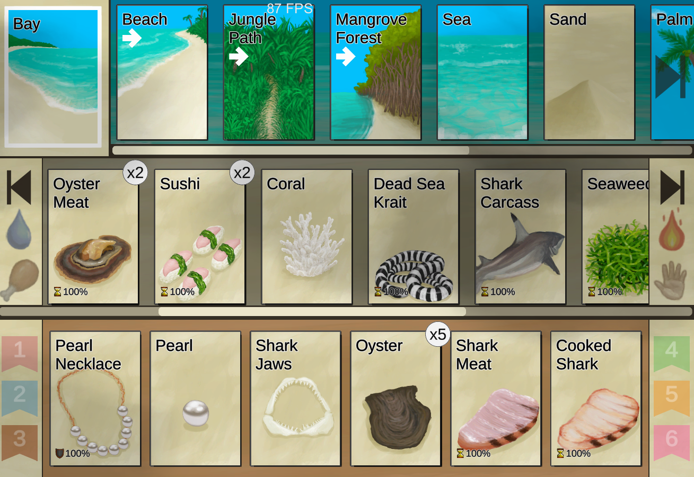

# Game Release Note  
## Card Survival: Tropical Island - Update 41  
  
Hi everyone!

We hope you are all well.After a lot of hard work, the Performance Update is finally here!

As with the latest updates, we'll be releasing this one in a special branch in order to avoid risking the game's stability. We'll use the time to fix any remaining bugs and tweak the game balance and we'll merge the branches in a few weeks as usual as soon as we make sure everything is working as intended.
If you want get the update before the merge, follow these instructions:

1) Go to your Steam Library and right click on Card Survival
2) Click on Properties
3) Go to BETAS
4) Select "updatebranch" in the dropdown list

The next time you hit play you will be playing in Update 41.

Before we go into the content list. We wanted to let you know that we've started localisation for German, Spanish and Portuguese. We don't have many volunteers yet, so it might take a while, but it's in the works! :)
If you would like to help translate Card Survival into your own language, whether it's one of the ones we mentioned or another one, don't hesitate to send us an email to winterspringgames@gmail.com!

Let's go to the content now:  
Performance Improvements:  
We're happy to say that we have made some big improvements regarding the game's performance. We've focused on improving the loading times when transitioning between zones, trying to make them as short as possible and we're quite satisfied with the results. Areas with crazy amounts of items might still take a bit of time to load but it's really nothing compared to what it was before. We think the late game experience should be significantly improved. As always, your feedback is very welcome. :)

This however required very deep changes to the way the game is structured internally, and this of course came with many bugs. We managed to fix most of them, but it's likely that a few have escaped us. Fortunately, we're confident that releasing it on the beta branch will allow us to detect and fix any remaining issues.  
Flutes:  
You can now build flutes with wood and bone. 

Initially you'll only be able to practice with them but as you progress with your skill you'll be able to unlock more and more tunes.

Each tune has its own requirements to unlock, with some requiring you to be in a specific mood, or in a particular place. Different tunes will also have their own minor effects!  
Resting Changes:  
The old rest button in the waiting option has now been changed for a new "meditate" action.
It no longer gives as much wakefulness as it used to, so players will now have to rely more on getting proper sleep. :)

Meditation will give you a way to increase your insight after reaching certain milestones, and can be made more effective through some special methods.  
Salt Improvements and Food Seasoning:  
The old method of getting salt (boiling seawater) has been removed from the game. To get salt you'll now have to build a Salt Bed with mud bricks and clay. This contraption evaporates seawater at a relatively fast pace, and lets you gather the remaining salt.

Curing Fish and Meat with Salt will now use Blueprints and require more salt.
Salt and Chilli Powder can now be used to season food, to make it tastier and sometimes slightly more durable.  
Farming Tweaks and Improvements:  
Animal feeders now have larger capacity. All animals feeding values have also been tweaked and rebalanced.

Crops now give a different yield depending on how healthy they are when they become ready to be harvested. Healthy crops will produce extra plants while very damaged ones will produce less.
  
New Weston Dialogues and Secret Ending:  
Weston has received a few new conversations that can get unlocked in some special circumstances.

A secret ending has also been added into the game. I don't want to release any details, but I should warn you that to experience it you'll have to start a new run.  
Minor Additions:  
- You can now build Wind Towers in both Mud and Stone Huts to help lower the temperature in them.
- A new outside shower can now be built to help advanced players wash themselves.
- Monitor Lizards Raids are now happening more reliably in lizard territory.
- Boars are now also able to raid jungle bases and can damage your crops if you're not careful. Yams are especially good at attracting them!
- Tables, Beds, Pottery Wheels and Bookshelves can now be dismantled and transported.
- Travois can now be dismantled.
- Stoves now have larger fuel capacity.
- Feathers can now be used as tinder and to make feathermeal, a fertilizer.  
  
Bug Fixes:  
- It is no longer possible to build wells inside enclosures or roofless mudhuts or sheds.
- Fixed some partridge bugs related to overcrowding.
- Travois can no longer be placed inside travois.
- And more! (I accidentally lost my the rest of my list of bug fixes :'( )

That's all for now. Hope you enjoy the new content and performance improvements!Take care everyone and see you on the next update!  
  
## Card Survival: Tropical Island - Update 40  
  
Hello everyone! 

I hope the new year has found you well and if not, I hope things get better soon!

It's time for Update 40!

We had originally intended for it to be the Performance update but unfortunately we have ran into a bit of a delay. Rather than postponing the update further we have decided to release it now but without the performance changes. This way people can get to enjoy the new content we had prepared now while we push the performance for Update 41. 
We apologise for the delay; we're working hard on it but it just can't go any faster. :'(

To make sure the update is stable we will first release it on a separate beta branch just like last time.
As soon as we see that there are no issues with the new content we will merge it with the main branch.
If you want to get to the update content now, follow these steps:

1) Go to your Steam Library and right click on Card Survival
2) Click on Properties
3) Go to BETAS
4) Select "updatebranch" in the dropdown list

The next time you hit play you will be playing in Update 40. 

Let's go to the content list now. :)  
Boar Breeding:  
  
Boars can finally be bred.  To do so, you'll first have to catch them on trapping pits (just like you would do with goats) and then release a mating couple in an enclosure. Once a male and a female are present they will start breeding and eventually produce offspring. 

The special thing about boars is that they will grow larger over time (as long as they are fed well) and will give an amount of meat and fat based on their size. That way you can have large boars that can serve as meat reserves when you decide to slaughter them.

Boars are omnivorous and can be fed both meat and vegetables and come with their own Boar Feeder blueprint to make the process easier. Their tusks can now also be carved into decorations by dragging a sharp knife onto them.  
Cage Traps:  
A new advanced trap is now available. Unlocked by having a high trap skill, this trap will allow you to catch live medium size animals like Partridges and Macaques.

Macaques trapped within these cages will remain inside and will gradually get tamed if you keep them fed and hydrated for long enough. This new feature will effectively make getting Macaque friends a more reliable process, provided you are willing to invest the time on improving your trapping skill.  
Travois:  
Many people have asked for this and we finally had the time to implement it. :)
The travois is a useful tool that will allow you to carry heavy objects more easily, making it ideal for transporting logs or large animals.  
Additional Things:  
We have added new craftable leather gloves so you no longer need to rely on hand wrappings to protect your hands when you are planning on chopping trees or crafting things with your hands.

A new recipe, Fried Puffballs, has been added to the list. It's a simple and nutritious vegetarian dish that should become available to players relatively early.

Macaques friends can now climb Palm Trees and bring you their coconuts.  
Minor Changes and Bug Fixes since the last Notes:  
- Fixed some issues with some food items giving the wrong saturation types.
- Added more items to filters.
- Partridge Feeders now accept more food.
- Dog Friend is no longer accepted in inventories.
- Dog Friend no longer has any weight.
- Liquids now work with the new digestive system.
- Tweaked Blueprint research costs.
- Fixed a bug that was breaking the enemy summoning process in some cases.
- The wooden bed blueprint now accepts all kinds of needles.
+ The cellar's cooling effect is now more noticeable.
- Fixed a bug that was preventing the stitched hide floor from unlocking in some environments.
- Fixed a bug that was stopping you from cooking egg fried rice on fire pits.
- Fixed some sound issues and added missing sounds.
- Fixed a bug that was causing goat kids to duplicate.
- Candles now need a full piece of fat.
- Waterskin now only require one portion of fat.
- Digging Mud with your hands now makes you a bit wet.
+ You can now repair glasses with hide glue.
- Fixed some issues that were causing some blueprints to only accept bone needles.
- Flowers can no longer be added to copper jars.
- Fixed a bug that was allowing you to craft multiple Westons.
- Fixed a bug that was stopping you from using copper or wooden needles when making bellows.
- Lowered and added saturation caps to many stats.
+ Added additional Art.
- Fixed a bug that was destroying sack contents when sacks were used to build scarecrows.
- Fixed an issue that was allowing you to build multiple wells.
- Fixed an issue where reptile saturation was not being affected by hunger and perks.
- Reduced minimum time between spiritual events.

That's all for now. 
See you on discord, the forums or the next announcement!  
  
## Card Survival: Tropical Island - Update 39  
  
Hello everyone!

Update 39 is here!

First we'd like to let you know that from now on, new updates will not go immediately live on the official version of the game, but will instead be available on a new update branch. This way we can release new content faster without compromising the stability of the game for most players. Once the new updated has been tested enough we'll just merge the branches and the content will become available to all players. 

If you want to get to the new content now, accessing the Update Branch is very easy, all you need to do is to follow these steps:

1) Go to your Steam Library and right click on Card Survival
2) Click on Properties
3) Go to BETAS
4) Select "updatebranch" in the dropdown list

The next time you hit play you will be playing in Update 39.

Now to the content list:  
Quality of Life Improvements:  
<b>Blueprint Liquid Requirements:</b>

Blueprints now show how much liquid they need in their slots. We use coconut halves as a measure unit, so everyone can more easily visualise how much liquid is required on each case.

<b>Storms Destruction:</b>

Structures and items on the location row that get destroyed by storms now drop some of their parts. So heavy stones are no longer blown away now when your deadfall traps get destroyed. :)

<b>Keyboard Shortcuts:</b>

We've had this one on our list for a while and we finally got to do it now. Thanks for the suggestions! ;)
Here's our current hotkeys:
Esc: Closes windows
Q-W: scrolls location row
A-S: scrolls base row / inventories
B: Toggles blueprint screen
J: Toggles journal
C: Toggle character sheet
T: Toggles waiting options
E: Toggles equipment
H: Toggle wound screen
D: Toggles stat screen  
Food-Related Improvements:  
  
<b>Digestive System:</b>

The digestive system has been made more complex in order to avoid some exploits and make it more realistic. Food will now gradually release its calories into your body as it gets digested. Throwing up while food is in your stomach will stop you from getting any calories that hadn't been already absorbed.

<b>Eating Utensils:</b>

You can now craft eating utensils out of wood or copper. Eating with them will give you more structure and reduce the amount of filth you gain from eating. They can also double as decorations if you place them on a shelf. 

<b>Additional Stuff:</b>

The cooking skill now increases more gradually as its progression used to be too fast. Mastering it will now be a bit more difficult.
We've also replaced the old Scrappy soup for the more unique and practical Bone Broth which gives a new use to bones. Finally we have also added a new recipe: Egg Fried Rice.  
Copper-Related Improvements:  
We added a new skill that will allow you to craft new things out of copper.
It will increase every time you smelt something or craft something using metal.

<b>Recycling Copper:</b>

You can now smelt any copper tools or items you have to recover their metal. To do this simply put them inside a Forge or Advanced Kiln.

<b>Copper Decorations:</b>

You can now make copper decorations that have a stronger bonus than their wooden counterparts. Similar to wooden carvings, the higher your skill the higher your chances of making them come out right.

<b>Copper Liquid Containers:</b>

You can now make copper jars and bottles. These containers can boil water faster than their clay counterparts making them specially useful for preparing brews or obtaining salt. They also double as decorations!

<b>Additional Stuff:</b>

Other new copper items are Copper Necklaces, Needles and Eating Utensils.  
Tailoring-Related Improvements:  
<b>Needle Improvements:</b>

You can now make needles out of copper and wood once your appropriate skills get high enough, making bird bones no longer a necessity for tailoring blueprints.
In addition to this, needles are now reusable, with wooden needles having more durability than bone ones, and copper ones having the most durability of the 3 types.

<b>Repairing Clothes:</b>

Most clothes can now be repaired by dragging threaded needles into them. To thread a needle just combine them with cord.   
Additional Features:  
<b>Bow Drill:</b>

Finally a better fire starting tool. :)
It gets unlocked once your crafting gets high enough. 

<b>Pottery Wheel:</b>

You can now build a Pottery Wheel that will make it easier to make Clay crafts, speeding up the process.

<b>Repairable Sails:</b>

The raft's sail can now be repaired once it breaks, making the raft trip a bit less punishing.  
Minor Additions since the last Announcement:  
+ Baby can now be renamed.
+ Fallen trees can now be found while exploring the jungles.
+ Added art for the Seagull Charm.
+ Perk-exclusive stats are no longer visible when those perks are not equipped.
+ Tourniquets can now be used on shark bites.  
Fixes and Hotfixes since the last Announcement:  
- Fixed an issue that was causing a stone image to appear in the glue recipe.
- Fixed a bug that was getting the game stuck when the jerrycan with fuel exploded in a campfire.
- Leather Backpack can now also be unlocked with the hunter's satchel.
- Grandpa can now drink milk, sugarwater, honeywater, mead and sugarwine.
- Adding leaves to solar stills no longer requires light.
- Fixed a bug that was letting you mix honey with large bodies of water.
- Fixed a bug that was causing macaques to sometimes raid too often.

That's all for now. 
We actually had more content that we wanted to add for this update but this month has been so crazy and busy that we had to cut some of our planned things. In any case, we'll add these things to the next update. 

Next on our list is the Mac/iOS version, localisation to other languages and performance improvements.
We'll keep you all update in our next announcements. ;)

By the way, lately it's been getting specially hard for me to keep up with all our forum and discord messages. We read everything but I just don't have the time to answer things as often as I used to. 
I'll make sure to catch up to all next week as soon as I finish with some priorities I need to focus on during the weekend. ;)

Have a great weekend everyone.
Until next time!  
  
## Card Survival: Tropical Island - Halloween Update  
  
Hello everyone!

I hope you're all well, it's time for Update 38, the Halloween update.
Let's go straight to our list of content:  
Mermaid:  
  
A new improved Mermaid is now available as the 4th official character.
She is a "hopeless" character that should provide some challenge to veteran players, as it is one difficulty level higher than the tourist.
While the mermaid is able to see in the dark and drink salt water, the fact that her skin cracks easily when out of the water and gets severely damaged by sunlight makes her a difficult character to play. As if this wasn't enough, she is also pregnant with a child, starts in the dangerous Desolate Beach and is being actively hunted by sea monsters.  
New Perks:  
We've added some new perks that where related to the mermaid and an additional horror one for halloween. Here's the list:

<b>Main Perks:</b>

<b>Alien Lifeform:</b>
Shortly after starting your island adventure an asteroid will fall from the sky. You will then notice something growing from the crater. Something that smells good and appears to be edible...
Smells great, strangely tasty, very nutritious and easy to grow. What could go wrong!?

<b>Seahounds: </b>
Horrible sea monsters obsessed with eating mermaid flesh (or human if no mermaid is available). They will hunt the coastal areas of the island and can inject you with parasites if they manage to sting you. Their parasites will grow inside your body if left unchecked and alter your mind to make you want to stay close to the sea so that the seahounds can finish their job.

<b>Pregnancy:</b>
This perk will cause your character to start pregnant. Pregnancy will give you nausea during its first stages, increase your hunger and calorie needs afterwards, and finally make it harder for you to walk. After 3 months you will then be able to give birth to a little baby!

<b>Additional Perks:</b>

- Feral: Become immune to the effects of discomfort. Perfect for cave living.
- Hypermetabolism: Burn energy very fast and have a higher body temperature.
- Land Sickness: Your character will get nauseous when far from the sea.  
Localisations:  
On an unrelated note, we also wanted to let you know that we're almost done with our localisations system! So we're going to be contacting all the volunteers that wrote us over the following days so we can start with translations as soon as possible!
If you are interested in helping us translate Card Survival to your language, write us an email at winterspringgames@gmail.com and we'll add you to our contact list. ;)

We would also like to take this opportunity to thank all off our Chinese players for all the support they've been giving our game since our recent release. Seeing how well the game has been received by you has been a very nice surprise for us.
We have included a new cooking recipe that had been suggested by your community, Drunken Crab, as a way to thank you. :)
Hopefully we'll be able to get Card Survival in Chinese very soon! <3  
Minor Changes and New Features:  
- Added a new Straw Cape that serves as less effective alternative to the raincoat.
- Some plants (including bark) can now be dried in the smoker.
- Added a new Drunken Crab recipe (made with alcohol, crabs and ginger).
- Most skill perks now have a stronger effect on the difficulty score.
- Gluttonous and Inappetent perks now have effects on food saturation.
- Snake Grass now also grows in the Mangroves.
- Mud Deposits are now more common in the Mangroves.
- Small game traps can now be destroyed by storms.
- Bone Knife has more durability now.
- Island Chicken no longer needs salt.
- Made official character portraits available to everyone.  
  
Bug Fixes since the last Patch Note:  
- Fixed the Speedrun achievement triggering even past the 60 days mark
- Added some redundancy so that achievements that you completed offline get unlocked on Steam once you are back online
- Fixed a bug that was stopping the honey blueprint from producing honey.
- Fixed "only available in full version" text showing up in some places
- Fixed a stone image showing in blueprint ingredient slots that don't need a stone
- Fixed an issue that was preventing a tourist objective from being completed.
- Fixed an issue where eating butter or fat directly would still use spoilage.
- Corrected the fertilizer icon for mushroom beds.
- Fixed a bug that would show the water reservoir adding to bug population even when you put oil in the water
- Yam Jam now also uses portions instead of durability, just like Fat and Butter.
- Fixed a bug with Honey Candy that would duplicate cooking pots
- Fixed some typos in the guide
- Fixed an issue with the Island Gourmet achievement.
- Fixed an issue where honey glazed pork was giving the wrong saturation type.
- Fixed a bug that was causing rafts to move slower after stopping at an atoll.
- Fixed a bug that was causing the honey candy recipe to use no honey.
- Alembics will now fill any type of containers when making aqua fortis.
- Fixed a bug that was causing the flare to show 200% durability.
- Fixed some issues where the Bird Rock and the Desolate Beach were showing the wrong names in saves.
- Fixed a bug that caused dynamite to kill a lot more fish that it was supposed to when used in certain areas of the island.

That's all for now.
Happy halloween everyone and see you for the next update!!  
  
## Card Survival: Tropical Island - Full Release  
  
  
Hello everyone!

The moment has finally come. After more than a year in Early Access and an extra year of development before that, Card Survival is finally ready.

We want to give our personal thanks to all the people that helped us improve the game by reporting bugs and making suggestions, to those who helped our game reach more people by creating content about it, to those who have given us fuel by expressing their love for the game and really to all the people who've given Card Survival a try, 
We are very happy that you all exist. <3  
Short Term Plans:  
Our plan for now is to continue fixing bugs as we find them and pushing hotfixes as usual while I try to get more exposure for the game.
We'll also continue filling in the survival guide for the next few weeks until it's complete, hopefully soon! (-_-u)

Later in the month we're going to be releasing game achievements and more importantly, a free limited version of the game for those who want to give Card Survival a try before buying it.

Then, once things are a bit more settled we'd like to take a short break to recover and our plan would be to later return with an update for Halloween that should include the new Mermaid character, as well as new features and perks. We'd also like to release our iOS and Mac versions around this time.

On the background we'll also start working on performance improvements and potentially looking into starting the localisation process.  
Long Term Plans:  
Like we've mentioned in the past, our idea is to continue updating Card Survival at a lower pace while we slowly shift our focus to our upcoming games, including the new Card Quest and the next game in the Card Survival series.

The amount of updates we release will most likely be dependent on what reception the game gets. So if you liked Card Survival and you like how we do things, consider leaving us a review and telling others about the game. These things can really go a long way and we need all the help we can get. :)  
GDWC  
We are participating in the Game Development World Championship and we thought it might be a good idea to mention it here as any support could help Card Survival get some extra exposure.
You can help us improve our ranking by visiting our GDWC page, liking it or sharing it. 
No registration is needed, so it's quite easy. :)  
New Perks:  
We've added a few new perks to the game. Nothing too fancy, but players should now be able to have perks to start in almost all locations of the island and even in an Abandoned Farm in the Secret Valley, just like the Farmer character.  
Minor Improvements + Fixes and Hotfixes:  
- Guide Entries layouts have been reworked.
- Blueprints steps now update better (images and numbers now change together).
- Grandfather no longer shows the medicine tooltip for liquids that are not actually medicinal. 
- Grandpa and Macaques now drink proportionally to the amount of drink that is given to them.
- Fixed some bugs that were causing roofs to collapse at strange times (again).
- Fixed a bug that was preventing tide pools from updating when you're not there.
- Added missing Yam and Mushroom Saturations to the Saturation List.
- Added some missing Art.
***
- Fixed some problems with alignment of visual elements in the journals
- Right-clicking to put something in an inventory will move the view of the inventory to the thing you just put inside.
- Clicking on locked blueprints that require another blueprint to be unlocked will take the view to that blueprint so you can check its requirements.
- Added sounds to menues and buttons.
- Drums now alter your mind less.
- Cleaning actions with brooms now inform you when it's too dark to clean.
***
- Fixed a bug where the time displayed by the confirmation popup on certain action didn't match the actual time of the action (for instance when detaching seats in the plane with the tourist)
- Eggs now give a lot less food to partridge feeders.
- Fixed bug that was preventing you from lighting tinder from a fire.
***
- Leaves now give the proper value when used as fuel.
- Sheltered Leaves can now be repaired with all leaves.
- Added a scroll view to the "current status" effects of the stat inspection window (ginger stat window bug).
- Fixed a bug where some chain of events would complete with a delay (macaque delay bug).
***
- Tweaks and fixes to the Farmer.
- Knapping is now easier to level up.
***
- Fixed another roof bug.
- Tweaks to farmer's journal.
- Saturation system improvements.
- Leaf Bed can now be built with every type of leaf.
- Fixed a bug with the honey blueprint.
- Visual improvements to blueprint research tab.
- Fixed sorting issues in the blueprint list.
***
- Implemented new Research System to replace Bluerptint Shop.
- Fixed a bug with the collapsing roofs.
- Balance Tweaks to saturation (specially on beach area food items)
- Saturation now takes longer to cause nausea.
- Added Tonic Water into the game.
- Balancing Tweaks and improvements to the Malaria System.  
  
  
That's all for now. Thank you all again for having shared this journey with us.
We'll be here in the forums and on discord as usual. ;)
See you around!  
## Card Survival Update 37  
  
Hello everyone!

Hope you are all well.

Let's go to straight to our content list:  
New Blueprint Unlocking System:  
  
On this, our second and last mini update, we are releasing a new blueprint system that we believe should make the game less overwhelming to new players. 

From now on, once a blueprints is unlocked, players will have to purchase them in order to be able to use them. Blueprints will now have to be bought with suns on each individual run. This will not only give a new use to suns, but also make the acquisition of new blueprints a more conscious action, which is something we think will help.
In addition to this, this system allows you to see all blueprints in the game at all times and informs you of the requirements to unlock them, making things a lot less obscure than before.  
Guide Improvements:  
- Blueprints now have a help button that takes you directly to their guide entry. This way you can see what they are about before placing or purchasing them.
- Blueprint Ingredients now also have a help button, so you can find out what the ingredients are and where to get them.
- Stats now also have a help button that takes you to their entry on the guide.
- The survival guide interface has received some polish.
- We have added multiple concept/tutorial pages to help understand some of the game systems. Let us know if there are any other systems you would like us to explain better!
- We have improved the searching algorithm for finding entries in the survival guide.  
  
Minor additions and Balance Changes:  
- The Shed is now more vulnerable to storms than the Mud Hut.
- The new Stone Hut is invulnerable to storms and a bit larger than the Mud Hut.
- Macaques are now harder to hurt, making them a worse source of meat and leather.
- Saturation now goes down slower, making it more important to vary your diet.
- Ginger is now better at lowering food saturation.
- Alcohol now has a stronger dehydrating effect.
- There are now more ways to get drunk: Mead and Sugar Wine.
- Rice now gives more satiation.
- Added a default journal for custom characters.
- Added descriptions for all stats.
- You can now find wood and sticks on the beach.
- Papers can now be lit with fires and candles.  
  
Fixes and Hotfixes since the last Update:  
- Fixed a bug that was causing sharks to constantly bite you when trying to wash yourself in the raft.
- Repairing Supply Chests now requires confirmation.
- Added more Guide Entries.
- Added some new cards to the filters.
- Grandpa can now drink coconut water.
- Fixed a bug that was stopping roofs from collapsing properly.
- Reorganized blueprints.
- Fixed a bug with the path that goes from the eastern to the western highlands.
- Fixed a bug that was causing items to duplicate.
- Fixed an issue that was preventing the eastern to western highland path from appearing.
- Fixed an issue that was breaking the seat and debris objectives for the tourist and farmer characters respectively.
- Improved many guide entries and removed many incorrect ones.
- Heavy Stones can now be destroyed.
- Fixed a visual appetite bug.
- Cholera tweaks to how you catch it.
- Heavy stones can now be trashed.
- Added new tips.
- Fixed a bug that was preventing grandpa from getting healthy.
- Fixed a bug that allowed you to build raft fish traps anywhere.  
  
Final Update:  
This will be the last update we release on early access as our final release is getting quite close. 
Until then we're going to be working on balancing the game, fixing bugs, filling in the guide entries, listening to your feedback on the new blueprint system and trying to reach out to youtubers to try and get some promotion for our game.

Thank you all for your support.
Have a good week and see you for the final release! ;)  
## Card Survival Update 36  
  
Hello everyone!

We just released a new feature into the game that we thought deserved its own update/announcement, so here we are with the first of these mini updates we promised!  
Safety Mode:  
The main feature we are releasing this time is the new Safety Mode.
This is a checkbox on the character selection screen that provides you with a safety net when playing the game. It can be applied to both official and custom characters and once checked will allow you to restart your day at any time from the in-game menu. You will also be given this option on the game over screen, so if you accidentally overheated to death or made a bad decision that led you to dehydrating you will have a chance to save your save. Provided of course that you ticked the Safety Mode option when you first started your run. :)  
  
  
On a related note we decided to remove the Survivalist as it was originally implemented her as a patch or quick solution for people that were having issues with the game's difficulty and it wasn't a proper character like the tourist or the farmer. I am hoping that the safety mode will help make things more managable and remove the need for the survivalist.
I might re-add the character later if I manage to get the time to give it a proper journal and a more unique adventure.

I have also temporarily removed the Mermaid but I will be re-adding her a bit after release as she is currently a bit broken with all the changes that have gone into the game. The new Mermaid will have her own journal as well as some new unique features.  
Visual Improvements:  
We have been working hard on making the game look prettier.  The game now has a new splash screen as well as shadows and other visual improvements for its cards and menues. We are happy with the results and hope they will make Card Survival more visually attractive to new players!

We have also added missing art for some stats and other things and will keep adding more during the following weeks.  
Minor Changes and Additions:  
- Tinder can now also be lit with Citronella and Jasmine candles.
- Bug Protection is now stronger.
- The Farmer's start is now considerably more generous with rain and the reservoir starts full.
- You can now soak rice in boiling and rice water.
- Gas mask protection effects is now weaker when not wet.
- Fiber can now be lit in stoves too.
- Made mold descriptions more helpful.  
  
Fixes and Hotfixes for the Update:  
- Fixed some issues involving all traps, specially one stopping you from catching partridges in the Secret Valley.
- Deadfall and Snare traps now work on the Eastern Grasslands and the Desolate Beach.
- Fixed a bug that was stopping Cinchona Crop Plots from producing trees (was giving bark directly instead).
- Fixed a bug that was hiding the effects of ginger.
- Fixed a bug that was allowing you to make mud in the dark.
- Macaques now transfer their previous states when going from wounded to friends.
- Fixed a bug with the dismantling action of the Scrap Spear.
- Cinchona bark now rots.
- Drying racks now properly slow down the spoilage of food in their inventories, but accelerate it if it's raining.
- Fixed a bug that was causing drying racks to create duplicates.
- Fixed a bug that was causing beesmokers to disappear in certain cases.
- Fixed a bug that allowed to harvest food from tidepools even when they were empty.
- Added some missing saturation icons.
- Changed the icons for Mites and Fungus in Crop Plots.
- Fixed a bug that was causing cleared jujube plants to dissappear.
- Cleared Wild Jujubes no longer have the wrong name.
- Fixed the wrong name in pesticides.
- Drying Racks are now cheaper to build.
- Fixed a bug that was making some characters start with cholera.

That's all for now!
See you soon in the next Mini Update! ;)  
  
## Card Survival Update 35  
  
Hello everyone!

Hope you are all well.

This is going to be our last regular update during early access as our final release is getting quite close.
During the following weeks we are going to be focusing on making the game as stable as possible, balancing and polishing things, filling up the survival guide and adding some last remaining features with some "mini updates".
This should not take us more than a few weeks (fingers crossed), at which point the game will be officially released.

Let's go to the content list now:  
New Diseases:  
We have added a couple new diseases to the island.

The first one is <b>Cholera </b>which can be contracted by being dirty and will cause nausea and extreme diarrhoea.

The second is <b>Malaria</b>, which can be contracted from mosquitoes (included in bug population) and can be quite dangerous if not treated with quinine. Quinine can be extracted from the bark of the new Cinchona Tree (found in the jungle highlands) and is essential to surviving this disease. A more potent version of this remedy can also be made if one has access to vitriol.
Large bodies of water like puddles, raincatchers and reservoirs now have a positive effect of insect population, so keep that in mind too!

Characters with the immunized perk (like hunter and farmer) will be resistant to these diseases but those who are not will have to be cautious and try to stay clean and avoid areas with high insect population until they are ready.  
Crop Pests:  
  
Crops can now get Mite and Fungal infestations.

Mite infestations will be more common in dry areas, underwatered plants and fertilized crops while Fungal ones will be more common in humid areas and overwatered plants.

Different plants will have different resistance to mites and fungus and as a general rule will be more susceptible to disease if growing outside of their natural environment.

Once a plant gets very infested it will start infecting other plants so try to not these things get out of control.
Fortunately there are a few ways to deal with these things. Crops can now be destroyed (returning you an empty crop plot) if you see there's no way of saving a plant. You can also use chilli pesticide to kill and prevent mites as well as a new brimstone pesticide which kills both mites and fungus.  
New Environments & Related Features:  
  
Two new environments have been added.

The first one is the Eastern Grasslands. A more arid version of the old (now Western) Grasslands. It connects the with the other Grasslands, the Eastern Highlands and the new Desolate Beach.
This environment contains a new plant called WIld Jujube which acts a good source of leaves and has edible fruits. This is also Cobra and Monitor territory so proceed with caution!

The second one is the Desolate Beach, a desolate volcanic beach that is adjacent to the Eastern Grasslands, the Mangroves, the Bird Rock and the Volcano itself. This area is a lot more barren and dangerous than the other coastal environments, having Monitor Lizards and no Palm Trees, and can now also be used as a starting place thanks to a new perk.
Because of its proximity to the Volcano, the Desolate Beach also possesses some obsidian, flint and brimstone rich rock, although in smaller quantities than the volcano, making this an safer but less effective alternative to get these materials.
This area also comes with the new Tide Pools which can be harvested for shellfish and get gradually replenished during high tide. These Tide Pools can also now be found in the Rocks and the Bird Rock.
Lastly, there is also a new cave (called the Tidal Cave) which can be found in this area and contains a tide pool of its own. This cave does not protect against storms though and will get you and your clothes wet every time the tides are high.  
Raft Improvements:  
The Raft Voyage has received some extra features again.

<b>- Floating Debris:</b> You can now bump into floating debris that you can harvest for materials including wood, cord and plastic.

<b>- Shark Visitors: </b>You will now sometimes get sharks following your raft. These sharks will attack you if you get into the water while they are close, so be carefull.

<b>- Atoll: </b>There is now also a chance to find small atolls where you can stop your raft to recover for a bit before continuing your Journey.

<b>- Passing Ships:</b> Which can rescue you early if you manage to catch your attention. To do so use Flares, Torches, Signalling Mirrors, Candles or just wave your hands and scream at them. All these methods vary in effectiveness and are subject to luck but you should still try with your best available tools whenever you see the opportunity.  
Loading Tips:  
The game now shows loading tips both when loading new saves and when entering environments. Hopefully this will help players discover many new features and make some of those long loading times a bit better while we work on improving performance.
There aren't that many tips yet but we are going to be adding many in the following weeks!  
New Survival Guide:  
The old survival guide was a bit confusing and obscure, not too mention quite out of date. For this reason we have made a brand new one that is more akin to an encyclopedia with a search function included.
The new guide is not ready as you'll notice it has a lot of duplicate/erroneous entries and most of the proper ones are quite incomplete, but we are going to be filling them up for the final release as well as adding tutorial pages to it.

We'll also soon be adding some new features to it, such as filters and quick access buttons to cards that would take you to their appropriate guide entry.  
Extra Features:  
<b>-Drying Rack:</b> You can now build a Drying Rack that will allow you to dry many plants as well as fish and meat and will soon be replacing the old drying system.
This structure can only be placed in open spaces (it won't work in the wetlands or deep jungle for example) and only works while it's not raining. 

<b>-Fresh Leaves: </b>They can now be acquired when chopping some trees and plants. They can be used as feed for goats and also left to dry to use as tinder.  
Fixes and Hotfixes for this Update:  
- Fixed a bug where boiling salt water would not yield salt when the boiling happened offscreen.
- Potential fix on the big bad bug where lots of cards would disappear in the top row after travelling to an area.
- You can now build rafts in all coastal environments.
- Bee suits now also protects against bugs.
- Macaque Skewers now also accept chilli powder.
- Fixed Issues with multiple Palm Trees losing their coconuts at the same time.
- Increased coral drop chances.
- Dragging Stacks is now faster.
- Wound screen now always start to the left when open.
- Weather indications no longer appear on main menu slots.
- Tweaks to card special durabilties.
- Fixed a bug with the scrap spear.
- Fish Tacos now also accept dried Chilli and Chilli powder.
- Milking goats now only costs a minitick.
- Fixed a bug when taking pictures to monitor lizards.
- Fixed an issue with the Tourist's souvenir mission.
- Tweaks to the fonts.
- Fixed an issue with roof damage not working properly.
- Treenails now unlock earlier.
- All fires can now be fed with stacks.
- Fixed a bug that was causing glasses to get damaged on some wrong events.
- Chests and Trunks are no longer damaged by storms.
- Dragging stacks implemented.
- Tweaked blood loss system.
- Tweaked Tourist start.
- Fixed an issue with the cut shavings action.
- Fixed some issues with the sharpened stone blueprint.
- Increased coral spawning chances.
- Fixed a visual bug where luggage would change colour.
- Fixed a bug that was causing plane seats to dissappear.
- Plane Trunk can now accept Jerrycans.
- Luggage can now be placed on the location row like baskets.
- Fixed a bug with the scrap spear.
- Fixed a bug that was stopping macaques from raiding some indoor environments.
- Added missing raft art.

That's all for now! See you all next time!  
  
## Card Survival Update 34  
  
Hello everyone!

I hope you are all well.

I would like to start this announcement by telling you that August is going to be our last month in early access. By then it will have been a year since we first released and we think it will be an appropriate time to release our game. We are hoping the release will bring us a much needed boost in sales and a chance for us to take a short break to recover and spend some time with our families.

This won't be the end for Card Survival though, as we have more updates coming after that.
While they won't be as crazy frequent as the ones we've been releasing this year they will still be introducing new content, polishing the experience, and bringing performance improvements. We will also be working on localizations and a mac/iOS release.

Now to the content list:  
Tourist:  
  
The Tourist has received some improvements including a new journal of its own to follow in line with the Hunter and Farmer characters. The plane crash perk now also has received some improvements, making it start with some detachable plane seats (which can be harvested for scrap, cloth and fiber) and some luggage containing papers, chocolate and some other things.  
Raft Improvements:  
The raft and the sea voyage have received a balance pass and some new features.

The raft now has a few improvements of its own:
- Raft Expansion: You can now build two different expansion improvements to expand the amount of things you can carry in your raft. Adding these expansion will also allow you to add more supply chests to a total of 4 if both expansions are built.
- Raft Shelter: This structure will let you sleep on it and protect your from the rain and sun.
- Fish Traps: Fixed nets that will catch fish for you over time.

The Island Escape ending is not ready yet though, so expect some new features for it coming soon.  
Sending Cards to Other Environments:  
You can now drag cards to the entrances of indoor environments to move things there without having to enter. This works for mudhuts, sheds and caves as long as the entering the place does not have a tick cost (so it doesn't work for the cave system in the highlands).
Hopefully this will help reduce the time spend in loading screens while we work on improving performance. ;)  
Dragging Stacks:  
By popular demand there's now a new feature that allows you to quickly move multiple cards into feeders, compost bins, inventories and indoor environments. ;)

Note: This feature has been temporarily disabled because of a last minute bug. We'll push a hotfix as soon as we can once we are sure it's stable.  
Beautification:  
We've been working on getting Card Survival to look better trying to achieve a more tangible and unified style. This is still a work in progress though so expect more improvements soon, both to improve aesthetics and readability (we are aware some has been lost with the new font).
As always everyone's feedback is welcome!
Hopefully you will like the new style or at least the direction in which it's going.  
Minor Changes:  
- You can now make a scrap spear too.
- Making honey now also has a blueprint like coconut milk.
- Ash Dressings are now also available as blueprints.
- Sharpened Stone now can also be crafted as a blueprint and now require a heavy stone.
- Flint Axe is now easier to unlock.
- Flint Spear is now harder to unlock.
- Dynamite can now be used for revenge purposes.
- Split Sago Logs now give rotten remains when they rot.  
  
Fixes and Hotfixes for the Update:  
- Fixed a bug that was causing mushroom objectives to not show in the plant of crops objective for the farmer.
- Solar Stills can now be buil in the secret valley.
- Fixed a bug that was preventing log traps and trapping pits from catching boars in the deep jungle.
- Fixed a bug that was preventing you from finding the beach from the rocks.
- Boiling Rice does not spend the water now, instead producing rice water which can be drank and reused.
- Rice Water and rice now have a small anti diarrhoea effect.
- Coffee beans can no longer be used as bird feed after i was informed it's bad for birds.
- Fixed some issues with some of the farmer journal missions not working properly.
- Tropical Almond Kernels and Coffee beans can now also be used to make bird feed.
- Fixed issues with the hunter's journal.
- Fixed a bug that was preventing the hunter and the farmer from unlocking the raft.
- Increased the rate at which the grandfather heals.
- Animal feeds now accept any combination of legal ingredients.
- Increased the difficulty rating of the Farmer character.
- There are now more important warning when suffering from hypothermia and hyperthermia.
- Oil now evaporates slower.- Fixed a hunter spear objective that seemed to be broken.
- There's a minimum swimming skill requirement to attempt to swim to the bird rock now.
- Fixed a bug that was making it easier to swim to the rocks even when low on swimming skills.
- Added quicklime and straw as usable temper items when working with clay.
- Fixed a bug that was preventing more than one young tree of a type to exist at any given time in a single environment.
- Fixed many action log texts.
- Bird Feed now costs less food.- You can now feed medicine to your grandfather (it makes him recover a bit faster).
- Fixed an issue with the jungle salad showing the wrong ingredient text.
- Added woodworker to the proper perk tab.
- Made the clay pot cooler and some other clay things heavy so that they won't get carried away by storms.
- Fixed some bugs that could happen with the grandfather cooking objectives.
- Fixed an issue with the wooden bed showing the wrong art.
- Fixed some issues where the grandfather would turn into a macaque after death.
- Added missing art for the update.

That's all for now.
See you next time!  
  
## Card Survival Update 33  
  
Hello everyone!

Hope you are all well. Update 33 is ready.
Let's go to the content list.  
Farmer Character:  
  
A new introductory character has been added to the game along with its own unique journal missions,
The farmer will have to take care of her sick grandfather while restoring his farm back to its former glory.

This character is a bit harder than the hunter and is designed to provide a very different experience from him, mainly one that takes place deep in the jungle and away from the coast land. This adventure will have you planting lots of different crops, building improvements for the farm and cooking your grandfather's favourite meals.

Hope you enjoy the new experience. :)  
New Plants (and mushrooms):  
The <b>Mango Tree</b> has tasty, nutritious and refreshing fruits. It can be found in the jungle highlands and acts mostly as a food source.

The <b>China Rose</b> is a very beautiful type of flower that can be worn in your head, brewed into a relaxing and slightly immune-system boosting tea, eaten raw and of course used by bees to make honey. It can be found in the jungle highlands too.

<b>Assorted Mushrooms</b> are a new type of mushrooms that can be found in the wetlands and some caves (where they grow over time on their own). Eating them will have a random effect based on how high your herbology skill is. Needless to say eating them with a low stat will be dangerous while eating them with a very high one will be harmless.

The <b>Palm Bush </b>is a minor plant that can be found in many different places. When harvested it gives you lots of palm fronds, effectively acting as a reserve for that item. They can also be planted in crop plots.

<b>Snakegrass</b> is now found in patches that can be harvested. Planting snakegrass in crop plots will now produces patches too.

In addition to small trees you can now also find <b>Small Palms</b> which give palm fronds and long sticks.

Not a new plant, but a new feature: Palm Trees, Tropical Almonds and Mango all regrow their fruits after a while making them a renewable food source that can become quite good if you have them in large numbers.
These trees can all be planted in crop plots now (yes, Palm Trees can be grown now) and will start as young trees that will have to mature before they can start producing fruits making them something of a long term investment.  
Success Calculations in Actions:  
Actions will no longer show a percentage indicating your success chances, they will now instead show a text saying things like "Pretty sure I can do it" or "Won't make it" to make it more realistic. Being drunk or in a manic state will skew those predictive statements and make them less accurate though, so be careful!
In addition to this, some things have changed in how the success chances are decided, and they are now calculated on the conservative side. Based mainly on your chances of succeeding without getting hurt rather that on your chances of succeeding the action no matter the cost as they were before.  
Game Clock Changes: Miniticks  
Some minor actions that used to take no time such as using paths or eating some types or food will no instead cost a minitick. Miniticks take 3 minutes in clock time, so there's 5 of them in a tick. The game will still work with ticks though, so stats will only update when a tick passes (every 15 minutes).  
Menu Improvements:  
  
The equipment screen has been greatly improved. Wounds now have they own separate tab so they are easier to find. Arrows have also been added to quickly jump from the edges of these screens.

There's also a new screen here called the character sheet, which shows your character's face, description and perks for reference and contains a quick access button to your skills, stats and character log (the screen you can access after dying or winning the game).  
Minor Improvements:  
- You can now craft a wooden shovel (it's unlocked through your woodworking skill).
- You can now mix safe water with unsafe water (spoiler: you get unsafe water)
- Macaques now start more afraid of you so they are less annoying at the begining of the game.
- Chests are now a bit cheaper, have more room and their contents weight doesn't count for the mudhut or shed.
- Made Bleeding out less dangerous.
- Food saturation now has a stronger effect on morale. 
- Bow is a now lot safer against boars and monitor lizards.  
  
Fixes and Hotfixes for the Update:  
- Fixed some issues with the jungle salad.
- Fixed a bug that was preventing traps from catching goats in the eastern highlands and the grasslands.
- Fixed a bug that was making the harvest beans action count as a vegetarian action.
- Fixed a bug with Jasmine Plants.
- Aloe Vera now benefits from the cooling effects of cellars.
- Eating sago flatbread now takes no time.
- Forges now have a special dismantle action and can no longer be destroyed with stones.
- Hunter and Unravelling Marks now heal slowly at all times, and faster if you have an altered mind state.
- Sea Kraits can't bite you while spearfishing on the first month.
- Macaques can now escape without stealing anything when attacked.
- Fixes to the Bee Suit.
- Fixes and tweaks to the Skeps (they now need to be fed less often).
- Stat tweaks to some food items.
- Jasmine crop plots now produce more flowers.
- Fixed some bugs with the bee smoker.
- Added unfired version of the bee smoker.
- Improved Bee Skep icons.
- Fixed an issue with players accidentally unlocking a WIP wooden shovel.
- Fixed some issues with swarming bee skeps.
- Cellars now protect better against heat.
- Fixed a bug that was causing goat and bird feeders to dissappear.
- Fixed some issues with the goat and bird feeds.
- Fixed a bug that was preventing the honey candy blueprint to appear.
- Added new foods to the food filter.
- Fleshing actions now use workshop bonus too.
- Removed Spoilage from wax.
- Fixed a bug related to feeding bee skeps.

That's all for now!
See you next time!  
  
## Card Survival Update 32  
  
Hello everyone!

Hope you all had a good time since the last update. 
It's Wednesday again and our new one is ready.
Let's go to the content list:  
Bees:  
  
Wild Beehives can now be found in the Deep Jungle. Hives give honeycomb which can be separated into wax (alternative for candles) and honey, but their bees can swarm and sting you if you come unprepared. With the help of a torch you can smoke and calm them down so you can harvest a queen and some of their drones along with their honeycombs.

With a queen, some bees, a honeycomb and some other things you can now build bee skeps. These artificial hives need to be fed sugar water to help them grow and will produce more honey the more flowers you have in the area. Skeps will also start swarming once new queens are ready, an opportunity that can be used to build new skeps by capturing the surplus of bees.

A bee smoking tool can be created with clay as a more effective and efficient alternative to the torch. A bee suit can also be crafted to help protect you against stings. (this last item is missing its art but I will be pushing it tomorrow with a hotfix).  
Mushrooms:  
You can now find 2 different types of mushrooms in the game. These mushrooms can be harvested, eaten and planted in a new more advanced structure called the mushroom bed. This structure requires straw and manure/guano to build, and has to be watered like crop plots. It can also be built indoors however and can grow its contents faster when in the dark.

Puffballs can now be found in the jungle and deep jungle. These mushrooms are quite big and can be eaten raw or used in some recipes.

Magic Mushrooms can now be found in the grasslands (although they are hard to find) and can be eaten to alter your mind state.  
Hunter Character:  
  
As we approach final release, we are going to be replacing some of the official characters (as well as adding new ones) and giving them unique journals to help make their experiences more unique and help introduce the game's features to new players.
The first of such characters is the Hunter, which replaces the old Islander.

The Hunter has his own journal and his own set of missions and objectives to complete before he can finish the game with either the island escape or home endings. These missions require him to hunt many different types of animals, craft some unique items and finally to perform a ritual to proof that he is ready.

Among his unique craftable equipment you'll be able to find a portable drum, a ceremonial dagger, a shark headpiece that makes its wearer a better warrior and a seagull charm that helps with spearfishing.

The Hunter, along with the upcoming Farmer character, is supposed to be one of the introductory characters to the game. Let us know what you think if you get to play him. :)  
Knapping:  
There is now a new skill called knapping.
Flint can now be found as small stones and larger slabs in the rocks and the highlands. By hitting these rocks with a stone you will be able to train your knapping skill and eventually unlock some new blueprints. These blueprints are: flint knife, flint spear, flint axe, obsidian knife and obsidian spear.

Flint tools are very sharp and count as advanced, allowing you to work wood with them, but have much lower durability than copper tools and cannot be repaired.
On a related note, the Stone spear has now been replaced by the flint spear. People who already had obsidian or stone spear blueprints will keep them, but new characters will have to increase their knapping skill in order to get them.

Obsidian tools are also now crafted and unlocked through knapping and are better than flint tools, but have even less durability. Obsidian Knives are so sharp that they make all skinning and butchering actions take 15 minutes less. Obsidian Spears are even better than copper ones (making them the best in the game), but can be quite brittle.  
New Recipes:  
A lot of new recipes have been added into the game for many of the meats that didn't have their own prepared meals.

<b>Hearty Feast: </b>Based on a suggestion we received, the pork feast is now replaced by this new recipe which accepts all types of mammal meat.
<b>Honey Glazed Pork:</b> Made with pork and honey.
<b>Lizard Fry:</b> Which uses monitor lizard meat.
<b>Macaque Skewers:</b> With macaque meat.
<b>Goat Stew:</b> Made with goat meat.
<b>Honey Candy:</b> Made with sugar, water and honey.  
Shed:  
A new cheaper alternative to the mud hut. It is built mostly with woven palm fronds so it can be built earlier in the game with less of an investment. Be warned however that this structure has considerably less space than the mud hut and does not have all of its improvements. So the mud hut is still much better for permanent homes, the shed being instead ideal for outposts and temporary bases.  
Character and Perk Screen Changes:  
More difficult characters now need to be purchased with suns and moons.
There are now two tabs separating official characters from custom ones, so it's easier to access them.

The perk screen now divides perks into different tabs so it's also easier to find them.
A couple new skill perks have also been added (Knapper and Stealth master).  
Minor Changes:  
- Leather pants now protect against sea kraits bites when walking or spearfishing.
- Drums now have stronger mind altering effects.
- Macaques can now steal your stuff if your attack fails during a raid.
- Macaques now have a lower feeding requirement so they can be fed and given water more often.
- Storm Damage events no longer take time.
- Scarecrows are now more effective against seagulls.
- Lowered courage requirement to stitching wounds.
- Tourniquets are more effective now.
- Wounds coagulate faster now. 
- Coconut Milk and both Tourniquets have blueprints now to make them less obscure.
- Wood Shavings are now unlocked sooner.
- Monitor Lizards now give a different type of skin to mammals.
- You can now light tinder with Kilns and forges too.
- You can now place shelves in all caves.
- Manure can now be found in the grasslands.
- Goats now also appear in the grasslands.  
  
Hotfixes and Fixes for the Update:  
-Fixed Home Sign improvement having the "Accept your life" action even in its blueprint state.
-Fixed the location weight bar being empty when entering the mud hut or a cave.
-Fixed a bug where it became impossible to unpin water containers.
-Fixed a bug where you would not find the bay when exploring the jungle after starting from the wetlands.
-Fixed a bug where entering the cave system through the secret cove underwater entrance removed darkness from the caves.
-Fixed a bug where a container that became empty after using its liquid in a blueprint would go in the wrong position on the middle row (like it would go to a new slot instead of going to an existing stack).
- Fixed a bug that was messing up with the monitor lizard population.
- Fixed a bug that was stopping the gas mask from losing durability.
- Demolition actions on kilns and forges now have a confirmation popup.
- Cobras can now be caught with deadfall traps.
- Fixed some temperature issues with the seasons.
- When butchered, monitor lizards can now sometimes drop gastric pellets.
- Fixed some errors that could cause location cards to disappear.
- Callouses now have a chance to protect you from spider bites.
- Less Items are now affected by storms.
- More items are now stolen by macaques.
- Fixed a bug that was preventing some brimstone vents from appearing and was blocking you from harvesting brimstone from them properly.
- Cooking Pots and Clay Jars can no longer be carried around in inventories.
- Increased Pearl chance in Oysters.
- You can now carry 4 shoulder items.
- Less things are now affected by the storm.
- Waterskin and Glazed Vase now fill correctly from the rain.
- Harpoon can now be dismantled.

Alright! That is all for now.
See you on the Next update! ;)  
## Card Survival Update 31  
  
Hello everyone!

I hope you are all well, it's time for the new update.
Let's go to the content list:  
Volcano:  
  
<b>Toxic Gases:</b>
The Volcano is a new environment that can be reached from the Eastern Highlands. The air in this area is toxic and will damage your lungs over time. Fortunately you can use large cloths to make yourself a makeshift gas mask, or even craft a proper leather one if you have the means.

<b>Obsidian:</b>
In the Volcano you will be able to find obsidian, which can be used for making obsidian knives. These knives have low durability but are sharp enough that can be used for advanced activities such as woodworking, giving you a temporary alternative to scrap knives as you work your way to copper tools.

<b>Acid Lake:</b>
The Volcano also contains an Acid Lake sub-area which has even more toxic gases and is therefore even more dangerous to explore without a mask. With the help of some specialised containers though you can take some of the acid back home and use it for a very special advanced recipe. 

<b>Brimstone:</b>
Another thing you can find in the Volcano is brimstone which can be used as an ingredient for a few different things, such as an antibiotic cream and making vitriol, and has a few more uses coming in the future. Brimstone can be obtained by firing brimstone rich stones on a kiln or by harvesting it pure from the Brimstone vents that can be found in the Volcano and its Acid Lake.  
Farming Improvements, Bad Smells and Saltpeter:  
<b>Fertilizer Changes:</b>
Fertilizer now completely fills the fertilizer stat on crop plots, making it a lot more effective and valuable.
In addition to this you can now also apply guano and manure directly to crop plots in order to fertilize them just a bit.
You can now also craft bonemeal by crushing bone splinters and use it as a minor fertilizer.

<b>Bat Cave:</b>
There's now a new cave in the Jungle Highlands that contains a bat colony. This colony will regularly produce guano and can be attacked with ranged weapons to get some bats to eat.

<b>Niter Beds & Saltpeter</b>
This new source of guano should help provide fertilizer for farming purposes and also be used to make Niter Beds. Niter Beds are a new structure that is built with guano/manure, clay and lye and can produce Niter Crystals after a long period of time, provided you keep watering them with lye. These Niter Crystals can be crushed to make Saltpeter which can be used as fertilizer too or as an ingredient for different blueprints.

<b>Bad Smells & Discomfort:</b>
The discomfort stat now also works when outdoors and is influenced by a large number of things, including compost bins, niter beds, cesspools (used up niter beds), brimstone, rotten remains, manure and guano. Fortunately there are a few methods of combating the bad odours. Jasmine Plants can help neutralize part of the smells with their nice fragrance and the addition of two new types of Candles can also now help with this endeavour.

<b>New Candles:</b>
Citronella Candles can now be made with Citronella Oil (which can be made by grounding Lemongrass, mixing it with oil and boiling it). These candles, in addition of providing lights also give off a nice smell that has good mental effects (comfort, stress and morale) and can help repel bugs.
You can also make Jasmine candles in a similar manner (by using ground Jasmine flowers instead of lemongrass) to make candles that give off a stronger smell that gives a greater boost to comfort, stress and morale.

<b>Dynamite:</b>
Dynamite can now be crafted with wood shavings, fat and Aquafortis (saltpeter + vitriol passed through alambic). This item can be used to blow up copper veins with a chance to get increased ore, to open collapsed passages and to fish (although this is not really recommended).   
Balance Changes:  
The <b>wet season</b> will now take place before the <b>dry season</b> so players will now have more time to prepare before rains become more scarce.

<b>Camp Fever</b> can now be caught from the first day but a new free perk (which the survivalist and islander start with) will grant permanent immunity to it.

A new sealed water container has also been introduced into the game: the <b>Glazed Vase</b>. It can store 3 coconuts worth of water, loses no water to evaporation and is the only one capable of holding acids like Vitriol and Aqua Fortis.

<b>Waterskins</b> can now hold 3 portions of water, making them more valuable.  
Tweaks, Fixes and Hotfixes for the Update:  
- Copper Shovels and Axes can now be dismantled.
- Wine now turns into vinegar faster.
- Fixed some bugs related to places having no more room for items (like the mud hut).
- Fixed erroneous "not enough salt water" or "not enough sap" texts while boiling these items.
- Fixed coconuts sometimes teleporting between enclosures when their content evaporated offscreen.
- Fixed the character's face in the endgame journal screen sometimes being wrong.
- Fixed some actions becoming unavailable because of very small number errors like a stat being at 99.99 checking for a value of 100.
- Fixed the weather visual effects like rain sometimes still appearing even when you were in a roofed location.
- Fixed a bug where you could "wear" pin cards as equipment.
- Improved the autofill button on blueprints.
- Fixed a bug when emptying a stack of coconut shells and the card would stay there floating.
- Fixed some still remaining problems with irrigation (irrigation sometimes not applying).
- Fixed a bunch of popups appearing when starting a new game with the plane crash perk.
- Potential fix on a memory leak error that could occur when leaving the game running for a very long time.
- Fixed a bug that was stopping your making the home sign in caves.
- Mice no longer need to be skinned.
- Fixed the incorrect weight in wounded macaques.
- Fixed a bug that was causing the storm not to destroy things.
- Fixed a bug with determination and the home ending.
- Mouse Raids can no longer affect the bird rock.
- Seagulls can no longer steal shark carcasses.
- Goat Meat can now be burnt.
- Fixed a bug with the home ending.
- Home Island victory requirement has been reduced from 180 days to 120days.
- Chances of finding monitor lizards in the mangroves have been reduced.
- Chili Crop Plots now produce 1 more plant.
- Bellows are now easier to unlock.
- White Washed Walls are now easier to unlock.
- Digging up collapsed Walls now tires you less.
- Fixed the wrong art for the secret cove.
- Macaque and Shark Carcasses now have their proper weights.
- Fixed an issue that was preventing deadfall traps from working on some coastal environments.
- Isolation is now visible.
- Made some important tweaks to the callouses system.
- Traps now work properly in the Cove, the Bird Rock and the Bay.
- Fixed a bug that was causing all furnaces to heat things at any temperature.
- Sea Krait stat visibility tweaks and fixes.
- Fixed a bug that was causing monkey raids in some coastal areas.
- Fixed a bug where irrigation would affect crop plots across different locations
- Fixed exploit for boiling sap and salt water.
- Sushi no longer requires vinegar to unlock.
- Fixed the butter baked oysters showing their wrong name.

That is all for now.
See you on the next update!  
  
## Card Survival Update 30  
  
Hello everyone!!

Hope you are all doing well!
The update is here, let's go straight to the content list:  
New Environment: Bay  
  
The Mangroves are no longer adjacent to the beach. There is now a new environment in between: The bay.
This new coastal area acts has most of the same things as the beach plus many new features:

<b>Oysters:</b>
Oysters can be found here and in the bird rock. These molluscs need to be opened before they can be eaten and can sometimes come with a pearl. Get enough pearls and you can craft yourself a fancy pearl necklace. There's also a new recipe now called Butter Baked Oysters that uses them.

<b>Seaweed:</b>
Seaweeds can be found by diving in this area and can be eaten or used as vegetables in many dishes. They can also be used for a new recipe: Sushi.

<b>Sharks:</b>
Sharks can be found both in the Bay and during your raft travels. This fish can attack you and leave you with an ugly bite if you are unlucky. If you manage to kill it though you will be able to cook its meat and even make a special trophy decoration out of its jaws.

<b>Sea Kraits:</b>
This animal can also be found in the bay and has been improved. Sea Kraits can now be killed for their meat but can also sometimes attack you while you spearfish in the Bay or the Mangroves.  
Macaque Improvements:  
The macaques now have their own base in the Jungle Highlands.
The stuff these animals steal from you will now be taken straight to their den, so if you ever want to recover it you will have to travel there and take it from them.

Macaque Friends can now help you open Coconuts and Nipa Fruits for you. Just drag the cards to them and they'll do the job for you.  
Home Ending:  
Escaping the island is no longer the only way to finish the game: the Journal has now been updated to work with the new Home Ending. 
Endings will now unlock once your determination gets high enough, a stat that mostly increases with time and by completing journal missions.
To win through the Home ending you will have to survive on the island for a minimum of 180 days and reach maximum comfort in your home.  
New "Influenced by" Tab on Stat Descriptions:  
You can now also see what a stat is being affected by in addition to which stats they are affecting. This new tab also shows any environments or cards that might be affecting a stat, making the whole process more transparent.  
Extra Things:  
- You can now make glue out of hide.
- Storms cannot happen during the first month any more.
- Heavy Stones and many other heavy items can no longer be carried away by storms.
- Yam Curry Recipe no longer requires water.
- Fishing rods now have more durability.
- Jungle Salad now also accepts clay jars.  
  
Fixes and Hotfixes from this Update:  
- Pinned stats are now saved.
- Fixed a bug that was causing storms to constantly wake you up even when sheltered.
- Fixed issue that was making the build button in improvements disappear.
- Fixed issue with demolishing clay structures.
- Fixed an exploit that allowed you to create a lot of sugar and salt from small quantities of liquid.
- Macaque Meat can now get burnt.
- Improvements now need light to be worked on.
- Compost Bins and Feeding Troughs can now be dismantled.
- Kilns, Forges, Water Filters and Watering Throughs can now be demolished with any hammering tool.
- Increased Bug Population on damp chamber.
- Fixed some stat visualization bugs.
- Candles are no longer neutralized by heavy rain.
- Sacks can no longer be stolen by monkeys.
- Fixed a bug that was making characters start naked when the supply trunk perk was equipped.
- You now have a minimum liquid requirement to be able to wash yourself.
- Fixed some stat issues in the stat visualizer.
- Metal Tools can now be sharpened with heavy stones too.
- Added art for the bellows.
- Made modifications to the bellows blueprint.
- Added bug population visible stat.
- Fixed art issue with the forge.
- Fixed image issues with some paths.
- Fixed some issues with stat icons and their bar colours.
- Added art for the Forge and Advanced Kiln.
- Fixed the bug that was causing sudden temperature drops.

That is all for now. :)
See you in around!    
  
## Card Survival Update 29  
  
Hello everyone!

Hope you are all well.

We would first like to make a small announcement.
As some of you might have suspected we are not going to be able to release Card Survival on the date we were planning. We don't want to give an exact date yet, but we believe it will probably be at some point in July. Fortunately, if anything this should just mean good news for all of you as it means more content is going into the game before it's final release. :)

Now let's go to the content list:  
New Locations:  
No Volcano yet!! It seems we keep postponing this one for some reason. Perhaps we should save it for our last update before leaving early access. :D

What we do have to offer this time is:

- Bird Rock: A small islet off the coast of the island. It can be reached from the rocks if your swimming skill is high enough. On it you'll find mostly find seagulls and guano. By the way, the shipwreck has been moved to this location and can no longer be found in the rocks.

- Secret Cove: A small sheltered beach that can found by exploring the Jungle Highlands. The bird rock can be seen from here, allowing you to swim to it and from there to the rocks. There's also a secret in this cove that good swimmer might be able to find.

- Eastern Highlands: A sister area to the old highlands (now called western highlands). It is drier and has less vegetation but is also richer in minerals and has the main entrance to the new cave system that has been added to the island.  
Cave System:  
  
The cave system can be found by digging up a buried tunnel in the Eastern Highlands. From that tunnel you'll be able to explore an extensive cave system with multiple chambers and exits to different parts of the island.

The cave system now holds almost all the copper that can be found in the island as the veins in the grasslands and wetlands caves have now been removed, along with all the ore that could be found in the western highlands.
The total copper that can be found has been increased considerably though, it is just harder to get now.

These caves are very dark so you'll have to bring multiple light sources with you. Inside you'll also run the risk of hurting yourself when climbing or exploring.
Some of the cool things you'll be able to find in the cave system are:
- Multiple Copper Veins.
- Calcite Crystals which can work as decorations when placed on shelves.
- Geodes that can be cracked open for a chance to find calcite or copper ore.
- An underground pond that refills itself and connects to the dark cave in the wetlands.
- A flooded chamber with an exit to the sea.  
Furnace Improvements:  
Firing clay and smelting copper now require a minimum temperature to work. The old kiln now will slowly increase its temperature when lit and will only start firing once its reached the required temperature. This process can be accelerated by using bellows, which can be crafted using leather.

Copper Ore now needs to be smelted into copper before it can be casted for making tools.
The kiln unfortunately can no longer reach the temperatures necessary for smelting copper however, so this will have to be done in one of two new structures.

<b>Forge:</b>
A new structure that can reach much higher temperatures than the kiln and at a much faster speed. It's the ideal structure for smelting and casting copper.

<b>Advanced Kiln:</b>
This Kiln can get hot enough to smelt copper too and it's slower to heat than the forge. Its main advantage is that it can fire 6 vases simultaneously. Double the amount of the old kiln.

Note: Unfortunately I didn't manage to finish the art for these things in time so we'll be uploading it in a hotfix as soon as we can. ;)  
Improved Stat Interface:  
  
There is now a new window with multiple tabs that lets you see lots of different stats, many of which are normally hidden. This window will be accessibly by clicking on any stat or from a special button in the equipment screen.
In other words, you can now finally check the state of your skills! :)

The new window will show you which stats a specific status is currently affecting and also let you pin any stat you want so that it's always visible while playing. In the future, it will also include a written description of each stat.

In addition to this, some stats now appear as single icons with no bar in order to save space. Things like shelter status, bug population in the area, rain and sun strength for example.

You can of course expect a few hotfixes over the following days to iron out some things. ;)
As always any feedback you have is welcome!  
General Changes:  
- Weather visual effects are now hidden in indoor places (and their sound is lowered)
- Making mortar no longer requires shovels.
- Chairs can now be moved around.
- Reduced the cost of building trapping fences.
- Temporarily hid TV game perk (unless the player has already purchased it) as it's not currently working well with the newly expanded island.  
  
Fixes and Hotfixes for this Update:  
- Fixed a bug where a macaque that you left alone in a place for a long time would bite you and bring you many gifts all at once when you got back to it (even if it had died in the meantime)
- Fixed a bug where you can't put things in bags or backpacks that you have in your hand or equipped when a location with a weight limit is full
- Fixed some bugs with irrigation to make it work with multiple reservoirs at once.
- Storms can no longer leak into cellars.
- Fixed a bug that was preventing the fiber shirt from unlocking.
- Fixed a bug that was preventing paths from working from the deep jungle to the secret valley.
- Fixed bug that was preventing irrigation from working on rice paddies.
- Seagulls can no longer steal macaque carcasses.
- Fixed a bug with the water reservoirs.
- Ginger effect is a bit stronger against diarrhoea.
- Weston now requires less loneliness to unlock.
- Scrappy soup unlock fix.
- Fibers can now be lit directly on a fire.
- Hand Callouses grow faster now.
- Drought Perk is now completely rain proof!
- Some text corrections.
- Increased tent sun protection.
- Coconut Fish no longer produces a coconut shell.
- Fixed issue with dry puddles showing water and having strange actions.
- Tweaked which locations can be raided by which animals.
- Raincoat now protects a bit more against the sun and against bugs.
- Added monkey meat to the food filter.
- Yam Curry now accepts all forms of chilly.
- Fixed text for the partridge feeder.
- Items obtained from exploring now go to the base instead of the hand.
- Animal raids into mudhuts and caves now only work if the environment housing them are within the territories of the raiding animals. (monkeys will only raid in jungle environments and secret valley, monitors will only raid in grasslands and mangroves)
- The game will now revert to a default resolution if it starts with a too small resolution.

That is all for now.
See you all on the forums, on Discord or on the next update!   
  
## Card Survival Update 28  
  
Hello everyone!

I hope you are all well. 
Update 28 is finally here. :)

Let's go directly to the content list:  
Location Improvements:  
  
Improvements can now be built on environments. This new feature is designed to help automate or accelerate certain actions during the late game.
Here's a list of all the improvement available now, although of course we'll be adding new ones in future updates:

<b>- Paths:</b> Paths can now be built to reduce the amount of time required to travel from one location.
<b>- Trapping Fences:</b> This improvement will increase the chances of catching prey for all the traps in the area.
<b>- Irrigation System:</b> This allows you to water crop plots automatically from water reservoirs.
<b>- Whitewashed Walls: </b>For caves and the mud hut. Increases comfort and slows down the accumulation of filth.
<b>- Stitched-Hide Floor (working title):</b> For caves and the mud hut too. Increases comfort and slows down the accumulation of filth.
<b>- Door: </b>Stops animal raids from taking place in your mud hut or cave.
<b>- Mud Hut Expansion:</b> Increases your mud hut's capacity.

To build these new improvements just click on the location card and switch from the exploration tab to the new improvements one. There you'll be able to see a list of all the improvements that can be built in that location.  
Cistern & Construction Additions:  
The cistern is a new advanced structure that can store large amounts of water and does not lose it to evaporation.
In addition to this you can now fire stones and seashells on kilns to make quicklime. This new material will have a few new uses in the future but for now can be used to white wash walls and to make mortar, which is now required for advanced structures like cisterns, wells and cellars.
Treenails are now also a new item that must be crafted for certain pieces advanced of furniture like beds, doors or tables.   
Cooking Improvements:  
Most meals in the game have been simplified to make them more viable. 
For example, some less important ingredients have been removed, while others like Lemongrass are now exchangeable for other greens in most recipes.
The recipe for coconut milk has also been removed, as this product is now made simply by combining coconut meat with a coconut shell or bowl.
Here's some additional food related changes of relevance:
- Lemongrass now gives more stalks when harvested.
- Rice no longer takes time to eat and is a bit less saturating.
- Sago Palm Crop Plots now produce two palms.  
Quality of Life Changes:  
- Blueprints now have subtabs so that things can be found more easily. Many blueprints have been reorganised for this reason.
- Things harvested from the location row now go into your hands by default, unless you don't have any available space.
- Things that break when travelling now also go into your hands so you no longer leave things behind accidentally (unless your hands are full of course).
- Seagulls will no longer steal food as you harvest it, as long as your hands are not full.  
  
Early Game Improvements:  
- Rain is now a lot more frequent in the game but it's also more likely to be shorter (unless it's wet season).
- Monitor Lizards can no longer be found in the mangroves.
- You can no longer get extreme lacerations from exploring the shipwreck, only minor ones.  
  
Washing Related Changes:  
- Soap is now made with a blueprint so that it's easier to discover by new players.
- Washing with water is now more effective.
- Washing with aloe vera is now less effective.
- Washing with soap is now super effective.  
  
Mental System Balance Changes:  
- Derealisation no longer slows down actions and now goes down a lot faster when you improve your morale.
- Stress is now affected more by loneliness and less by comfort.
- Entertaining activities now give a temporary bonus to morale and loneliness.
- Macaque friends now have a stronger effect on loneliness.
- Weston now provides a buff to loneliness when you have him close.
- Comfort is now a bit better against loneliness.
- Comfort can now be increased further for better benefits.  
  
General Changes:  
- Removed the aberration visual effect that made some people dizzy (the altered mind state one).
- You can no longer carry shells and bowls with liquid inside containers.
- The bug repellent blueprint now produces 3 units instead of one.
- Carving wood now sometimes produces shavings.
- Secret Valley now grows lemongrass, aloe, chilies and tropical almonds a bit slower.
- Macaques can now raid the secret valley.
- Macaques should now be able to enter into mudhuts to raid you.
- Having parasites will now appear as a rash.
- Camp Fever, parasites and headaches now have their own icon.
- Cellars can no longer be built on the outskirts.
- Soaked items (sago, yam, rice) can no longer be placed in jars to prevent a duplication exploit.
- Fixed a bug that was causing some characters to go euphoric when they shouldn't.

That's all for now. As always thanks a lot everyone for your feedback, support and suggestions. 
I hope you all see how essential you are and have been in helping us make this game good. :)
Stay safe and see you on the next update!  
  
## Card Survival Update 27  
  
  
Hello everyone!

Time for a new update.

Let's start with a couple of announcements.

<b>Discord Server:</b>
First, we have created a discord server! A good number of people had asked for it over the past few months and we have now decided to give it a try as an experiment. I'm not sure if it will work, as I don't know if we have enough players and I'm not sure if it's a good idea to split them into two different places (discord and the steam forums). But we'll see! Opinions are welcome of course. 
We'll update this post with a link to the server tomorrow as soon as we finish some last details. 

<b>Android Release:</b>
Second, in case you missed our announcement last week, Card Survival has been officially released on Android and can now be found on Google Play. If you are having trouble finding it, just try typing the complete name between quotes. That should do the trick in the worse case. :)

Now, to the content list:  
Coffee:  
Coffee can now be found in a new location called the Jungle Highlands. Its berries can be harvested and eaten and its seeds can be roasted and used to make coffee. This new drink can be used to wake yourself up when sleepy, but don't abuse it as the lack of sleep will have detrimental effects to your mental structure, specially after spending long periods of time in the island.
Coffee can of course also be planted on crop plots like all other plants.  
Macaques:  
  
Macaques now inhabit all jungle environments, old and new, although they are most commonly found in the jungle highlands.
These monkeys can visit your place, just like other animals do, but can also steal your tools and objects in addition to food. 

Macaques can be hunted with weapons and log traps, both for their skins and their meat, which can be smoked and salted, just like goat and boar meat. While not dangerous like boars or monitor lizards, they can still bite, so be careful!

One special thing about macaques is that sometimes when hunting them or catching them with log traps, you can wound them instead of killing them. In those cases, you'll have the chance to nurse them back to health and gain their trust. If you keep them fed, hydrated and unstressed for long enough they will become your friends once they are fully healed and stay permanently with you.
A macaque friend will keep you company, lowering your loneliness (specially when pet), and can also be carried around as a satchel. In addition to this, it can also bring you gifts every now and then, and of course poop.
Be careful though, a macaque is not a domesticated animal so expect to get bitten quite a bit by it, specially if stressed. :)  
Rice:  
A new crop that can be found in yet another new location, the secret valley. Rice can be found in the wild and its stalks can be harvested and thrashed to get its grain. The remaining plant can be used to feed goats as straw.

Rice is unique too in that it can also be planted in a new type of crop plot called the Rice Paddy. When planted there you can get a much greater yield, at the cost of using considerably more water.
This new food source is supposed to fill the role of staple food to late game players building their bases inland.

Lastly, Rice will grow best in fertile areas, like the grasslands or the secret valley.  
New Locations:  
Three new locations have been added to the game:

<b>The Deep Jungle:</b>
A new jungle that can be accessed from the wetlands and connects to a few different locations. It is now the only place where you can find jasmine at the moment. It can be reached from the wetlands.

<b>The Jungle Highlands:</b>
It can be reached from both the deep jungle and the highlands. These area has the highest chances of finding macaques and is also the only place in the island where you can find coffee.

<b>The Secret Valley:</b>
An area that can mainly be reached from the deep jungle. It is a fertile environment, similar to the grasslands, where plants grow a bit faster than in other places. It is also the only area where you can find rice.

These three new areas are still missing content and need some balancing, but this will change over the next few updates.
The Volcano and a few other new areas are coming soon too, and should be completing the final structure of the island for the game's release. Probably on the next update or the one after that at the latest. ;)  
New Visual and Sound Effects:  
We have added new visual and audio effects for darkness, derealisation and altered mind states. We hope they will help make the game experience more immersive.

We have also added lots of new ambient and action sounds that were missing. Goats and partridges for example will no longer be silent now. :)
Smaller environments like huts and enclosures now also play muffled version of the environments outside too.  
General Tweaks:  
- Many tweaks to the mental system, specially as it relates to the late game and to manic states.
- Isolation now decreases morale more directly as time passes, making having a proper house essential for players that want to stay in the island for long periods of time.
- Balance tweaks to the watcher experience.
- Added many food items to the food filter.
- Fish scraps and slices no longer turn into rotten remains after expiring.
- Tweaks to the bug population system.
- Added many new items to the list of things that are affected by the table's crafting bonus.
- Very Favourable and Unfavourable sea winds in the raft now come with rain too.  
  
Fixes and Hotfixes since the last update:  
- Added art for the flower necklace.
- Fixed the Cellar effect.
- Fixed a bug where games would fail to load on version ea_27.01.
- Fixed the strange behaviours when trying to put things into containers inside the mud hut (triggering the "Mud hut doesn't have room for this" messages)
- Added new Down To Earth perk.
- Fixed some issues related to sleep interruptions.
- Fixed an issue that was causing traps to unlock with the crafting instead of the trapping skill.
- Fixed an issue that was limiting the amount of almond trees that could exist at any given time to 1.
- Handdrills work normally again (they were doing a strange thing with dry leaves).
- Fixed some psychological issues related to manic states.
- Fixed a bug with the dark chamber in the highland hole.
- Made swapping card stacks faster.
- Fixed multiple typos.
- Fixed an issue with the jasmine clay jar.
- Fixed a bug that was causing shelving units not to work anymore.
- Fixed a bug with the hunter's mark.
- Fixed an issue that was locking the liferaft perk.
- Fixed a bug that was causing cookers to cook air into air!
- Fixed an issue that was preventing you from using metal knives to carve wood.
- Fixed cellar bug that was messing with durabilities.
- Fixed an issue that stopped you from building more than one hut or cellar per environment.
- Light is no longer required for ripping clothes or crafting wrappings or bandages out of them.
- Fixed some issues with hunter proximity doing strange things.
- Blueprints "fill all" button no longer steals elements from other blueprints.
- Fixed an issue with the watering through not refilling under some special circumstances.
- Fixed a bug that would cause the screen to go all white when nearing death
- Made the charcoal/ash exploit less of an issue.
- Fixed bug that allowed you to feed partridges infinitely with bait.
- Fixed issue that was preventing wound dressings from spoiling in some cases.
- Fixed an issue that prevented the hunter from appearing to characters with night vision.
- Fixed an issue with charcoal in stoves.

That's all for now.
Hope you enjoy the update and have a nice couple of weeks!  
  
## Card Survival Update 26  
  
  
Hello everyone!

It's time for update 26!

First just a small announcement: we have submitted Card Survival to Google Play and it should become available soon. We'll let you all know as soon as the game goes live on Android.

Now to the content list:  
House Improvements:  
  
<b>Tables:</b>
You can now build tables, which will give you a bonus to crafting as long as you are in the same room as them. Making crafting things at home much better. They also increase house comfort.

<b>Chairs:</b>
Cheaper than tables, they can also give you a bonus to crafting, This bonus gets even better if there's a table too. They also give a bit of comfort as well.

<b>Shelves:</b>
A more advanced version of the individual shelf, this shelving unit increases comfort and can store a lot more things as well as display decorations. 

<b>House Filthiness & Brooms:</b>
Houses now get dirtier over time. If they get too dirty, comfort will decrease and you'll player will start getting stressed. Fortunately you can now craft brooms to keep your place clean.
It's also worth pointing that some caves will get dirty faster than others, making that a strategic decision at the time of choosing a home. Oh, and animal enclosures get dirty too of course.
On a related note, the dark cave can now accept individual shelves, all the other caves don't though, as their walls are too hard.

<b>House Capacity:</b>
All indoor environments, the raft and the enclosures now have a maximum weight capacity. So you will no longer be able to store infinite things inside them. Shelves, chests or other inventories will help you make a more efficient use of the space though by reducing the weight of the things stored in them.

<b>Cellar:</b>
You can now dig cellars/underground cellars to use as home or storage place. Food items stored there will spoil at a slower rate. This effect is not working at the moment however, but a hotfix tomorrow will make it work.   
Psychological System Improvements:  
<b>Sleep Changes:</b>
Sleep can no longer be cancelled and is now affected by your morale and stress. Depression will cause you to sleep more while stress will cause you to sleep less and give you nightmares that wake you up in the middle of the night, giving you even more stress. The positive effects of sleeping over napping have now also been increased.
On another related note, you can now also get bitten by spiders while sleeping! Specially if you sleep on the ground in some of the more heavily forested areas.

<b>New Altered States of Consciousness Mechanics:</b>
Two new mechanics of this sort have been added to the psychological system, bringing the total of possible altered state experiences to 4. These two new experiences will bring some new challenge to the late game.

<b>Flower Necklace:</b>
You can now craft a necklace out of jasmine flowers and cord. It's nice smell can help a little bit with stress. Just a bit. :)

<b>Isolation Mechanics:</b>
The newest late game challenge added is the isolation system. As you character spends more and more time on the island alone, his previous mental structure will start gradually falling apart, making altered mental states easier to trigger and making loneliness more of a problem.
Don't worry though, permanently living in the island is still completely viable, some mental systems will just get a more challenging with time, and you will start unlocking some new experiences.
This system still needs a lot of tweaking and balancing, but it is on a good starting place at the moment I think. :)  
New UI Improvements:  
<b>Location Arrows:</b>
The location row now has arrows that can be pressed to scroll more easily. You can also hold them to fast-scroll to any of the ends of the row.

<b>Swap Action:</b>
You can no swamp cards from row to row by taping on the top or bottom area of a card, depending on which row they are located. In addition to this, you can also hold your click to move stacks faster.

<b>Blueprint and Exploration Bar Improvements:</b>
Blueprint's completion bars now show how many steps they will have, making it easy to get an idea of how big/expensive a project will be.

<b>Easier Equipping:</b>
Dragging cards to the equipment button will now equip them directly. Making the whole process easier.

<b>Near Death Visual Effects:</b>
The screen will now pulse red, sounds will get muffled and you will be able to hear your heartbeats whenever a stat get too close to a death causing state. We hope this will help avoid distraction deaths considerably. :)

<b>Credits Improvements:</b>
Credits are now on a special button in the main menu and have arrows to navigate them.

<b>Autosave Improvements:</b>
The game now autosaves every 6hs instead of every 24.  
General Changes:  
- Storm waves can now destroy items from your hand, only items that are equipped or on supply chests are safe. (Chests now also accept clay vases though)
- Increased shelf weight capacity.
- Travelling to and from the rocks now takes 15 minutes.
- Doing exercise burns more calories now.
- Drums no longer have a special screen for choosing rhythm.
- Derealization can now also be experienced without having a mental breakdown.
- Washing yourself now also wets your clothes, although less than swimming.
- Bug protection is now a bit stronger when in high doses.
- Rustic Bed can now be dismantled.
- Traps can no longer be dismantled or rearmed in the dark.
- Rearming traps now increases your trapping skill.
- Reorganized blueprint tabs.
- Fish scraps now taste worse.
- Chances of ruining wood carvings are now lower.
- Dismantling Solar Stills and Raincatchers now requires confirmation.
- The Mud Hut is now a bit cooler.
- Clay Jars can hold half as much liquid as before but slow down spoilage making liquids like kava and spider lily last longer in them.
- Clay Pot Cooler has more capacity now.
- Cooked meals can now be stored in clay pot coolers.
- Food counts as more in the partridge feeder.
- You can now also train climbing at the wetland cliffs.
- It is now a bit harder to get a heatstroke.  
  
Bug Fixes and Hotfixes from these weeks:  
- Fixed a bug where the Archer perk would not make you start with the bow and arrow blueprints.
- Fixed a bug where transferring liquids to other containers would reset their durabilities.
- Fixed a bug that would create strange behavior in blueprints.
- Fixed a crash that would happen sometimes when opening inventories.
- Fixed issue with flower durabilities in clayjars and bottles.
- Fixed the stick fuel issue again. :'(
- Made it so that you can burn all types of wood carving now.
- Fixed an issue with that caused sticks to give a lot of fuel.
- Fixed an issue with respawning highland holes.
- Fixed an issue that would trap you in drum hell.
- Made half logs weigh less.
- Fixed a typo on the shield blueprint.
- Fixed a bug that would get players stuck when attacking lizards, boars or cobras with a spear or when attempting to retreat.
- Fixed an issue that was preventing the solar still from been refuelled.

That's all for now!
Hope you have a nice couple weeks until the next update!   
  
## Card Survival Update 25  
  
Hello everyone!

It's time for the update.

First a small announcement:

We have been working hard on improving the performance of the android version and making UI improvements that will make the experience on the phone (& pc) more pleasurable. Unfortunately, while we wanted to release the android version over the next few days we believe it's probably going to be better to wait one more update before doing so as we would like to test the new version we've been working on a bit more before releasing it. To those participating in our beta, stay tuned we will soon be updating its version!

On another topic, as stated on our update plan, Card Survival has received a new price increase. The game is now 16.99 dollars and will stay that way right until final release.
We'd like to take this opportunity to give a special thank you to all of you early supporters that have purchased our game until now. :)

That said, let's get to the content:  
New Psychological System:  
<b>Mental Structure:</b>
This is a new hidden stat that governs how confident you are on your own worldview. A high structure stat makes you see the world as a predictable place you understand the rules of, a low structure on the other hand makes you see it as a chaotic and unpredictable place.
Structure will usually increase on its own while you are busy and relaxed, but intense emotions like euphoria, severe depression and severe stress/anxiety will tend to lower it. Feeling too lonely, not getting enough sleep or talking to Weston too often will of course not be the best for your structure either.
If this stat gets very low it will start causing altered mind states that can sometimes end in what some people would call psychotic breaks. The game currently has two of such episodes (although more will be added later) which can be triggered in different circumstances and have their own unique effects..  
  
<b>Stress:</b>
Characters will now get gradually stressed when under pressure. Having wounds, being hungry, thirsty or having worries of any sort will now impact your stress levels. If you stress gets out of control you will start getting anxiety attacks which will make you waste time, damage your mental structure and demoralise you, 
To combat this however, you have many options:
- Doing leisure actions such as swimming, playing the drums, carving wood, making sand castles or just plain relaxing.
- Keeping busy with varied tasks and avoiding doing the same actions too frequently in order to stay fresh and focused.
- Drinking Kava, Wine or the new Jasmine tea as well as eating sugary foods.   
  
<b>Morale Changes:</b>
Morale has been tweaked to work with the new mental structure and stress stats. In addition to this, the effects things have on your morale will change based on how saturated you are of them. Therefore you might get some good entertainment out of playing the drums for 2 hours, but after playing them for 7 hours you won't be getting much out of it.
Depression has also been changed now, you will no longer get the event but instead will get a duration penalty to all actions.  
  
<b>Captain:</b>
There is now an Anti-Weston: the Captain. He is a bad imaginary friend that should probably be avoided by most people, unless you are a masochist. The Captain is a very negative character that will try to get you down, lowering your morale in exchange for his company. There are many new features coming from him and Weston coming in the next few updates too!
By the way, the skeleton that used to be in the cave by the rocks has moved to a new location. :)  
New Woodworking Stuff:  
  
The woodworking skill can now unlock a lot more things.
Here are some of those things:

<b>Shavings: </b>
These are now created with a blueprint that produces many at once.

<b>Wood Carvings:</b>
You can now create 5 different figurines out of wood which can serve as collectable decorations that you can use to make your house more comfortable by placing them on shelves. Making wood carvings will sometimes produce failed figurines depending on your skill but will also count as entertainment and be great training for your woodworking skills.

<b>Shield:</b> 
You can now craft a wooden shield that lowers the chances of getting wounded by Monitor Lizards, Boars and Spitting Cobras.

<b>Bow and Arrows: </b>
These are now unlocked as part of the woodworking skill progression.

<b>Drum:</b> 
You can now craft a drum with which to entertain yourself. Initially you will only be able to practice, but as your skill increases you'll unlock new rhythms with different effects. There are only two rhythms to unlock for now but more will be added in the future. It also doubles as decoration for your home.

<b>Wooden Bed:</b> 
A new bed that can be crafted with planks, which includes a proper mattress and a feather pillow!  
House Comfort:  
A new stat, called comfort, has been added. It only exists when you stay in your mudhut or cave base, and it can be increased by adding decorations or furniture. Comfort helps lower stress and raise morale and is a first step towards the new home ending that will be coming in future updates. 

Some of the current things that can increase comfort are:
- Stoves
- Wooden Beds
- Drums
- Decorations such as wood carvings or flower jars when placed on shelves.
Some things will also lower comfort however, such as:
- Rotten remains
- Excrement like Manure or Guano
- Various Animal Carcasses  
Jasmine Flowers:  
A new plant has been added to the jungle. Its flowers can be harvested and used to make jasmine tea, which has a relaxing effect that can help you sleep and lower your stress. In addition to this, jasmine flowers can also be placed on plastic bottles or clay jars to serve as decorations for your home. Make sure to water them if you want them to last longer.
Of course, Jasmine plants can also be grown on crop plots. :)  
Other New Items:  
<b>Harpoon:</b>
The Harpoon is a new tool/weapon unlocked through your spearfishing skill. It acts as a fishing spear but can be used in the open seas during your raft journey.

<b>Clay jar:</b>
The clay jar is a new liquid container, it cannot contain much liquid but it has a lid that allows it to keep its contents safe from evaporation, making it a good container for vinegar, oil or other useful liquids.

<b>Plastic Bottle:</b>
Plastic bottles are now a rare find in the rocks. They can be used just like clay jars. Some perks will now make characters start with them.

<b>The Hole:</b>
There is now a new location in the highlands, a hole that can be climbed down into provided you have enough rope with you. There are some nice things inside, just make sure your climbing is high enough or you might get stuck down there with pretty bad company. :)

<b>Fishing Lines:</b>
Fishing Rods can now longer be unlocked by crafting a hook but instead will unlock once your fishing skill gets high enough. In the meantime you'll be able to craft fishing lines: cheaper and simpler fishing tools.   
New Character and Perks:  
There is now a new experimental character: the survivalist.
While the Islander is still supposed to be the ideal character for newcomers, the survivalist is designed to be a more relaxing character for those who want to approach the game in a more relaxed way.
In addition to this there's a couple new perks:
- Loner: It takes longer for you to feel lonely.
- Supply Trunk: Makes you start the game with a chest full of supplies, including fishing lines and water purification tablets.  
Tweaks:  
- Fish scraps now taste worse, lowering more morale than before.
- Metal Axes now get more wood from wood cutting actions.
- Coconut Water gives a bit less diarrhoea.
- Goats now drink more water.
- Stone Axe is now made with a blueprint and wood handle can no longer be made in the game.
- Some clay blueprints now take a bit longer to craft.
- Learning is now more efficient if done in short sessions.
- Made it a bit more likely for rain to take place in the first week.
- Aloe Vera no longer needs light to be harvested.
- Scarecrows scare seagulls a bit more.
- Shelfs can now carry a bit more weight.
- Woodshavings can no longer be crafted the old way, as they now come from a blueprint.
- Bows and arrows are now unlocked with woodworking.  
  
Fixes and Hotfixes for the Update:  
- Fixed rotten coconut duplicating when cracking it on its last tick and other bugs of the sort
- Fixed a bug with cooking pots and other liquid containers moving to different inventories
- Fixed a bug where liquids would disappear from containers
- Fixed bugs where cards would get stuck being greyed out when quickly dragging things around
- Fixed some issues with clothes' durabilities.
- Made it so that smaller items give less food to the partridge feeder.
- Corrected a text that was appearing when the water filter runs out of water.
- Satiation stat no longer says not hungry while it's been filled.
- Cooked Fish should now give cooked fish scraps when eaten.
- Fish scraps are now less nutritious.
- Fixed an issue with the satchel.
- Fixed an issue with the military belt.
- Fixed an issue with sailing.
- Wine now expires faster.
- Tweaked the amount of woodworking skill gained with some tasks.
- Made sure all wood cutting tasks now increase woodworking skill.
- Fixed a bug where liquid containers stacked in inventories would disappear (for instance several waterskins in a backpack would disappear).
- Fixed a bug where environments that had Claypot Coolers in them would not load properly
- Fixed a bug where weapon options (attack with spear or with bow) would not appear in hunting or animal raid events
- Made the Claypot Cooler work with the new weight system

That's all for now. Hope you enjoy the new update! :)  
  
## Card Survival Update 24  
  
Hello everyone,

I hope you are all well!
Let's get straight to the content list this time:  
New Weight System:  
  
The new weight system is now live. 
Its main features are:

<b>Encumbrance: </b>
This stat is now the primary limiting factor determining how many cards you can carry. Slots still exist, but play now only a secondary role, limiting only the amount of different items you can carry in your hands at a time.
Every item in the game now has an encumbrance stat, a mixture between weight and how cumbersome to move around the item is. Exceeding your encumbrance will give you penalties to movement and stamina, making it harder to move between locations while carrying excessive weight.

<b>Hand Changes: </b>
Items can now be stacked in your hands too. This means that light weight items can now be carried in your hands in large amounts without much trouble and that this row is now a lot more practical buffer for the purpose of managing and organising your base row.
Large items, like long sticks, can also be stacked allowing to finally be able to carry more than 6 at a time. Logs can also be carried to other environments now, provided you have the weight.

<b>Inventory Changes:</b>
Cards now also stack in inventories and are limited only by weight, making them a lot more useful for organisational purposes. A chest can now be filled for example, by a few heavy items or lots of smaller items.
Portable inventories can also stack cards and allow you to extend the amount of weight you can carry by neutralising all of part of the weight of their contents.

Don't hesitate to give us feedback about the new system. We believe it works much better than the old one, specially after you get used to it. It is not just more realistic, but also a lot more practical for organising things and carrying them around.
Of course, we will be balancing it considerably over the next few updates to make sure the costs and benefits of inventories and card weights are appropriate. :)

<b>Note on Clay Pot Coolers:</b>
Clay Pot Coolers where a bit of a special case so we have left them with the old system for now to prevent some issues. We will be pushing a hotfix soon however, that should update this inventory to the new system as well.  
Extra Features:  
<b>Spindle:</b>
A new tool that can be used to spin cord more efficiently than with your hands. It is unlocked automatically once your tailor skill gets high enough and allows you fill it with fiber, which can then be converted into 2 cords or 1 yarn for a single 15 minutes action. It is also able to make 2 cords out of 3 fibers instead of 4, making it an efficient tool in terms of not only time but resources as well.

<b>Woodworking:</b>
In preparation for some upcoming changes, a new woodworking skill has been added.
The skill can Initially be increased by cutting wood or felling large trees but once it's high enough it will start unlocking new blueprints which will also be able to help increase it. 
At the moment there are only two blueprints, but many more will be following soon:
- Planks: Which can be crafted from logs and will be used for more advanced constructions and crafts.
- Shelves: A very cheap storage card for the upper row that can only be placed inside Mud Huts.

<b>Vinegar:</b>
Wine will now turn into vinegar when spoiled. This new liquid can now be used as a replacement for rennet so that people can make cheese without needing to have access to a dead baby goat.
Vinegar has no other uses for now but I'm sure that will change over the next few updates.

<b>Credits:</b>
We implemented a first version of the credits section. For now it can only be accessed in the options but we will plan to make it more accessible in future updates.  
Minor Changes:  
- Edible multi-use items have now been made single use, but are now found in larger quantities.
- Milk can now last longer when stored in a clay pot coolers.
- Hyperthermia now takes considerably longer to kill you.
- Bedroll recipe is now divided into 2 shorter steps.
- Lactating goats can now be carried around.
- Goats now get stressed when there's too much poop in their enclosure. (make sure to keep it clean!)
- Increased the amount of snake grass produced by crop plots so it's a more viable way to feed goats.
- Sugar is no longer made with a blueprint, but simple by cooking sap (similar to how you get salt).
- Lemongrass now takes longer to rot.
- Depression events and sleep will now get interrupted if you're too hot.  
  
Fixes and Hotfixes for the Update:  
- Fixed a serious bug that was teleporting containers from enclosure to enclosure.
- Fixed a bug that was causing the bedroll to lose durability over time.
- Fixed issue that would allow you to create ash water in any container.
- Fixed an issue with goat lactation.
- Fixed a bug related to goat kids growth.
- Fixed some issues with goat stress.
- Fixed an issue that was causing feeding troughs to disappear when multiple enclosures existed.
- Fixed a bug that was causing goat kids to turn into adults when killed.
- Fixed a bug that prevented starting fires with mirrors on some cases.
- Fixed a bug that was causing goat hunting events to drop partridges.
- Fixed an issue where excessive heat wouldn't interrupt your depression event.

That is all for now. 
See you in the next update! :)
  
  
## Card Survival Update 23  
Android Release  
Hello everyone!

It's time for the update. Hope you are all well!

First, we would like to start by telling you that we are going to be releasing Card Survival: Tropical Island on android phones very soon.
Our plan is to first release a beta version so that we can make sure the game is as stable as possible before it becomes available to the public. We would like to do this by giving away some free keys to those of you who would like to give it a try.

So, if you're interested, just write to us at winterspringgames at gmail dot com!  
Patreon  
  
Second, we wanted to let you know that we have created a Patreon account for those of you who can and want to help support us and our games.
We will be adding a Credits screen to the game on the next update and it will include the names of all our patreon supporters as well as the names of other people that have been supportive of us, both in the steam forums and elsewhere.  
Card Survival Release Plan  
Lastly, since Card Survival has been out on Early Access for almost 6 months now, we thought it might be a good idea to share our plans for the future of the game with all of you, so that you can get a better idea of what to expect. Things could change of course, but I think this is as accurate a plan as we can get.

<b>Update 24: Weight System</b>
This update will be introducing the new weight system which will make transporting and storing things easier and more realistic.

<b>Update 25: Mind Update</b>
This update will introduce new mental systems to deal with morale and loneliness as well as new mental features that will play larger roles the more time you spend on the island.

<b>March 16th - Android Release - Price Increase
</b>

<b>Update 26 to 29: Mid/ Late Game & Endings</b>
These updates will focus on adding new content to make the mid and late game sections of the game more meaningful and interesting, including new animals, environments and other features. In addition to this, we will also be implementing the home and secret endings.

<b>Update 30 & 31: Polish and Quality of Life
</b>
While we will continue to add new content on these updates, focus will mostly be placed on fixing bugs, making things prettier and polishing existing features. We'll make sure to get the survival guide completely up to date too!

<b>June the 8th - Game leaves Early Access - Final Price
</b>

<b>Update 32+: Localization and Extra Content
</b>
Once the game is out of early access we will continue releasing updates albeit at a lower pace. These updates will continue adding new content like animals, perks and other features. Localizations will also take place at this stage.

Now, let's get to the new content:  
Goats  
  
Goats can now be found in the highlands. They can be hunted as normal or captured live with trapping pits.
Once captured, goats can be released inside enclosures and kept fed and hydrated either manually or with the help of feeding and watering troughs to better automate the process.

Goats can be bred if you manage to get both females and males and act as a renewable source of leather, meat and milk.
Milk is a new product that is not only nutritious and hydrating but can also be used to make cheese and butter, which acts as a new alternative for fat.

Goats also have some few extra uses. They can be petted to lower their stress as well as to reduce your own loneliness and are also able to produce manure, which can be used to create crop plots or to fill compost bins.  
Hydration and Temperature Tweaks  
Temperature has been tweaked considerably and is now affected by a lot more factors than before.
All in all, the whole system has been tweaked to make you sweat more and increase your rate of hydration loss.
To compensate for this however, it will now take longer to die of dehydration. This means that you will now have to drink more often but death from hydration will be less aggressive.

Here are some of the things that can affect your temperature/sweating rate:

- Clothing: With some clothes being hotter than others.
- Exercise: Getting tired or exhausted will increase your temperature.
- Fires: Burning fires will increase your temperature when indoors, some more than others.
- Season: With the dry season been hotter and the wet season colder.
- Time of the day: Hotter at noon, colder at night.
- Wetness: Being wet lowers your temperature.  
General Tweaks  
- Added a loading screen.
- Added a news hub section to the main menu.
- Tweaked hunger stat visibility to make it easier to predict how much you can eat before getting full.
- Trapping Pits now take 2 less hours to rearm.
- Trapping bits now have slightly more chances to catch prey and can also catch prey with no bait, although their chances then are lower.
- You can wash cobra spat on the sea now.
- Sea Krait is now a bit more dangerous.
- Diving in the sea no longer shows chances since that was a bit confusing.
- Airplane Truck now has 12 slots.
- Lemongrass can now be harvested without a cutting tool.
- Bows blueprints are now split into 2 shorter steps.
- You can now also sharpen stones with heavy stones.
- Tourniquets can now be dismantled.  
  
Fixes and Hotfixes for the Update  
- Sand Castle can no longer be stored in bags.
- Fixed an issue where storms would sometimes affect the interiors of houses and caves.
- Fixed a bug that allowed you to make gel by cutting aloe vera leaves.
- Fixed a bug involving pinned clay vase stacks.
- Fixed a bug that caused destruction events to have the wrong titles.
- Fixed some boiling water bugs.
- Fixed a jerrycan bug.
- Made it so that you cannot fill alembics with safe fresh water any more. 
- Made Solar Still unlock requirements easier.
- Fixed bug that stopped you from equipping some perks.
- Fainting events now give you back pain and count as sleep.
- Solar Still now appears in the camp filter too.
- Fixed an issue where the rain catcher was producing multiple plastic sheets when one attempted to dismantle it.
- Fixed the storm bug again.
- Fixed bug that allowed you to place multiple wells everywhere in the island.
- Solar Still now gives stones when dismantled.
- Fixed bug that was causing storms to hit non coastal environments if you travelled at the right time.
- Fixed wrong name for woven basket blueprint.
- Sago and Yam now both have a greater minimum liquid requirement for soaking them in water.
- Puddles now have a greater minimum liquid requirement for extracting mud, and work with salt and toxic water too.
- Added woodcutting sounds to environments that were missing it.  

