# Items  
## Tools  

<a href="AxeHead.md" style="color:black">Axe Head</a>

<a href="AxeHeadBlunt.md" style="color:black">Blunt Axe Head</a>

<a href="KnifeCopperBlunt.md" style="color:black">Blunt Knife</a>

<a href="KnifeMilitaryBlunt.md" style="color:black">Blunt Knife</a>

<a href="SpearHeadBlunt.md" style="color:black">Blunt Spear Head</a>

<a href="AxeSurvivalBlunt.md" style="color:black">Blunt Survival Axe</a>

<a href="KnifeBone.md" style="color:black">Bone Knife</a>

<a href="CeremonialDagger.md" style="color:black">Ceremonial Dagger</a>

<a href="AxeCopper.md" style="color:black">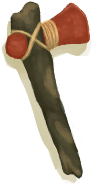Copper Axe</a>

<a href="KnifeCopper.md" style="color:black">Copper Knife</a>

<a href="ShovelCopper.md" style="color:black">Copper Shovel</a>

<a href="Flint.md" style="color:black">Flint</a>

<a href="AxeFlint.md" style="color:black">Flint Axe</a>

<a href="KnifeFlint.md" style="color:black">Flint Knife</a>

<a href="FlintSlab.md" style="color:black">Flint Slab</a>

<a href="Geode.md" style="color:black">Geode</a>

<a href="KnifeGrandpaBlunt.md" style="color:black">Grandfather's Blunt Knife</a>

<a href="KnifeGrandpa.md" style="color:black">Grandfather's Knife</a>

<a href="StoneHeavy.md" style="color:black">Heavy Stone</a>

<a href="KnifeMilitary.md" style="color:black">Military Knife</a>

<a href="KnifeObsidian.md" style="color:black">Obsidian Knife</a>

<a href="Oyster.md" style="color:black">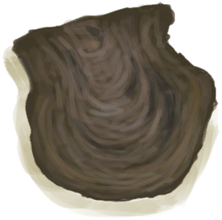Oyster</a>

<a href="SafetyKnife.md" style="color:black">Safety Knife</a>

<a href="AxeScrap.md" style="color:black">Scrap Axe</a>

<a href="KnifeScrap.md" style="color:black">Scrap Knife</a>

<a href="ShovelScrap.md" style="color:black">Scrap Shovel</a>

<a href="StoneSharpened.md" style="color:black">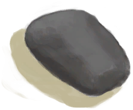Sharpened Stone</a>

<a href="ShovelHead.md" style="color:black">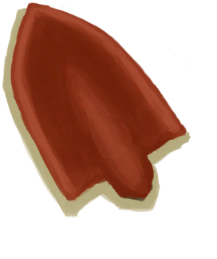Shovel Head</a>

<a href="SpearHead.md" style="color:black">Spear Head</a>

<a href="Stone.md" style="color:black">Stone</a>

<a href="StoneAxe.md" style="color:black">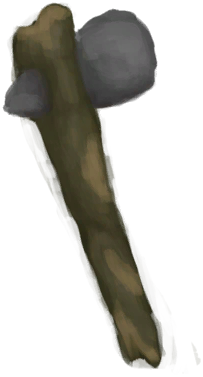Stone Axe</a>

<a href="StoneHeavyBrimstone.md" style="color:black">Sulphurous Stone</a>

<a href="AxeSurvival.md" style="color:black">Survival Axe</a>

<a href="ShovelWooden.md" style="color:black">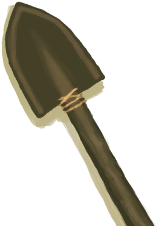Wooden Shovel</a>

  
  
## Equipped Cards  

<a href="AshDressing.md" style="color:black">Ash Dressing</a>

<a href="BackpackSurvivalist.md" style="color:black">Backpack</a>

<a href="BackpackTourist.md" style="color:black">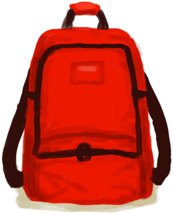Backpack</a>

<a href="BeeSuit.md" style="color:black">Bee Suit</a>

<a href="Bellows.md" style="color:black">Bellows</a>

<a href="BeltBag.md" style="color:black">Belt Bag</a>

<a href="Camera.md" style="color:black">Camera</a>

<a href="PantsCloth.md" style="color:black">Cloth Pants</a>

<a href="CoconutSandals.md" style="color:black">Coconut Sandals</a>

<a href="CollarTV.md" style="color:black">Collar</a>

<a href="CopperBottle.md" style="color:black">Copper Bottle</a>

<a href="CopperNecklace.md" style="color:black">Copper Necklace</a>

<a href="SpearCopper.md" style="color:black">Copper Spear</a>

<a href="SpearFlint.md" style="color:black">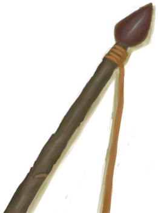Flint Spear</a>

<a href="Flipflops.md" style="color:black">Flipflops</a>

<a href="FlowerNecklace.md" style="color:black">Flower Necklace</a>

<a href="FootWrappings.md" style="color:black">Foot Wrappings</a>

<a href="GasMaskRustic.md" style="color:black">Gas Mask</a>

<a href="Glasses.md" style="color:black">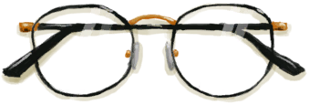Glasses</a>

<a href="GourdBottle.md" style="color:black">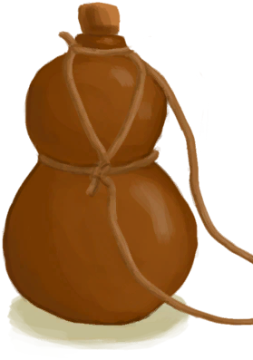Gourd Bottle</a>

<a href="HandWrappings.md" style="color:black">Hand Wrappings</a>

<a href="HarpoonBone.md" style="color:black">Harpoon</a>

<a href="HawaiianShirt.md" style="color:black">Hawaiian Shirt</a>

<a href="HeadWrappings.md" style="color:black">Head Wrappings</a>

<a href="HoodieRetromation.md" style="color:black">Hoodie</a>

<a href="ImprovisedDressing.md" style="color:black">Improvised Dressing</a>

<a href="LeafDressing.md" style="color:black">Leaf Dressing</a>

<a href="LeafSKirt.md" style="color:black">Leaf Skirt</a>

<a href="BackpackLeather.md" style="color:black">Leather Backpack</a>

<a href="LeatherGloves.md" style="color:black">Leather Gloves</a>

<a href="LeatherPants.md" style="color:black">Leather Pants</a>

<a href="LeatherShoes.md" style="color:black">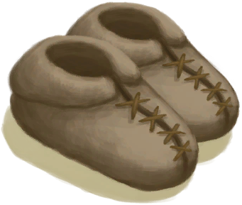Leather Shoes</a>

<a href="LizardDrum.md" style="color:black">Lizard Drum</a>

<a href="MacaqueFriend.md" style="color:black">Macaque Friend</a>

<a href="MaskMakeshift.md" style="color:black">Makeshift Mask</a>

<a href="BeltMilitary.md" style="color:black">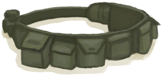Military Belt</a>

<a href="MilitaryBoots.md" style="color:black">Military Boots</a>

<a href="MilitaryPants.md" style="color:black">Military Pants</a>

<a href="SpearObsidian.md" style="color:black">Obsidian Spear</a>

<a href="PearlNecklace.md" style="color:black">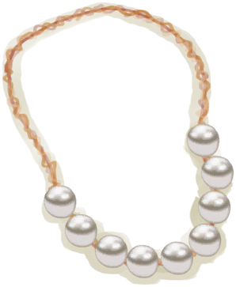Pearl Necklace</a>

<a href="Quiver.md" style="color:black">Quiver</a>

<a href="Raincoat.md" style="color:black">Raincoat</a>

<a href="Rope.md" style="color:black">Rope</a>

<a href="BowRustic.md" style="color:black">Rustic Bow</a>

<a href="Satchel.md" style="color:black">Satchel</a>

<a href="SatchelHunter.md" style="color:black">Satchel</a>

<a href="SpearScrap.md" style="color:black">Scrap Spear</a>

<a href="SeagullCharm.md" style="color:black">Seagull Charm</a>

<a href="SeashellNecklace.md" style="color:black">Seashell Necklace</a>

<a href="SharkHeadpiece.md" style="color:black">Shark Headpiece</a>

<a href="Shield.md" style="color:black">Shield</a>

<a href="ShirtFiber.md" style="color:black">Shirt</a>

<a href="Shorts.md" style="color:black">Shorts</a>

<a href="Sneakers.md" style="color:black">Sneakers</a>

<a href="Socks.md" style="color:black">Socks</a>

<a href="StrawCape.md" style="color:black">Straw Cape</a>

<a href="HatSurvival.md" style="color:black">Survival Hat</a>

<a href="T-Shirt.md" style="color:black">T-Shirt</a>

<a href="Underwear.md" style="color:black">Underwear</a>

<a href="Waterskin.md" style="color:black">Waterskin</a>

<a href="WoundDressing.md" style="color:black">Wound Dressing</a>

<a href="BackpackBasket.md" style="color:black">Woven Backpack</a>

<a href="HatWoven.md" style="color:black">Woven Palm Hat</a>

  
  
## Foods  

<a href="AlienNodule.md" style="color:black">Alien Nodule</a>

<a href="Banana.md" style="color:black">Banana</a>

<a href="YamBoiled.md" style="color:black">Boiled Yam</a>

<a href="BoneBroth.md" style="color:black">Bone Broth</a>

<a href="OysterMeatBaked.md" style="color:black">Butter Baked Oyster</a>

<a href="ButterBakedOystersCooked.md" style="color:black">Butter Baked Oysters</a>

<a href="CandiedGinger.md" style="color:black">Candied Ginger</a>

<a href="ChickenSandwich.md" style="color:black">Chicken Sandwich</a>

<a href="Chilies.md" style="color:black">Chillies</a>

<a href="Chocolate.md" style="color:black">Chocolate</a>

<a href="CoconutFish.md" style="color:black">Coconut Fish</a>

<a href="CoconutMeat.md" style="color:black">Coconut Meat</a>

<a href="CoffeeBerries.md" style="color:black">Coffee Berries</a>

<a href="BirdMeatCooked.md" style="color:black">Cooked Bird Meat</a>

<a href="BoarMeatCooked.md" style="color:black">Cooked Boar Meat</a>

<a href="BonefishCooked.md" style="color:black">Cooked Bonefish</a>

<a href="ConchMeatCooked.md" style="color:black">Cooked Conch Meat</a>

<a href="CrabCooked.md" style="color:black">Cooked Crab</a>

<a href="GoatMeatCooked.md" style="color:black">Cooked Goat Meat</a>

<a href="GoatfishCooked.md" style="color:black">Cooked Goatfish</a>

<a href="GrouperMeatCooked.md" style="color:black">Cooked Grouper</a>

<a href="HerringCooked.md" style="color:black">Cooked Herring</a>

<a href="MonitorMeatCooked.md" style="color:black">Cooked Lizard Meat</a>

<a href="MacaqueMeatCooked.md" style="color:black">Cooked Macaque Meat</a>

<a href="OysterMeatCooked.md" style="color:black">Cooked Oyster</a>

<a href="ParrotFishCooked.md" style="color:black">Cooked Parrot Fish</a>

<a href="SeahoundCooked.md" style="color:black">Cooked Seahound</a>

<a href="SharkCooked.md" style="color:black">Cooked Shark</a>

<a href="SnakeCooked.md" style="color:black">Cooked Snake Meat</a>

<a href="ConchMeatSoftCooked.md" style="color:black">Cooked Soft Conch Meat</a>

<a href="ThreadfinCooked.md" style="color:black">Cooked Threadfin</a>

<a href="UrchinMeatCooked.md" style="color:black">Cooked Urchin</a>

<a href="BoarMeatSalted.md" style="color:black">Cured Boar Meat</a>

<a href="GoatMeatSalted.md" style="color:black">Cured Goat Meat</a>

<a href="MacaqueMeatSalted.md" style="color:black">Cured Macaque Meat</a>

<a href="MeatSaltedDried.md" style="color:black">Cured Meat</a>

<a href="BoarMeatDried.md" style="color:black">Dried Boar Meat</a>

<a href="FishDried.md" style="color:black">Dried Fish</a>

<a href="GoatMeatDried.md" style="color:black">Dried Goat Meat</a>

<a href="MacaqueMeatDried.md" style="color:black">Dried Macaque Meat</a>

<a href="DrunkenCrab.md" style="color:black">Drunken Crab</a>

<a href="EggFriedRice.md" style="color:black">Egg Fried Rice</a>

<a href="FishNChips.md" style="color:black">Fish N' Chips</a>

<a href="FishOmelette.md" style="color:black">Fish Omelette</a>

<a href="FishTaco.md" style="color:black">Fish Taco</a>

<a href="FoodRation.md" style="color:black">Food Ration</a>

<a href="FriedBanana.md" style="color:black">Fried Banana</a>

<a href="FriedPuffballs.md" style="color:black">Fried Puffballs</a>

<a href="Cheese.md" style="color:black">Goat Cheese</a>

<a href="GoatStew.md" style="color:black">Goat Stew</a>

<a href="HeartyFeast.md" style="color:black">Hearty Feast</a>

<a href="HoneyCandy.md" style="color:black">Honey Candy</a>

<a href="HoneyGlazedPork.md" style="color:black">Honey Glazed Pork</a>

<a href="BeeHoneycomb.md" style="color:black">Honeycomb</a>

<a href="IslandChicken.md" style="color:black">Island Chicken</a>

<a href="JujubeFruits.md" style="color:black">Jujube Fruits</a>

<a href="LizardFry.md" style="color:black">Lizard Fry</a>

<a href="MacaqueSkewers.md" style="color:black">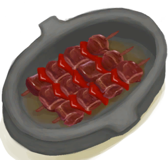Macaque Skewers</a>

<a href="Mango.md" style="color:black">Mango</a>

<a href="NipaSeeds.md" style="color:black">Nipa Seeds</a>

<a href="ProteinBar.md" style="color:black">Protein Bar</a>

<a href="Puffballs.md" style="color:black">Puffballs</a>

<a href="RiceCooked.md" style="color:black">Rice</a>

<a href="BatCooked.md" style="color:black">Roasted Bat</a>

<a href="CoconutMeatCooked.md" style="color:black">Roasted Coconut Meat</a>

<a href="EggCooked.md" style="color:black">Roasted Egg</a>

<a href="LizardCooked.md" style="color:black">Roasted Lizard</a>

<a href="MouseCooked.md" style="color:black">Roasted Mouse</a>

<a href="MudskipperCooked.md" style="color:black">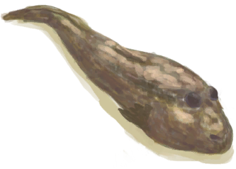Roasted Mudskipper</a>

<a href="PrawnsCooked.md" style="color:black">Roasted Prawns</a>

<a href="TropicalAlmondsRoasted.md" style="color:black">Roasted Tropical Almond</a>

<a href="SagoCake.md" style="color:black">Sago Cake</a>

<a href="SagoFlatbread.md" style="color:black">Sago Flatbread</a>

<a href="SagoFlatbreadHoney.md" style="color:black">Sago Flatbread with Honey</a>

<a href="SagoFlatbreadJam.md" style="color:black">Sago Flatbread with Jam</a>

<a href="SagoSlime.md" style="color:black">Sago Slime</a>

<a href="FishSalted.md" style="color:black">Salted Fish</a>

<a href="BirdMeatSmoked.md" style="color:black">Smoked Bird Meat</a>

<a href="BoarMeatSmoked.md" style="color:black">Smoked Boar Meat</a>

<a href="BonefishSmoked.md" style="color:black">Smoked Bonefish</a>

<a href="GoatMeatSmoked.md" style="color:black">Smoked Goat Meat</a>

<a href="GoatfishSmoked.md" style="color:black">Smoked Goatfish</a>

<a href="GrouperMeatSmoked.md" style="color:black">Smoked Grouper</a>

<a href="MonitorMeatSmoked.md" style="color:black">Smoked Lizard Meat</a>

<a href="MacaqueMeatSmoked.md" style="color:black">Smoked Macaque Meat</a>

<a href="ParrotFishSmoked.md" style="color:black">Smoked Parrot Fish</a>

<a href="SharkSmoked.md" style="color:black">Smoked Shark</a>

<a href="ThreadfinSmoked.md" style="color:black">Smoked Threadfin</a>

<a href="Sushi.md" style="color:black">Sushi</a>

<a href="TropicalAlmondKernels.md" style="color:black">Tropical Almond Kernels</a>

<a href="YamCurry.md" style="color:black">Yam Curry</a>

<a href="YamJam.md" style="color:black">Yam Jam</a>

  
  
##   

<a href="AloeVeraGel.md" style="color:black">Aloe Vera Gel</a>

<a href="AssortedMushrooms.md" style="color:black">Assorted Mushrooms</a>

<a href="BananaStem.md" style="color:black">Banana Stem</a>

<a href="BirdMeat.md" style="color:black">Bird Meat</a>

<a href="BoarMeat.md" style="color:black">Boar Meat</a>

<a href="BonefishMeat.md" style="color:black">Bonefish Meat</a>

<a href="Bugs.md" style="color:black">Bugs</a>

<a href="Butter.md" style="color:black">Butter</a>

<a href="CharredRemains.md" style="color:black">Charred Remains</a>

<a href="ChinaRoseFlowers.md" style="color:black">China Rose</a>

<a href="CoffeeBerryPulp.md" style="color:black">Coffee Berry Pulp</a>

<a href="ConchMeat.md" style="color:black">Conch Meat</a>

<a href="FishScrapsCooked.md" style="color:black">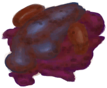Cooked Fish Scraps</a>

<a href="FishSlicesCooked.md" style="color:black">Cooked Fish Slices</a>

<a href="Crab.md" style="color:black">Crab</a>

<a href="YamCut.md" style="color:black">Cut Yam</a>

<a href="Bat.md" style="color:black">Dead Bat</a>

<a href="PartridgeChickDead.md" style="color:black">Dead Chick</a>

<a href="Mouse.md" style="color:black">Dead Mouse</a>

<a href="ChiliesDried.md" style="color:black">Dried Chilies</a>

<a href="GingerDried.md" style="color:black">Dried Ginger</a>

<a href="KavaRootDried.md" style="color:black">Dried Kava Root</a>

<a href="SpiderLilyLeavesDried.md" style="color:black">Dried Spider Lily Leaves</a>

<a href="BoarMeatSaltedDrying.md" style="color:black">Drying Boar Meat</a>

<a href="GoatMeatSaltedDrying.md" style="color:black">Drying Goat Meat</a>

<a href="MacaqueMeatSaltedDrying.md" style="color:black">Drying Macaque Meat</a>

<a href="MeatSaltedDrying.md" style="color:black">Drying Meat</a>

<a href="FishSaltedDrying.md" style="color:black">Drying Salted Fish</a>

<a href="Egg.md" style="color:black">Egg</a>

<a href="Fat.md" style="color:black">Fat</a>

<a href="EggPartridgeFertilized.md" style="color:black">Fertilized Egg</a>

<a href="FishScraps.md" style="color:black">Fish Scraps</a>

<a href="FishSlices.md" style="color:black">Fish Slices</a>

<a href="Ginger.md" style="color:black">Ginger</a>

<a href="GoatMeat.md" style="color:black">Goat Meat</a>

<a href="Goatfish.md" style="color:black">Goatfish</a>

<a href="GingerGround.md" style="color:black">Ground Ginger</a>

<a href="JasmineFlowersGround.md" style="color:black">Ground Jasmine Flowers</a>

<a href="KavaRootGround.md" style="color:black">Ground Kava Root</a>

<a href="LemonGrassGround.md" style="color:black">Ground Lemongrass</a>

<a href="SnakeGrassGround.md" style="color:black">Ground Snake Grass</a>

<a href="SpiderLilyGround.md" style="color:black">Ground Spider Lily</a>

<a href="Herring.md" style="color:black">Herring</a>

<a href="JasmineFlowers.md" style="color:black">Jasmine Flowers</a>

<a href="JungleSalad.md" style="color:black">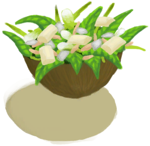Jungle Salad</a>

<a href="KavaRoot.md" style="color:black">Kava Root</a>

<a href="LemongrassStalks.md" style="color:black">Lemongrass</a>

<a href="Lizard.md" style="color:black">Lizard</a>

<a href="MonitorMeat.md" style="color:black">Lizard Meat</a>

<a href="MacaqueMeat.md" style="color:black">Macaque Meat</a>

<a href="MagicMushrooms.md" style="color:black">Magic Mushrooms</a>

<a href="Mudskipper.md" style="color:black">Mudskipper</a>

<a href="OysterMeat.md" style="color:black">Oyster Meat</a>

<a href="ParrotFish.md" style="color:black">Parrot Fish</a>

<a href="Prawns.md" style="color:black">Prawns</a>

<a href="RottenRemains.md" style="color:black">Rotten Remains</a>

<a href="SagoFlour.md" style="color:black">Sago Flour</a>

<a href="SagoPulp.md" style="color:black">Sago Pulp</a>

<a href="SagoSawdust.md" style="color:black">Sago Sawdust</a>

<a href="SeafoodCup.md" style="color:black">Seafood Cup</a>

<a href="Seahoundmeat.md" style="color:black">Seahound Meat</a>

<a href="Seaweed.md" style="color:black">Seaweed</a>

<a href="SharkMeat.md" style="color:black">Shark Meat</a>

<a href="SnakeSkinned.md" style="color:black">Skinned Snake</a>

<a href="ConchMeatSoft.md" style="color:black">Soft Conch Meat</a>

<a href="SpiderLilyLeaves.md" style="color:black">Spider Lily Leaves</a>

<a href="Sugar.md" style="color:black">Sugar</a>

<a href="ThreadfinMeat.md" style="color:black">Threadfin Meat</a>

<a href="BoneBrothUncooked.md" style="color:black">Uncooked Bone Broth</a>

<a href="CandiedGingerUncooked.md" style="color:black">Uncooked Candied Ginger</a>

<a href="CoconutFishUncooked.md" style="color:black">Uncooked Coconut Fish</a>

<a href="DrunkenCrabUncooked.md" style="color:black">Uncooked Drunken Crab</a>

<a href="EggFriedRiceUncooked.md" style="color:black">Uncooked Egg Fried Rice</a>

<a href="FishNChipsUncooked.md" style="color:black">Uncooked Fish N' Chips</a>

<a href="FishOmeletteUncooked.md" style="color:black">Uncooked Fish Omelette</a>

<a href="FriedBananasUncooked.md" style="color:black">Uncooked Fried Bananas</a>

<a href="FriedPuffballsUncooked.md" style="color:black">Uncooked Fried Puffballs</a>

<a href="GlueUncooked.md" style="color:black">Uncooked Glue</a>

<a href="GoatStewUncooked.md" style="color:black">Uncooked Goat Stew</a>

<a href="HeartyFeastUncooked.md" style="color:black">Uncooked Hearty Feast</a>

<a href="HoneyCandyUncooked.md" style="color:black">Uncooked Honey Candy</a>

<a href="HoneyGlazedPorkUncooked.md" style="color:black">Uncooked Honey Glazed Pork</a>

<a href="IslandChickenUncooked.md" style="color:black">Uncooked Island Chicken</a>

<a href="LizardFryUncooked.md" style="color:black">Uncooked Lizard Fry</a>

<a href="MacaqueSkewersUncooked.md" style="color:black">Uncooked Macaque Skewers</a>

<a href="ButterBakedOystersUncooked.md" style="color:black">Uncooked Oysters</a>

<a href="ProteinBarUncooked.md" style="color:black">Uncooked Protein Bars</a>

<a href="SagoCakeUncooked.md" style="color:black">Uncooked Sago Cake</a>

<a href="SagoSlimeUncooked.md" style="color:black">Uncooked Sago Slime</a>

<a href="YamCurryUncooked.md" style="color:black">Uncooked Yam Curry</a>

<a href="YamJamUncooked.md" style="color:black">Uncooked Yam Jam</a>

<a href="UrchinMeat.md" style="color:black">Urchin Meat</a>

  
  
## Other  

<a href="AlembicUndeployed.md" style="color:black">Alembic</a>

<a href="AloeVeraLeaf.md" style="color:black">Aloe Vera Leaf</a>

<a href="AntiDiarrhoeaPills.md" style="color:black">Anti-Diarrhoea Pills</a>

<a href="Antibiotics.md" style="color:black">Antibiotics</a>

<a href="Ash.md" style="color:black">Ash</a>

<a href="MoldAxe.md" style="color:black">Axe Mold</a>

<a href="Baby.md" style="color:black">Baby</a>

<a href="Basket.md" style="color:black">Basket</a>

<a href="BedRoll.md" style="color:black">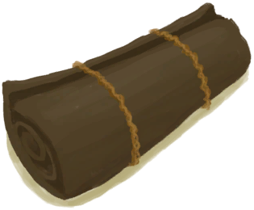Bedroll</a>

<a href="BeeSkepEmpty.md" style="color:black">Bee Skep</a>

<a href="BeeSmokerOff.md" style="color:black">Bee Smoker</a>

<a href="BeeSmokerOn.md" style="color:black">Bee Smoker</a>

<a href="Bees.md" style="color:black">Bees</a>

<a href="Beeswax.md" style="color:black">Beeswax</a>

<a href="BeeswaxBlock.md" style="color:black">Beeswax Block</a>

<a href="BonesBird.md" style="color:black">Bird Bones</a>

<a href="FeedBird.md" style="color:black">Bird Feed</a>

<a href="BoarTiedMale.md" style="color:black">Boar</a>

<a href="BoarCarcass.md" style="color:black">Boar Carcass</a>

<a href="FeedBoar.md" style="color:black">Boar Feed</a>

<a href="Tusk.md" style="color:black">Boar Tusk</a>

<a href="FluteBone.md" style="color:black">Bone Flute</a>

<a href="HookBone.md" style="color:black">Bone Hook</a>

<a href="BoneNeedle.md" style="color:black">Bone Needle</a>

<a href="BoneSplinters.md" style="color:black">Bone Splinters</a>

<a href="Bonefish.md" style="color:black">Bonefish</a>

<a href="Bonemeal.md" style="color:black">Bonemeal</a>

<a href="Bones.md" style="color:black">Bones</a>

<a href="BowDrill.md" style="color:black">Bow Drill</a>

<a href="Brimstone.md" style="color:black">Brimstone</a>

<a href="BrimstoneGel.md" style="color:black">Brimstone Gel</a>

<a href="Broom.md" style="color:black">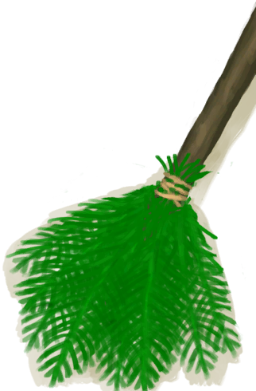Broom</a>

<a href="BugRepellent.md" style="color:black">Bug Repellent</a>

<a href="FlareHandOn.md" style="color:black">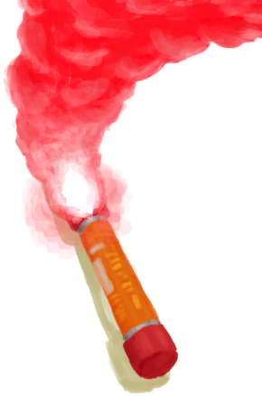Burning Flare</a>

<a href="WoodBurning.md" style="color:black">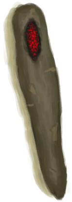Burning Wood</a>

<a href="StoneHeavyBurnt.md" style="color:black">Burnt Heavy Stone</a>

<a href="MortarBurnt.md" style="color:black">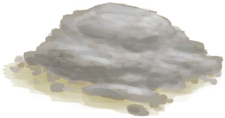Burnt Mortar</a>

<a href="StoneBurnt.md" style="color:black">Burnt Stone</a>

<a href="CageTrap.md" style="color:black">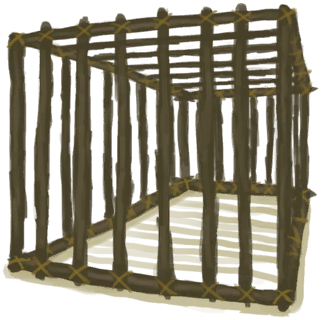Cage Trap</a>

<a href="Calcite.md" style="color:black">Calcite Crystal</a>

<a href="CandiedGingerCooked.md" style="color:black">Candied Ginger</a>

<a href="CandleOff.md" style="color:black">Candle</a>

<a href="CandleOn.md" style="color:black">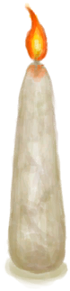Candle</a>

<a href="Canteen.md" style="color:black">Canteen</a>

<a href="Captain.md" style="color:black">Captain</a>

<a href="Chair.md" style="color:black">Chair</a>

<a href="Charcoal.md" style="color:black">Charcoal</a>

<a href="ChiliPowder.md" style="color:black">Chilli Powder</a>

<a href="BarkCinchona.md" style="color:black">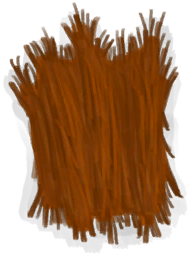Cinchona Bark</a>

<a href="QuininePowder.md" style="color:black">Cinchona Powder</a>

<a href="CandleCitronellaOff.md" style="color:black">Citronella Candle</a>

<a href="CandleCitronellaOn.md" style="color:black">Citronella Candle</a>

<a href="Clay.md" style="color:black">Clay</a>

<a href="ClayBowl.md" style="color:black">Clay Bowl</a>

<a href="ClayFirePitExtinguished.md" style="color:black">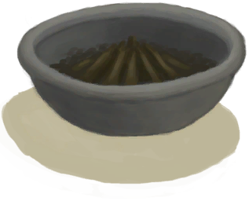Clay Fire Pit</a>

<a href="ClayJar.md" style="color:black">Clay Jar</a>

<a href="ClayPotCoolerUndeployed.md" style="color:black">Clay Pot Cooler</a>

<a href="ClayVase.md" style="color:black">Clay Vase</a>

<a href="Cloth.md" style="color:black">Cloth</a>

<a href="Coconut.md" style="color:black">Coconut</a>

<a href="CoconutHalf.md" style="color:black">Coconut Half</a>

<a href="CoconutHusk.md" style="color:black">Coconut Husk</a>

<a href="CoconutShell.md" style="color:black">Coconut Shell</a>

<a href="CoffeeBeans.md" style="color:black">Coffee Beans</a>

<a href="Conch.md" style="color:black">Conch</a>

<a href="ContainerBagA.md" style="color:black">Container Bag</a>

<a href="ContainerBagB.md" style="color:black">Container Bag</a>

<a href="FriedBananasCooked.md" style="color:black">Cooked Fried Bananas</a>

<a href="GlueCooked.md" style="color:black">Cooked Glue</a>

<a href="ProteinBarsCooked.md" style="color:black">Cooked Protein Bars</a>

<a href="SagoSlimeCooked.md" style="color:black">Cooked Sago Slime</a>

<a href="YamJamCooked.md" style="color:black">Cooked Yam Jam</a>

<a href="CookingPot.md" style="color:black">Cooking Pot</a>

<a href="Copper.md" style="color:black">Copper</a>

<a href="ArrowCopper.md" style="color:black">Copper Arrow</a>

<a href="CopperDecoration_Mold.md" style="color:black">Copper Decoration</a>

<a href="CopperDecoration_Fish.md" style="color:black">Copper Fish</a>

<a href="CopperJar.md" style="color:black">Copper Jar</a>

<a href="CopperDecoration_Failed.md" style="color:black">Copper Mess</a>

<a href="CopperNeedle.md" style="color:black">Copper Needle</a>

<a href="CopperOre.md" style="color:black">Copper Ore</a>

<a href="CopperDecoration_Seashell.md" style="color:black">Copper Seashell</a>

<a href="CopperSheet.md" style="color:black">Copper Sheet</a>

<a href="CopperDecoration_Turtle.md" style="color:black">Copper Turtle</a>

<a href="Coral.md" style="color:black">Coral</a>

<a href="ConchBroken.md" style="color:black">Crushed Conch</a>

<a href="CuredSkinReptile.md" style="color:black">Cured Reptile Skin</a>

<a href="CuredSkin.md" style="color:black">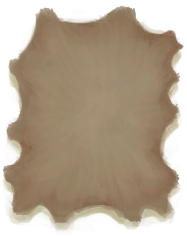Cured Skin</a>

<a href="CobraDead.md" style="color:black">Dead Cobra</a>

<a href="PartridgeDead.md" style="color:black">Dead Partridge</a>

<a href="SeaKraitDead.md" style="color:black">Dead Sea Krait</a>

<a href="SeagullDead.md" style="color:black">Dead Seagull</a>

<a href="MoldCopperDecoration.md" style="color:black">Decoration Mold</a>

<a href="DirtPile.md" style="color:black">Dirt Pile</a>

<a href="BookShelfDismantled.md" style="color:black">Dismantled BookShelf</a>

<a href="PotteryWheelDismantled.md" style="color:black">Dismantled PotteryWheel</a>

<a href="TableDismantled.md" style="color:black">Dismantled Table</a>

<a href="BedWoodenDismantled.md" style="color:black">Dismantled Wooden Bed</a>

<a href="DogFriend.md" style="color:black">Dog Friend</a>

<a href="BarkCinchonaDried.md" style="color:black">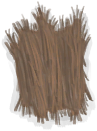Dried Cinchona Bark</a>

<a href="Drum.md" style="color:black">Drum</a>

<a href="GlueDry.md" style="color:black">Dry Glue</a>

<a href="LeavesDry.md" style="color:black">Dry Leaves</a>

<a href="MortarDry.md" style="color:black">Dry Mortar</a>

<a href="Duplicator.md" style="color:black">Duplicator</a>

<a href="DynamiteOff.md" style="color:black">Dynamite</a>

<a href="DynamiteOn.md" style="color:black">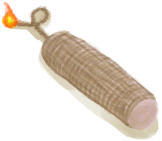Dynamite</a>

<a href="EatingUtensilsCopper.md" style="color:black">Eating Utensils</a>

<a href="EatingUtensilsWooden.md" style="color:black">Eating Utensils</a>

<a href="Embers.md" style="color:black">Embers</a>

<a href="GunEmpty.md" style="color:black">Empty Gun</a>

<a href="Feathermeal.md" style="color:black">Feathermeal</a>

<a href="Feathers.md" style="color:black">Feathers</a>

<a href="Fertilizer.md" style="color:black">Fertilizer</a>

<a href="CordFiber.md" style="color:black">Fiber Cord</a>

<a href="Fibers.md" style="color:black">Fibers</a>

<a href="FineDirt.md" style="color:black">Fine Dirt</a>

<a href="FirstAidKitLifeRaft.md" style="color:black">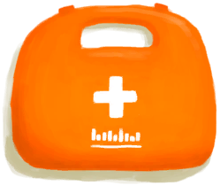First Aid Kit</a>

<a href="FirstAidKitPlane.md" style="color:black">First Aid Kit</a>

<a href="FirstAidKitTrunk.md" style="color:black">First Aid Kit</a>

<a href="FishBait.md" style="color:black">Fish Bait</a>

<a href="FishTrap.md" style="color:black">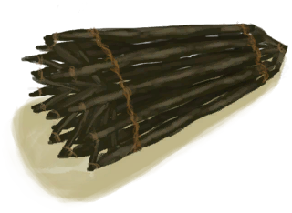Fish Trap</a>

<a href="FishingLine.md" style="color:black">Fishing Line</a>

<a href="FishingLineRustic.md" style="color:black">Fishing Line</a>

<a href="FishingLineBait.md" style="color:black">Fishing Line (baited)</a>

<a href="FishingLineRusticBait.md" style="color:black">Fishing Line (baited)</a>

<a href="FishingRod.md" style="color:black">Fishing Rod</a>

<a href="FishingRodBait.md" style="color:black">Fishing Rod (baited)</a>

<a href="SpearFishing.md" style="color:black">Fishing Spear</a>

<a href="FlareHand.md" style="color:black">Flare</a>

<a href="SkinFleshedReptile.md" style="color:black">Fleshed Reptile Skin</a>

<a href="SkinFleshed.md" style="color:black">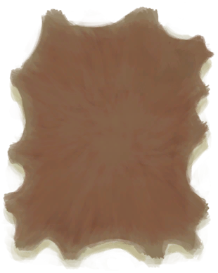Fleshed Skin</a>

<a href="FoodRationsPackage.md" style="color:black">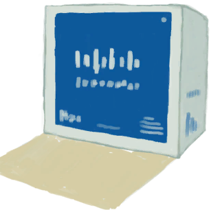Food Rations</a>

<a href="LeavesFresh.md" style="color:black">Fresh Leaves</a>

<a href="SkinFreshReptile.md" style="color:black">Fresh Reptile Skin</a>

<a href="SkinFresh.md" style="color:black">Fresh Skin</a>

<a href="JerrycanFuel.md" style="color:black">Fuel Jerrycan</a>

<a href="GasCookerOff.md" style="color:black">Gas Cooker</a>

<a href="GastricPellet.md" style="color:black">Gastric Pellet</a>

<a href="GiantConch.md" style="color:black">Giant Conch</a>

<a href="GlazedVase.md" style="color:black">Glazed Vase</a>

<a href="Glue.md" style="color:black">Glue</a>

<a href="TuskCarving_GnomeFemale.md" style="color:black">Gnome Figurine</a>

<a href="TuskCarving_GnomeMale.md" style="color:black">Gnome Figurine</a>

<a href="GoatTiedFemale.md" style="color:black">Goat</a>

<a href="GoatCarcassFemale.md" style="color:black">Goat Carcass</a>

<a href="GoatCarcassMale.md" style="color:black">Goat Carcass</a>

<a href="FeedGoat.md" style="color:black">Goat Feed</a>

<a href="WoodCarving_Goat.md" style="color:black">Goat Figure</a>

<a href="Guano.md" style="color:black">Guano</a>

<a href="Gun.md" style="color:black">Gun</a>

<a href="HalfLog.md" style="color:black">Half Log</a>

<a href="HandDrill.md" style="color:black">Hand Drill</a>

<a href="HoneyCandyCooked.md" style="color:black">Honey Candy</a>

<a href="CoconutHusked.md" style="color:black">Husked Coconut</a>

<a href="TourniquetRustic.md" style="color:black">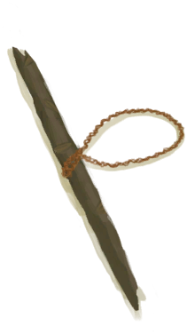Improvised Tourniquet</a>

<a href="CandleJasmineOff.md" style="color:black">Jasmine Candle</a>

<a href="CandleJasmineOn.md" style="color:black">Jasmine Candle</a>

<a href="ClayJarJasmine.md" style="color:black">Jasmine Flowers</a>

<a href="PlasticBottleJasmine.md" style="color:black">Jasmine Flowers</a>

<a href="Jerrycan.md" style="color:black">Jerrycan</a>

<a href="GoatTiedKid.md" style="color:black">Juvenile Goat</a>

<a href="GoatCarcassKid.md" style="color:black">Juvenile Goat Carcass</a>

<a href="KingThreadfin.md" style="color:black">King Threadfin</a>

<a href="MoldKnife.md" style="color:black">Knife Mold</a>

<a href="GoatTiedFemaleLactating.md" style="color:black">Lactating Goat</a>

<a href="ClothLarge.md" style="color:black">Large Cloth</a>

<a href="TinderLit.md" style="color:black">Lit Tinder</a>

<a href="MonitorCarcass.md" style="color:black">Lizard Carcass</a>

<a href="Log.md" style="color:black">Log</a>

<a href="StickLong.md" style="color:black">Long Stick</a>

<a href="LuggageA.md" style="color:black">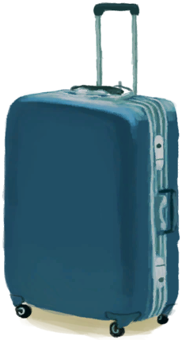Luggage</a>

<a href="LuggageC.md" style="color:black">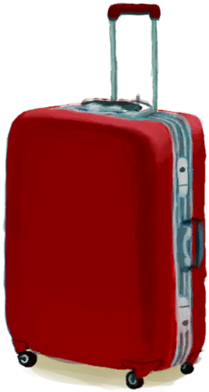Luggage</a>

<a href="MacaqueCarcass.md" style="color:black">Macaque Carcass</a>

<a href="GoatTiedMale.md" style="color:black">Male Goat</a>

<a href="PartridgeMaleLive.md" style="color:black">Male Partridge</a>

<a href="WoodCarving_Man.md" style="color:black">Man Figure</a>

<a href="Manure.md" style="color:black">Manure</a>

<a href="MetalScrap.md" style="color:black">Metal Scrap</a>

<a href="Mortar.md" style="color:black">Mortar</a>

<a href="MudBrick.md" style="color:black">Mud Brick</a>

<a href="MudPile.md" style="color:black">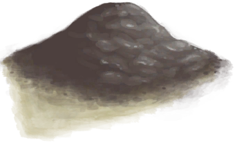Mud Pile</a>

<a href="Nest.md" style="color:black">Nest</a>

<a href="NipaFruit.md" style="color:black">Nipa Fruit</a>

<a href="NiterCrystals.md" style="color:black">Niter Crystals</a>

<a href="Obsidian.md" style="color:black">Obsidian</a>

<a href="TentPacked.md" style="color:black">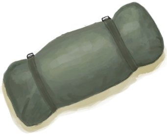Packed Tent</a>

<a href="Painkillers.md" style="color:black">Painkillers</a>

<a href="PalmBushSeeds.md" style="color:black">Palm Bush Seeds</a>

<a href="PalmFronds.md" style="color:black">Palm Fronds</a>

<a href="WeavePalm.md" style="color:black">Palm Weave</a>

<a href="Papers.md" style="color:black">Papers</a>

<a href="PartridgeFemaleLive.md" style="color:black">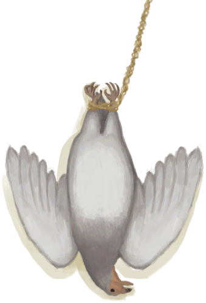Partridge</a>

<a href="PartridgeCarcass.md" style="color:black">Partridge Carcass</a>

<a href="Passport.md" style="color:black">Passport</a>

<a href="Pearl.md" style="color:black">Pearl</a>

<a href="CoconutPerforated.md" style="color:black">Perforated Coconut</a>

<a href="PhoneOff.md" style="color:black">Phone</a>

<a href="PhoneOn.md" style="color:black">Phone</a>

<a href="PhoneOnLight.md" style="color:black">Phone</a>

<a href="BoarTiedPiglet.md" style="color:black">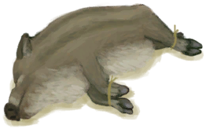Piglet</a>

<a href="BoarCarcassPiglet.md" style="color:black">Piglet Carcass</a>

<a href="PlasticBottle.md" style="color:black">Plastic Bottle</a>

<a href="PlasticBottleFull.md" style="color:black">Plastic Bottle</a>

<a href="PlasticSheet.md" style="color:black">Plastic Sheet</a>

<a href="SeashellsPretty.md" style="color:black">Pretty Seashells</a>

<a href="QueenBee.md" style="color:black">Queen Bee</a>

<a href="Quicklime.md" style="color:black">Quicklime</a>

<a href="QuinineSulfate.md" style="color:black">Quinine Sulfate</a>

<a href="Rennet.md" style="color:black">Rennet</a>

<a href="RiceGrains.md" style="color:black">Rice Grain</a>

<a href="RiceStalks.md" style="color:black">Rice Stalks</a>

<a href="RiceStraw.md" style="color:black">Rice Straw</a>

<a href="CoffeeRoastedBeans.md" style="color:black">Roasted Coffee Beans</a>

<a href="CoconutRotten.md" style="color:black">Rotten Coconut</a>

<a href="WoodCarving_Failed.md" style="color:black">Ruined Figure</a>

<a href="SpearRustic.md" style="color:black">Rustic Spear</a>

<a href="Sack.md" style="color:black">Sack</a>

<a href="SagoSeeds.md" style="color:black">Sago Seeds</a>

<a href="Salt.md" style="color:black">Salt</a>

<a href="Saltpeter.md" style="color:black">Saltpeter</a>

<a href="Sand.md" style="color:black">Sand</a>

<a href="SeahoundCarcass.md" style="color:black">Sea Hound Carcass</a>

<a href="SeagullCarcass.md" style="color:black">Seagull Carcass</a>

<a href="WoodCarving_Seagull.md" style="color:black">Seagull Figure</a>

<a href="Seat.md" style="color:black">Seat</a>

<a href="SharkCarcass.md" style="color:black">Shark Carcass</a>

<a href="SharkJaws.md" style="color:black">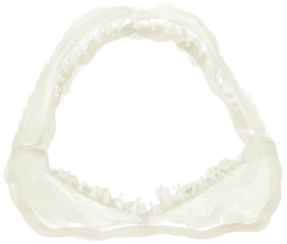Shark Jaws</a>

<a href="MoldShovel.md" style="color:black">Shovel Mold</a>

<a href="SignalingMirror.md" style="color:black">Signaling Mirror</a>

<a href="ArrowSimple.md" style="color:black">Simple Arrow</a>

<a href="BoarSkinned.md" style="color:black">Skinned Boar</a>

<a href="GoatSkinned.md" style="color:black">Skinned Goat</a>

<a href="GoatSkinnedKid.md" style="color:black">Skinned Kid</a>

<a href="MonitorSkinned.md" style="color:black">Skinned Lizard</a>

<a href="BoarSkinnedPiglet.md" style="color:black">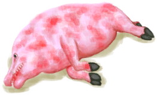Skinned Piglet</a>

<a href="Skull.md" style="color:black">Skull</a>

<a href="Sling.md" style="color:black">Sling</a>

<a href="ClothSmall.md" style="color:black">Small Cloth</a>

<a href="SnakeGrass.md" style="color:black">Snake Grass</a>

<a href="SnakegrassSeeds.md" style="color:black">Snakegrass Seeds</a>

<a href="SoapDry.md" style="color:black">Soap</a>

<a href="BoarTiedFemale.md" style="color:black">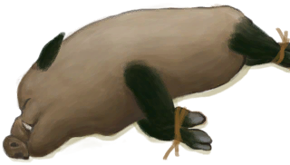Sow</a>

<a href="MoldSpear.md" style="color:black">Spear Mold</a>

<a href="Spindle.md" style="color:black">Spindle</a>

<a href="SpindleFiber.md" style="color:black">Spindled Cord</a>

<a href="WoodCarving_Monster.md" style="color:black">Spirit Figure</a>

<a href="Splint.md" style="color:black">Splint</a>

<a href="Sticks.md" style="color:black">Sticks</a>

<a href="Chest.md" style="color:black">Storage Chest</a>

<a href="Trunk.md" style="color:black">Storage Trunk</a>

<a href="SunScreen.md" style="color:black">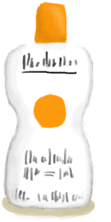Sun Screen</a>

<a href="TrunkPerk.md" style="color:black">Super Survival Trunk 2000</a>

<a href="BoneNeedleThreaded.md" style="color:black">Threaded Needle</a>

<a href="CopperNeedleThreaded.md" style="color:black">Threaded Needle</a>

<a href="WoodenNeedleThreaded.md" style="color:black">Threaded Needle</a>

<a href="TorchOff.md" style="color:black">Torch</a>

<a href="TorchOn.md" style="color:black">Torch</a>

<a href="Tourniquet.md" style="color:black">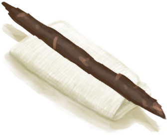Tourniquet</a>

<a href="CageTrapMacaque.md" style="color:black">Trapped Macaque</a>

<a href="Travois.md" style="color:black">Travois</a>

<a href="Treenail.md" style="color:black">Treenail</a>

<a href="TropicalAlmonds.md" style="color:black">Tropical Almonds</a>

<a href="FluteBone_Unfinished.md" style="color:black">Unfinished  Bone Flute</a>

<a href="FluteWooden_Unfinished.md" style="color:black">Unfinished  Wooden Flute</a>

<a href="WoodCarving_Unfinished.md" style="color:black">Unfinished Wood Carving</a>

<a href="AlembicUnfired.md" style="color:black">Unfired Alembic</a>

<a href="BeeSmokerUnfired.md" style="color:black">Unfired Bee Smoker</a>

<a href="ClayBowlUnfired.md" style="color:black">Unfired Clay Bowl</a>

<a href="ClayFirePitUnfired.md" style="color:black">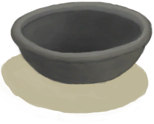Unfired Clay Fire Pit</a>

<a href="ClayJarUnfired.md" style="color:black">Unfired Clay Jar</a>

<a href="ClayPotCoolerUnfired.md" style="color:black">Unfired Clay Pot Cooler</a>

<a href="ClayVaseUnfired.md" style="color:black">Unfired Clay Vase</a>

<a href="CookingPotUnfired.md" style="color:black">Unfired Cooking Pot</a>

<a href="GlazedVaseUnfired.md" style="color:black">Unfired Glazed Vase</a>

<a href="Urchin.md" style="color:black">Urchin</a>

<a href="ClothVeryLarge.md" style="color:black">Very Large Cloth</a>

<a href="TV_Leaflet.md" style="color:black">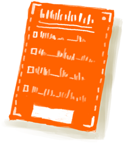Victory Leaflet</a>

<a href="VictoryPillsTV.md" style="color:black">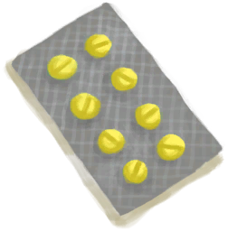Victory Pills</a>

<a href="WaterPurificationTablets.md" style="color:black">Water Purification Tablets</a>

<a href="WaterRation.md" style="color:black">Water Ration</a>

<a href="WaterRationsPackage.md" style="color:black">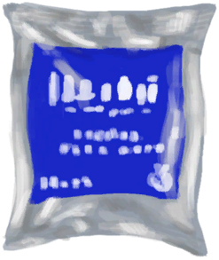Water Rations</a>

<a href="WeevilLilyLeaves.md" style="color:black">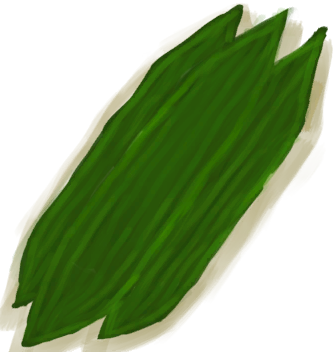Weevil Lily Leaves</a>

<a href="Weston.md" style="color:black">Weston</a>

<a href="SoapWet.md" style="color:black">Wet Soap</a>

<a href="WoodCarving_Woman.md" style="color:black">Woman Figure</a>

<a href="Wood.md" style="color:black">Wood</a>

<a href="HandleWood.md" style="color:black">Wood Handle</a>

<a href="WoodShavings.md" style="color:black">Wood Shavings</a>

<a href="FluteWooden.md" style="color:black">Wooden Flute</a>

<a href="WoodenNeedle.md" style="color:black">Wooden Needle</a>

<a href="Plank.md" style="color:black">Wooden Plank</a>

<a href="MacaqueWounded.md" style="color:black">Wounded Macaque</a>

<a href="Yam.md" style="color:black">Yam</a>

<a href="YarnFiber.md" style="color:black">Yarn</a>

  
  

