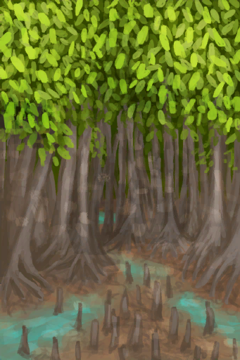
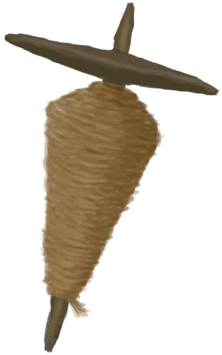

# Perk  
## Appetite  
<table class="table table-bordered" data-toggle="table"  ><thead style=""><tr ><th  style="width:25%;text-align:left;vertical-align:top;"  >Name</th><th  style="text-align:left;vertical-align:top;"  data-sortable="true"  >Score</th><th  style="text-align:left;vertical-align:top;"  >UnlockPrice</th><th  style="width:40%;text-align:left;vertical-align:top;"  >Desc</th></tr></thead><tr ><td  style="width:25%;text-align:left;vertical-align:top;"  >

[Gluttonous](Pk_4_Gluttonous.md)</td><td  style="text-align:left;vertical-align:top;"  >0</td><td  style="text-align:left;vertical-align:top;"  >10☀️</td><td  style="width:40%;text-align:left;vertical-align:top;"  >Get hungry faster. Makes eating easier so it's harder to become malnourished.</td></tr><tr ><td  style="width:25%;text-align:left;vertical-align:top;"  >

[Inappetent](Pk_4_Inappetent.md)</td><td  style="text-align:left;vertical-align:top;"  >1000</td><td  style="text-align:left;vertical-align:top;"  >10☀️</td><td  style="width:40%;text-align:left;vertical-align:top;"  >Slower to get hungry. Makes eating harder so it's easier to get malnourished.</td></tr></tbody></table>  
  
## Bugs  
<table class="table table-bordered" data-toggle="table"  ><thead style=""><tr ><th  style="width:25%;text-align:left;vertical-align:top;"  >Name</th><th  style="text-align:left;vertical-align:top;"  data-sortable="true"  >Score</th><th  style="text-align:left;vertical-align:top;"  >UnlockPrice</th><th  style="width:40%;text-align:left;vertical-align:top;"  >Desc</th></tr></thead><tr ><td  style="width:25%;text-align:left;vertical-align:top;"  >

[Bug Attractant](Pk_4_BugAttractant.md)</td><td  style="text-align:left;vertical-align:top;"  >750</td><td  style="text-align:left;vertical-align:top;"  >10☀️</td><td  style="width:40%;text-align:left;vertical-align:top;"  >Bugs love you.</td></tr><tr ><td  style="width:25%;text-align:left;vertical-align:top;"  >

[Bug Resistant](Pk_4_BugResistant.md)</td><td  style="text-align:left;vertical-align:top;"  >-500</td><td  style="text-align:left;vertical-align:top;"  >10☀️</td><td  style="width:40%;text-align:left;vertical-align:top;"  >Bugs tend to leave you alone.</td></tr></tbody></table>  
  
## Clothing  
<table class="table table-bordered" data-toggle="table"  ><thead style=""><tr ><th  style="width:25%;text-align:left;vertical-align:top;"  >Name</th><th  style="text-align:left;vertical-align:top;"  data-sortable="true"  >Score</th><th  style="text-align:left;vertical-align:top;"  >UnlockPrice</th><th  style="width:40%;text-align:left;vertical-align:top;"  >Desc</th></tr></thead><tr ><td  style="width:25%;text-align:left;vertical-align:top;"  >

[Military](Pk_2_Military.md)</td><td  style="text-align:left;vertical-align:top;"  >-1500</td><td  style="text-align:left;vertical-align:top;"  >1🌙</td><td  style="width:40%;text-align:left;vertical-align:top;"  >"Start with military equipment</td></tr><tr ><td  style="width:25%;text-align:left;vertical-align:top;"  >

[Birthday Suit](Pk_2_Naked.md)</td><td  style="text-align:left;vertical-align:top;"  >750</td><td  style="text-align:left;vertical-align:top;"  >5☀️</td><td  style="width:40%;text-align:left;vertical-align:top;"  >Start completely naked.</td></tr><tr ><td  style="width:25%;text-align:left;vertical-align:top;"  >

[Islander](Pk_2_Islander.md)</td><td  style="text-align:left;vertical-align:top;"  >-1000</td><td  style="text-align:left;vertical-align:top;"  >5☀️</td><td  style="width:40%;text-align:left;vertical-align:top;"  >One of the original inhabitants of the islands.</td></tr><tr ><td  style="width:25%;text-align:left;vertical-align:top;"  >

[Tourist](Pk_2_Tourist.md)</td><td  style="text-align:left;vertical-align:top;"  >-750</td><td  style="text-align:left;vertical-align:top;"  >20☀️</td><td  style="width:40%;text-align:left;vertical-align:top;"  >Start with tourist equipment.</td></tr><tr ><td  style="width:25%;text-align:left;vertical-align:top;"  >

[Survivalist](Pk_2_Survivalist.md)</td><td  style="text-align:left;vertical-align:top;"  >-2500</td><td  style="text-align:left;vertical-align:top;"  >1🌙</td><td  style="width:40%;text-align:left;vertical-align:top;"  >"Start with survival equipment</td></tr><tr ><td  style="width:25%;text-align:left;vertical-align:top;"  >

[Youtuber](Pk_2_Retromation.md)</td><td  style="text-align:left;vertical-align:top;"  >-500</td><td  style="text-align:left;vertical-align:top;"  >10☀️</td><td  style="width:40%;text-align:left;vertical-align:top;"  >Start with a nice hoodie and a mobile phone!\n(check Retromation's channel!)</td></tr></tbody></table>  
  
## Diet  
<table class="table table-bordered" data-toggle="table"  ><thead style=""><tr ><th  style="width:25%;text-align:left;vertical-align:top;"  >Name</th><th  style="text-align:left;vertical-align:top;"  data-sortable="true"  >Score</th><th  style="text-align:left;vertical-align:top;"  >UnlockPrice</th><th  style="width:40%;text-align:left;vertical-align:top;"  >Desc</th></tr></thead><tr ><td  style="width:25%;text-align:left;vertical-align:top;"  >

[Vegetarian](Pk_4_Vegetarian.md)</td><td  style="text-align:left;vertical-align:top;"  >1500</td><td  style="text-align:left;vertical-align:top;"  >15☀️</td><td  style="width:40%;text-align:left;vertical-align:top;"  >Eating meat makes you sick and depressed.</td></tr><tr ><td  style="width:25%;text-align:left;vertical-align:top;"  >

[Carnivore](Pk_4_Carnivore.md)</td><td  style="text-align:left;vertical-align:top;"  >1500</td><td  style="text-align:left;vertical-align:top;"  >15☀️</td><td  style="width:40%;text-align:left;vertical-align:top;"  >Eating vegetables makes you sick and depressed.</td></tr></tbody></table>  
  
## Immune System  
<table class="table table-bordered" data-toggle="table"  ><thead style=""><tr ><th  style="width:25%;text-align:left;vertical-align:top;"  >Name</th><th  style="text-align:left;vertical-align:top;"  data-sortable="true"  >Score</th><th  style="text-align:left;vertical-align:top;"  >UnlockPrice</th><th  style="width:40%;text-align:left;vertical-align:top;"  >Desc</th></tr></thead><tr ><td  style="width:25%;text-align:left;vertical-align:top;"  >

[Strong Immune System](Pk_4_ImmuneSystemStrong.md)</td><td  style="text-align:left;vertical-align:top;"  >-750</td><td  style="text-align:left;vertical-align:top;"  >10☀️</td><td  style="width:40%;text-align:left;vertical-align:top;"  >Resistant to disease.</td></tr><tr ><td  style="width:25%;text-align:left;vertical-align:top;"  >

[Weak Immune System](Pk_4_ImmuneSystemWeak.md)</td><td  style="text-align:left;vertical-align:top;"  >1000</td><td  style="text-align:left;vertical-align:top;"  >10☀️</td><td  style="width:40%;text-align:left;vertical-align:top;"  >Vulnerable to disease.</td></tr></tbody></table>  
  
## Location  
<table class="table table-bordered" data-toggle="table"  ><thead style=""><tr ><th  style="width:25%;text-align:left;vertical-align:top;"  >Name</th><th  style="text-align:left;vertical-align:top;"  data-sortable="true"  >Score</th><th  style="text-align:left;vertical-align:top;"  >UnlockPrice</th><th  style="width:40%;text-align:left;vertical-align:top;"  >Desc</th></tr></thead><tr ><td  style="width:25%;text-align:left;vertical-align:top;"  >

[Abandoned Farm](Pk_1_AbandonedFarm.md)</td><td  style="text-align:left;vertical-align:top;"  >500</td><td  style="text-align:left;vertical-align:top;"  >3🌙</td><td  style="width:40%;text-align:left;vertical-align:top;"  >Start in an abandoned farm in the Secret Valley.</td></tr><tr ><td  style="width:25%;text-align:left;vertical-align:top;"  >

[Plane Crash](Pk_1_PlaneCrash.md)</td><td  style="text-align:left;vertical-align:top;"  >500</td><td  style="text-align:left;vertical-align:top;"  >3🌙</td><td  style="width:40%;text-align:left;vertical-align:top;"  >Start in a Crashed Plane in the wetlands.</td></tr><tr ><td  style="width:25%;text-align:left;vertical-align:top;"  >

[Bay](Pk_1_LocationBay.md)</td><td  style="text-align:left;vertical-align:top;"  >0</td><td  style="text-align:left;vertical-align:top;"  >10☀️</td><td  style="width:40%;text-align:left;vertical-align:top;"  >Start on the Bay.</td></tr><tr ><td  style="width:25%;text-align:left;vertical-align:top;"  >

[Deep Jungle](Pk_1_LocationDeepJungle.md)</td><td  style="text-align:left;vertical-align:top;"  >1000</td><td  style="text-align:left;vertical-align:top;"  >10☀️</td><td  style="width:40%;text-align:left;vertical-align:top;"  >Start in the Deep Jungle.</td></tr><tr ><td  style="width:25%;text-align:left;vertical-align:top;"  >

[Desolate Beach](Pk_1_LocationDesolateBeach.md)</td><td  style="text-align:left;vertical-align:top;"  >2000</td><td  style="text-align:left;vertical-align:top;"  >10☀️</td><td  style="width:40%;text-align:left;vertical-align:top;"  >Start on the Desolate Beach.</td></tr><tr ><td  style="width:25%;text-align:left;vertical-align:top;"  >

[Eastern Grasslands](Pk_1_LocationEGrasslands.md)</td><td  style="text-align:left;vertical-align:top;"  >1500</td><td  style="text-align:left;vertical-align:top;"  >10☀️</td><td  style="width:40%;text-align:left;vertical-align:top;"  >Start on the Eastern Grasslands.</td></tr><tr ><td  style="width:25%;text-align:left;vertical-align:top;"  >

[Eastern Highlands](Pk_1_LocationEHighlands.md)</td><td  style="text-align:left;vertical-align:top;"  >2500</td><td  style="text-align:left;vertical-align:top;"  >10☀️</td><td  style="width:40%;text-align:left;vertical-align:top;"  >Start in the Eastern Highlands.</td></tr><tr ><td  style="width:25%;text-align:left;vertical-align:top;"  >

[Jungle](Pk_1_LocationJungle.md)</td><td  style="text-align:left;vertical-align:top;"  >750</td><td  style="text-align:left;vertical-align:top;"  >10☀️</td><td  style="width:40%;text-align:left;vertical-align:top;"  >Start in the Jungle.</td></tr><tr ><td  style="width:25%;text-align:left;vertical-align:top;"  >

[Jungle Highlands](Pk_1_LocationJungleHighlands.md)</td><td  style="text-align:left;vertical-align:top;"  >2000</td><td  style="text-align:left;vertical-align:top;"  >10☀️</td><td  style="width:40%;text-align:left;vertical-align:top;"  >Start on the Jungle Highlands.</td></tr><tr ><td  style="width:25%;text-align:left;vertical-align:top;"  >

[Secret Valley](Pk_1_LocationSecretValley.md)</td><td  style="text-align:left;vertical-align:top;"  >2000</td><td  style="text-align:left;vertical-align:top;"  >10☀️</td><td  style="width:40%;text-align:left;vertical-align:top;"  >Start in the Secret Valley.</td></tr><tr ><td  style="width:25%;text-align:left;vertical-align:top;"  >

[Wetlands](Pk_1_LocationWetlands.md)</td><td  style="text-align:left;vertical-align:top;"  >1000</td><td  style="text-align:left;vertical-align:top;"  >10☀️</td><td  style="width:40%;text-align:left;vertical-align:top;"  >Start on the Wetlands.</td></tr><tr ><td  style="width:25%;text-align:left;vertical-align:top;"  >

[Western Grasslands](Pk_1_LocationWGrasslands.md)</td><td  style="text-align:left;vertical-align:top;"  >1000</td><td  style="text-align:left;vertical-align:top;"  >10☀️</td><td  style="width:40%;text-align:left;vertical-align:top;"  >Start on the Western Grasslands.</td></tr><tr ><td  style="width:25%;text-align:left;vertical-align:top;"  >

[Western Highlands](Pk_1_LocationWHighlands.md)</td><td  style="text-align:left;vertical-align:top;"  >2000</td><td  style="text-align:left;vertical-align:top;"  >10☀️</td><td  style="width:40%;text-align:left;vertical-align:top;"  >Start in the Western Highlands.</td></tr><tr ><td  style="width:25%;text-align:left;vertical-align:top;"  >

[Mangroves](Pk_1_LocationMangroves.md)</td><td  style="text-align:left;vertical-align:top;"  >750</td><td  style="text-align:left;vertical-align:top;"  >10☀️</td><td  style="width:40%;text-align:left;vertical-align:top;"  >Start in the Mangroves.</td></tr></tbody></table>  
  
## Metabolism  
<table class="table table-bordered" data-toggle="table"  ><thead style=""><tr ><th  style="width:25%;text-align:left;vertical-align:top;"  >Name</th><th  style="text-align:left;vertical-align:top;"  data-sortable="true"  >Score</th><th  style="text-align:left;vertical-align:top;"  >UnlockPrice</th><th  style="width:40%;text-align:left;vertical-align:top;"  >Desc</th></tr></thead><tr ><td  style="width:25%;text-align:left;vertical-align:top;"  >

[Hyper Metabolism](Pk_4_HyperMetabolism.md)</td><td  style="text-align:left;vertical-align:top;"  >1500</td><td  style="text-align:left;vertical-align:top;"  >15☀️</td><td  style="width:40%;text-align:left;vertical-align:top;"  >Starve and overheat faster.</td></tr><tr ><td  style="width:25%;text-align:left;vertical-align:top;"  >

[Fast Metabolism](Pk_4_FastMetabolism.md)</td><td  style="text-align:left;vertical-align:top;"  >750</td><td  style="text-align:left;vertical-align:top;"  >10☀️</td><td  style="width:40%;text-align:left;vertical-align:top;"  >Starves faster.</td></tr><tr ><td  style="width:25%;text-align:left;vertical-align:top;"  >

[Slow Metabolism](Pk_4_SlowMetabolism.md)</td><td  style="text-align:left;vertical-align:top;"  >-750</td><td  style="text-align:left;vertical-align:top;"  >10☀️</td><td  style="width:40%;text-align:left;vertical-align:top;"  >Takes longer to starve.</td></tr></tbody></table>  
  
## Mood  
<table class="table table-bordered" data-toggle="table"  ><thead style=""><tr ><th  style="width:25%;text-align:left;vertical-align:top;"  >Name</th><th  style="text-align:left;vertical-align:top;"  data-sortable="true"  >Score</th><th  style="text-align:left;vertical-align:top;"  >UnlockPrice</th><th  style="width:40%;text-align:left;vertical-align:top;"  >Desc</th></tr></thead><tr ><td  style="width:25%;text-align:left;vertical-align:top;"  >

[Optimist](Pk_4_Optimist.md)</td><td  style="text-align:left;vertical-align:top;"  >-1000</td><td  style="text-align:left;vertical-align:top;"  >10☀️</td><td  style="width:40%;text-align:left;vertical-align:top;"  >A positive personality.</td></tr><tr ><td  style="width:25%;text-align:left;vertical-align:top;"  >

[Pessimistic](Pk_4_Pessimistic.md)</td><td  style="text-align:left;vertical-align:top;"  >1250</td><td  style="text-align:left;vertical-align:top;"  >10☀️</td><td  style="width:40%;text-align:left;vertical-align:top;"  >A negative personality.</td></tr></tbody></table>  
  
## Skin  
<table class="table table-bordered" data-toggle="table"  ><thead style=""><tr ><th  style="width:25%;text-align:left;vertical-align:top;"  >Name</th><th  style="text-align:left;vertical-align:top;"  data-sortable="true"  >Score</th><th  style="text-align:left;vertical-align:top;"  >UnlockPrice</th><th  style="width:40%;text-align:left;vertical-align:top;"  >Desc</th></tr></thead><tr ><td  style="width:25%;text-align:left;vertical-align:top;"  >

[Pale Skin](Pk_3_PaleSkin.md)</td><td  style="text-align:left;vertical-align:top;"  >500</td><td  style="text-align:left;vertical-align:top;"  >Free</td><td  style="width:40%;text-align:left;vertical-align:top;"  >Very vulnerable to sunburn.</td></tr><tr ><td  style="width:25%;text-align:left;vertical-align:top;"  >

[Dark Skin](Pk_3_DarkSkin.md)</td><td  style="text-align:left;vertical-align:top;"  >-250</td><td  style="text-align:left;vertical-align:top;"  >Free</td><td  style="width:40%;text-align:left;vertical-align:top;"  >Protects against sunburn.</td></tr><tr ><td  style="width:25%;text-align:left;vertical-align:top;"  >

[Sun Allergy](Pk_3_SunAllergy.md)</td><td  style="text-align:left;vertical-align:top;"  >4000</td><td  style="text-align:left;vertical-align:top;"  >1🌙</td><td  style="width:40%;text-align:left;vertical-align:top;"  >Hide from the sun! It burns your skin!!</td></tr></tbody></table>  
  
## Start  
<table class="table table-bordered" data-toggle="table"  ><thead style=""><tr ><th  style="width:25%;text-align:left;vertical-align:top;"  >Name</th><th  style="text-align:left;vertical-align:top;"  data-sortable="true"  >Score</th><th  style="text-align:left;vertical-align:top;"  >UnlockPrice</th><th  style="width:40%;text-align:left;vertical-align:top;"  >Desc</th></tr></thead><tr ><td  style="width:25%;text-align:left;vertical-align:top;"  >

[Life Raft](Pk_1_LifeRaft.md)</td><td  style="text-align:left;vertical-align:top;"  >-2000</td><td  style="text-align:left;vertical-align:top;"  >Free</td><td  style="width:40%;text-align:left;vertical-align:top;"  >Start with a Life Raft full of supplies.</td></tr><tr ><td  style="width:25%;text-align:left;vertical-align:top;"  >

[Parachute](Pk_1_Parachute.md)</td><td  style="text-align:left;vertical-align:top;"  >-500</td><td  style="text-align:left;vertical-align:top;"  >1🌙</td><td  style="width:40%;text-align:left;vertical-align:top;"  >Start with a parachute.</td></tr><tr ><td  style="width:25%;text-align:left;vertical-align:top;"  >

[Abandoned Farm](Pk_1_AbandonedFarm.md)</td><td  style="text-align:left;vertical-align:top;"  >500</td><td  style="text-align:left;vertical-align:top;"  >3🌙</td><td  style="width:40%;text-align:left;vertical-align:top;"  >Start in an abandoned farm in the Secret Valley.</td></tr><tr ><td  style="width:25%;text-align:left;vertical-align:top;"  >

[Plane Crash](Pk_1_PlaneCrash.md)</td><td  style="text-align:left;vertical-align:top;"  >500</td><td  style="text-align:left;vertical-align:top;"  >3🌙</td><td  style="width:40%;text-align:left;vertical-align:top;"  >Start in a Crashed Plane in the wetlands.</td></tr></tbody></table>  
  
## Weather  
<table class="table table-bordered" data-toggle="table"  ><thead style=""><tr ><th  style="width:25%;text-align:left;vertical-align:top;"  >Name</th><th  style="text-align:left;vertical-align:top;"  data-sortable="true"  >Score</th><th  style="text-align:left;vertical-align:top;"  >UnlockPrice</th><th  style="width:40%;text-align:left;vertical-align:top;"  >Desc</th></tr></thead><tr ><td  style="width:25%;text-align:left;vertical-align:top;"  >

[Extreme Drought](Pk_1_ExtremeDrought.md)</td><td  style="text-align:left;vertical-align:top;"  >750</td><td  style="text-align:left;vertical-align:top;"  >30☀️</td><td  style="width:40%;text-align:left;vertical-align:top;"  >Rainy weather is extremely rare.</td></tr><tr ><td  style="width:25%;text-align:left;vertical-align:top;"  >

[Extreme Rain](Pk_1_ExtremeRain.md)</td><td  style="text-align:left;vertical-align:top;"  >750</td><td  style="text-align:left;vertical-align:top;"  >1🌙</td><td  style="width:40%;text-align:left;vertical-align:top;"  >Rainy weather is extremely common.</td></tr><tr ><td  style="width:25%;text-align:left;vertical-align:top;"  >

[Final Drought](Pk_1_FinalDrought.md)</td><td  style="text-align:left;vertical-align:top;"  >1500</td><td  style="text-align:left;vertical-align:top;"  >90☀️</td><td  style="width:40%;text-align:left;vertical-align:top;"  >It never rains!</td></tr><tr ><td  style="width:25%;text-align:left;vertical-align:top;"  >

[Final Rain](Pk_1_FinalRain.md)</td><td  style="text-align:left;vertical-align:top;"  >1500</td><td  style="text-align:left;vertical-align:top;"  >3🌙</td><td  style="width:40%;text-align:left;vertical-align:top;"  >It never stops raining!</td></tr><tr ><td  style="width:25%;text-align:left;vertical-align:top;"  >

[Final Storm](Pk_1_FinalStorm.md)</td><td  style="text-align:left;vertical-align:top;"  >2500</td><td  style="text-align:left;vertical-align:top;"  >3🌙</td><td  style="width:40%;text-align:left;vertical-align:top;"  >A neverending storm.</td></tr><tr ><td  style="width:25%;text-align:left;vertical-align:top;"  >

[Rain Start](Pk_1_RainStart.md)</td><td  style="text-align:left;vertical-align:top;"  >100</td><td  style="text-align:left;vertical-align:top;"  >5☀️</td><td  style="width:40%;text-align:left;vertical-align:top;"  >Start the game during the rain.</td></tr></tbody></table>  
  
## Weight  
<table class="table table-bordered" data-toggle="table"  ><thead style=""><tr ><th  style="width:25%;text-align:left;vertical-align:top;"  >Name</th><th  style="text-align:left;vertical-align:top;"  data-sortable="true"  >Score</th><th  style="text-align:left;vertical-align:top;"  >UnlockPrice</th><th  style="width:40%;text-align:left;vertical-align:top;"  >Desc</th></tr></thead><tr ><td  style="width:25%;text-align:left;vertical-align:top;"  >

[Underweight](Pk_3_Underweight.md)</td><td  style="text-align:left;vertical-align:top;"  >1250</td><td  style="text-align:left;vertical-align:top;"  >Free</td><td  style="width:40%;text-align:left;vertical-align:top;"  >Start Malnourished.</td></tr><tr ><td  style="width:25%;text-align:left;vertical-align:top;"  >

[Overweight](Pk_3_Overweight.md)</td><td  style="text-align:left;vertical-align:top;"  >-750</td><td  style="text-align:left;vertical-align:top;"  >Free</td><td  style="width:40%;text-align:left;vertical-align:top;"  >Start with more fat reserves.</td></tr><tr ><td  style="width:25%;text-align:left;vertical-align:top;"  >

[Obese](Pk_3_Obese.md)</td><td  style="text-align:left;vertical-align:top;"  >250</td><td  style="text-align:left;vertical-align:top;"  >5☀️</td><td  style="width:40%;text-align:left;vertical-align:top;"  >Start with high fat reserves but have a penalty to movement.</td></tr></tbody></table>  
  
## Other  
<table class="table table-bordered" data-toggle="table"  ><thead style=""><tr ><th  style="width:25%;text-align:left;vertical-align:top;"  >Name</th><th  style="text-align:left;vertical-align:top;"  data-sortable="true"  >Score</th><th  style="text-align:left;vertical-align:top;"  >UnlockPrice</th><th  style="width:40%;text-align:left;vertical-align:top;"  >Desc</th></tr></thead><tr ><td  style="width:25%;text-align:left;vertical-align:top;"  >

[Alien Lifeform](Pk_1_AlienLifeform.md)</td><td  style="text-align:left;vertical-align:top;"  >1500</td><td  style="text-align:left;vertical-align:top;"  >2🌙</td><td  style="width:40%;text-align:left;vertical-align:top;"  >"Smells great</td></tr><tr ><td  style="width:25%;text-align:left;vertical-align:top;"  >

[Killer Drones](Pk_1_KillerDrones.md)</td><td  style="text-align:left;vertical-align:top;"  >2000</td><td  style="text-align:left;vertical-align:top;"  >3🌙</td><td  style="width:40%;text-align:left;vertical-align:top;"  >Killer drones will constantly appear in the island and search for you. </td></tr><tr ><td  style="width:25%;text-align:left;vertical-align:top;"  >

[Macaque Curse](Pk_1_MacaqueCurse.md)</td><td  style="text-align:left;vertical-align:top;"  >750</td><td  style="text-align:left;vertical-align:top;"  >1🌙</td><td  style="width:40%;text-align:left;vertical-align:top;"  >Macaques will especially enjoy annoying you. </td></tr><tr ><td  style="width:25%;text-align:left;vertical-align:top;"  >

[Night Start](Pk_1_NightStart.md)</td><td  style="text-align:left;vertical-align:top;"  >100</td><td  style="text-align:left;vertical-align:top;"  >5☀️</td><td  style="width:40%;text-align:left;vertical-align:top;"  >Start the game during the night.</td></tr><tr ><td  style="width:25%;text-align:left;vertical-align:top;"  >

[Seahounds](Pk_1_Seahounds.md)</td><td  style="text-align:left;vertical-align:top;"  >1500</td><td  style="text-align:left;vertical-align:top;"  >1🌙</td><td  style="width:40%;text-align:left;vertical-align:top;"  >Sea Monsters will constantly hunt you in coastal areas. </td></tr><tr ><td  style="width:25%;text-align:left;vertical-align:top;"  >

[TV Game](Pk_1_TVGame.md)</td><td  style="text-align:left;vertical-align:top;"  >4000</td><td  style="text-align:left;vertical-align:top;"  >3🌙</td><td  style="width:40%;text-align:left;vertical-align:top;"  >"You have 3 lives</td></tr><tr ><td  style="width:25%;text-align:left;vertical-align:top;"  >

[Dog Friend](Pk_2_DogFriend.md)</td><td  style="text-align:left;vertical-align:top;"  >-1500</td><td  style="text-align:left;vertical-align:top;"  >Free</td><td  style="width:40%;text-align:left;vertical-align:top;"  >A loyal companion to help you and keep you company.</td></tr><tr ><td  style="width:25%;text-align:left;vertical-align:top;"  >

[Super Survival Trunk 2000](Pk_2_SurvivalTrunk.md)</td><td  style="text-align:left;vertical-align:top;"  >-7500</td><td  style="text-align:left;vertical-align:top;"  >Free</td><td  style="width:40%;text-align:left;vertical-align:top;"  >Trouble surviving? Super Survival Trunk 2000 is all you need!</td></tr><tr ><td  style="width:25%;text-align:left;vertical-align:top;"  >

[Bleeding](Pk_3_BleedingWound.md)</td><td  style="text-align:left;vertical-align:top;"  >2500</td><td  style="text-align:left;vertical-align:top;"  >10☀️</td><td  style="width:40%;text-align:left;vertical-align:top;"  >Start with a bleeding wound.</td></tr><tr ><td  style="width:25%;text-align:left;vertical-align:top;"  >

[Leg Fracture](Pk_3_LegFracture.md)</td><td  style="text-align:left;vertical-align:top;"  >2500</td><td  style="text-align:left;vertical-align:top;"  >10☀️</td><td  style="width:40%;text-align:left;vertical-align:top;"  >Start with a broken leg.</td></tr><tr ><td  style="width:25%;text-align:left;vertical-align:top;"  >

[Night Vision](Pk_3_NightVision.md)</td><td  style="text-align:left;vertical-align:top;"  >-1500</td><td  style="text-align:left;vertical-align:top;"  >2🌙</td><td  style="width:40%;text-align:left;vertical-align:top;"  >You are able to see in the dark!</td></tr><tr ><td  style="width:25%;text-align:left;vertical-align:top;"  >

[Permeable Skin](Pk_3_PermeableSkin.md)</td><td  style="text-align:left;vertical-align:top;"  >3000</td><td  style="text-align:left;vertical-align:top;"  >1🌙</td><td  style="width:40%;text-align:left;vertical-align:top;"  >Your skin dries when out of water. Make sure to keep it hydrated!</td></tr><tr ><td  style="width:25%;text-align:left;vertical-align:top;"  >

[Shortsighted](Pk_3_Shortsighted.md)</td><td  style="text-align:left;vertical-align:top;"  >1000</td><td  style="text-align:left;vertical-align:top;"  >Free</td><td  style="width:40%;text-align:left;vertical-align:top;"  >"Lowers your chances of finding good things</td></tr><tr ><td  style="width:25%;text-align:left;vertical-align:top;"  >

[Specialized Kidneys](Pk_3_SpecializedKidneys.md)</td><td  style="text-align:left;vertical-align:top;"  >-1500</td><td  style="text-align:left;vertical-align:top;"  >2🌙</td><td  style="width:40%;text-align:left;vertical-align:top;"  >You can drink salt water without trouble. </td></tr><tr ><td  style="width:25%;text-align:left;vertical-align:top;"  >

[Brave](Pk_4_Brave.md)</td><td  style="text-align:left;vertical-align:top;"  >-1000</td><td  style="text-align:left;vertical-align:top;"  >10☀️</td><td  style="width:40%;text-align:left;vertical-align:top;"  >Full of courage and determination.</td></tr><tr ><td  style="width:25%;text-align:left;vertical-align:top;"  >

[Down To Earth](Pk_4_DownToEarth.md)</td><td  style="text-align:left;vertical-align:top;"  >-1500</td><td  style="text-align:left;vertical-align:top;"  >Free</td><td  style="width:40%;text-align:left;vertical-align:top;"  >Very resistant to altered mind states.</td></tr><tr ><td  style="width:25%;text-align:left;vertical-align:top;"  >

[Feral](Pk_4_Feral.md)</td><td  style="text-align:left;vertical-align:top;"  >-1000</td><td  style="text-align:left;vertical-align:top;"  >1🌙</td><td  style="width:40%;text-align:left;vertical-align:top;"  >Immune to discomfort.</td></tr><tr ><td  style="width:25%;text-align:left;vertical-align:top;"  >

[Immunized](Pk_4_Immunized.md)</td><td  style="text-align:left;vertical-align:top;"  >-750</td><td  style="text-align:left;vertical-align:top;"  >Free</td><td  style="width:40%;text-align:left;vertical-align:top;"  >Immune to serious diseases.</td></tr><tr ><td  style="width:25%;text-align:left;vertical-align:top;"  >

[Land Sickness](Pk_4_LandSickness.md)</td><td  style="text-align:left;vertical-align:top;"  >750</td><td  style="text-align:left;vertical-align:top;"  >10☀️</td><td  style="width:40%;text-align:left;vertical-align:top;"  >Get sick when far from the coast.</td></tr><tr ><td  style="width:25%;text-align:left;vertical-align:top;"  >

[Loner](Pk_4_Loner.md)</td><td  style="text-align:left;vertical-align:top;"  >-1000</td><td  style="text-align:left;vertical-align:top;"  >10☀️</td><td  style="width:40%;text-align:left;vertical-align:top;"  >Suffer less from the effects of loneliness.</td></tr><tr ><td  style="width:25%;text-align:left;vertical-align:top;"  >

[Nut Allergy](Pk_4_NutAllergy.md)</td><td  style="text-align:left;vertical-align:top;"  >750</td><td  style="text-align:left;vertical-align:top;"  >15☀️</td><td  style="width:40%;text-align:left;vertical-align:top;"  >"Eating coconuts</td></tr><tr ><td  style="width:25%;text-align:left;vertical-align:top;"  >

[Pain Tolerance](Pk_4_PainTolerance.md)</td><td  style="text-align:left;vertical-align:top;"  >-500</td><td  style="text-align:left;vertical-align:top;"  >10☀️</td><td  style="width:40%;text-align:left;vertical-align:top;"  >More resistant to pain.</td></tr><tr ><td  style="width:25%;text-align:left;vertical-align:top;"  >

[Rough Sleeper](Pk_4_RoughSleeper.md)</td><td  style="text-align:left;vertical-align:top;"  >-750</td><td  style="text-align:left;vertical-align:top;"  >10☀️</td><td  style="width:40%;text-align:left;vertical-align:top;"  >Immune to back pain.</td></tr><tr ><td  style="width:25%;text-align:left;vertical-align:top;"  >

[Sailor](Pk_4_Sailor.md)</td><td  style="text-align:left;vertical-align:top;"  >-250</td><td  style="text-align:left;vertical-align:top;"  >15☀️</td><td  style="width:40%;text-align:left;vertical-align:top;"  >Immune to seasickness.</td></tr><tr ><td  style="width:25%;text-align:left;vertical-align:top;"  >

[Shellfish Allergy](Pk_4_ShellfishAllergy.md)</td><td  style="text-align:left;vertical-align:top;"  >750</td><td  style="text-align:left;vertical-align:top;"  >15☀️</td><td  style="width:40%;text-align:left;vertical-align:top;"  >Eating shellfish is not good for your stomach.</td></tr><tr ><td  style="width:25%;text-align:left;vertical-align:top;"  >

[Archer](Pk_5_Archer.md)</td><td  style="text-align:left;vertical-align:top;"  >-1000</td><td  style="text-align:left;vertical-align:top;"  >10☀️</td><td  style="width:40%;text-align:left;vertical-align:top;"  >Good at archery.</td></tr><tr ><td  style="width:25%;text-align:left;vertical-align:top;"  >

[Climber](Pk_5_Climber.md)</td><td  style="text-align:left;vertical-align:top;"  >-1000</td><td  style="text-align:left;vertical-align:top;"  >10☀️</td><td  style="width:40%;text-align:left;vertical-align:top;"  >Good at climbing.</td></tr><tr ><td  style="width:25%;text-align:left;vertical-align:top;"  >

[Cook](Pk_5_Cook.md)</td><td  style="text-align:left;vertical-align:top;"  >-500</td><td  style="text-align:left;vertical-align:top;"  >10☀️</td><td  style="width:40%;text-align:left;vertical-align:top;"  >Good at cooking.</td></tr><tr ><td  style="width:25%;text-align:left;vertical-align:top;"  >

[Crafter](Pk_5_Crafting.md)</td><td  style="text-align:left;vertical-align:top;"  >-1000</td><td  style="text-align:left;vertical-align:top;"  >10☀️</td><td  style="width:40%;text-align:left;vertical-align:top;"  >Good at crafting.</td></tr><tr ><td  style="width:25%;text-align:left;vertical-align:top;"  >

[Drummer](Pk_5_Drummer.md)</td><td  style="text-align:left;vertical-align:top;"  >-500</td><td  style="text-align:left;vertical-align:top;"  >10☀️</td><td  style="width:40%;text-align:left;vertical-align:top;"  >Good at playing the Drums.</td></tr><tr ><td  style="width:25%;text-align:left;vertical-align:top;"  >

[Fisher](Pk_5_Fisher.md)</td><td  style="text-align:left;vertical-align:top;"  >-1500</td><td  style="text-align:left;vertical-align:top;"  >10☀️</td><td  style="width:40%;text-align:left;vertical-align:top;"  >Good at fishing.</td></tr><tr ><td  style="width:25%;text-align:left;vertical-align:top;"  >

[Herbologist](Pk_5_Herbologist.md)</td><td  style="text-align:left;vertical-align:top;"  >-1000</td><td  style="text-align:left;vertical-align:top;"  >10☀️</td><td  style="width:40%;text-align:left;vertical-align:top;"  >Knows about all kinds of plants.</td></tr><tr ><td  style="width:25%;text-align:left;vertical-align:top;"  >

[Knapper](Pk_5_Knapper.md)</td><td  style="text-align:left;vertical-align:top;"  >-1000</td><td  style="text-align:left;vertical-align:top;"  >10☀️</td><td  style="width:40%;text-align:left;vertical-align:top;"  >Good at making stone tools.</td></tr><tr ><td  style="width:25%;text-align:left;vertical-align:top;"  >

[Spearfighter](Pk_5_SpearFighter.md)</td><td  style="text-align:left;vertical-align:top;"  >-1500</td><td  style="text-align:left;vertical-align:top;"  >10☀️</td><td  style="width:40%;text-align:left;vertical-align:top;"  >Good at spearfighting.</td></tr><tr ><td  style="width:25%;text-align:left;vertical-align:top;"  >

[Spearfisher](Pk_5_SpearFisher.md)</td><td  style="text-align:left;vertical-align:top;"  >-1500</td><td  style="text-align:left;vertical-align:top;"  >10☀️</td><td  style="width:40%;text-align:left;vertical-align:top;"  >Good at spearfishing.</td></tr><tr ><td  style="width:25%;text-align:left;vertical-align:top;"  >

[Stealth Master](Pk_5_StealthMaster.md)</td><td  style="text-align:left;vertical-align:top;"  >-1500</td><td  style="text-align:left;vertical-align:top;"  >10☀️</td><td  style="width:40%;text-align:left;vertical-align:top;"  >Good at remaining unseen.</td></tr><tr ><td  style="width:25%;text-align:left;vertical-align:top;"  >

[Swimmer](Pk_5_Swimmer.md)</td><td  style="text-align:left;vertical-align:top;"  >-1000</td><td  style="text-align:left;vertical-align:top;"  >10☀️</td><td  style="width:40%;text-align:left;vertical-align:top;"  >Good at swimming.</td></tr><tr ><td  style="width:25%;text-align:left;vertical-align:top;"  >

[Tailor](Pk_5_Tailor.md)</td><td  style="text-align:left;vertical-align:top;"  >-1000</td><td  style="text-align:left;vertical-align:top;"  >10☀️</td><td  style="width:40%;text-align:left;vertical-align:top;"  >Good at tailoring.</td></tr><tr ><td  style="width:25%;text-align:left;vertical-align:top;"  >

[Trapper](Pk_5_Trapper.md)</td><td  style="text-align:left;vertical-align:top;"  >-1000</td><td  style="text-align:left;vertical-align:top;"  >10☀️</td><td  style="width:40%;text-align:left;vertical-align:top;"  >Good at trapping.</td></tr><tr ><td  style="width:25%;text-align:left;vertical-align:top;"  >

[Woodworker](Pk_5_Woodworker.md)</td><td  style="text-align:left;vertical-align:top;"  >-1000</td><td  style="text-align:left;vertical-align:top;"  >10☀️</td><td  style="width:40%;text-align:left;vertical-align:top;"  >Good at working with wood.</td></tr><tr ><td  style="width:25%;text-align:left;vertical-align:top;"  >

[Grandfather](Pk_6_Grandfather.md)</td><td  style="text-align:left;vertical-align:top;"  >2500</td><td  style="text-align:left;vertical-align:top;"  >Free</td><td  style="width:40%;text-align:left;vertical-align:top;"  >You must take care of your grand father.</td></tr><tr ><td  style="width:25%;text-align:left;vertical-align:top;"  >

[Pregnant](Pk_6_Pregnancy.md)</td><td  style="text-align:left;vertical-align:top;"  >1500</td><td  style="text-align:left;vertical-align:top;"  >3🌙</td><td  style="width:40%;text-align:left;vertical-align:top;"  >You are carrying life inside you.</td></tr></tbody></table>  
  

