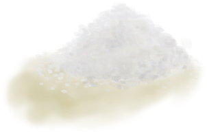
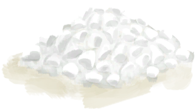

# Status  
## “Mental”  

[

[Morale](Morale.md)](Morale.md)

[

[Stress](Stress.md)](Stress.md)

[

[Wakefulness](Wakefulness.md)](Wakefulness.md)

[

[Appetite](Appetite.md)](Appetite.md)

[

[Entertainment](Entertainment.md)](Entertainment.md)

[

[Courage](Courage.md)](Courage.md)

[

[Loneliness](Loneliness.md)](Loneliness.md)

[

[Altered Mind State](MindState.md)](MindState.md)

[

[Mania](Mania.md)](Mania.md)

[

[Derealization](Derealization.md)](Derealization.md)

[

[Mental Structure](Structure.md)](Structure.md)

[

[Isolation](Isolation.md)](Isolation.md)

  
  
  
## “Physical”  

[

[Hydration ](Hydration.md)](Hydration.md)

[

[Satiation](Satiation.md)](Satiation.md)

[

[Stamina](Stamina.md)](Stamina.md)

[

[Filth](Filth.md)](Filth.md)

[

[Weight](Weight.md)](Weight.md)

[

[Tanning](Tanning.md)](Tanning.md)

[

[Foot Callouses](CallousesFeet.md)](CallousesFeet.md)

[

[Hand Callouses](CallousesHands.md)](CallousesHands.md)

[

[Eyesight](Myopia.md)](Myopia.md)

[

[Skin Integrity](SkinIntegrity.md)](SkinIntegrity.md)

  
  
  
## “Damage”  

[

[Pain](Pain.md)](Pain.md)

[

[Sunburn](Sunburn.md)](Sunburn.md)

[

[Back Pain](BackPain.md)](BackPain.md)

[

[Bug Bites](BugBites.md)](BugBites.md)

[

[Foot Damage](FootDamage.md)](FootDamage.md)

[

[Hand Damage](HandDamage.md)](HandDamage.md)

[

[Blood Loss](BloodLoss.md)](BloodLoss.md)

[

[Bruising](Bruising.md)](Bruising.md)

[

[Burns](Burns.md)](Burns.md)

[

[Eye Damage](EyeDamage.md)](EyeDamage.md)

[

[Lung Damage](LungDamage.md)](LungDamage.md)

  
  
  
## “Internal”  

[

[Hyperthermia](Hyperthermia.md)](Hyperthermia.md)

[

[Hypothermia](Hypothermia.md)](Hypothermia.md)

[

[Blood Pressure](Blood.md)](Blood.md)

[

[Fever](Fever.md)](Fever.md)

[

[Nausea](Nausea.md)](Nausea.md)

[

[Stool Liquidity](Diarrhoea.md)](Diarrhoea.md)

[

[Immune System](ImmuneSystem.md)](ImmuneSystem.md)

[

[Headache](Headache.md)](Headache.md)

  
  
  
## “Chemical”  

[

[Analgesia](Analgesia.md)](Analgesia.md)

[

[Spider Lily Effect](SpiderLilyEffect.md)](SpiderLilyEffect.md)

[

[Ginger](GingerEffect.md)](GingerEffect.md)

[Antibiotics](AntibioticsEffect.md)

[

[Alcohol](Alcohol.md)](Alcohol.md)

[

[Sodium](Sodium.md)](Sodium.md)

[

[Quinine](Quinine.md)](Quinine.md)

[

[Caffeine](Caffeine.md)](Caffeine.md)

[

[Capsaicin](Capsaicin.md)](Capsaicin.md)

[

[Psylocibin](Psylocibin.md)](Psylocibin.md)

[

[Jasmine](JasmineEffect.md)](JasmineEffect.md)

[

[Food Poisoning](FoodPoisoning.md)](FoodPoisoning.md)

[

[Chine Rose Effect](ChinaRoseEffect.md)](ChinaRoseEffect.md)

[

[Rice Effect](RiceEffect.md)](RiceEffect.md)

[

[Venom Krait](VenomKrait.md)](VenomKrait.md)

  
  
  
## “Protection”  

[

[Heat Insulation](InsulationHeat.md)](InsulationHeat.md)

[

[Cold Insulation](InsulationCold.md)](InsulationCold.md)

[

[Sun Protection](SunProtection.md)](SunProtection.md)

[

[Rain Protection](RainProtection.md)](RainProtection.md)

[

[Bug Protection](BugProtection.md)](BugProtection.md)

[

[Foot Protection](FootProtection.md)](FootProtection.md)

[

[Armor](Armor.md)](Armor.md)

  
  
  
## “Saturation”  

[

[Saturation Coconuts](SaturationCoconuts.md)](SaturationCoconuts.md)

[

[Saturation Crustaceans](SaturationCrustaceans.md)](SaturationCrustaceans.md)

[

[Saturation Mollusks](SaturationMollusks.md)](SaturationMollusks.md)

[

[Saturation Fish](SaturationFish.md)](SaturationFish.md)

[

[Saturation Bird](SaturationBird.md)](SaturationBird.md)

[

[Saturation Meat](SaturationMeat.md)](SaturationMeat.md)

[

[Saturation Reptile](SaturationReptile.md)](SaturationReptile.md)

[

[Saturation Bananas](SaturationBananas.md)](SaturationBananas.md)

[

[Saturation Fruits](SaturationFruits.md)](SaturationFruits.md)

[

[Saturation Vegetables](SaturationVegetables.md)](SaturationVegetables.md)

[

[Saturation Sago](SaturationSago.md)](SaturationSago.md)

[

[Saturation Sugar](SaturationSugar.md)](SaturationSugar.md)

[

[Saturation Rice](SaturationRice.md)](SaturationRice.md)

[

[Saturation Nuts](SaturationNuts.md)](SaturationNuts.md)

[

[Saturation Rations](SaturationRations.md)](SaturationRations.md)

[

[Saturation Eggs](SaturationEggs.md)](SaturationEggs.md)

[

[Saturation Dairy](SaturationDairy.md)](SaturationDairy.md)

[

[Saturation Mushrooms](SaturationMushrooms.md)](SaturationMushrooms.md)

[

[Saturation Yam](SaturationYam.md)](SaturationYam.md)

  
  
  
## “Skills”  

[

[Climbing(Skill)](Skill_Climbing.md)](Skill_Climbing.md)

[

[Swimming(Skill)](Skill_Swimming.md)](Skill_Swimming.md)

[

[Herbology(Skill)](Skill_Herbology.md)](Skill_Herbology.md)

[

[Cooking(Skill)](Skill_Cooking.md)](Skill_Cooking.md)

[

[Crafting(Skill)](Skill_Crafting.md)](Skill_Crafting.md)

[

[Tailoring(Skill)](Skill_Tailoring.md)](Skill_Tailoring.md)

[

[Woodworking(Skill)](Skill_Woodworking.md)](Skill_Woodworking.md)

[

[Knapping(Skill)](Skill_Knapping.md)](Skill_Knapping.md)

[

[Metalworking(Skill)](Skill_Metalworking.md)](Skill_Metalworking.md)

[

[Trapping(Skill)](Skill_Trapping.md)](Skill_Trapping.md)

[

[Fishing(Skill)](Skill_Fishing.md)](Skill_Fishing.md)

[

[Spear Fishing(Skill)](Skill_SpearFishing.md)](Skill_SpearFishing.md)

[

[Spear Fighting(Skill)](Skill_SpearFighting.md)](Skill_SpearFighting.md)

[

[Archery(Skill)](Skill_Archery.md)](Skill_Archery.md)

[

[Rock Throwing(Skill)](Skill_RockThrowing.md)](Skill_RockThrowing.md)

[

[Sling(Skill)](Skill_Sling.md)](Skill_Sling.md)

[

[Percussion(Skill)](Skill_Percussion.md)](Skill_Percussion.md)

[

[Wind Instruments(Skill)](Skill_WindInstruments.md)](Skill_WindInstruments.md)

[

[Stealth(Skill)](Skill_Stealth.md)](Skill_Stealth.md)

[

[Insight(Skill)](Skill_Insight.md)](Skill_Insight.md)

  
  
  
## TV Show  

[TV - Package Timer](TV_CounterRush.md)

[TV - Wait](TV_CounterWait.md)

[TV Crate Killer](TV_CrateKiller.md)

[TV Grasslands](TV_Grasslands.md)

[TV Grasslands - Explore](TV_GrasslandsExplore.md)

[TV Highlands](TV_Highlands.md)

[TV Highlands - Explore](TV_HighlandsExplore.md)

[TV Jungle](TV_Jungle.md)

[TV Jungle - Explore](TV_JungleExplore.md)

[TV Lives](TV_Lives.md)

[TV Mangroves](TV_Mangroves.md)

[TV Mangroves - Explore](TV_MangrovesExplore.md)

[TV Rocks](TV_Rocks.md)

[TV Rocks - Explore](TV_RocksExplore.md)

[TV Stage](TV_Stage.md)

  
  
## Other  

[Air Toxicity](AirToxicity.md)

[Alien Cravings](AlienCravings.md)

[Alien Spores](AlienSpores.md)

[Alien Spots](AlienSpots.md)

[Aloe Gel Protection](AloeVeraGelProtection.md)

[Anti-Seasickness](AntiSeasickness.md)

[Anxiety Counter](AnxietyCounter.md)

[Bacteria Cholera](BacteriaCholera.md)

[Bacteria Cholera Package](BacteriaCholeraPackage.md)

[Bacteria Diarrhoea](BacteriaDiarrhoea.md)

[Bacteria Fever](BacteriaFever.md)

[Bacteria Typhus Package](BacteriaTyphusPackage.md)

[Bay Aloe Vera](AloeVera_BayPop.md)

[Bay Lemon Grass](LemonGrass_BayPop.md)

[Bay Palm Trees](PalmTree_BayPop.md)

[Beach Aloe Vera](AloeVera_BeachPop.md)

[Beach Lemon Grass](LemonGrass_BeachPop.md)

[Beach Palm Trees](Bananas_JunglePop.md)

[Beach Palm Trees](PalmTree_BeachPop.md)

[Bee Protection](BeeProtection.md)

[Bee Stings](BeeStings.md)

[Boar Death Alarm](BoarDeathAlarm.md)

[Boar Raid Counter](BoarRaidCounter.md)

[Brimstone Gel Protection](BrimstoneGelProtection.md)

[Bug Damage](BugDamage.md)

[Bug Population](BugPopulation.md)

[Bug Repellent](BugRepellentApplied.md)

[Camp Fever](BacteriaTyphus.md)

[Captain Company](CaptainCompany.md)

[Captain Propinquity](CaptainPropinquity.md)

[Climb Modifier](ModifierClimb.md)

[Clouds](Clouds.md)

[Comfort](Comfort.md)

[Counter](Counter.md)

[Determination](Determination.md)

[Discomfort](Discomfort.md)

[Distance](Distance.md)

[Drone Raid Counter](DroneRaidCounter.md)

[Eastern Grasslands Wild Jujupe Population](WIldJujube_GrasslandsEPop.md)

[Encumbrance](Encumbrance.md)

[Enemy Prescence](EnemyDefeated.md)

[Engine On](EngineOn.md)

[Exploration Bay](Exploration_Bay.md)

[Exploration Deep Jungle](Exploration_DeepJungle.md)

[Exploration Jungle](Exploration_Jungle.md)

[Exploration Jungle Outskirts](Exploration_JungleOutskirts.md)

[Exploration Mangroves](Exploration_Mangroves.md)

[Exploration Rocks](Exploration_Rocks.md)

[Exploration Sea](Exploration_Sea.md)

[Exploration Shore](Exploration_Beach.md)

[Exploration Small Island](Exploration_SmallIsland.md)

[Exploration Wetlands](Exploration_Wetlands.md)

[Faint Counter](FaintCounter.md)

[First Month Counter](FirstMonthCounter.md)

[Foodplace](Foodplace.md)

[Foot Hardness](FootHardness.md)

[Fuel Tank Full](FuelTankFull.md)

[God Insight](GodInsight.md)

[Grasslands Almond Trees](Almond_GrasslandPop.md)

[Grasslands Chilies](Chilies_GrasslandPop.md)

[Hand Modifier](ModifierHand.md)

[Hand Nerve Damage](NerveDamageHandsPermanent.md)

[Hand Nerve Damage](NerveDamageHands.md)

[Handguns(Skill)](Skill_Handguns.md)

[Highlands Almond Trees](Almond_HighlandsPop.md)

[Highlands Aloe Vera](AloeVera_HighlandsPop.md)

[Highlands Lemon Grass](LemonGrass_HighlandsPop.md)

[Holiday Satisfaction](HolidaySatisfaction.md)

[Hunter's Insight](HunterInsight.md)

[Hunter's Proximity](HuntersProximity.md)

[if Kidneys](IfKidneys.md)

[In Dark Place](InDarkPlace.md)

[Insanity](Insanity.md)

[Intestines](Intestines.md)

[Irrigated](Irrigated.md)

[Is Grandpa Dead?](IsGrandpaDead.md)

[Island Drones](Pop_Drone.md)

[IsNight](IsNight.md)

[Jungle Highlands China Rose](ChinaRose_JungleHighlandsPop.md)

[Jungle Highlands Coffee](Coffee_JungleHighlandsPop.md)

[Jungle Jasmine](Jasmine_JunglePop.md)

[Jungle Kava](Kava_JunglePop.md)

[Jungle Mangos](Mango_JungleHighlandsPop.md)

[Jungle Mangos](Mango_JunglePop.md)

[Jungle Molinaria](WeevilLily_JunglePop.md)

[Jungle Yam](Yam_JunglePop.md)

[Land Sickness](LandSickness.md)

[Leg Modifier](ModifierLeg.md)

[Leg Nerve Damage](NerveDamageLegsPermanent.md)

[Leg Nerve Damage](NerveDamageLegs.md)

[Leg Protection](LegProtection.md)

[Light](Light.md)

[Macaque Fear](MacaqueFear.md)

[Macaque Raid Counter](MacaqueRaidCounter.md)

[Malaria - Resistance](MalariaResistance.md)

[Mangroves Ginger](Ginger_MangrovesPop.md)

[Mangroves Nipa Palms](Nipa_MangrovesPop.md)

[Mermaid Final Action](MermaidFinalAction.md)

[Monitor Raid Counter](MonitorRaidCounter.md)

[Mood Oscillator](MoodOscillator.md)

[Mourning](Mourning.md)

[Mouse Raid Counter](MouseDamageCounter.md)

[Mud Protection](MudProtection.md)

[Nightmare Counter](NightmareCounter.md)

[On Coconut Hit](OnCoconutHit.md)

[On Not Axe Adv](OnNotAxeAdv.md)

[On Raft](OnRaft.md)

[Outskirts Aloe Vera](AloeVera_OutskirtsPop.md)

[Outskirts Lemon Grass](LemonGrass_OutskirtsPop.md)

[Outskirts Palm Trees](Bananas_WetlandsPop.md)

[Outskirts Palm Trees](PalmTree_OutskirtsPop.md)

[Oyster Population](Pop_Oyster.md)

[Palm Tree Killer](PalmTreeKiller.md)

[Parasite Malaria](ParasiteMalaria.md)

[Parasites](Parasites.md)

[Population Bees](Pop_Bees.md)

[Population Boars](Pop_Boar.md)

[Population Cobra](Pop_Cobra.md)

[Population Conch](Pop_Conch.md)

[Population Crab](Pop_Crab.md)

[Population Goats](Pop_Goat.md)

[Population Lizard](Pop_Lizard.md)

[Population Macaques](Pop_Macaque.md)

[Population Monitors](Pop_Monitor.md)

[Population Mouse](Pop_Mouse.md)

[Population Mudskippers](Pop_Mudskipper.md)

[Population Partridges](Pop_Partridge.md)

[Population Prawn](Pop_Prawn.md)

[Population Sea Krait](Pop_Krait.md)

[Population Seagulls](Pop_Seagull.md)

[Population Shark](Pop_Shark.md)

[Pottery Bonus](PotteryBonus.md)

[Pregnancy](Pregnancy.md)

[Pyscho Counter](PsychoCounter.md)

[Rain Counter](RainCounter.md)

[Rain Exposure](RainExposure.md)

[Rain Killer](RainKiller.md)

[Rain Value](RainValue.md)

[Relational Layer](RelationalLayer.md)

[Sailed](Sailed.md)

[Sea Agitation](SeaAgitation.md)

[Sea Sickness](SeaSickness.md)

[Seagull Fear](SeagullFear.md)

[Seagull Nest Killer](SeagullNestKiller.md)

[Seagull Raid Counter](SeagullRaidCounter.md)

[Seahound Kills](SeaHoundKills.md)

[Seahound Parasites](ParasitesSeahound.md)

[Seahound Raid Counter](SeaHoundRaidCounter.md)

[Seahounds](Pop_Seahounds.md)

[Seamanship](SeaSicknessResistance.md)

[Seasons](Seasons.md)

[Sheltered](Sheltered.md)

[Skin Humidity](SkinHumidity.md)

[Sleep Clock](SleepClock.md)

[Sleep Interrupt](SleepInterrupt.md)

[SleepRisk](SleepRisk.md)

[Start Jungle](Start_Jungle.md)

[Start Rocks](Start_Rocks.md)

[Stomach](Stomach.md)

[Storm Bay](Storm_Bay.md)

[Storm Beach](Storm_Beach.md)

[Storm Counter](StormCounter.md)

[Storm Desolate Beach](Storm_DesolateBeach.md)

[Storm Mangroves](Storm_Mangroves.md)

[Storm Outskirts](Storm_Outskirts.md)

[Storm Rocks](Storm_Rocks.md)

[Sun Allergy](SunAllergy.md)

[Sun Exposure](SunExposure.md)

[Sun Screen](SunScreenApplied.md)

[Sun Strength](SunStrength.md)

[Surface Bacteria](BacteriaSurface.md)

[Temperature](TemperaturePerceived.md)

[Thought Depth](ThoughtDepth.md)

[Tick Counter](TickCounter.md)

[Tides](Tides.md)

[Travel Modifier](ModifierTravel.md)

[Tune - Advanced](Tune_Advanced.md)

[Tune - Cave](Tune_Cave.md)

[Tune - Happy](Tune_Happy.md)

[Tune - Jungle](Tune_Jungle.md)

[Tune - Lonely](Tune_Lonely.md)

[Tune - Sad](Tune_Sad.md)

[Tune - Sea](Tune_Sea.md)

[Tune - Simple](Tune_Simple.md)

[Tune - Weston](Tune_Weston.md)

[Urchin Population](Pop_Urchin.md)

[Valley Rice](Rice_ValleyPop.md)

[Venom Krait - Injector](VenomKraitInjector.md)

[Venom Krait - Resistance](VenomKraitResistance.md)

[Void Insight](VoidInsight.md)

[Vomit Counter](VomitCounter.md)

[Watcher's Glare](WatchersGlare.md)

[Watcher's Insight](WatcherInsight.md)

[WaveCounter](WaveCounter.md)

[Weston Alive](WestonAlive.md)

[Weston Company](WestonCompany.md)

[Weston Determination](WestonDetermination.md)

[Weston Happiness](WestonHappiness.md)

[Weston Propinquity](WestonPropinquity.md)

[Weston Special](WestonSpecial1.md)

[Weston Special 2](WestonSpecial2.md)

[Weston Special 3](WestonSpecial3.md)

[Weston Special 4](WestonSpecial4.md)

[Wetlands Ginger](Ginger_WetlandsPop.md)

[Wetlands Sago](Sago_WetlandsPop.md)

[Wetlands Spider Lily](SpiderLily_WetlandsPop.md)

[Wetlands Yam](Yam_WetlandsPop.md)

[Wetness](Wetness.md)

[Wind](Wind.md)

[Workplace](Workplace.md)

[Wounded](Wounds.md)

  
  

