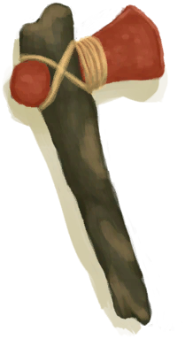
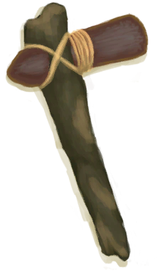
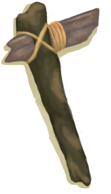
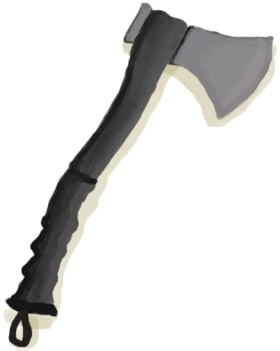

# “Axe”  

<a href="AxeCopper.md" style="color:black">Copper Axe</a>

<a href="AxeFlint.md" style="color:black">Flint Axe</a>

<a href="AxeScrap.md" style="color:black">Scrap Axe</a>

<a href="AxeSurvival.md" style="color:black">Survival Axe</a>

<a href="StoneAxe.md" style="color:black">Stone Axe</a>

  
  

