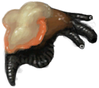

# “Bait”  

<a href="FishBait.md" style="color:black">Fish Bait</a>

<a href="Bees.md" style="color:black">Bees</a>

<a href="Bugs.md" style="color:black">Bugs</a>

<a href="ConchMeat.md" style="color:black">Conch Meat</a>

<a href="ConchMeatCooked.md" style="color:black">Cooked Conch Meat</a>

<a href="ConchMeatSoft.md" style="color:black">Soft Conch Meat</a>

<a href="ConchMeatSoftCooked.md" style="color:black">Cooked Soft Conch Meat</a>

<a href="Crab.md" style="color:black">Crab</a>

<a href="CrabCooked.md" style="color:black">Cooked Crab</a>

<a href="FishScraps.md" style="color:black">Fish Scraps</a>

<a href="FishScrapsCooked.md" style="color:black">Cooked Fish Scraps</a>

<a href="FishSlices.md" style="color:black">Fish Slices</a>

<a href="FishSlicesCooked.md" style="color:black">Cooked Fish Slices</a>

<a href="OysterMeat.md" style="color:black">Oyster Meat</a>

<a href="OysterMeatBaked.md" style="color:black">Butter Baked Oyster</a>

<a href="OysterMeatCooked.md" style="color:black">Cooked Oyster</a>

<a href="Prawns.md" style="color:black">Prawns</a>

<a href="PrawnsCooked.md" style="color:black">Roasted Prawns</a>

<a href="Rennet.md" style="color:black">Rennet</a>

<a href="RottenRemains.md" style="color:black">Rotten Remains</a>

<a href="GastricPellet.md" style="color:black">Gastric Pellet</a>

  
  

