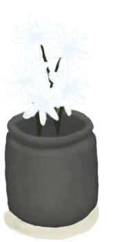
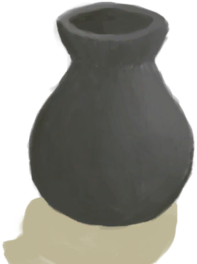

# “Clay”  

<a href="AlembicUnfired.md" style="color:black">Unfired Alembic</a>

<a href="ClayBowl.md" style="color:black">Clay Bowl</a>

<a href="ClayBowlUnfired.md" style="color:black">Unfired Clay Bowl</a>

<a href="ClayFirePitUnfired.md" style="color:black">Unfired Clay Fire Pit</a>

<a href="ClayJar.md" style="color:black">Clay Jar</a>

<a href="ClayJarJasmine.md" style="color:black">Jasmine Flowers</a>

<a href="ClayJarUnfired.md" style="color:black">Unfired Clay Jar</a>

<a href="ClayPotCoolerUnfired.md" style="color:black">Unfired Clay Pot Cooler</a>

<a href="ClayVase.md" style="color:black">Clay Vase</a>

<a href="ClayVaseUnfinished.md" style="color:black">Unfinished Clay Vase</a>

<a href="ClayVaseUnfired.md" style="color:black">Unfired Clay Vase</a>

<a href="CookingPot.md" style="color:black">Cooking Pot</a>

<a href="CookingPotUnfired.md" style="color:black">Unfired Cooking Pot</a>

<a href="CopperJar.md" style="color:black">Copper Jar</a>

<a href="GlazedVase.md" style="color:black">Glazed Vase</a>

<a href="GlazedVaseUnfired.md" style="color:black">Unfired Glazed Vase</a>

<a href="MoldAxe.md" style="color:black">Axe Mold</a>

<a href="MoldCopperDecoration.md" style="color:black">Decoration Mold</a>

<a href="MoldKnife.md" style="color:black">Knife Mold</a>

<a href="MoldShovel.md" style="color:black">Shovel Mold</a>

<a href="MoldSpear.md" style="color:black">Spear Mold</a>

<a href="BeeSmokerUnfired.md" style="color:black">Unfired Bee Smoker</a>

  
  

