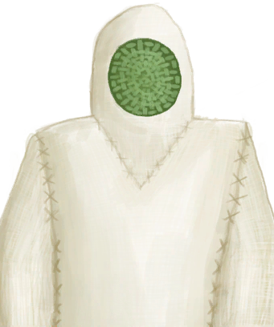
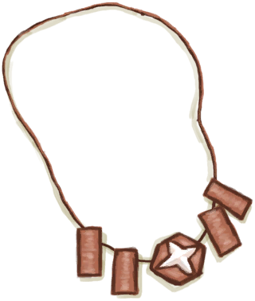

# “Legs (Inner)”  

<a href="BeeSuit.md" style="color:black">Bee Suit</a>

<a href="CollarTV.md" style="color:black">Collar</a>

<a href="CopperNecklace.md" style="color:black">Copper Necklace</a>

<a href="FlowerNecklace.md" style="color:black">Flower Necklace</a>

<a href="FootWrappings.md" style="color:black">Foot Wrappings</a>

<a href="GasMaskRustic.md" style="color:black">Gas Mask</a>

<a href="HandWrappings.md" style="color:black">Hand Wrappings</a>

<a href="HatSurvival.md" style="color:black">Survival Hat</a>

<a href="HatWoven.md" style="color:black">Woven Palm Hat</a>

<a href="HawaiianShirt.md" style="color:black">Hawaiian Shirt</a>

<a href="HeadWrappings.md" style="color:black">Head Wrappings</a>

<a href="HoodieRetromation.md" style="color:black">Hoodie</a>

<a href="LeafSKirt.md" style="color:black">Leaf Skirt</a>

<a href="LeatherGloves.md" style="color:black">Leather Gloves</a>

<a href="LeatherPants.md" style="color:black">Leather Pants</a>

<a href="LeatherShoes.md" style="color:black">Leather Shoes</a>

<a href="MaskMakeshift.md" style="color:black">Makeshift Mask</a>

<a href="MilitaryBoots.md" style="color:black">Military Boots</a>

<a href="MilitaryPants.md" style="color:black">Military Pants</a>

<a href="PantsCloth.md" style="color:black">Cloth Pants</a>

<a href="PearlNecklace.md" style="color:black">Pearl Necklace</a>

<a href="Raincoat.md" style="color:black">Raincoat</a>

<a href="SeagullCharm.md" style="color:black">Seagull Charm</a>

<a href="SeashellNecklace.md" style="color:black">Seashell Necklace</a>

<a href="SharkHeadpiece.md" style="color:black">Shark Headpiece</a>

<a href="ShirtFiber.md" style="color:black">Shirt</a>

<a href="Shorts.md" style="color:black">Shorts</a>

<a href="Sneakers.md" style="color:black">Sneakers</a>

<a href="Socks.md" style="color:black">Socks</a>

<a href="StrawCape.md" style="color:black">Straw Cape</a>

<a href="T-Shirt.md" style="color:black">T-Shirt</a>

<a href="Underwear.md" style="color:black">Underwear</a>

  
  

