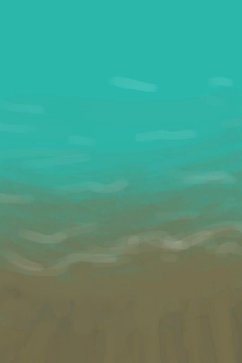
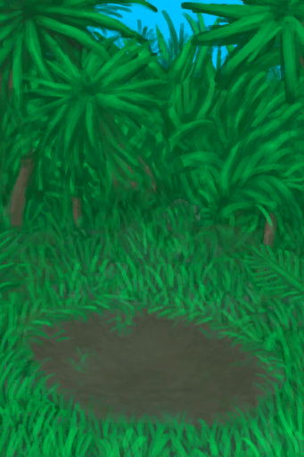
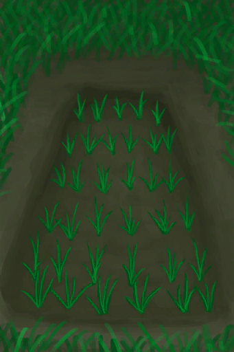

# “Container Open”  
<table class="table table-bordered" data-toggle="table"  ><thead style=""><tr ><th  style="text-align:left;vertical-align:top;"  >Name</th><th  style="text-align:left;vertical-align:top;"  >LiquidCapacity</th><th  style="text-align:left;vertical-align:top;"  >Sealed</th></tr></thead><tr ><td  style="text-align:left;vertical-align:top;"  >[

[Dry Acid Lake(Volcano)](AcidLakePuddle.md)](AcidLakePuddle.md)</td><td  style="text-align:left;vertical-align:top;"  >60000 (200portions)</td><td  style="text-align:left;vertical-align:top;"  >❌</td></tr><tr ><td  style="text-align:left;vertical-align:top;"  >[

[Dry Puddle(Wetlands)](Puddle.md)](Puddle.md)</td><td  style="text-align:left;vertical-align:top;"  >6000 (20portions)</td><td  style="text-align:left;vertical-align:top;"  >❌</td></tr><tr ><td  style="text-align:left;vertical-align:top;"  >[

[Well](Well.md)](Well.md)</td><td  style="text-align:left;vertical-align:top;"  >6000 (20portions)</td><td  style="text-align:left;vertical-align:top;"  >❌</td></tr><tr ><td  style="text-align:left;vertical-align:top;"  >[

[Dry Cave Pond(Damp Chamber)](CavePond.md)](CavePond.md)</td><td  style="text-align:left;vertical-align:top;"  >2400 (8portions)</td><td  style="text-align:left;vertical-align:top;"  >❌</td></tr><tr ><td  style="text-align:left;vertical-align:top;"  >[

[Rice Paddy](RicePaddy.md)](RicePaddy.md)</td><td  style="text-align:left;vertical-align:top;"  >2000 (6.666666666666667portions)</td><td  style="text-align:left;vertical-align:top;"  >❌</td></tr><tr ><td  style="text-align:left;vertical-align:top;"  >[

[Empty Rice Paddy(Empty)](RicePaddyEmpty.md)](RicePaddyEmpty.md)</td><td  style="text-align:left;vertical-align:top;"  >2000 (6.666666666666667portions)</td><td  style="text-align:left;vertical-align:top;"  >❌</td></tr><tr ><td  style="text-align:left;vertical-align:top;"  >[

[Dry Puddle(Dark Cave)](CavePuddle.md)](CavePuddle.md)</td><td  style="text-align:left;vertical-align:top;"  >600 (2portions)</td><td  style="text-align:left;vertical-align:top;"  >❌</td></tr></tbody></table>  
  

