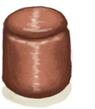

# “Container Metal”  
<table class="table table-bordered" data-toggle="table"  ><thead style=""><tr ><th  style="text-align:left;vertical-align:top;"  >Name</th><th  style="text-align:left;vertical-align:top;"  >LiquidCapacity</th><th  style="text-align:left;vertical-align:top;"  >Sealed</th></tr></thead><tr ><td  style="text-align:left;vertical-align:top;"  >[

[Copper Bottle](CopperBottle.md)](CopperBottle.md)</td><td  style="text-align:left;vertical-align:top;"  >600 (2portions)</td><td  style="text-align:left;vertical-align:top;"  >✅</td></tr><tr ><td  style="text-align:left;vertical-align:top;"  >[

[Copper Jar](CopperJar.md)](CopperJar.md)</td><td  style="text-align:left;vertical-align:top;"  >150 (0.5portions)</td><td  style="text-align:left;vertical-align:top;"  >✅</td></tr></tbody></table>  
  

