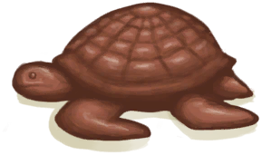
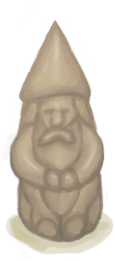

# “Decoration Advanced”  

<a href="Calcite.md" style="color:black">Calcite Crystal</a>

<a href="CopperDecoration_Fish.md" style="color:black">Copper Fish</a>

<a href="CopperDecoration_Seashell.md" style="color:black">Copper Seashell</a>

<a href="CopperDecoration_Turtle.md" style="color:black">Copper Turtle</a>

<a href="Coral.md" style="color:black">Coral</a>

<a href="TuskCarving_GnomeFemale.md" style="color:black">Gnome Figurine</a>

<a href="TuskCarving_GnomeMale.md" style="color:black">Gnome Figurine</a>

  
  

