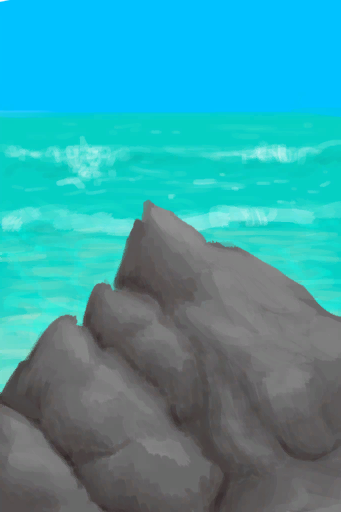

# “Infertile Environment”  

<a href="Env_AcidLake.md" style="color:black">Volcano</a>

<a href="Env_BirdRock.md" style="color:black">Bird Rock</a>

<a href="Env_Volcano.md" style="color:black">Volcano</a>

  
  

