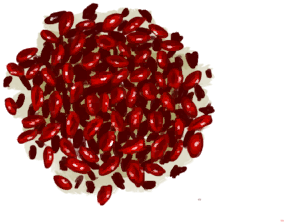
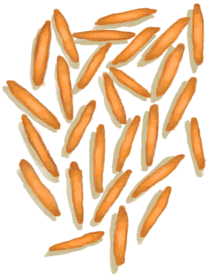

# “Feed Herbivore”  

<a href="AssortedMushrooms.md" style="color:black">Assorted Mushrooms</a>

<a href="Banana.md" style="color:black">Banana</a>

<a href="CandiedGinger.md" style="color:black">Candied Ginger</a>

<a href="Chilies.md" style="color:black">Chillies</a>

<a href="ChiliesDried.md" style="color:black">Dried Chilies</a>

<a href="ChinaRoseFlowers.md" style="color:black">China Rose</a>

<a href="CoconutMeat.md" style="color:black">Coconut Meat</a>

<a href="CoconutMeatCooked.md" style="color:black">Roasted Coconut Meat</a>

<a href="CoffeeBerries.md" style="color:black">Coffee Berries</a>

<a href="CoffeeBerryPulp.md" style="color:black">Coffee Berry Pulp</a>

<a href="FeedGoat.md" style="color:black">Goat Feed</a>

<a href="Ginger.md" style="color:black">Ginger</a>

<a href="GingerDried.md" style="color:black">Dried Ginger</a>

<a href="JasmineFlowers.md" style="color:black">Jasmine Flowers</a>

<a href="JujubeFruits.md" style="color:black">Jujube Fruits</a>

<a href="KavaRoot.md" style="color:black">Kava Root</a>

<a href="LemonGrassGround.md" style="color:black">Ground Lemongrass</a>

<a href="LemongrassStalks.md" style="color:black">Lemongrass</a>

<a href="MagicMushrooms.md" style="color:black">Magic Mushrooms</a>

<a href="Mango.md" style="color:black">Mango</a>

<a href="NipaSeeds.md" style="color:black">Nipa Seeds</a>

<a href="Puffballs.md" style="color:black">Puffballs</a>

<a href="RiceStalks.md" style="color:black">Rice Stalks</a>

<a href="SagoFlatbread.md" style="color:black">Sago Flatbread</a>

<a href="SagoFlatbreadHoney.md" style="color:black">Sago Flatbread with Honey</a>

<a href="SagoFlatbreadJam.md" style="color:black">Sago Flatbread with Jam</a>

<a href="Seaweed.md" style="color:black">Seaweed</a>

<a href="SpiderLilyLeaves.md" style="color:black">Spider Lily Leaves</a>

<a href="SpiderLilyLeavesDried.md" style="color:black">Dried Spider Lily Leaves</a>

<a href="TropicalAlmondKernels.md" style="color:black">Tropical Almond Kernels</a>

<a href="TropicalAlmondsRoasted.md" style="color:black">Roasted Tropical Almond</a>

<a href="WeevilLilyLeaves.md" style="color:black">Weevil Lily Leaves</a>

<a href="Yam.md" style="color:black">Yam</a>

<a href="YamBoiled.md" style="color:black">Boiled Yam</a>

<a href="YamCut.md" style="color:black">Cut Yam</a>

<a href="RiceStraw.md" style="color:black">Rice Straw</a>

  
  

