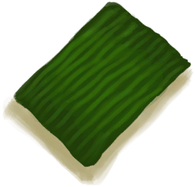

# “Poor Fibers”  

<a href="CoconutHusk.md" style="color:black">Coconut Husk</a>

<a href="Fibers.md" style="color:black">Fibers</a>

<a href="SpiderLilyGround.md" style="color:black">Ground Spider Lily</a>

<a href="SpiderLilyLeaves.md" style="color:black">Spider Lily Leaves</a>

<a href="SpiderLilyLeavesDried.md" style="color:black">Dried Spider Lily Leaves</a>

<a href="WeevilLilyLeaves.md" style="color:black">Weevil Lily Leaves</a>

<a href="LeafDressing.md" style="color:black">Leaf Dressing</a>

<a href="LeavesDry.md" style="color:black">Dry Leaves</a>

<a href="PalmFronds.md" style="color:black">Palm Fronds</a>

  
  

