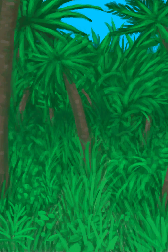
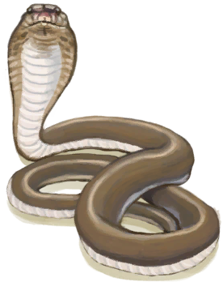
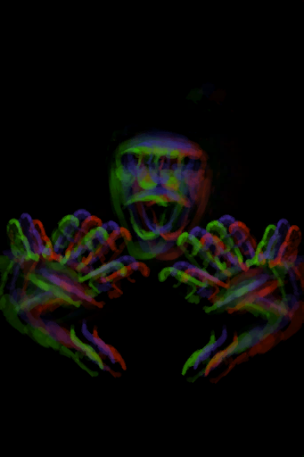
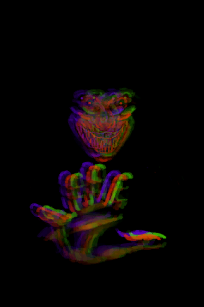
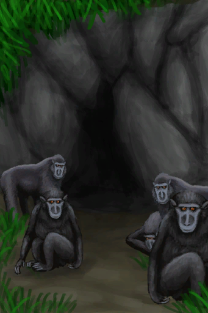
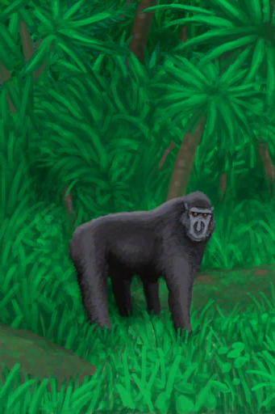
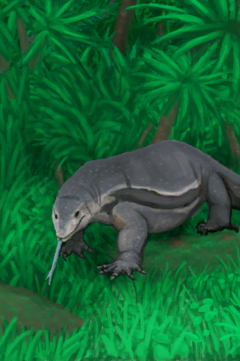
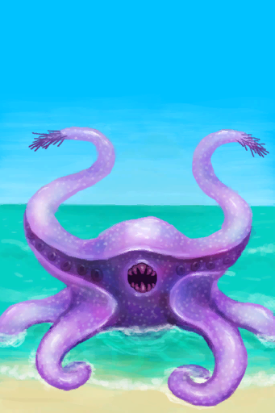
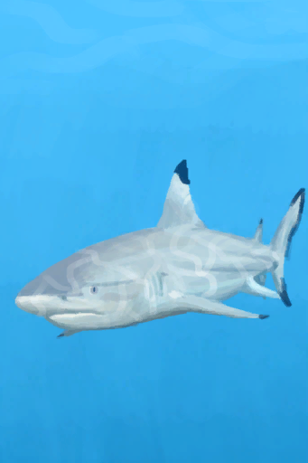

# “Fight Event”  

<a href="Event_BoarFight.md" style="color:black">I see a Boar!</a>

<a href="Event_BoarFightRaid.md" style="color:black">A wild Boar!</a>

<a href="Event_BoarTrailLost.md" style="color:black">I lost the trail...</a>

<a href="Event_BoarTrailOld.md" style="color:black">Old Trail</a>

<a href="Event_BoarTrailRecent.md" style="color:black">Recent Trail</a>

<a href="Event_CobraFight.md" style="color:black">Spitting Cobra!</a>

<a href="Event_DroneFight.md" style="color:black">Attack Drone!</a>

<a href="Event_EnemyFight.md" style="color:black">The Enemy is here!</a>

<a href="Event_EnemyPresence.md" style="color:black">I can feel a presence here...</a>

<a href="Event_HunterFight.md" style="color:black">The Hunter is here</a>

<a href="Event_MacaqueDenFight.md" style="color:black">The Macaques attack!</a>

<a href="Event_MacaqueFight.md" style="color:black">A Macaque!</a>

<a href="Event_MacaqueFightRaid.md" style="color:black">A Macaque!</a>

<a href="Event_MacaqueRaid.md" style="color:black">A Macaque!</a>

<a href="Event_MacaqueUndeadFight.md" style="color:black">A Macaque!</a>

<a href="Event_MonitorFight.md" style="color:black">A Monitor Lizard!</a>

<a href="Event_MonitorRaid.md" style="color:black">A Monitor Lizard!</a>

<a href="Event_SeahoundFight.md" style="color:black">A Seahound!</a>

<a href="Event_SharkFight.md" style="color:black">A Shark!</a>

  
  

