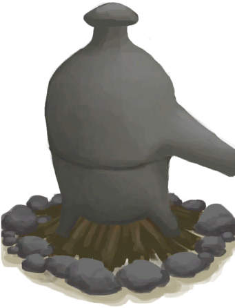

# “Fire”  

<a href="AlembicOff.md" style="color:black">Alembic</a>

<a href="AlembicOn.md" style="color:black">Alembic</a>

<a href="Campfire.md" style="color:black">Campfire</a>

<a href="CampfireExtinguished.md" style="color:black">Campfire</a>

<a href="ClayFirePit.md" style="color:black">Clay Fire Pit</a>

<a href="ClayFirePitExtinguished.md" style="color:black">Clay Fire Pit</a>

<a href="Fire.md" style="color:black">Fire</a>

<a href="FireExtinguished.md" style="color:black">Fire</a>

<a href="GasCookerEmpty.md" style="color:black">Campfire</a>

<a href="GasCookerOn.md" style="color:black">Gas Cooker</a>

<a href="Stove.md" style="color:black">Stove</a>

<a href="StoveExtinguished.md" style="color:black">Stove</a>

  
  

