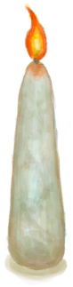

# “Fire Source”  

<a href="Campfire.md" style="color:black">Campfire</a>

<a href="Fire.md" style="color:black">Fire</a>

<a href="Forge.md" style="color:black">Forge</a>

<a href="GasCookerOn.md" style="color:black">Gas Cooker</a>

<a href="Kiln.md" style="color:black">Kiln</a>

<a href="KilnAdvanced.md" style="color:black">Advanced Kiln</a>

<a href="Stove.md" style="color:black">Stove</a>

<a href="Smoker.md" style="color:black">Smoker</a>

<a href="TinderLit.md" style="color:black">Lit Tinder</a>

<a href="BeeSmokerOn.md" style="color:black">Bee Smoker</a>

<a href="CandleCitronellaOn.md" style="color:black">Citronella Candle</a>

<a href="CandleJasmineOn.md" style="color:black">Jasmine Candle</a>

<a href="CandleOn.md" style="color:black">Candle</a>

<a href="DynamiteOn.md" style="color:black">Dynamite</a>

<a href="FlareHandOn.md" style="color:black">Burning Flare</a>

<a href="TorchOn.md" style="color:black">Torch</a>

  
  

