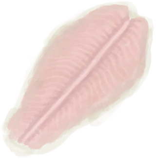

# “Fish”  

<a href="Bonefish.md" style="color:black">Bonefish</a>

<a href="BonefishCooked.md" style="color:black">Cooked Bonefish</a>

<a href="BonefishMeat.md" style="color:black">Bonefish Meat</a>

<a href="BonefishSmoked.md" style="color:black">Smoked Bonefish</a>

<a href="FishDried.md" style="color:black">Dried Fish</a>

<a href="FishSalted.md" style="color:black">Salted Fish</a>

<a href="FishSaltedDrying.md" style="color:black">Drying Salted Fish</a>

<a href="Goatfish.md" style="color:black">Goatfish</a>

<a href="GoatfishCooked.md" style="color:black">Cooked Goatfish</a>

<a href="GoatfishSmoked.md" style="color:black">Smoked Goatfish</a>

<a href="GrouperMeat.md" style="color:black">Grouper Meat</a>

<a href="GrouperMeatCooked.md" style="color:black">Cooked Grouper</a>

<a href="GrouperMeatSmoked.md" style="color:black">Smoked Grouper</a>

<a href="Herring.md" style="color:black">Herring</a>

<a href="HerringCooked.md" style="color:black">Cooked Herring</a>

<a href="HerringSmoked.md" style="color:black">Smoked Herring</a>

<a href="Mudskipper.md" style="color:black">Mudskipper</a>

<a href="MudskipperCooked.md" style="color:black">Roasted Mudskipper</a>

<a href="ParrotFish.md" style="color:black">Parrot Fish</a>

<a href="ParrotFishCooked.md" style="color:black">Cooked Parrot Fish</a>

<a href="ParrotFishSmoked.md" style="color:black">Smoked Parrot Fish</a>

<a href="SharkCooked.md" style="color:black">Cooked Shark</a>

<a href="SharkMeat.md" style="color:black">Shark Meat</a>

<a href="SharkSmoked.md" style="color:black">Smoked Shark</a>

<a href="SnakeCooked.md" style="color:black">Cooked Snake Meat</a>

<a href="ThreadfinCooked.md" style="color:black">Cooked Threadfin</a>

<a href="ThreadfinMeat.md" style="color:black">Threadfin Meat</a>

<a href="ThreadfinSmoked.md" style="color:black">Smoked Threadfin</a>

  
  

