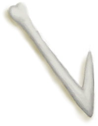
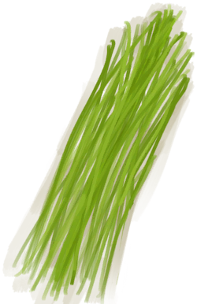

# “Fuel”  

<a href="ArrowCopper.md" style="color:black">Copper Arrow</a>

<a href="ArrowShaft.md" style="color:black">Arrow Shaft</a>

<a href="ArrowSimple.md" style="color:black">Simple Arrow</a>

<a href="CoconutHusk.md" style="color:black">Coconut Husk</a>

<a href="FluteWooden_Unfinished.md" style="color:black">Unfinished  Wooden Flute</a>

<a href="HookBone.md" style="color:black">Bone Hook</a>

<a href="RiceStraw.md" style="color:black">Rice Straw</a>

<a href="Sticks.md" style="color:black">Sticks</a>

<a href="WoodCarving_Failed.md" style="color:black">Ruined Figure</a>

<a href="WoodCarving_Goat.md" style="color:black">Goat Figure</a>

<a href="WoodCarving_Man.md" style="color:black">Man Figure</a>

<a href="WoodCarving_Monster.md" style="color:black">Spirit Figure</a>

<a href="WoodCarving_Seagull.md" style="color:black">Seagull Figure</a>

<a href="WoodCarving_Unfinished.md" style="color:black">Unfinished Wood Carving</a>

<a href="WoodCarving_Woman.md" style="color:black">Woman Figure</a>

  
  

