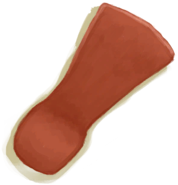
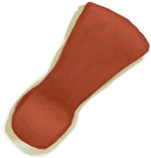
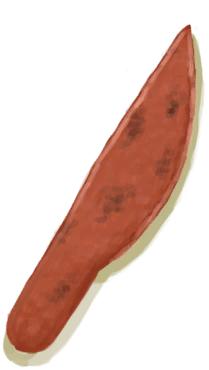
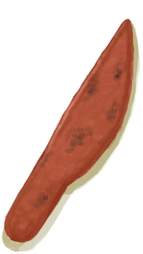
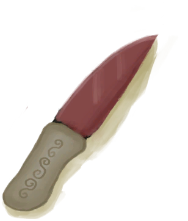
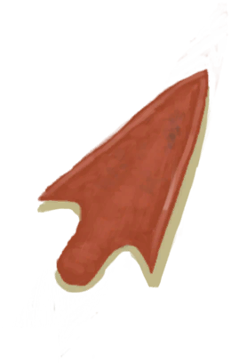

# “Hammer”  

<a href="Flint.md" style="color:black">Flint</a>

<a href="FlintSlab.md" style="color:black">Flint Slab</a>

<a href="Geode.md" style="color:black">Geode</a>

<a href="Oyster.md" style="color:black">Oyster</a>

<a href="Stone.md" style="color:black">Stone</a>

<a href="StoneHeavy.md" style="color:black">Heavy Stone</a>

<a href="StoneHeavyBrimstone.md" style="color:black">Sulphurous Stone</a>

<a href="AxeCopper.md" style="color:black">Copper Axe</a>

<a href="AxeFlint.md" style="color:black">Flint Axe</a>

<a href="AxeHead.md" style="color:black">Axe Head</a>

<a href="AxeHeadBlunt.md" style="color:black">Blunt Axe Head</a>

<a href="AxeScrap.md" style="color:black">Scrap Axe</a>

<a href="AxeSurvival.md" style="color:black">Survival Axe</a>

<a href="AxeSurvivalBlunt.md" style="color:black">Blunt Survival Axe</a>

<a href="KnifeBone.md" style="color:black">Bone Knife</a>

<a href="KnifeCopper.md" style="color:black">Copper Knife</a>

<a href="KnifeCopperBlunt.md" style="color:black">Blunt Knife</a>

<a href="KnifeGrandpa.md" style="color:black">Grandfather's Knife</a>

<a href="KnifeGrandpaBlunt.md" style="color:black">Grandfather's Blunt Knife</a>

<a href="KnifeMilitary.md" style="color:black">Military Knife</a>

<a href="KnifeMilitaryBlunt.md" style="color:black">Blunt Knife</a>

<a href="KnifeScrap.md" style="color:black">Scrap Knife</a>

<a href="ShovelCopper.md" style="color:black">Copper Shovel</a>

<a href="ShovelHead.md" style="color:black">Shovel Head</a>

<a href="ShovelScrap.md" style="color:black">Scrap Shovel</a>

<a href="ShovelWooden.md" style="color:black">Wooden Shovel</a>

<a href="SpearHead.md" style="color:black">Spear Head</a>

<a href="SpearHeadBlunt.md" style="color:black">Blunt Spear Head</a>

<a href="StoneAxe.md" style="color:black">Stone Axe</a>

<a href="StoneSharpened.md" style="color:black">Sharpened Stone</a>

  
  

