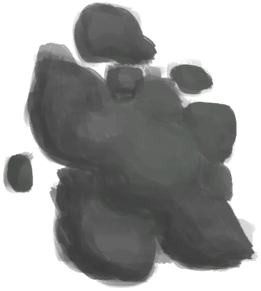
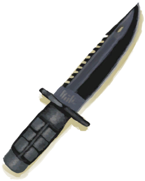
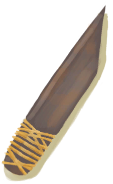
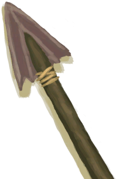

# “Heavy”  

<a href="DirtPile.md" style="color:black">Dirt Pile</a>

<a href="ClayFirePit.md" style="color:black">Clay Fire Pit</a>

<a href="ClayFirePitExtinguished.md" style="color:black">Clay Fire Pit</a>

<a href="HalfLog.md" style="color:black">Half Log</a>

<a href="Log.md" style="color:black">Log</a>

<a href="MudPile.md" style="color:black">Mud Pile</a>

<a href="Clay.md" style="color:black">Clay</a>

<a href="ClayPotCoolerUnfired.md" style="color:black">Unfired Clay Pot Cooler</a>

<a href="ClayVase.md" style="color:black">Clay Vase</a>

<a href="ClayVaseUnfired.md" style="color:black">Unfired Clay Vase</a>

<a href="CookingPot.md" style="color:black">Cooking Pot</a>

<a href="CookingPotUnfired.md" style="color:black">Unfired Cooking Pot</a>

<a href="GlazedVase.md" style="color:black">Glazed Vase</a>

<a href="GlazedVaseUnfired.md" style="color:black">Unfired Glazed Vase</a>

<a href="Jerrycan.md" style="color:black">Jerrycan</a>

<a href="JerrycanFuel.md" style="color:black">Fuel Jerrycan</a>

<a href="Flint.md" style="color:black">Flint</a>

<a href="FlintSlab.md" style="color:black">Flint Slab</a>

<a href="Chest.md" style="color:black">Storage Chest</a>

<a href="ChestFarmer.md" style="color:black">Storage Chest</a>

<a href="ChestPlaced.md" style="color:black">Storage Chest</a>

<a href="ClayPotCoolerOff.md" style="color:black">Clay Pot Cooler</a>

<a href="ClayPotCoolerOn.md" style="color:black">Clay Pot Cooler</a>

<a href="ClayPotCoolerUndeployed.md" style="color:black">Clay Pot Cooler</a>

<a href="SupplyChestRaft.md" style="color:black">Supply Chest</a>

<a href="Trunk.md" style="color:black">Storage Trunk</a>

<a href="TrunkPerk.md" style="color:black">Super Survival Trunk 2000</a>

<a href="TrunkPerkPlaced.md" style="color:black">Super Survival Trunk 2000</a>

<a href="TrunkPlaced.md" style="color:black">Trunk</a>

<a href="MetalScrap.md" style="color:black">Metal Scrap</a>

<a href="MoldAxe.md" style="color:black">Axe Mold</a>

<a href="MoldCopperDecoration.md" style="color:black">Decoration Mold</a>

<a href="MoldKnife.md" style="color:black">Knife Mold</a>

<a href="MoldShovel.md" style="color:black">Shovel Mold</a>

<a href="MoldSpear.md" style="color:black">Spear Mold</a>

<a href="Mortar.md" style="color:black">Mortar</a>

<a href="MortarBurnt.md" style="color:black">Burnt Mortar</a>

<a href="MortarDry.md" style="color:black">Dry Mortar</a>

<a href="MudBrick.md" style="color:black">Mud Brick</a>

<a href="Obsidian.md" style="color:black">Obsidian</a>

<a href="Stone.md" style="color:black">Stone</a>

<a href="StoneBurnt.md" style="color:black">Burnt Stone</a>

<a href="StoneHeavy.md" style="color:black">Heavy Stone</a>

<a href="StoneHeavyBrimstone.md" style="color:black">Sulphurous Stone</a>

<a href="StoneHeavyBurnt.md" style="color:black">Burnt Heavy Stone</a>

<a href="AxeFlint.md" style="color:black">Flint Axe</a>

<a href="AxeHead.md" style="color:black">Axe Head</a>

<a href="AxeHeadBlunt.md" style="color:black">Blunt Axe Head</a>

<a href="AxeScrap.md" style="color:black">Scrap Axe</a>

<a href="AxeSurvival.md" style="color:black">Survival Axe</a>

<a href="AxeSurvivalBlunt.md" style="color:black">Blunt Survival Axe</a>

<a href="CeremonialDagger.md" style="color:black">Ceremonial Dagger</a>

<a href="KnifeCopper.md" style="color:black">Copper Knife</a>

<a href="KnifeCopperBlunt.md" style="color:black">Blunt Knife</a>

<a href="KnifeFlint.md" style="color:black">Flint Knife</a>

<a href="KnifeGrandpa.md" style="color:black">Grandfather's Knife</a>

<a href="KnifeGrandpaBlunt.md" style="color:black">Grandfather's Blunt Knife</a>

<a href="KnifeMilitary.md" style="color:black">Military Knife</a>

<a href="KnifeMilitaryBlunt.md" style="color:black">Blunt Knife</a>

<a href="KnifeObsidian.md" style="color:black">Obsidian Knife</a>

<a href="KnifeScrap.md" style="color:black">Scrap Knife</a>

<a href="ShovelCopper.md" style="color:black">Copper Shovel</a>

<a href="ShovelHead.md" style="color:black">Shovel Head</a>

<a href="ShovelScrap.md" style="color:black">Scrap Shovel</a>

<a href="ShovelWooden.md" style="color:black">Wooden Shovel</a>

<a href="StoneAxe.md" style="color:black">Stone Axe</a>

<a href="StoneSharpened.md" style="color:black">Sharpened Stone</a>

  
  

