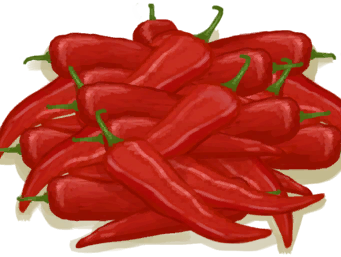
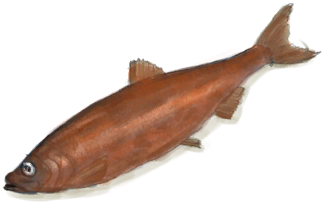
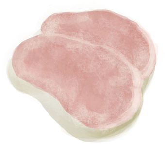
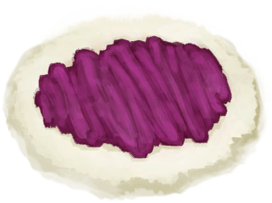
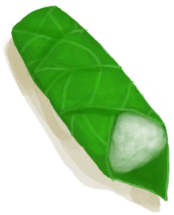
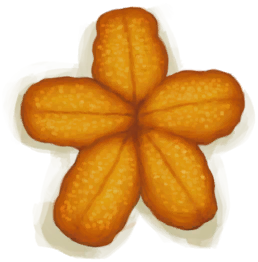

# “Human Food”  

<a href="AlienNodule.md" style="color:black">Alien Nodule</a>

<a href="Banana.md" style="color:black">Banana</a>

<a href="BatCooked.md" style="color:black">Roasted Bat</a>

<a href="BeeHoneycomb.md" style="color:black">Honeycomb</a>

<a href="BirdMeatCooked.md" style="color:black">Cooked Bird Meat</a>

<a href="BirdMeatSmoked.md" style="color:black">Smoked Bird Meat</a>

<a href="BoarMeatCooked.md" style="color:black">Cooked Boar Meat</a>

<a href="BoarMeatDried.md" style="color:black">Dried Boar Meat</a>

<a href="BoarMeatSalted.md" style="color:black">Cured Boar Meat</a>

<a href="BoarMeatSmoked.md" style="color:black">Smoked Boar Meat</a>

<a href="BonefishCooked.md" style="color:black">Cooked Bonefish</a>

<a href="BonefishSmoked.md" style="color:black">Smoked Bonefish</a>

<a href="CandiedGinger.md" style="color:black">Candied Ginger</a>

<a href="Cheese.md" style="color:black">Goat Cheese</a>

<a href="ChickenSandwich.md" style="color:black">Chicken Sandwich</a>

<a href="Chilies.md" style="color:black">Chillies</a>

<a href="Chocolate.md" style="color:black">Chocolate</a>

<a href="CoconutMeat.md" style="color:black">Coconut Meat</a>

<a href="CoconutMeatCooked.md" style="color:black">Roasted Coconut Meat</a>

<a href="CoffeeBerries.md" style="color:black">Coffee Berries</a>

<a href="ConchMeatCooked.md" style="color:black">Cooked Conch Meat</a>

<a href="ConchMeatSoftCooked.md" style="color:black">Cooked Soft Conch Meat</a>

<a href="ButterBakedOystersCooked.md" style="color:black">Butter Baked Oysters</a>

<a href="CrabCooked.md" style="color:black">Cooked Crab</a>

<a href="EggBoiled.md" style="color:black">Boiled Egg</a>

<a href="EggCooked.md" style="color:black">Roasted Egg</a>

<a href="FishDried.md" style="color:black">Dried Fish</a>

<a href="FishSalted.md" style="color:black">Salted Fish</a>

<a href="FishTaco.md" style="color:black">Fish Taco</a>

<a href="FoodRation.md" style="color:black">Food Ration</a>

<a href="FriedBanana.md" style="color:black">Fried Banana</a>

<a href="GoatMeatCooked.md" style="color:black">Cooked Goat Meat</a>

<a href="GoatMeatDried.md" style="color:black">Dried Goat Meat</a>

<a href="GoatMeatSalted.md" style="color:black">Cured Goat Meat</a>

<a href="GoatMeatSmoked.md" style="color:black">Smoked Goat Meat</a>

<a href="GoatfishCooked.md" style="color:black">Cooked Goatfish</a>

<a href="GoatfishSmoked.md" style="color:black">Smoked Goatfish</a>

<a href="GrouperMeatCooked.md" style="color:black">Cooked Grouper</a>

<a href="GrouperMeatSmoked.md" style="color:black">Smoked Grouper</a>

<a href="HerringCooked.md" style="color:black">Cooked Herring</a>

<a href="HerringSmoked.md" style="color:black">Smoked Herring</a>

<a href="HoneyCandy.md" style="color:black">Honey Candy</a>

<a href="JujubeFruits.md" style="color:black">Jujube Fruits</a>

<a href="LizardCooked.md" style="color:black">Roasted Lizard</a>

<a href="MacaqueMeatCooked.md" style="color:black">Cooked Macaque Meat</a>

<a href="MacaqueMeatDried.md" style="color:black">Dried Macaque Meat</a>

<a href="MacaqueMeatSalted.md" style="color:black">Cured Macaque Meat</a>

<a href="MacaqueMeatSmoked.md" style="color:black">Smoked Macaque Meat</a>

<a href="Mango.md" style="color:black">Mango</a>

<a href="MeatSaltedDried.md" style="color:black">Cured Meat</a>

<a href="MonitorMeatCooked.md" style="color:black">Cooked Lizard Meat</a>

<a href="MonitorMeatDried.md" style="color:black">Dried Lizard Meat</a>

<a href="MonitorMeatSalted.md" style="color:black">Cured Lizard Meat</a>

<a href="MonitorMeatSmoked.md" style="color:black">Smoked Lizard Meat</a>

<a href="MouseCooked.md" style="color:black">Roasted Mouse</a>

<a href="MudskipperCooked.md" style="color:black">Roasted Mudskipper</a>

<a href="NipaSeeds.md" style="color:black">Nipa Seeds</a>

<a href="OysterMeatBaked.md" style="color:black">Butter Baked Oyster</a>

<a href="OysterMeatCooked.md" style="color:black">Cooked Oyster</a>

<a href="ParrotFishCooked.md" style="color:black">Cooked Parrot Fish</a>

<a href="ParrotFishSmoked.md" style="color:black">Smoked Parrot Fish</a>

<a href="PrawnsCooked.md" style="color:black">Roasted Prawns</a>

<a href="ProteinBar.md" style="color:black">Protein Bar</a>

<a href="Puffballs.md" style="color:black">Puffballs</a>

<a href="RiceCooked.md" style="color:black">Rice</a>

<a href="SagoFlatbread.md" style="color:black">Sago Flatbread</a>

<a href="SagoFlatbreadHoney.md" style="color:black">Sago Flatbread with Honey</a>

<a href="SagoFlatbreadJam.md" style="color:black">Sago Flatbread with Jam</a>

<a href="SagoSlime.md" style="color:black">Sago Slime</a>

<a href="SeahoundCooked.md" style="color:black">Cooked Seahound</a>

<a href="SharkCooked.md" style="color:black">Cooked Shark</a>

<a href="SharkSmoked.md" style="color:black">Smoked Shark</a>

<a href="SnakeCooked.md" style="color:black">Cooked Snake Meat</a>

<a href="Sushi.md" style="color:black">Sushi</a>

<a href="ThreadfinCooked.md" style="color:black">Cooked Threadfin</a>

<a href="ThreadfinSmoked.md" style="color:black">Smoked Threadfin</a>

<a href="TropicalAlmondKernels.md" style="color:black">Tropical Almond Kernels</a>

<a href="TropicalAlmondsRoasted.md" style="color:black">Roasted Tropical Almond</a>

<a href="UrchinMeatCooked.md" style="color:black">Cooked Urchin</a>

<a href="YamBoiled.md" style="color:black">Boiled Yam</a>

<a href="YamJam.md" style="color:black">Yam Jam</a>

  
  

