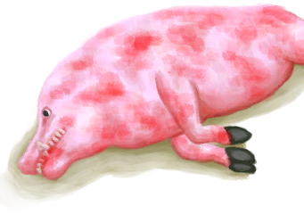
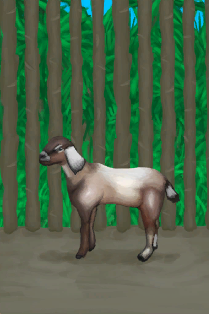
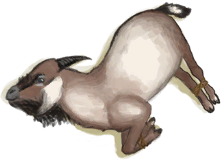
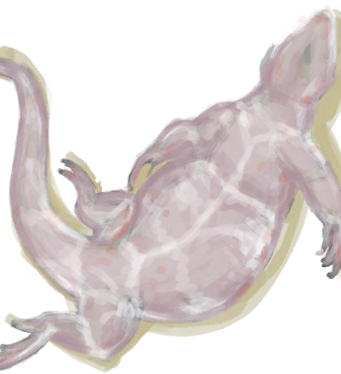
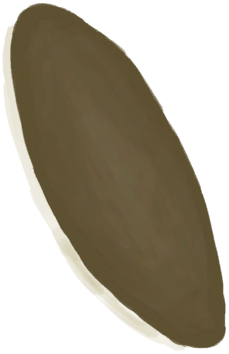

# “Large”  

<a href="CageTrap.md" style="color:black">Cage Trap</a>

<a href="CageTrapPlaced.md" style="color:black">Cage Trap</a>

<a href="GasCookerOn.md" style="color:black">Gas Cooker</a>

<a href="HalfLog.md" style="color:black">Half Log</a>

<a href="Log.md" style="color:black">Log</a>

<a href="BowRustic.md" style="color:black">Rustic Bow</a>

<a href="BowRustic_Copper.md" style="color:black">Loaded Rustic Bow</a>

<a href="BowRustic_Simple.md" style="color:black">Loaded Rustic Bow</a>

<a href="ClayFirePitUnfired.md" style="color:black">Unfired Clay Fire Pit</a>

<a href="ClayVase.md" style="color:black">Clay Vase</a>

<a href="ClayVaseUnfired.md" style="color:black">Unfired Clay Vase</a>

<a href="GlazedVase.md" style="color:black">Glazed Vase</a>

<a href="GlazedVaseUnfired.md" style="color:black">Unfired Glazed Vase</a>

<a href="Jerrycan.md" style="color:black">Jerrycan</a>

<a href="JerrycanFuel.md" style="color:black">Fuel Jerrycan</a>

<a href="Drum.md" style="color:black">Drum</a>

<a href="CageTrapMacaque.md" style="color:black">Trapped Macaque</a>

<a href="BoarCarcass.md" style="color:black">Boar Carcass</a>

<a href="BoarCarcassPiglet.md" style="color:black">Piglet Carcass</a>

<a href="BoarEnclosureFemale.md" style="color:black">Sow</a>

<a href="BoarEnclosureMale.md" style="color:black">Boar</a>

<a href="BoarEnclosurePiglet.md" style="color:black">Piglet</a>

<a href="BoarSkinned.md" style="color:black">Skinned Boar</a>

<a href="BoarSkinnedPiglet.md" style="color:black">Skinned Piglet</a>

<a href="BoarTiedFemale.md" style="color:black">Sow</a>

<a href="BoarTiedMale.md" style="color:black">Boar</a>

<a href="BoarTiedPiglet.md" style="color:black">Piglet</a>

<a href="DogFriend.md" style="color:black">Dog Friend</a>

<a href="GoatCarcassFemale.md" style="color:black">Goat Carcass</a>

<a href="GoatCarcassKid.md" style="color:black">Juvenile Goat Carcass</a>

<a href="GoatCarcassMale.md" style="color:black">Goat Carcass</a>

<a href="GoatEnclosureFemale.md" style="color:black">Goat</a>

<a href="GoatEnclosureKid.md" style="color:black">Juvenile Goat</a>

<a href="GoatEnclosureLactating.md" style="color:black">Lactating Goat</a>

<a href="GoatEnclosureMale.md" style="color:black">Male Goat</a>

<a href="GoatSkinned.md" style="color:black">Skinned Goat</a>

<a href="GoatSkinnedKid.md" style="color:black">Skinned Kid</a>

<a href="GoatTiedFemale.md" style="color:black">Goat</a>

<a href="GoatTiedFemaleLactating.md" style="color:black">Lactating Goat</a>

<a href="GoatTiedKid.md" style="color:black">Juvenile Goat</a>

<a href="GoatTiedMale.md" style="color:black">Male Goat</a>

<a href="SeahoundCarcass.md" style="color:black">Sea Hound Carcass</a>

<a href="SharkCarcass.md" style="color:black">Shark Carcass</a>

<a href="PartridgeFemaleEnclosure.md" style="color:black">Partridge</a>

<a href="PartridgeMaleEnclosure.md" style="color:black">Male Partridge</a>

<a href="Chest.md" style="color:black">Storage Chest</a>

<a href="ChestFarmer.md" style="color:black">Storage Chest</a>

<a href="ChestPlaced.md" style="color:black">Storage Chest</a>

<a href="ClayPotCoolerOff.md" style="color:black">Clay Pot Cooler</a>

<a href="ClayPotCoolerUndeployed.md" style="color:black">Clay Pot Cooler</a>

<a href="SupplyChestRaft.md" style="color:black">Supply Chest</a>

<a href="Travois.md" style="color:black">Travois</a>

<a href="Trunk.md" style="color:black">Storage Trunk</a>

<a href="TrunkPerk.md" style="color:black">Super Survival Trunk 2000</a>

<a href="TrunkPerkPlaced.md" style="color:black">Super Survival Trunk 2000</a>

<a href="TrunkPlaced.md" style="color:black">Trunk</a>

<a href="LizardDrum.md" style="color:black">Lizard Drum</a>

<a href="MonitorCarcass.md" style="color:black">Lizard Carcass</a>

<a href="MonitorSkinned.md" style="color:black">Skinned Lizard</a>

<a href="SandCastle.md" style="color:black">Sand Castle</a>

<a href="StickLong.md" style="color:black">Long Stick</a>

<a href="Broom.md" style="color:black">Broom</a>

<a href="FishingRod.md" style="color:black">Fishing Rod</a>

<a href="FishingRodBait.md" style="color:black">Fishing Rod (baited)</a>

<a href="HarpoonBone.md" style="color:black">Harpoon</a>

<a href="Shield.md" style="color:black">Shield</a>

<a href="SpearCopper.md" style="color:black">Copper Spear</a>

<a href="SpearFishing.md" style="color:black">Fishing Spear</a>

<a href="SpearFlint.md" style="color:black">Flint Spear</a>

<a href="SpearObsidian.md" style="color:black">Obsidian Spear</a>

<a href="SpearRustic.md" style="color:black">Rustic Spear</a>

<a href="SpearScrap.md" style="color:black">Scrap Spear</a>

<a href="AlembicUndeployed.md" style="color:black">Alembic</a>

  
  

