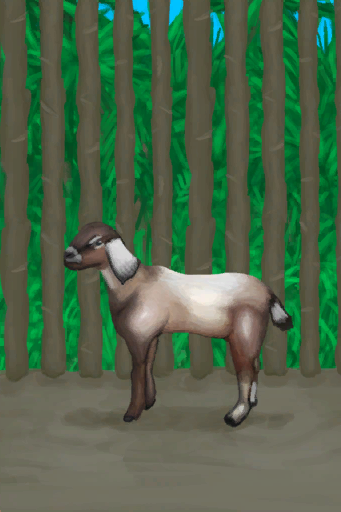
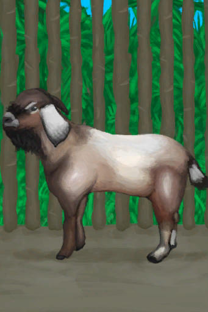
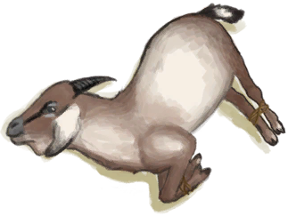
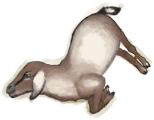
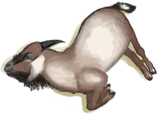

# “Large Animal”  

<a href="BoarEnclosureFemale.md" style="color:black">Sow</a>

<a href="BoarEnclosureMale.md" style="color:black">Boar</a>

<a href="BoarEnclosurePiglet.md" style="color:black">Piglet</a>

<a href="BoarTiedFemale.md" style="color:black">Sow</a>

<a href="BoarTiedMale.md" style="color:black">Boar</a>

<a href="BoarTiedPiglet.md" style="color:black">Piglet</a>

<a href="DogFriend.md" style="color:black">Dog Friend</a>

<a href="GoatEnclosureFemale.md" style="color:black">Goat</a>

<a href="GoatEnclosureKid.md" style="color:black">Juvenile Goat</a>

<a href="GoatEnclosureLactating.md" style="color:black">Lactating Goat</a>

<a href="GoatEnclosureMale.md" style="color:black">Male Goat</a>

<a href="GoatTiedFemale.md" style="color:black">Goat</a>

<a href="GoatTiedFemaleLactating.md" style="color:black">Lactating Goat</a>

<a href="GoatTiedKid.md" style="color:black">Juvenile Goat</a>

<a href="GoatTiedMale.md" style="color:black">Male Goat</a>

  
  

