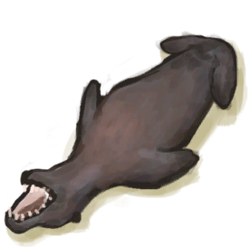
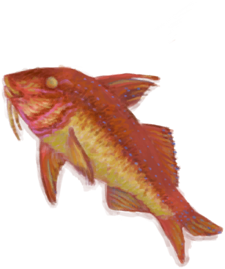
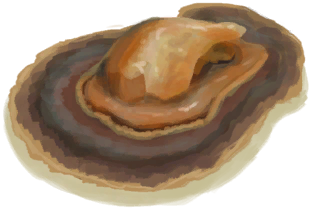

# “Feed”  

<a href="Bat.md" style="color:black">Dead Bat</a>

<a href="BatCooked.md" style="color:black">Roasted Bat</a>

<a href="BirdMeat.md" style="color:black">Bird Meat</a>

<a href="BirdMeatCooked.md" style="color:black">Cooked Bird Meat</a>

<a href="BirdMeatSmoked.md" style="color:black">Smoked Bird Meat</a>

<a href="BoarMeat.md" style="color:black">Boar Meat</a>

<a href="BoarMeatCooked.md" style="color:black">Cooked Boar Meat</a>

<a href="BoarMeatDried.md" style="color:black">Dried Boar Meat</a>

<a href="BoarMeatSalted.md" style="color:black">Cured Boar Meat</a>

<a href="BoarMeatSaltedDrying.md" style="color:black">Drying Boar Meat</a>

<a href="BoarMeatSmoked.md" style="color:black">Smoked Boar Meat</a>

<a href="Bonefish.md" style="color:black">Bonefish</a>

<a href="BonefishCooked.md" style="color:black">Cooked Bonefish</a>

<a href="BonefishMeat.md" style="color:black">Bonefish Meat</a>

<a href="BonefishSmoked.md" style="color:black">Smoked Bonefish</a>

<a href="Butter.md" style="color:black">Butter</a>

<a href="ConchMeat.md" style="color:black">Conch Meat</a>

<a href="ConchMeatCooked.md" style="color:black">Cooked Conch Meat</a>

<a href="ConchMeatSoft.md" style="color:black">Soft Conch Meat</a>

<a href="ConchMeatSoftCooked.md" style="color:black">Cooked Soft Conch Meat</a>

<a href="Egg.md" style="color:black">Egg</a>

<a href="EggBoiled.md" style="color:black">Boiled Egg</a>

<a href="EggCooked.md" style="color:black">Roasted Egg</a>

<a href="EggPartridgeFertilized.md" style="color:black">Fertilized Egg</a>

<a href="Fat.md" style="color:black">Fat</a>

<a href="FishDried.md" style="color:black">Dried Fish</a>

<a href="FishSalted.md" style="color:black">Salted Fish</a>

<a href="FishSaltedDrying.md" style="color:black">Drying Salted Fish</a>

<a href="FishScraps.md" style="color:black">Fish Scraps</a>

<a href="FishScrapsCooked.md" style="color:black">Cooked Fish Scraps</a>

<a href="GoatMeat.md" style="color:black">Goat Meat</a>

<a href="GoatMeatCooked.md" style="color:black">Cooked Goat Meat</a>

<a href="GoatMeatDried.md" style="color:black">Dried Goat Meat</a>

<a href="GoatMeatSalted.md" style="color:black">Cured Goat Meat</a>

<a href="GoatMeatSaltedDrying.md" style="color:black">Drying Goat Meat</a>

<a href="GoatMeatSmoked.md" style="color:black">Smoked Goat Meat</a>

<a href="Goatfish.md" style="color:black">Goatfish</a>

<a href="GoatfishCooked.md" style="color:black">Cooked Goatfish</a>

<a href="GoatfishSmoked.md" style="color:black">Smoked Goatfish</a>

<a href="Herring.md" style="color:black">Herring</a>

<a href="HerringCooked.md" style="color:black">Cooked Herring</a>

<a href="HerringSmoked.md" style="color:black">Smoked Herring</a>

<a href="KingThreadfin.md" style="color:black">King Threadfin</a>

<a href="SeahoundCarcass.md" style="color:black">Sea Hound Carcass</a>

<a href="SharkCarcass.md" style="color:black">Shark Carcass</a>

<a href="Lizard.md" style="color:black">Lizard</a>

<a href="LizardCooked.md" style="color:black">Roasted Lizard</a>

<a href="MacaqueCarcass.md" style="color:black">Macaque Carcass</a>

<a href="MacaqueMeat.md" style="color:black">Macaque Meat</a>

<a href="MacaqueMeatCooked.md" style="color:black">Cooked Macaque Meat</a>

<a href="MacaqueMeatDried.md" style="color:black">Dried Macaque Meat</a>

<a href="MacaqueMeatSalted.md" style="color:black">Cured Macaque Meat</a>

<a href="MacaqueMeatSaltedDrying.md" style="color:black">Drying Macaque Meat</a>

<a href="MacaqueMeatSmoked.md" style="color:black">Smoked Macaque Meat</a>

<a href="MeatSaltedDried.md" style="color:black">Cured Meat</a>

<a href="MeatSaltedDrying.md" style="color:black">Drying Meat</a>

<a href="MonitorMeat.md" style="color:black">Lizard Meat</a>

<a href="MonitorMeatCooked.md" style="color:black">Cooked Lizard Meat</a>

<a href="MonitorMeatDried.md" style="color:black">Dried Lizard Meat</a>

<a href="MonitorMeatSalted.md" style="color:black">Cured Lizard Meat</a>

<a href="MonitorMeatSaltedDrying.md" style="color:black">Drying Lizard Meat</a>

<a href="MonitorMeatSmoked.md" style="color:black">Smoked Lizard Meat</a>

<a href="Mouse.md" style="color:black">Dead Mouse</a>

<a href="MouseCooked.md" style="color:black">Roasted Mouse</a>

<a href="MouseSkinned.md" style="color:black">Skinned Mouse</a>

<a href="Mudskipper.md" style="color:black">Mudskipper</a>

<a href="MudskipperCooked.md" style="color:black">Roasted Mudskipper</a>

<a href="OysterMeat.md" style="color:black">Oyster Meat</a>

<a href="OysterMeatBaked.md" style="color:black">Butter Baked Oyster</a>

<a href="OysterMeatCooked.md" style="color:black">Cooked Oyster</a>

<a href="ParrotFish.md" style="color:black">Parrot Fish</a>

<a href="ParrotFishCooked.md" style="color:black">Cooked Parrot Fish</a>

<a href="ParrotFishSmoked.md" style="color:black">Smoked Parrot Fish</a>

<a href="PartridgeChick.md" style="color:black">Chick</a>

<a href="PartridgeChickDead.md" style="color:black">Dead Chick</a>

<a href="PartridgeDead.md" style="color:black">Dead Partridge</a>

<a href="PartridgeFemaleEnclosure.md" style="color:black">Partridge</a>

<a href="PartridgeFemaleLive.md" style="color:black">Partridge</a>

<a href="PartridgeMaleEnclosure.md" style="color:black">Male Partridge</a>

<a href="PartridgeMaleLive.md" style="color:black">Male Partridge</a>

<a href="Prawns.md" style="color:black">Prawns</a>

<a href="PrawnsCooked.md" style="color:black">Roasted Prawns</a>

<a href="Rennet.md" style="color:black">Rennet</a>

<a href="SeagullDead.md" style="color:black">Dead Seagull</a>

<a href="SeahoundCooked.md" style="color:black">Cooked Seahound</a>

<a href="Seahoundmeat.md" style="color:black">Seahound Meat</a>

<a href="SharkCooked.md" style="color:black">Cooked Shark</a>

<a href="ThreadfinCooked.md" style="color:black">Cooked Threadfin</a>

<a href="ThreadfinMeat.md" style="color:black">Threadfin Meat</a>

<a href="ThreadfinSmoked.md" style="color:black">Smoked Threadfin</a>

<a href="UrchinMeat.md" style="color:black">Urchin Meat</a>

<a href="UrchinMeatCooked.md" style="color:black">Cooked Urchin</a>

  
  

