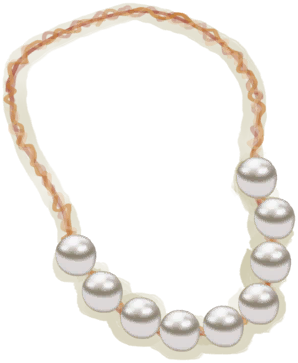
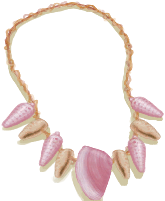

# “Neck”  

<a href="Camera.md" style="color:black">Camera</a>

<a href="CollarTV.md" style="color:black">Collar</a>

<a href="CopperNecklace.md" style="color:black">Copper Necklace</a>

<a href="FlowerNecklace.md" style="color:black">Flower Necklace</a>

<a href="PearlNecklace.md" style="color:black">Pearl Necklace</a>

<a href="SeagullCharm.md" style="color:black">Seagull Charm</a>

<a href="SeashellNecklace.md" style="color:black">Seashell Necklace</a>

  
  

