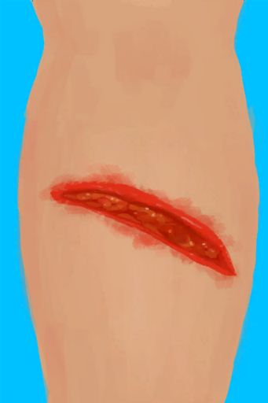

# “Open Wound”  

<a href="W_Abrasion.md" style="color:black">Abrasion</a>

<a href="W_ArmLacerationL.md" style="color:black">Arm Laceration</a>

<a href="W_ArmLacerationR.md" style="color:black">Arm Laceration</a>

<a href="W_DogBite.md" style="color:black">Dog Bite</a>

<a href="W_LegLacerationL.md" style="color:black">Leg Laceration</a>

<a href="W_LegLacerationR.md" style="color:black">Leg Laceration</a>

<a href="W_MacaqueBite.md" style="color:black">Macaque Bite</a>

<a href="W_MinorLaceration.md" style="color:black">Minor Laceration</a>

<a href="W_MonitorBite.md" style="color:black">Lizard Bite</a>

<a href="W_SharkBite.md" style="color:black">Shark Bite</a>

  
  

