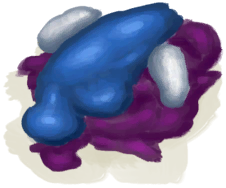

# “Poor Proteins”  

<a href="Bat.md" style="color:black">Dead Bat</a>

<a href="BatCooked.md" style="color:black">Roasted Bat</a>

<a href="Bugs.md" style="color:black">Bugs</a>

<a href="ConchMeat.md" style="color:black">Conch Meat</a>

<a href="ConchMeatCooked.md" style="color:black">Cooked Conch Meat</a>

<a href="ConchMeatSoft.md" style="color:black">Soft Conch Meat</a>

<a href="ConchMeatSoftCooked.md" style="color:black">Cooked Soft Conch Meat</a>

<a href="Crab.md" style="color:black">Crab</a>

<a href="CrabCooked.md" style="color:black">Cooked Crab</a>

<a href="Egg.md" style="color:black">Egg</a>

<a href="EggBoiled.md" style="color:black">Boiled Egg</a>

<a href="EggCooked.md" style="color:black">Roasted Egg</a>

<a href="EggPartridgeFertilized.md" style="color:black">Fertilized Egg</a>

<a href="FishScraps.md" style="color:black">Fish Scraps</a>

<a href="FishScrapsCooked.md" style="color:black">Cooked Fish Scraps</a>

<a href="FishSlices.md" style="color:black">Fish Slices</a>

<a href="FishSlicesCooked.md" style="color:black">Cooked Fish Slices</a>

<a href="Lizard.md" style="color:black">Lizard</a>

<a href="LizardCooked.md" style="color:black">Roasted Lizard</a>

<a href="Mouse.md" style="color:black">Dead Mouse</a>

<a href="MouseCooked.md" style="color:black">Roasted Mouse</a>

<a href="MouseSkinned.md" style="color:black">Skinned Mouse</a>

<a href="Mudskipper.md" style="color:black">Mudskipper</a>

<a href="MudskipperCooked.md" style="color:black">Roasted Mudskipper</a>

<a href="OysterMeat.md" style="color:black">Oyster Meat</a>

<a href="OysterMeatBaked.md" style="color:black">Butter Baked Oyster</a>

<a href="OysterMeatCooked.md" style="color:black">Cooked Oyster</a>

<a href="PartridgeChick.md" style="color:black">Chick</a>

<a href="PartridgeChickDead.md" style="color:black">Dead Chick</a>

<a href="Prawns.md" style="color:black">Prawns</a>

<a href="PrawnsCooked.md" style="color:black">Roasted Prawns</a>

<a href="Rennet.md" style="color:black">Rennet</a>

<a href="UrchinMeat.md" style="color:black">Urchin Meat</a>

<a href="UrchinMeatCooked.md" style="color:black">Cooked Urchin</a>

  
  

