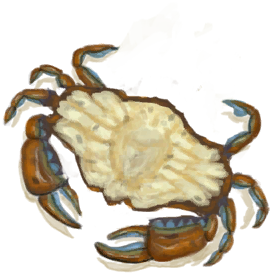

# “Salt can be added. ”  

<a href="BatCooked.md" style="color:black">Roasted Bat</a>

<a href="BirdMeatCooked.md" style="color:black">Cooked Bird Meat</a>

<a href="BirdMeatSmoked.md" style="color:black">Smoked Bird Meat</a>

<a href="BoarMeatCooked.md" style="color:black">Cooked Boar Meat</a>

<a href="BoarMeatSmoked.md" style="color:black">Smoked Boar Meat</a>

<a href="BonefishCooked.md" style="color:black">Cooked Bonefish</a>

<a href="BonefishSmoked.md" style="color:black">Smoked Bonefish</a>

<a href="Butter.md" style="color:black">Butter</a>

<a href="Cheese.md" style="color:black">Goat Cheese</a>

<a href="ChickenSandwich.md" style="color:black">Chicken Sandwich</a>

<a href="ConchMeatCooked.md" style="color:black">Cooked Conch Meat</a>

<a href="ConchMeatSoftCooked.md" style="color:black">Cooked Soft Conch Meat</a>

<a href="BoneBroth.md" style="color:black">Bone Broth</a>

<a href="ButterBakedOystersCooked.md" style="color:black">Butter Baked Oysters</a>

<a href="CoconutFish.md" style="color:black">Coconut Fish</a>

<a href="DrunkenCrab.md" style="color:black">Drunken Crab</a>

<a href="EggFriedRice.md" style="color:black">Egg Fried Rice</a>

<a href="FishNChips.md" style="color:black">Fish N' Chips</a>

<a href="FishOmelette.md" style="color:black">Fish Omelette</a>

<a href="FriedPuffballs.md" style="color:black">Fried Puffballs</a>

<a href="GoatStew.md" style="color:black">Goat Stew</a>

<a href="HeartyFeast.md" style="color:black">Hearty Feast</a>

<a href="HoneyGlazedPork.md" style="color:black">Honey Glazed Pork</a>

<a href="IslandChicken.md" style="color:black">Island Chicken</a>

<a href="JungleSalad.md" style="color:black">Jungle Salad</a>

<a href="LizardFry.md" style="color:black">Lizard Fry</a>

<a href="MacaqueSkewers.md" style="color:black">Macaque Skewers</a>

<a href="SeafoodCup.md" style="color:black">Seafood Cup</a>

<a href="YamCurry.md" style="color:black">Yam Curry</a>

<a href="CrabCooked.md" style="color:black">Cooked Crab</a>

<a href="EggBoiled.md" style="color:black">Boiled Egg</a>

<a href="EggCooked.md" style="color:black">Roasted Egg</a>

<a href="FishTaco.md" style="color:black">Fish Taco</a>

<a href="FriedBanana.md" style="color:black">Fried Banana</a>

<a href="GoatMeatCooked.md" style="color:black">Cooked Goat Meat</a>

<a href="GoatMeatSmoked.md" style="color:black">Smoked Goat Meat</a>

<a href="GoatfishCooked.md" style="color:black">Cooked Goatfish</a>

<a href="GoatfishSmoked.md" style="color:black">Smoked Goatfish</a>

<a href="GrouperMeatCooked.md" style="color:black">Cooked Grouper</a>

<a href="GrouperMeatSmoked.md" style="color:black">Smoked Grouper</a>

<a href="HerringCooked.md" style="color:black">Cooked Herring</a>

<a href="HerringSmoked.md" style="color:black">Smoked Herring</a>

<a href="LizardCooked.md" style="color:black">Roasted Lizard</a>

<a href="MacaqueMeatCooked.md" style="color:black">Cooked Macaque Meat</a>

<a href="MacaqueMeatSmoked.md" style="color:black">Smoked Macaque Meat</a>

<a href="MonitorMeatCooked.md" style="color:black">Cooked Lizard Meat</a>

<a href="MonitorMeatSmoked.md" style="color:black">Smoked Lizard Meat</a>

<a href="MouseCooked.md" style="color:black">Roasted Mouse</a>

<a href="MudskipperCooked.md" style="color:black">Roasted Mudskipper</a>

<a href="OysterMeatCooked.md" style="color:black">Cooked Oyster</a>

<a href="ParrotFishCooked.md" style="color:black">Cooked Parrot Fish</a>

<a href="ParrotFishSmoked.md" style="color:black">Smoked Parrot Fish</a>

<a href="ProteinBar.md" style="color:black">Protein Bar</a>

<a href="RiceCooked.md" style="color:black">Rice</a>

<a href="SagoFlatbread.md" style="color:black">Sago Flatbread</a>

<a href="SagoSlime.md" style="color:black">Sago Slime</a>

<a href="SeahoundCooked.md" style="color:black">Cooked Seahound</a>

<a href="SharkCooked.md" style="color:black">Cooked Shark</a>

<a href="SharkSmoked.md" style="color:black">Smoked Shark</a>

<a href="SnakeCooked.md" style="color:black">Cooked Snake Meat</a>

<a href="Sushi.md" style="color:black">Sushi</a>

<a href="ThreadfinCooked.md" style="color:black">Cooked Threadfin</a>

<a href="ThreadfinSmoked.md" style="color:black">Smoked Threadfin</a>

<a href="UrchinMeatCooked.md" style="color:black">Cooked Urchin</a>

<a href="YamBoiled.md" style="color:black">Boiled Yam</a>

  
  
## 影响动作  

<table><tr><td>[“EatingAction(Group)”](EatingAction.md)</td></tr<tr><td>** Require Durability：** 

: <b>1(100%)</b></td></tr<tr><td>[

[Morale](Morale.md)](Morale.md)<b>+8</b> [

[Sodium](Sodium.md)](Sodium.md)<b>+12</b></td></tr</table>
  

