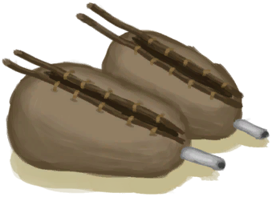
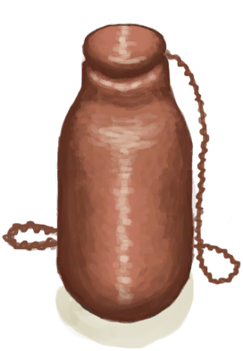
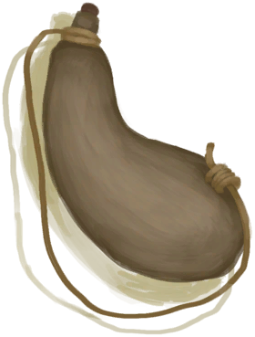
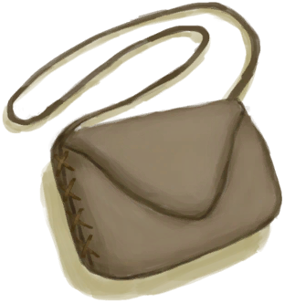

# “Satchel”  

<a href="Baby.md" style="color:black">Baby</a>

<a href="Bellows.md" style="color:black">Bellows</a>

<a href="CopperBottle.md" style="color:black">Copper Bottle</a>

<a href="Waterskin.md" style="color:black">Waterskin</a>

<a href="Satchel.md" style="color:black">Satchel</a>

<a href="SatchelHunter.md" style="color:black">Satchel</a>

  
  

