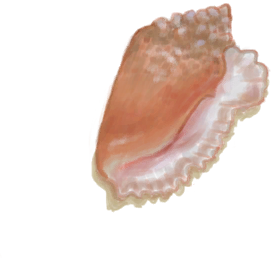
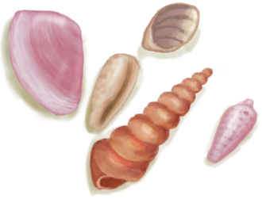

# “Seashell”  

<a href="Conch.md" style="color:black">Conch</a>

<a href="ConchBroken.md" style="color:black">Crushed Conch</a>

<a href="SeashellsPretty.md" style="color:black">Pretty Seashells</a>

  
  

