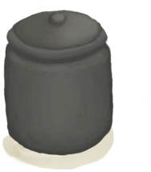
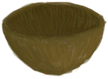

# “Spillable”  

<a href="ClayBowl.md" style="color:black">Clay Bowl</a>

<a href="ClayJar.md" style="color:black">Clay Jar</a>

<a href="ClayVase.md" style="color:black">Clay Vase</a>

<a href="ClayVaseUnfired.md" style="color:black">Unfired Clay Vase</a>

<a href="CoconutShell.md" style="color:black">Coconut Shell</a>

<a href="CookingPot.md" style="color:black">Cooking Pot</a>

<a href="CopperJar.md" style="color:black">Copper Jar</a>

<a href="GlazedVase.md" style="color:black">Glazed Vase</a>

<a href="GlazedVaseUnfired.md" style="color:black">Unfired Glazed Vase</a>

  
  

