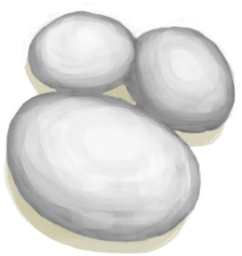

# “Medium Sugars”  

<a href="Banana.md" style="color:black">Banana</a>

<a href="CandiedGinger.md" style="color:black">Candied Ginger</a>

<a href="Chilies.md" style="color:black">Chillies</a>

<a href="ChiliesDried.md" style="color:black">Dried Chilies</a>

<a href="CoconutMeat.md" style="color:black">Coconut Meat</a>

<a href="CoconutMeatCooked.md" style="color:black">Roasted Coconut Meat</a>

<a href="CoffeeBerries.md" style="color:black">Coffee Berries</a>

<a href="CoffeeBerryPulp.md" style="color:black">Coffee Berry Pulp</a>

<a href="Ginger.md" style="color:black">Ginger</a>

<a href="GingerDried.md" style="color:black">Dried Ginger</a>

<a href="GingerGround.md" style="color:black">Ground Ginger</a>

<a href="JujubeFruits.md" style="color:black">Jujube Fruits</a>

<a href="KavaRoot.md" style="color:black">Kava Root</a>

<a href="KavaRootDried.md" style="color:black">Dried Kava Root</a>

<a href="KavaRootGround.md" style="color:black">Ground Kava Root</a>

<a href="Mango.md" style="color:black">Mango</a>

<a href="NipaSeeds.md" style="color:black">Nipa Seeds</a>

<a href="Puffballs.md" style="color:black">Puffballs</a>

<a href="RiceCooked.md" style="color:black">Rice</a>

<a href="RiceGrains.md" style="color:black">Rice Grain</a>

<a href="SagoFlatbread.md" style="color:black">Sago Flatbread</a>

<a href="SagoFlour.md" style="color:black">Sago Flour</a>

<a href="SagoPulp.md" style="color:black">Sago Pulp</a>

<a href="SagoSawdust.md" style="color:black">Sago Sawdust</a>

<a href="SagoSlime.md" style="color:black">Sago Slime</a>

<a href="Seaweed.md" style="color:black">Seaweed</a>

<a href="TropicalAlmondKernels.md" style="color:black">Tropical Almond Kernels</a>

<a href="TropicalAlmondsRoasted.md" style="color:black">Roasted Tropical Almond</a>

<a href="YamCut.md" style="color:black">Cut Yam</a>

  
  

