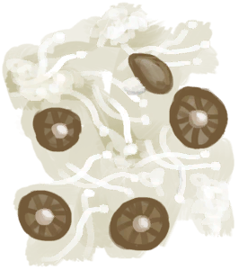
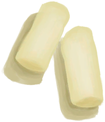
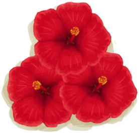
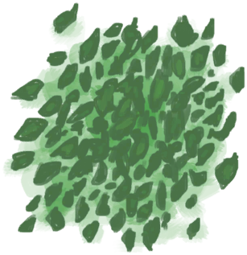
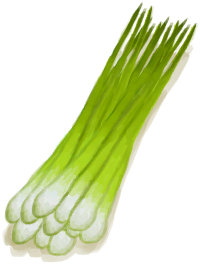
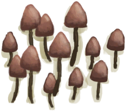
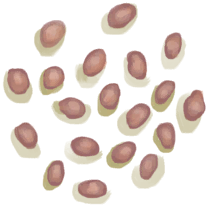

# “Poor Sugars”  

<a href="AssortedMushrooms.md" style="color:black">Assorted Mushrooms</a>

<a href="BananaStem.md" style="color:black">Banana Stem</a>

<a href="ChinaRoseFlowers.md" style="color:black">China Rose</a>

<a href="JasmineFlowers.md" style="color:black">Jasmine Flowers</a>

<a href="JasmineFlowersGround.md" style="color:black">Ground Jasmine Flowers</a>

<a href="LemonGrassGround.md" style="color:black">Ground Lemongrass</a>

<a href="LemongrassStalks.md" style="color:black">Lemongrass</a>

<a href="MagicMushrooms.md" style="color:black">Magic Mushrooms</a>

<a href="SnakeGrass.md" style="color:black">Snake Grass</a>

<a href="SnakeGrassGround.md" style="color:black">Ground Snake Grass</a>

<a href="PalmBushSeeds.md" style="color:black">Palm Bush Seeds</a>

<a href="SagoSeeds.md" style="color:black">Sago Seeds</a>

<a href="SnakegrassSeeds.md" style="color:black">Snakegrass Seeds</a>

  
  

