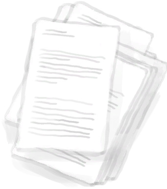

# “Tinder”  

<a href="Feathers.md" style="color:black">Feathers</a>

<a href="Fibers.md" style="color:black">Fibers</a>

<a href="LeavesDry.md" style="color:black">Dry Leaves</a>

<a href="Nest.md" style="color:black">Nest</a>

<a href="Papers.md" style="color:black">Papers</a>

<a href="WoodShavings.md" style="color:black">Wood Shavings</a>

  
  

