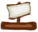
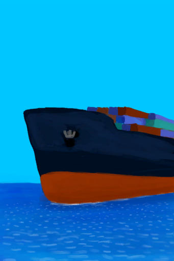
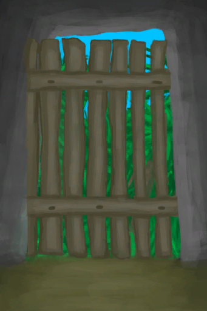

# Trigger  

<table><tr style="background-color:#F8F8F8"><td><b>Death</b></td></tr><tr><td><b>Trigger：</b>[

[Hydration ](Hydration.md)](Hydration.md): <b>0-0</b></td></tr></table>
  

<table><tr style="background-color:#F8F8F8"><td><b>Death</b></td></tr><tr><td><b>Trigger：</b>[

[Hypothermia](Hypothermia.md)](Hypothermia.md): <b>100-100</b></td></tr><tr><td>[

[Death(Event)](Event_DeathHypothermia.md)](Event_DeathHypothermia.md)(<b>+1</b>)</td></tr></table>
  

<table><tr style="background-color:#F8F8F8"><td><b>Death</b></td></tr><tr><td><b>Trigger：</b>[

[Weight](Weight.md)](Weight.md): <b>0-0</b></td></tr><tr><td>[

[Death(Event)](Event_DeathNutrition.md)](Event_DeathNutrition.md)(<b>+1</b>)</td></tr></table>
  

<table><tr style="background-color:#F8F8F8"><td><b>Destination Reached</b></td></tr><tr><td><b>Trigger：</b>[

[Distance](Distance.md)](Distance.md): <b>2016-2016</b></td></tr><tr><td><b>Effect：</b>[Sleep Interrupt](SleepInterrupt.md)<b>+1</b></td></tr><tr><td>[

[Ship Incoming!(Event)](Event_ShipRescueDistance.md)](Event_ShipRescueDistance.md)(<b>+1</b>)</td></tr></table>
  

<table><tr style="background-color:#F8F8F8"><td><b>Rocks Explored</b></td></tr><tr><td><b>Trigger：</b></td></tr><tr><td>[

[Cave(Event)(Rocks)](Event_CaveFound.md)](Event_CaveFound.md)(<b>+0</b>)</td></tr></table>
  

<table><tr style="background-color:#F8F8F8"><td><b>Sea Explored</b></td></tr><tr><td><b>Trigger：</b>[Exploration Rocks](Exploration_Rocks.md): <b>20-20</b></td></tr><tr><td>[

[Shipwreck(Event)](Event_ShipwreckFound.md)](Event_ShipwreckFound.md)(<b>+0</b>)</td></tr></table>
  

<table><tr style="background-color:#F8F8F8"><td><b>Faint</b></td></tr><tr><td><b>Trigger：</b>[

[Stamina](Stamina.md)](Stamina.md): <b>0-0</b>, [Faint Counter](FaintCounter.md): <b>0-0</b></td></tr><tr><td><b>Effect：</b>[Faint Counter](FaintCounter.md)<b>+33</b></td></tr><tr><td>[

[You Pass Out(Event)](Event_FaintExhaustion.md)](Event_FaintExhaustion.md)(<b>+1</b>)</td></tr></table>
  

<table><tr style="background-color:#F8F8F8"><td><b>A skeleton!</b></td></tr><tr><td><b>Trigger：</b>[

[Satiation](Satiation.md)](Satiation.md): <b>0-1000</b>, [

[Skeleton(Hole)](Skeleton.md)](Skeleton.md) On Hand/Board</td></tr><tr><td>[

[A Skeleton!(Event)(Hole)](Event_SkeletonSeen.md)](Event_SkeletonSeen.md)(<b>+1</b>)</td></tr></table>
  

<table><tr style="background-color:#F8F8F8"><td><b>Death</b></td></tr><tr><td><b>Trigger：</b>[

[TV Lives](TV_Lives.md)](TV_Lives.md): <b>0-0</b></td></tr><tr><td>[

[Collar Damage!(Event)](Event_TVNerveDamageDead.md)](Event_TVNerveDamageDead.md)(<b>+1</b>)</td></tr></table>
  

<table><tr style="background-color:#F8F8F8"><td><b>TV Reset</b></td></tr><tr><td><b>Trigger：</b>[

[TV Lives](TV_Lives.md)](TV_Lives.md): <b>1-1</b></td></tr><tr><td>[

[Collar Damage!(Event)](Event_TVNerveDamageLegs.md)](Event_TVNerveDamageLegs.md)(<b>+1</b>)</td></tr></table>
  

<table><tr style="background-color:#F8F8F8"><td><b>TV Reset</b></td></tr><tr><td><b>Trigger：</b>[

[TV Lives](TV_Lives.md)](TV_Lives.md): <b>2-2</b></td></tr><tr><td>[

[Collar Damage!(Event)](Event_TVNerveDamageHands.md)](Event_TVNerveDamageHands.md)(<b>+1</b>)</td></tr></table>
  

<table><tr style="background-color:#F8F8F8"><td><b>TV Manager</b></td></tr><tr><td><b>Trigger：</b>[

[TV - Wait](TV_CounterWait.md)](TV_CounterWait.md): <b>288-288</b></td></tr><tr><td><b>Effect：</b>[TV Crate Killer](TV_CrateKiller.md)<b>-1</b></td></tr><tr><td>

<table style="margin-bottom:3px;"><tr><td rowspan=2 style="text-align:center" width="80px">
Base Weight

1
</td><td style="font-size:0.6em;line-height:0.6em;font-weight:bold">Jungle</td></tr><tr><td>[

[Capsule Dropped - Jungle(Event)](Event_TVPackageJungle.md)](Event_TVPackageJungle.md)(<b>+1</b>)[

[TV Jungle](TV_Jungle.md)](TV_Jungle.md)<b>+1</b> [TV Jungle - Explore](TV_JungleExplore.md)<b>-20</b> [

[TV - Package Timer](TV_CounterRush.md)](TV_CounterRush.md)<b>-288</b></td></tr><tr><td colspan=2><li>[TV Stage](TV_Stage.md) in <b>0～7</b>, weight<b>-1</b></li></td></tr></table>

<table style="margin-bottom:3px;"><tr><td rowspan=2 style="text-align:center" width="80px">
Base Weight

1
</td><td style="font-size:0.6em;line-height:0.6em;font-weight:bold">Rocks</td></tr><tr><td>[

[Capsule Dropped - Rocks(Event)](Event_TVPackageRocks.md)](Event_TVPackageRocks.md)(<b>+1</b>)[

[TV Rocks](TV_Rocks.md)](TV_Rocks.md)<b>+1</b> [TV Rocks - Explore](TV_RocksExplore.md)<b>-20</b> [

[TV - Package Timer](TV_CounterRush.md)](TV_CounterRush.md)<b>-288</b></td></tr><tr><td colspan=2><li>[TV Stage](TV_Stage.md) in <b>0～7</b>, weight<b>-1</b></li></td></tr></table>

<table style="margin-bottom:3px;"><tr><td rowspan=2 style="text-align:center" width="80px">
Base Weight

1
</td><td style="font-size:0.6em;line-height:0.6em;font-weight:bold">Mangroves</td></tr><tr><td>[

[Capsule Dropped - Mangroves(Event)](Event_TVPackageMangroves.md)](Event_TVPackageMangroves.md)(<b>+1</b>)[

[TV Mangroves](TV_Mangroves.md)](TV_Mangroves.md)<b>+1</b> [TV Mangroves - Explore](TV_MangrovesExplore.md)<b>-20</b> [

[TV - Package Timer](TV_CounterRush.md)](TV_CounterRush.md)<b>-288</b></td></tr><tr><td colspan=2><li>[TV Stage](TV_Stage.md) in <b>0～7</b>, weight<b>-1</b></li></td></tr></table>

<table style="margin-bottom:3px;"><tr><td rowspan=2 style="text-align:center" width="80px">
Base Weight

1
</td><td style="font-size:0.6em;line-height:0.6em;font-weight:bold">Grasslands</td></tr><tr><td>[

[Capsule Dropped - Grasslands(Event)](Event_TVPackageGrasslands.md)](Event_TVPackageGrasslands.md)(<b>+1</b>)[

[TV Grasslands](TV_Grasslands.md)](TV_Grasslands.md)<b>+1</b> [TV Grasslands - Explore](TV_GrasslandsExplore.md)<b>-20</b> [

[TV - Package Timer](TV_CounterRush.md)](TV_CounterRush.md)<b>-288</b></td></tr><tr><td colspan=2><li>[TV Stage](TV_Stage.md) in <b>0～7</b>, weight<b>-1</b></li></td></tr></table>

<table style="margin-bottom:3px;"><tr><td rowspan=2 style="text-align:center" width="80px">
Base Weight

1
</td><td style="font-size:0.6em;line-height:0.6em;font-weight:bold">Highlands</td></tr><tr><td>[

[Capsule Dropped - Highlands(Event)](Event_TVPackageHighlands.md)](Event_TVPackageHighlands.md)(<b>+1</b>)[

[TV Highlands](TV_Highlands.md)](TV_Highlands.md)<b>+1</b> [TV Highlands - Explore](TV_HighlandsExplore.md)<b>-20</b> [

[TV - Package Timer](TV_CounterRush.md)](TV_CounterRush.md)<b>-288</b></td></tr><tr><td colspan=2><li>[TV Stage](TV_Stage.md) in <b>0～7</b>, weight<b>-1</b></li></td></tr></table>

<table style="margin-bottom:3px;"><tr><td rowspan=2 style="text-align:center" width="80px">
Base Weight

0
</td><td style="font-size:0.6em;line-height:0.6em;font-weight:bold">Highlands Victory</td></tr><tr><td>[

[Capsule Dropped - Highlands(Event)](Event_TVPackageHighlands.md)](Event_TVPackageHighlands.md)(<b>+1</b>)[

[TV Highlands](TV_Highlands.md)](TV_Highlands.md)<b>+1</b> [TV Highlands - Explore](TV_HighlandsExplore.md)<b>-20</b> [

[TV - Package Timer](TV_CounterRush.md)](TV_CounterRush.md)<b>-288</b></td></tr><tr><td colspan=2><li>[TV Stage](TV_Stage.md) in <b>8</b>, weight<b>+10000</b></li></td></tr></table>

</td></tr></table>
  

<table><tr style="background-color:#F8F8F8"><td><b>TV Reset</b></td></tr><tr><td><b>Trigger：</b>[

[TV - Package Timer](TV_CounterRush.md)](TV_CounterRush.md): <b>288-288</b></td></tr><tr><td>[

[TV - Wait](TV_CounterWait.md)](TV_CounterWait.md)<b>-287</b> [

[TV Lives](TV_Lives.md)](TV_Lives.md)<b>-1</b> [TV Crate Killer](TV_CrateKiller.md)<b>+1</b> [TV Stage](TV_Stage.md)<b>+1</b> [

[TV Highlands](TV_Highlands.md)](TV_Highlands.md)<b>-1</b> [

[TV Jungle](TV_Jungle.md)](TV_Jungle.md)<b>-1</b> [

[TV Mangroves](TV_Mangroves.md)](TV_Mangroves.md)<b>-1</b> [

[TV Rocks](TV_Rocks.md)](TV_Rocks.md)<b>-1</b></td></tr></table>
  

<table><tr style="background-color:#F8F8F8"><td><b>Victory!!</b></td></tr><tr><td><b>Trigger：</b>[TV Stage](TV_Stage.md): <b>10-10</b></td></tr></table>
  

<table><tr style="background-color:#F8F8F8"><td><b>An Alien Growth!</b></td></tr><tr><td><b>Trigger：</b>[Alien Spores](AlienSpores.md): <b>288-288</b></td></tr><tr><td><b>Effect：</b>[Alien Spores](AlienSpores.md)<b>-288</b></td></tr><tr><td>[

[Alien Growth](AlienGrowthCleared.md)](AlienGrowthCleared.md)(<b>+1</b>)</td></tr></table>
  

<table><tr style="background-color:#F8F8F8"><td><b>Depression</b></td></tr><tr><td><b>Trigger：</b>[

[Stress](Stress.md)](Stress.md): <b>240-240</b>, [Anxiety Counter](AnxietyCounter.md): <b>0-0</b></td></tr><tr><td><b>Effect：</b>[Anxiety Counter](AnxietyCounter.md)<b>+96</b></td></tr><tr><td>[

[Anxiety is getting out of control!(Event)](Event_AnxietyAttack.md)](Event_AnxietyAttack.md)(<b>+1</b>)</td></tr></table>
  

<table><tr style="background-color:#F8F8F8"><td><b>A Wild Boar!</b></td></tr><tr><td><b>Trigger：</b>[Boar Raid Counter](BoarRaidCounter.md): <b>192-192</b>, ~~In [

[Enclosure(Environment)](Env_Enclosure.md)](Env_Enclosure.md)~~, ~~In [

[Raft(Environment)](Env_Raft.md)](Env_Raft.md)~~, ~~[

[Door](Imp_Door.md)](Imp_Door.md) On Hand/Board~~, [“Feed”](tag_Feed.md) On Board, [“Shallow Water”](tag_BoarTerritory.md) On Hand/Board</td></tr><tr><td><b>Effect：</b>[Boar Raid Counter](BoarRaidCounter.md)<b>-192</b></td></tr><tr><td>

<table style="margin-bottom:3px;"><tr><td rowspan=2 style="text-align:center" width="80px">
Base Weight

50
</td><td style="font-size:0.6em;line-height:0.6em;font-weight:bold">Nothing</td></tr><tr><td></td></tr></table>

<table style="margin-bottom:3px;"><tr><td rowspan=2 style="text-align:center" width="80px">
Base Weight

0
</td><td style="font-size:0.6em;line-height:0.6em;font-weight:bold">Wild Boar Raiding</td></tr><tr><td>[

[A wild Boar!(Event)](Event_BoarFightRaid.md)](Event_BoarFightRaid.md)(<b>+1</b>)</td></tr><tr><td colspan=2><li>[First Month Counter](FirstMonthCounter.md) in <b>0～5759</b>, weight<b>-1000</b></li><li>[Population Boars](Pop_Boar.md) in <b>0</b>, weight<b>-1000</b></li><li>[Population Boars](Pop_Boar.md) in <b>0～14000</b>, weight<b>-250～+0</b></li><li>[“Feed”](tag_Feed.md) On *Hand/Board*，Weight<b>+10</b>(Stackable),</li><li>[“Crop”](tag_Crop.md) On *Hand/Board*，Weight<b>+100</b>(Stackable),</li><li>[

[Wild Yam](YamPlant.md)](YamPlant.md) On *Hand/Board*，Weight<b>+50</b>(Stackable),</li></td></tr></table>

</td></tr></table>
  

<table><tr style="background-color:#F8F8F8"><td><b>Weston Special Talk 1</b></td></tr><tr><td><b>Trigger：</b>[Captain Propinquity](CaptainPropinquity.md): <b>2000-3000</b>, [Sleep Clock](SleepClock.md): <b>1-999</b></td></tr><tr><td><b>Effect：</b>[Sleep Interrupt](SleepInterrupt.md)<b>+1</b></td></tr><tr><td>[

[Captain(Special1a)(Event)](Event_CaptainSpecial1a.md)](Event_CaptainSpecial1a.md)(<b>+1</b>)</td></tr></table>
  

<table><tr style="background-color:#F8F8F8"><td><b>Birth</b></td></tr><tr><td><b>Trigger：</b>[

[Pregnancy](Pregnancy.md)](Pregnancy.md): <b>8640-8640</b></td></tr></table>
  

<table><tr style="background-color:#F8F8F8"><td><b>Vomit</b></td></tr><tr><td><b>Trigger：</b>[

[Nausea](Nausea.md)](Nausea.md): <b>20-24</b>, [Vomit Counter](VomitCounter.md): <b>0-0</b></td></tr><tr><td><b>Effect：</b>[Vomit Counter](VomitCounter.md)<b>+4</b></td></tr><tr><td>[

[Vomit!(Event)](Event_Vomit.md)](Event_Vomit.md)(<b>+1</b>)</td></tr></table>
  

<table><tr style="background-color:#F8F8F8"><td><b>A Drone!</b></td></tr><tr><td><b>Trigger：</b>[Drone Raid Counter](DroneRaidCounter.md): <b>192-192</b>, [

[Sheltered](Sheltered.md)](Sheltered.md): <b>0-0</b>, ~~In [

[Enclosure(Environment)](Env_Enclosure.md)](Env_Enclosure.md)~~, ~~In [

[Raft(Environment)](Env_Raft.md)](Env_Raft.md)~~</td></tr><tr><td><b>Effect：</b>[Drone Raid Counter](DroneRaidCounter.md)<b>-191</b></td></tr><tr><td>

<table style="margin-bottom:3px;"><tr><td rowspan=2 style="text-align:center" width="80px">
Base Weight

500
</td><td style="font-size:0.6em;line-height:0.6em;font-weight:bold">Nothing</td></tr><tr><td></td></tr><tr><td colspan=2><li>In [

[Outskirts(Environment)](Env_Outskirts.md)](Env_Outskirts.md)Weight<b>+100</b>,</li><li>In [

[Mangrove Forest(Environment)](Env_Mangroves.md)](Env_Mangroves.md)Weight<b>+175</b>,</li><li>In [

[Jungle(Environment)](Env_Jungle.md)](Env_Jungle.md)Weight<b>+250</b>,</li><li>In [

[Wetlands(Environment)](Env_Wetlands.md)](Env_Wetlands.md)Weight<b>+325</b>,</li><li>[

[Campfire](Campfire.md)](Campfire.md) On *Hand/Board*，Weight<b>-150</b>(Stackable),</li><li>[

[Clay Fire Pit](ClayFirePit.md)](ClayFirePit.md) On *Hand/Board*，Weight<b>-150</b>(Stackable),</li></td></tr></table>

<table style="margin-bottom:3px;"><tr><td rowspan=2 style="text-align:center" width="80px">
Base Weight

1000
</td><td style="font-size:0.6em;line-height:0.6em;font-weight:bold">Drone</td></tr><tr><td>[

[Attack Drone!(Event)](Event_DroneFight.md)](Event_DroneFight.md)(<b>+1</b>)</td></tr><tr><td colspan=2><li>[First Month Counter](FirstMonthCounter.md) in <b>0～1</b>, weight<b>-1000</b></li><li>[Island Drones](Pop_Drone.md) in <b>0～999</b>, weight<b>-1000</b></li><li>[Island Drones](Pop_Drone.md) in <b>1000～4000</b>, weight<b>-750～+0</b></li></td></tr></table>

</td></tr></table>
  

<table><tr style="background-color:#F8F8F8"><td><b>Faint</b></td></tr><tr><td><b>Trigger：</b>[

[Alcohol](Alcohol.md)](Alcohol.md): <b>64-70</b>, [Faint Counter](FaintCounter.md): <b>0-0</b></td></tr><tr><td><b>Effect：</b>[Faint Counter](FaintCounter.md)<b>+33</b></td></tr><tr><td>[

[You Pass Out(Event)](Event_FaintDizzy.md)](Event_FaintDizzy.md)(<b>+1</b>)</td></tr></table>
  

<table><tr style="background-color:#F8F8F8"><td><b>Fell Asleep</b></td></tr><tr><td><b>Trigger：</b>[

[Wakefulness](Wakefulness.md)](Wakefulness.md): <b>0-0</b></td></tr><tr><td>[

[You fell asleep!(Event)](Event_FallingAsleep.md)](Event_FallingAsleep.md)(<b>+1</b>)</td></tr></table>
  

<table><tr style="background-color:#F8F8F8"><td><b>God Experience</b></td></tr><tr><td><b>Trigger：</b>[

[Morale](Morale.md)](Morale.md): <b>350-350</b>, [

[Altered Mind State](MindState.md)](MindState.md): <b>150-300</b>, [

[God Insight](GodInsight.md)](GodInsight.md): <b>0-0</b>, [Pyscho Counter](PsychoCounter.md): <b>0-0</b></td></tr><tr><td><b>Effect：</b>[Pyscho Counter](PsychoCounter.md)<b>+96</b></td></tr><tr><td>[

[Divine Insight(Event)](Event_GodExperience1a.md)](Event_GodExperience1a.md)(<b>+1</b>)</td></tr></table>
  

<table><tr style="background-color:#F8F8F8"><td><b>Hunted Experience</b></td></tr><tr><td><b>Trigger：</b>[

[Hunter's Proximity](HuntersProximity.md)](HuntersProximity.md): <b>96-96</b>, [Pyscho Counter](PsychoCounter.md): <b>0-0</b>, [IsNight](IsNight.md): <b>1-1</b></td></tr><tr><td><b>Effect：</b>[Pyscho Counter](PsychoCounter.md)<b>+96</b>, [Sleep Interrupt](SleepInterrupt.md)<b>+1</b></td></tr><tr><td>[

[The Hunter is here(Event)](Event_HunterFight.md)](Event_HunterFight.md)(<b>+1</b>)</td></tr></table>
  

<table><tr style="background-color:#F8F8F8"><td><b>Watched Experience</b></td></tr><tr><td><b>Trigger：</b>[

[Isolation](Isolation.md)](Isolation.md): <b>2881-8640</b>, [

[Stress](Stress.md)](Stress.md): <b>193-240</b>, [

[Altered Mind State](MindState.md)](MindState.md): <b>150-300</b>, [Pyscho Counter](PsychoCounter.md): <b>0-0</b>, [

[Light](Light.md)](Light.md): <b>1-100</b></td></tr><tr><td><b>Effect：</b>[

[Hunter's Insight](HunterInsight.md)](HunterInsight.md)<b>+1</b>, [Pyscho Counter](PsychoCounter.md)<b>+96</b></td></tr></table>
  

<table><tr style="background-color:#F8F8F8"><td><b>A Macaque!!</b></td></tr><tr><td><b>Trigger：</b>[Macaque Raid Counter](MacaqueRaidCounter.md): <b>192-192</b>, ~~In [

[Mangrove Forest(Environment)](Env_Mangroves.md)](Env_Mangroves.md)~~, ~~[

[Door](Imp_Door.md)](Imp_Door.md) On Hand/Board~~, ~~In [

[Raft(Environment)](Env_Raft.md)](Env_Raft.md)~~, ~~In [

[Macaque Den(Environment)](Env_MacaqueDen.md)](Env_MacaqueDen.md)~~, ~~[“Cave System”](tag_EnvCaveSystem.md) On Hand/Board~~, [“Jungle”](tag_Jungle.md) On Hand/Board</td></tr><tr><td><b>Effect：</b>[Macaque Raid Counter](MacaqueRaidCounter.md)<b>-192</b></td></tr><tr><td>

<table style="margin-bottom:3px;"><tr><td rowspan=2 style="text-align:center" width="80px">
Base Weight

50
</td><td style="font-size:0.6em;line-height:0.6em;font-weight:bold">Nothing</td></tr><tr><td></td></tr></table>

<table style="margin-bottom:3px;"><tr><td rowspan=2 style="text-align:center" width="80px">
Base Weight

0
</td><td style="font-size:0.6em;line-height:0.6em;font-weight:bold">Macaque Raid</td></tr><tr><td>[

[A Macaque!(Event)](Event_MacaqueRaid.md)](Event_MacaqueRaid.md)(<b>+1</b>)</td></tr><tr><td colspan=2><li>[Counter](Counter.md) in <b>0～48</b>, weight<b>-1000</b></li><li>[Population Macaques](Pop_Macaque.md) in <b>0</b>, weight<b>-1000</b></li><li>[Population Macaques](Pop_Macaque.md) in <b>0～25000</b>, weight<b>-100～+0</b></li><li>[Macaque Fear](MacaqueFear.md) in <b>0～3000</b>, weight <b>+0～-1000</b></li><li>[“Feed”](tag_Feed.md) On *Board/Exclude Inventory*，Weight<b>+50</b>(Stackable),</li><li>[“Pretty”](tag_Pretty.md) On *Board/Exclude Inventory*，Weight<b>+25</b>(Stackable),</li><li>[“Decoration”](tag_Decoration.md) On *Board/Exclude Inventory*，Weight<b>+25</b>(Stackable),</li></td></tr></table>

<table style="margin-bottom:3px;"><tr><td rowspan=2 style="text-align:center" width="80px">
Base Weight

0
</td><td style="font-size:0.6em;line-height:0.6em;font-weight:bold">Macaque Crop Attack</td></tr><tr><td>[

[A Macaque!(Event)](Event_MacaqueRaid.md)](Event_MacaqueRaid.md)(<b>+1</b>)</td></tr><tr><td colspan=2><li>[First Month Counter](FirstMonthCounter.md) in <b>0～48</b>, weight<b>-1000</b></li><li>[Population Macaques](Pop_Macaque.md) in <b>0</b>, weight<b>-1000</b></li><li>[Population Macaques](Pop_Macaque.md) in <b>1000～25000</b>, weight<b>-150～+0</b></li><li>[Macaque Fear](MacaqueFear.md) in <b>0～2500</b>, weight <b>+0～-200</b></li><li>[“Crop”](tag_Crop.md) On *Hand/Board*，Weight<b>+25</b>(Stackable),</li></td></tr></table>

</td></tr></table>
  

<table><tr style="background-color:#F8F8F8"><td><b>A Monitor Lizard!</b></td></tr><tr><td><b>Trigger：</b>[Monitor Raid Counter](MonitorRaidCounter.md): <b>192-192</b>, ~~In [

[Enclosure(Environment)](Env_Enclosure.md)](Env_Enclosure.md)~~, ~~In [

[Raft(Environment)](Env_Raft.md)](Env_Raft.md)~~, ~~[

[Door](Imp_Door.md)](Imp_Door.md) On Hand/Board~~, [“Feed”](tag_Meat.md) On Board, [“Shallow Water”](tag_MonitorTerritory.md) On Hand/Board</td></tr><tr><td><b>Effect：</b>[Monitor Raid Counter](MonitorRaidCounter.md)<b>-192</b></td></tr><tr><td>

<table style="margin-bottom:3px;"><tr><td rowspan=2 style="text-align:center" width="80px">
Base Weight

50
</td><td style="font-size:0.6em;line-height:0.6em;font-weight:bold">Nothing</td></tr><tr><td></td></tr></table>

<table style="margin-bottom:3px;"><tr><td rowspan=2 style="text-align:center" width="80px">
Base Weight

0
</td><td style="font-size:0.6em;line-height:0.6em;font-weight:bold">Monitor</td></tr><tr><td>[

[A Monitor Lizard!(Event)](Event_MonitorRaid.md)](Event_MonitorRaid.md)(<b>+1</b>)</td></tr><tr><td colspan=2><li>[First Month Counter](FirstMonthCounter.md) in <b>0～5759</b>, weight<b>-1000</b></li><li>[Population Monitors](Pop_Monitor.md) in <b>0</b>, weight<b>-1000</b></li><li>[Population Monitors](Pop_Monitor.md) in <b>0～14000</b>, weight<b>-250～+0</b></li><li>[“Feed”](tag_Meat.md) On *Board*，Weight<b>+10</b>(Stackable),</li></td></tr></table>

</td></tr></table>
  

<table><tr style="background-color:#F8F8F8"><td><b>Mouse Damage!</b></td></tr><tr><td><b>Trigger：</b>[Mouse Raid Counter](MouseDamageCounter.md): <b>192-192</b>, [

[Distance](Distance.md)](Distance.md): <b>0-0</b>, ~~[

[Door](Imp_Door.md)](Imp_Door.md) On Hand/Board~~, ~~In [

[Bird Rock(Environment)](Env_BirdRock.md)](Env_BirdRock.md)~~, [“Feed”](tag_Feed.md) On Board/不在容器中</td></tr><tr><td><b>Effect：</b>[Mouse Raid Counter](MouseDamageCounter.md)<b>-192</b></td></tr><tr><td>

<table style="margin-bottom:3px;"><tr><td rowspan=2 style="text-align:center" width="80px">
Base Weight

50
</td><td style="font-size:0.6em;line-height:0.6em;font-weight:bold">Nothing</td></tr><tr><td></td></tr></table>

<table style="margin-bottom:3px;"><tr><td rowspan=2 style="text-align:center" width="80px">
Base Weight

0
</td><td style="font-size:0.6em;line-height:0.6em;font-weight:bold">Mouse</td></tr><tr><td>[

[Mouse Damage(Event)](Event_MouseDamage.md)](Event_MouseDamage.md)(<b>+1</b>)</td></tr><tr><td colspan=2><li>[First Month Counter](FirstMonthCounter.md) in <b>0～1344</b>, weight<b>-1000</b></li><li>[Population Mouse](Pop_Mouse.md) in <b>0</b>, weight<b>-1000</b>，否则权重-1000000</li><li>[Population Mouse](Pop_Mouse.md) in <b>0～100000</b>, weight <b>-150～+0</b></li><li>[“Feed”](tag_Feed.md) On *Board/Exclude Inventory*，Weight<b>+10</b>(Stackable),</li><li>[“Crop”](tag_Crop.md) On *Hand/Board*，Weight<b>+10</b>(Stackable),</li><li>[

[Dog Friend](DogFriend.md)](DogFriend.md) On *Hand/Board*，Weight<b>-100</b>(Stackable),</li></td></tr></table>

</td></tr></table>
  

<table><tr style="background-color:#F8F8F8"><td><b>Nightmare</b></td></tr><tr><td><b>Trigger：</b>[

[Stress](Stress.md)](Stress.md): <b>193-240</b>, [Sleep Clock](SleepClock.md): <b>1-14</b>, [Nightmare Counter](NightmareCounter.md): <b>0-0</b></td></tr><tr><td><b>Effect：</b>[Sleep Interrupt](SleepInterrupt.md)<b>+1</b>, [Nightmare Counter](NightmareCounter.md)<b>+36～+144</b></td></tr><tr><td>[

[Nightmare!(Event)](Event_Nightmare.md)](Event_Nightmare.md)(<b>+1</b>)</td></tr></table>
  

<table><tr style="background-color:#F8F8F8"><td><b>Pregnancy</b></td></tr><tr><td><b>Trigger：</b>[

[Pregnancy](Pregnancy.md)](Pregnancy.md): <b>8640-8640</b></td></tr><tr><td>[

[It's time!(Event)](Event_Pregnancy.md)](Event_Pregnancy.md)(<b>+1</b>)</td></tr></table>
  

<table><tr style="background-color:#F8F8F8"><td><b>Raft Event</b></td></tr><tr><td><b>Trigger：</b>[

[Distance](Distance.md)](Distance.md): <b>336-2016</b></td></tr><tr><td>

<table style="margin-bottom:3px;"><tr><td rowspan=2 style="text-align:center" width="80px">
Base Weight

5
</td><td style="font-size:0.6em;line-height:0.6em;font-weight:bold">Atoll</td></tr><tr><td>[

[Land Ahead!(Event)](Event_Raft_Atoll.md)](Event_Raft_Atoll.md)(<b>+1</b>)</td></tr></table>

<table style="margin-bottom:3px;"><tr><td rowspan=2 style="text-align:center" width="80px">
Base Weight

20
</td><td style="font-size:0.6em;line-height:0.6em;font-weight:bold">Shark</td></tr><tr><td>[

[A Shark!(Event)](Event_Raft_SharkVisitor.md)](Event_Raft_SharkVisitor.md)(<b>+1</b>)</td></tr></table>

<table style="margin-bottom:3px;"><tr><td rowspan=2 style="text-align:center" width="80px">
Base Weight

20
</td><td style="font-size:0.6em;line-height:0.6em;font-weight:bold">Debris</td></tr><tr><td>[

[Floating Debris!(Event)](Event_Raft_FloatingDebris.md)](Event_Raft_FloatingDebris.md)(<b>+1</b>)</td></tr></table>

<table style="margin-bottom:3px;"><tr><td rowspan=2 style="text-align:center" width="80px">
Base Weight

5
</td><td style="font-size:0.6em;line-height:0.6em;font-weight:bold">Ship</td></tr><tr><td>[

[A Passing Ship!(Event)](Event_Raft_PassingShip.md)](Event_Raft_PassingShip.md)(<b>+1</b>)</td></tr></table>

</td></tr></table>
  

<table><tr style="background-color:#F8F8F8"><td><b>Raft Event</b></td></tr><tr><td><b>Trigger：</b>[

[Distance](Distance.md)](Distance.md): <b>672-2016</b></td></tr><tr><td>

<table style="margin-bottom:3px;"><tr><td rowspan=2 style="text-align:center" width="80px">
Base Weight

10
</td><td style="font-size:0.6em;line-height:0.6em;font-weight:bold">Atoll</td></tr><tr><td>[

[Land Ahead!(Event)](Event_Raft_Atoll.md)](Event_Raft_Atoll.md)(<b>+1</b>)</td></tr></table>

<table style="margin-bottom:3px;"><tr><td rowspan=2 style="text-align:center" width="80px">
Base Weight

20
</td><td style="font-size:0.6em;line-height:0.6em;font-weight:bold">Shark</td></tr><tr><td>[

[A Shark!(Event)](Event_Raft_SharkVisitor.md)](Event_Raft_SharkVisitor.md)(<b>+1</b>)</td></tr></table>

<table style="margin-bottom:3px;"><tr><td rowspan=2 style="text-align:center" width="80px">
Base Weight

20
</td><td style="font-size:0.6em;line-height:0.6em;font-weight:bold">Debris</td></tr><tr><td>[

[Floating Debris!(Event)](Event_Raft_FloatingDebris.md)](Event_Raft_FloatingDebris.md)(<b>+1</b>)</td></tr></table>

<table style="margin-bottom:3px;"><tr><td rowspan=2 style="text-align:center" width="80px">
Base Weight

10
</td><td style="font-size:0.6em;line-height:0.6em;font-weight:bold">Ship</td></tr><tr><td>[

[A Passing Ship!(Event)](Event_Raft_PassingShip.md)](Event_Raft_PassingShip.md)(<b>+1</b>)</td></tr></table>

</td></tr></table>
  

<table><tr style="background-color:#F8F8F8"><td><b>Raft Event</b></td></tr><tr><td><b>Trigger：</b>[

[Distance](Distance.md)](Distance.md): <b>1008-2016</b></td></tr><tr><td>

<table style="margin-bottom:3px;"><tr><td rowspan=2 style="text-align:center" width="80px">
Base Weight

15
</td><td style="font-size:0.6em;line-height:0.6em;font-weight:bold">Atoll</td></tr><tr><td>[

[Land Ahead!(Event)](Event_Raft_Atoll.md)](Event_Raft_Atoll.md)(<b>+1</b>)</td></tr></table>

<table style="margin-bottom:3px;"><tr><td rowspan=2 style="text-align:center" width="80px">
Base Weight

20
</td><td style="font-size:0.6em;line-height:0.6em;font-weight:bold">Shark</td></tr><tr><td>[

[A Shark!(Event)](Event_Raft_SharkVisitor.md)](Event_Raft_SharkVisitor.md)(<b>+1</b>)</td></tr></table>

<table style="margin-bottom:3px;"><tr><td rowspan=2 style="text-align:center" width="80px">
Base Weight

20
</td><td style="font-size:0.6em;line-height:0.6em;font-weight:bold">Debris</td></tr><tr><td>[

[Floating Debris!(Event)](Event_Raft_FloatingDebris.md)](Event_Raft_FloatingDebris.md)(<b>+1</b>)</td></tr></table>

<table style="margin-bottom:3px;"><tr><td rowspan=2 style="text-align:center" width="80px">
Base Weight

15
</td><td style="font-size:0.6em;line-height:0.6em;font-weight:bold">Ship</td></tr><tr><td>[

[A Passing Ship!(Event)](Event_Raft_PassingShip.md)](Event_Raft_PassingShip.md)(<b>+1</b>)</td></tr></table>

</td></tr></table>
  

<table><tr style="background-color:#F8F8F8"><td><b>Raft Event</b></td></tr><tr><td><b>Trigger：</b>[

[Distance](Distance.md)](Distance.md): <b>1344-2016</b></td></tr><tr><td>

<table style="margin-bottom:3px;"><tr><td rowspan=2 style="text-align:center" width="80px">
Base Weight

15
</td><td style="font-size:0.6em;line-height:0.6em;font-weight:bold">Atoll</td></tr><tr><td>[

[Land Ahead!(Event)](Event_Raft_Atoll.md)](Event_Raft_Atoll.md)(<b>+1</b>)</td></tr></table>

<table style="margin-bottom:3px;"><tr><td rowspan=2 style="text-align:center" width="80px">
Base Weight

20
</td><td style="font-size:0.6em;line-height:0.6em;font-weight:bold">Shark</td></tr><tr><td>[

[A Shark!(Event)](Event_Raft_SharkVisitor.md)](Event_Raft_SharkVisitor.md)(<b>+1</b>)</td></tr></table>

<table style="margin-bottom:3px;"><tr><td rowspan=2 style="text-align:center" width="80px">
Base Weight

20
</td><td style="font-size:0.6em;line-height:0.6em;font-weight:bold">Debris</td></tr><tr><td>[

[Floating Debris!(Event)](Event_Raft_FloatingDebris.md)](Event_Raft_FloatingDebris.md)(<b>+1</b>)</td></tr></table>

<table style="margin-bottom:3px;"><tr><td rowspan=2 style="text-align:center" width="80px">
Base Weight

20
</td><td style="font-size:0.6em;line-height:0.6em;font-weight:bold">Ship</td></tr><tr><td>[

[A Passing Ship!(Event)](Event_Raft_PassingShip.md)](Event_Raft_PassingShip.md)(<b>+1</b>)</td></tr></table>

</td></tr></table>
  

<table><tr style="background-color:#F8F8F8"><td><b>Raft Event</b></td></tr><tr><td><b>Trigger：</b>[

[Distance](Distance.md)](Distance.md): <b>1680-2016</b></td></tr><tr><td>

<table style="margin-bottom:3px;"><tr><td rowspan=2 style="text-align:center" width="80px">
Base Weight

15
</td><td style="font-size:0.6em;line-height:0.6em;font-weight:bold">Atoll</td></tr><tr><td>[

[Land Ahead!(Event)](Event_Raft_Atoll.md)](Event_Raft_Atoll.md)(<b>+1</b>)</td></tr></table>

<table style="margin-bottom:3px;"><tr><td rowspan=2 style="text-align:center" width="80px">
Base Weight

20
</td><td style="font-size:0.6em;line-height:0.6em;font-weight:bold">Shark</td></tr><tr><td>[

[A Shark!(Event)](Event_Raft_SharkVisitor.md)](Event_Raft_SharkVisitor.md)(<b>+1</b>)</td></tr></table>

<table style="margin-bottom:3px;"><tr><td rowspan=2 style="text-align:center" width="80px">
Base Weight

20
</td><td style="font-size:0.6em;line-height:0.6em;font-weight:bold">Debris</td></tr><tr><td>[

[Floating Debris!(Event)](Event_Raft_FloatingDebris.md)](Event_Raft_FloatingDebris.md)(<b>+1</b>)</td></tr></table>

<table style="margin-bottom:3px;"><tr><td rowspan=2 style="text-align:center" width="80px">
Base Weight

20
</td><td style="font-size:0.6em;line-height:0.6em;font-weight:bold">Ship</td></tr><tr><td>[

[A Passing Ship!(Event)](Event_Raft_PassingShip.md)](Event_Raft_PassingShip.md)(<b>+1</b>)</td></tr></table>

</td></tr></table>
  

<table><tr style="background-color:#F8F8F8"><td><b>A Sea Hound!</b></td></tr><tr><td><b>Trigger：</b>[Seahound Raid Counter](SeaHoundRaidCounter.md): <b>192-192</b>, [

[Sheltered](Sheltered.md)](Sheltered.md): <b>0-0</b>, ~~In [

[Enclosure(Environment)](Env_Enclosure.md)](Env_Enclosure.md)~~, ~~[

[Door](Imp_Door.md)](Imp_Door.md) On Hand/Board~~, [“Seagull Compatible”](tag_Coastal.md) On Hand/Board</td></tr><tr><td><b>Effect：</b>[Seahound Raid Counter](SeaHoundRaidCounter.md)<b>-191</b></td></tr><tr><td>

<table style="margin-bottom:3px;"><tr><td rowspan=2 style="text-align:center" width="80px">
Base Weight

100
</td><td style="font-size:0.6em;line-height:0.6em;font-weight:bold">Nothing</td></tr><tr><td></td></tr></table>

<table style="margin-bottom:3px;"><tr><td rowspan=2 style="text-align:center" width="80px">
Base Weight

0
</td><td style="font-size:0.6em;line-height:0.6em;font-weight:bold">Seahound</td></tr><tr><td>[

[A Seahound!(Event)](Event_SeahoundFight.md)](Event_SeahoundFight.md)(<b>+1</b>)</td></tr><tr><td colspan=2><li>[Counter](Counter.md) in <b>0～1920</b>, weight<b>-1000</b></li><li>[Seahounds](Pop_Seahounds.md) in <b>0～999</b>, weight<b>-1000</b></li><li>[Seahounds](Pop_Seahounds.md) in <b>1000～4000</b>, weight<b>+50～+500</b>，否则权重-1000000</li></td></tr></table>

</td></tr></table>
  

<table><tr style="background-color:#F8F8F8"><td><b>A Seagull!</b></td></tr><tr><td><b>Trigger：</b>[Seagull Raid Counter](SeagullRaidCounter.md): <b>192-192</b>, [

[Distance](Distance.md)](Distance.md): <b>0-500</b>, [

[Sheltered](Sheltered.md)](Sheltered.md): <b>0-0</b>, ~~[

[Door](Imp_Door.md)](Imp_Door.md) On Hand/Board~~, [“Feed”](tag_Feed.md) On Board/不在容器中, [“Seagull Compatible”](tag_Coastal.md) On Hand/Board</td></tr><tr><td><b>Effect：</b>[Seagull Raid Counter](SeagullRaidCounter.md)<b>-192</b></td></tr><tr><td>

<table style="margin-bottom:3px;"><tr><td rowspan=2 style="text-align:center" width="80px">
Base Weight

50
</td><td style="font-size:0.6em;line-height:0.6em;font-weight:bold">Nothing</td></tr><tr><td></td></tr></table>

<table style="margin-bottom:3px;"><tr><td rowspan=2 style="text-align:center" width="80px">
Base Weight

0
</td><td style="font-size:0.6em;line-height:0.6em;font-weight:bold">Seagull Raid</td></tr><tr><td>[

[A seagull!(Event)](Event_SeagullRaid.md)](Event_SeagullRaid.md)(<b>+1</b>)</td></tr><tr><td colspan=2><li>[First Month Counter](FirstMonthCounter.md) in <b>0～48</b>, weight<b>-1000</b></li><li>[Population Seagulls](Pop_Seagull.md) in <b>0</b>, weight<b>-1000</b></li><li>[Population Seagulls](Pop_Seagull.md) in <b>0～45000</b>, weight<b>-100～+0</b></li><li>[Seagull Fear](SeagullFear.md) in <b>0～10000</b>, weight <b>+0～-1000</b></li><li>[“Feed”](tag_Feed.md) On *Board/Exclude Inventory*，Weight<b>+50</b>(Stackable),</li></td></tr></table>

<table style="margin-bottom:3px;"><tr><td rowspan=2 style="text-align:center" width="80px">
Base Weight

0
</td><td style="font-size:0.6em;line-height:0.6em;font-weight:bold">Seagull Crop Attack</td></tr><tr><td>[

[A seagull!(Event)](Event_SeagullRaid.md)](Event_SeagullRaid.md)(<b>+1</b>)</td></tr><tr><td colspan=2><li>[First Month Counter](FirstMonthCounter.md) in <b>0～48</b>, weight<b>-1000</b></li><li>[Population Seagulls](Pop_Seagull.md) in <b>0</b>, weight<b>-1000</b></li><li>[Population Seagulls](Pop_Seagull.md) in <b>1000～45000</b>, weight<b>-150～+0</b></li><li>[Seagull Fear](SeagullFear.md) in <b>0～2500</b>, weight <b>+0～-200</b></li><li>[“Crop”](tag_Crop.md) On *Hand/Board*，Weight<b>+25</b>(Stackable),</li></td></tr></table>

</td></tr></table>
  

<table><tr style="background-color:#F8F8F8"><td><b>A Wild Boar!</b></td></tr><tr><td><b>Trigger：</b>[Seasons](Seasons.md): <b>8641-8641</b></td></tr><tr><td><b>Effect：</b>[Seasons](Seasons.md)<b>-8641</b></td></tr></table>
  

<table><tr style="background-color:#F8F8F8"><td><b>Spider</b></td></tr><tr><td><b>Trigger：</b>[SleepRisk](SleepRisk.md): <b>1-999</b>, [Sleep Clock](SleepClock.md): <b>2-14</b></td></tr><tr><td>

<table style="margin-bottom:3px;"><tr><td rowspan=2 style="text-align:center" width="80px">
Base Weight

100
</td><td style="font-size:0.6em;line-height:0.6em;font-weight:bold">No Spider</td></tr><tr><td></td></tr></table>

<table style="margin-bottom:3px;"><tr><td rowspan=2 style="text-align:center" width="80px">
Base Weight

0
</td><td style="font-size:0.6em;line-height:0.6em;font-weight:bold">Spider</td></tr><tr><td>[

[A Spider bit me!(Event)](Event_SpiderNight.md)](Event_SpiderNight.md)(<b>+1</b>)[Sleep Interrupt](SleepInterrupt.md)<b>+1</b></td></tr><tr><td colspan=2>Max 1 of：<li>[

[Jungle](Jungle.md)](Jungle.md) On *Hand/Board*，Weight<b>+10</b>,</li><li>[

[Wetland Jungle(Wetlands)](Wetlands.md)](Wetlands.md) On *Hand/Board*，Weight<b>+10</b>,</li><li>[

[Dark Cave](DarkCave.md)](DarkCave.md) On *Hand/Board*，Weight<b>+20</b>,</li><li>[

[Exit(Crashed Plane)](PlaneCrashExit.md)](PlaneCrashExit.md) On *Hand/Board*，Weight<b>+5</b>,</li><li>[

[Campfire](Campfire.md)](Campfire.md) On *Hand/Board*，Weight<b>-50</b>,</li><li>[

[Clay Fire Pit](ClayFirePit.md)](ClayFirePit.md) On *Hand/Board*，Weight<b>-50</b>,</li></td></tr></table>

</td></tr></table>
  

<table><tr style="background-color:#F8F8F8"><td><b>A storm!!</b></td></tr><tr><td><b>Trigger：</b>[Storm Counter](StormCounter.md): <b>6-6</b>, [

[Sheltered](Sheltered.md)](Sheltered.md): <b>0-0</b>, [“Seagull Compatible”](tag_Coastal.md) On Hand/Board</td></tr><tr><td><b>Effect：</b>[Storm Counter](StormCounter.md)<b>-5</b></td></tr><tr><td>[

[The wind is too strong!(Event)](Event_Storm.md)](Event_Storm.md)(<b>+1</b>)</td></tr></table>
  

<table><tr style="background-color:#F8F8F8"><td><b>Storm Damage!</b></td></tr><tr><td><b>Trigger：</b>[Storm Bay](Storm_Bay.md): <b>1-1</b>, ~~[

[Storm](TropicalIsland_Storm.md)](TropicalIsland_Storm.md) On Hand/Board~~, In [

[Bay(Environment)](Env_Bay.md)](Env_Bay.md)</td></tr><tr><td>[

[Storm Damage(Event)](Event_StormDamage.md)](Event_StormDamage.md)(<b>+1</b>)[Storm Bay](Storm_Bay.md)<b>-1</b></td></tr></table>
  

<table><tr style="background-color:#F8F8F8"><td><b>Storm Damage!</b></td></tr><tr><td><b>Trigger：</b>[Storm Beach](Storm_Beach.md): <b>1-1</b>, ~~[

[Storm](TropicalIsland_Storm.md)](TropicalIsland_Storm.md) On Hand/Board~~, In [

[Beach(Environment)](Env_Beach.md)](Env_Beach.md)</td></tr><tr><td>[

[Storm Damage(Event)](Event_StormDamage.md)](Event_StormDamage.md)(<b>+1</b>)[Storm Beach](Storm_Beach.md)<b>-1</b></td></tr></table>
  

<table><tr style="background-color:#F8F8F8"><td><b>Storm Damage!</b></td></tr><tr><td><b>Trigger：</b>[Storm Desolate Beach](Storm_DesolateBeach.md): <b>1-1</b>, ~~[

[Storm](TropicalIsland_Storm.md)](TropicalIsland_Storm.md) On Hand/Board~~, [

[Desolate Beach](DesolateBeach.md)](DesolateBeach.md) On Hand/Board</td></tr><tr><td>[

[Storm Damage(Event)](Event_StormDamage.md)](Event_StormDamage.md)(<b>+1</b>)[Storm Desolate Beach](Storm_DesolateBeach.md)<b>-1</b></td></tr></table>
  

<table><tr style="background-color:#F8F8F8"><td><b>Storm Damage!</b></td></tr><tr><td><b>Trigger：</b>[Storm Mangroves](Storm_Mangroves.md): <b>1-1</b>, ~~[

[Storm](TropicalIsland_Storm.md)](TropicalIsland_Storm.md) On Hand/Board~~, In [

[Mangrove Forest(Environment)](Env_Mangroves.md)](Env_Mangroves.md)</td></tr><tr><td>[

[Storm Damage(Event)](Event_StormDamage.md)](Event_StormDamage.md)(<b>+1</b>)[Storm Mangroves](Storm_Mangroves.md)<b>-1</b></td></tr></table>
  

<table><tr style="background-color:#F8F8F8"><td><b>Storm Damage!</b></td></tr><tr><td><b>Trigger：</b>[Storm Outskirts](Storm_Outskirts.md): <b>1-1</b>, ~~[

[Storm](TropicalIsland_Storm.md)](TropicalIsland_Storm.md) On Hand/Board~~, In [

[Outskirts(Environment)](Env_Outskirts.md)](Env_Outskirts.md)</td></tr><tr><td>[

[Storm Damage(Event)](Event_StormDamage.md)](Event_StormDamage.md)(<b>+1</b>)[Storm Outskirts](Storm_Outskirts.md)<b>-1</b></td></tr></table>
  

<table><tr style="background-color:#F8F8F8"><td><b>Storm Damage!</b></td></tr><tr><td><b>Trigger：</b>[Storm Rocks](Storm_Rocks.md): <b>1-1</b>, ~~[

[Storm](TropicalIsland_Storm.md)](TropicalIsland_Storm.md) On Hand/Board~~, In [

[Rocks(Environment)](Env_Rocks.md)](Env_Rocks.md)</td></tr><tr><td>[

[Storm Damage(Event)](Event_StormDamage.md)](Event_StormDamage.md)(<b>+1</b>)[Storm Rocks](Storm_Rocks.md)<b>-1</b></td></tr></table>
  

<table><tr style="background-color:#F8F8F8"><td><b>A wave!!</b></td></tr><tr><td><b>Trigger：</b>[WaveCounter](WaveCounter.md): <b>24-24</b>, [Sea Agitation](SeaAgitation.md): <b>4-5</b></td></tr><tr><td><b>Effect：</b>[WaveCounter](WaveCounter.md)<b>-24</b></td></tr><tr><td>[

[A huge wave strikes the raft!(Event)](Event_Wave.md)](Event_Wave.md)(<b>+1</b>)</td></tr></table>
  

<table><tr style="background-color:#F8F8F8"><td><b>Fake Reality</b></td></tr><tr><td><b>Trigger：</b>[

[Derealization](Derealization.md)](Derealization.md): <b>101-1000</b>, [

[Altered Mind State](MindState.md)](MindState.md): <b>150-300</b>, [

[Void Insight](VoidInsight.md)](VoidInsight.md): <b>0-0</b>, [Pyscho Counter](PsychoCounter.md): <b>0-0</b></td></tr><tr><td><b>Effect：</b>[Pyscho Counter](PsychoCounter.md)<b>+96</b></td></tr><tr><td>[

[Void Insight(Event)](Event_VoidExperience1a.md)](Event_VoidExperience1a.md)(<b>+1</b>)</td></tr></table>
  

<table><tr style="background-color:#F8F8F8"><td><b>Watched Experience</b></td></tr><tr><td><b>Trigger：</b>[

[Watcher's Glare](WatchersGlare.md)](WatchersGlare.md): <b>96-96</b>, [Pyscho Counter](PsychoCounter.md): <b>0-0</b></td></tr><tr><td><b>Effect：</b>[Pyscho Counter](PsychoCounter.md)<b>+96</b>, [Sleep Interrupt](SleepInterrupt.md)<b>+1</b></td></tr><tr><td>[

[Watcher(Event)](Event_WatchedExperience1a.md)](Event_WatchedExperience1a.md)(<b>+1</b>)</td></tr></table>
  

<table><tr style="background-color:#F8F8F8"><td><b>Watched Experience</b></td></tr><tr><td><b>Trigger：</b>[

[Isolation](Isolation.md)](Isolation.md): <b>2881-8640</b>, [

[Stress](Stress.md)](Stress.md): <b>193-240</b>, [

[Altered Mind State](MindState.md)](MindState.md): <b>150-300</b>, [Pyscho Counter](PsychoCounter.md): <b>0-0</b>, [

[Light](Light.md)](Light.md): <b>0-0</b></td></tr><tr><td><b>Effect：</b>[

[Watcher's Insight](WatcherInsight.md)](WatcherInsight.md)<b>+1</b>, [Pyscho Counter](PsychoCounter.md)<b>+96</b></td></tr></table>
  

<table><tr style="background-color:#F8F8F8"><td><b>Weston Special Talk 1</b></td></tr><tr><td><b>Trigger：</b>[Weston Propinquity](WestonPropinquity.md): <b>2000-3000</b>, [Sleep Clock](SleepClock.md): <b>1-999</b></td></tr><tr><td><b>Effect：</b>[Sleep Interrupt](SleepInterrupt.md)<b>+1</b></td></tr><tr><td>[

[Weston(Special1a)(Event)](Event_WestonSpecial1a.md)](Event_WestonSpecial1a.md)(<b>+1</b>)</td></tr></table>
  

<table><tr style="background-color:#F8F8F8"><td><b>Archery Improved!</b></td></tr><tr><td><b>Trigger：</b>[

[Archery(Skill)](Skill_Archery.md)](Skill_Archery.md): <b>10-150</b></td></tr><tr><td>[

[Archery Improved!(Event)](Event_SkillArchery1.md)](Event_SkillArchery1.md)(<b>+1</b>)</td></tr></table>
  

<table><tr style="background-color:#F8F8F8"><td><b>Archery Improved!</b></td></tr><tr><td><b>Trigger：</b>[

[Archery(Skill)](Skill_Archery.md)](Skill_Archery.md): <b>30-150</b></td></tr><tr><td>[

[Archery Improved!(Event)](Event_SkillArchery2.md)](Event_SkillArchery2.md)(<b>+1</b>)</td></tr></table>
  

<table><tr style="background-color:#F8F8F8"><td><b>Archery Improved!</b></td></tr><tr><td><b>Trigger：</b>[

[Archery(Skill)](Skill_Archery.md)](Skill_Archery.md): <b>70-150</b></td></tr><tr><td>[

[Archery Improved!(Event)](Event_SkillArchery3.md)](Event_SkillArchery3.md)(<b>+1</b>)</td></tr></table>
  

<table><tr style="background-color:#F8F8F8"><td><b>Archery Improved!</b></td></tr><tr><td><b>Trigger：</b>[

[Archery(Skill)](Skill_Archery.md)](Skill_Archery.md): <b>150-150</b></td></tr><tr><td>[

[Archery Improved!(Event)](Event_SkillArchery4.md)](Event_SkillArchery4.md)(<b>+1</b>)</td></tr></table>
  

<table><tr style="background-color:#F8F8F8"><td><b>Cooking Improved!</b></td></tr><tr><td><b>Trigger：</b>[

[Cooking(Skill)](Skill_Cooking.md)](Skill_Cooking.md): <b>10-150</b></td></tr><tr><td>[

[Cooking Improved!(Event)](Event_SkillCooking1.md)](Event_SkillCooking1.md)(<b>+1</b>)</td></tr></table>
  

<table><tr style="background-color:#F8F8F8"><td><b>Cooking Improved!</b></td></tr><tr><td><b>Trigger：</b>[

[Cooking(Skill)](Skill_Cooking.md)](Skill_Cooking.md): <b>30-150</b></td></tr><tr><td>[

[Cooking Improved!(Event)](Event_SkillCooking2.md)](Event_SkillCooking2.md)(<b>+1</b>)</td></tr></table>
  

<table><tr style="background-color:#F8F8F8"><td><b>Cooking Improved!</b></td></tr><tr><td><b>Trigger：</b>[

[Cooking(Skill)](Skill_Cooking.md)](Skill_Cooking.md): <b>70-150</b></td></tr><tr><td>[

[Cooking Improved!(Event)](Event_SkillCooking3.md)](Event_SkillCooking3.md)(<b>+1</b>)</td></tr></table>
  

<table><tr style="background-color:#F8F8F8"><td><b>Cooking Improved!</b></td></tr><tr><td><b>Trigger：</b>[

[Cooking(Skill)](Skill_Cooking.md)](Skill_Cooking.md): <b>150-150</b></td></tr><tr><td>[

[Cooking Improved!(Event)](Event_SkillCooking4.md)](Event_SkillCooking4.md)(<b>+1</b>)</td></tr></table>
  

<table><tr style="background-color:#F8F8F8"><td><b>Crafting Improved!</b></td></tr><tr><td><b>Trigger：</b>[

[Crafting(Skill)](Skill_Crafting.md)](Skill_Crafting.md): <b>10-150</b></td></tr><tr><td>[

[Crafting Improved!(Event)](Event_SkillCrafting1.md)](Event_SkillCrafting1.md)(<b>+1</b>)</td></tr></table>
  

<table><tr style="background-color:#F8F8F8"><td><b>Crafting Improved!</b></td></tr><tr><td><b>Trigger：</b>[

[Crafting(Skill)](Skill_Crafting.md)](Skill_Crafting.md): <b>30-150</b></td></tr><tr><td>[

[Crafting Improved!(Event)](Event_SkillCrafting2.md)](Event_SkillCrafting2.md)(<b>+1</b>)</td></tr></table>
  

<table><tr style="background-color:#F8F8F8"><td><b>Crafting Improved!</b></td></tr><tr><td><b>Trigger：</b>[

[Crafting(Skill)](Skill_Crafting.md)](Skill_Crafting.md): <b>70-150</b></td></tr><tr><td>[

[Crafting Improved!(Event)](Event_SkillCrafting3.md)](Event_SkillCrafting3.md)(<b>+1</b>)</td></tr></table>
  

<table><tr style="background-color:#F8F8F8"><td><b>Crafting Improved!</b></td></tr><tr><td><b>Trigger：</b>[

[Crafting(Skill)](Skill_Crafting.md)](Skill_Crafting.md): <b>150-150</b></td></tr><tr><td>[

[Crafting Improved!(Event)](Event_SkillCrafting4.md)](Event_SkillCrafting4.md)(<b>+1</b>)</td></tr></table>
  

<table><tr style="background-color:#F8F8F8"><td><b>Fishing Improved!</b></td></tr><tr><td><b>Trigger：</b>[

[Fishing(Skill)](Skill_Fishing.md)](Skill_Fishing.md): <b>10-150</b></td></tr><tr><td>[

[Fishing Improved!(Event)](Event_SkillFishing1.md)](Event_SkillFishing1.md)(<b>+1</b>)</td></tr></table>
  

<table><tr style="background-color:#F8F8F8"><td><b>Fishing Improved!</b></td></tr><tr><td><b>Trigger：</b>[

[Fishing(Skill)](Skill_Fishing.md)](Skill_Fishing.md): <b>30-150</b></td></tr><tr><td>[

[Fishing Improved!(Event)](Event_SkillFishing2.md)](Event_SkillFishing2.md)(<b>+1</b>)</td></tr></table>
  

<table><tr style="background-color:#F8F8F8"><td><b>Fishing Improved!</b></td></tr><tr><td><b>Trigger：</b>[

[Fishing(Skill)](Skill_Fishing.md)](Skill_Fishing.md): <b>70-150</b></td></tr><tr><td>[

[Fishing Improved!(Event)](Event_SkillFishing3.md)](Event_SkillFishing3.md)(<b>+1</b>)</td></tr></table>
  

<table><tr style="background-color:#F8F8F8"><td><b>Fishing Improved!</b></td></tr><tr><td><b>Trigger：</b>[

[Fishing(Skill)](Skill_Fishing.md)](Skill_Fishing.md): <b>150-150</b></td></tr><tr><td>[

[Fishing Improved!(Event)](Event_SkillFishing4.md)](Event_SkillFishing4.md)(<b>+1</b>)</td></tr></table>
  

<table><tr style="background-color:#F8F8F8"><td><b>Herbology Improved!</b></td></tr><tr><td><b>Trigger：</b>[

[Herbology(Skill)](Skill_Herbology.md)](Skill_Herbology.md): <b>10-150</b></td></tr><tr><td>[

[Herbology Improved!(Event)](Event_SkillHerbology1.md)](Event_SkillHerbology1.md)(<b>+1</b>)</td></tr></table>
  

<table><tr style="background-color:#F8F8F8"><td><b>Herbology Improved!</b></td></tr><tr><td><b>Trigger：</b>[

[Herbology(Skill)](Skill_Herbology.md)](Skill_Herbology.md): <b>30-150</b></td></tr><tr><td>[

[Herbology Improved!(Event)](Event_SkillHerbology2.md)](Event_SkillHerbology2.md)(<b>+1</b>)</td></tr></table>
  

<table><tr style="background-color:#F8F8F8"><td><b>Herbology Improved!</b></td></tr><tr><td><b>Trigger：</b>[

[Herbology(Skill)](Skill_Herbology.md)](Skill_Herbology.md): <b>70-150</b></td></tr><tr><td>[

[Herbology Improved!(Event)](Event_SkillHerbology3.md)](Event_SkillHerbology3.md)(<b>+1</b>)</td></tr></table>
  

<table><tr style="background-color:#F8F8F8"><td><b>Herbology Improved!</b></td></tr><tr><td><b>Trigger：</b>[

[Herbology(Skill)](Skill_Herbology.md)](Skill_Herbology.md): <b>150-150</b></td></tr><tr><td>[

[Herbology Improved!(Event)](Event_SkillHerbology4.md)](Event_SkillHerbology4.md)(<b>+1</b>)</td></tr></table>
  

<table><tr style="background-color:#F8F8F8"><td><b>Insight Improved!</b></td></tr><tr><td><b>Trigger：</b>[

[Thought Depth](ThoughtDepth.md)](ThoughtDepth.md): <b>25-100</b></td></tr><tr><td>[

[You had an epiphany!(Event)](Event_SkillInsight1.md)](Event_SkillInsight1.md)(<b>+1</b>)</td></tr></table>
  

<table><tr style="background-color:#F8F8F8"><td><b>Insight Improved!</b></td></tr><tr><td><b>Trigger：</b>[

[Thought Depth](ThoughtDepth.md)](ThoughtDepth.md): <b>50-100</b></td></tr><tr><td>[

[You had an epiphany!(Event)](Event_SkillInsight2.md)](Event_SkillInsight2.md)(<b>+1</b>)</td></tr></table>
  

<table><tr style="background-color:#F8F8F8"><td><b>Insight Improved!</b></td></tr><tr><td><b>Trigger：</b>[

[Insight(Skill)](Skill_Insight.md)](Skill_Insight.md): <b>75-100</b></td></tr><tr><td>[

[You had an epiphany!(Event)](Event_SkillInsight3.md)](Event_SkillInsight3.md)(<b>+1</b>)</td></tr></table>
  

<table><tr style="background-color:#F8F8F8"><td><b>Insight Improved!</b></td></tr><tr><td><b>Trigger：</b>[

[Insight(Skill)](Skill_Insight.md)](Skill_Insight.md): <b>100-100</b></td></tr><tr><td>[

[You had an epiphany!(Event)](Event_SkillInsight4.md)](Event_SkillInsight4.md)(<b>+1</b>)</td></tr></table>
  

<table><tr style="background-color:#F8F8F8"><td><b>Knapping Improved!</b></td></tr><tr><td><b>Trigger：</b>[

[Knapping(Skill)](Skill_Knapping.md)](Skill_Knapping.md): <b>10-150</b></td></tr><tr><td>[

[Knapping Improved!(Event)](Event_SkillKnapping1.md)](Event_SkillKnapping1.md)(<b>+1</b>)</td></tr></table>
  

<table><tr style="background-color:#F8F8F8"><td><b>Knapping Improved!</b></td></tr><tr><td><b>Trigger：</b>[

[Knapping(Skill)](Skill_Knapping.md)](Skill_Knapping.md): <b>30-150</b></td></tr><tr><td>[

[Knapping Improved!(Event)](Event_SkillKnapping2.md)](Event_SkillKnapping2.md)(<b>+1</b>)</td></tr></table>
  

<table><tr style="background-color:#F8F8F8"><td><b>Knapping Improved!</b></td></tr><tr><td><b>Trigger：</b>[

[Knapping(Skill)](Skill_Knapping.md)](Skill_Knapping.md): <b>70-150</b></td></tr><tr><td>[

[Knapping Improved!(Event)](Event_SkillKnapping3.md)](Event_SkillKnapping3.md)(<b>+1</b>)</td></tr></table>
  

<table><tr style="background-color:#F8F8F8"><td><b>Knapping Improved!</b></td></tr><tr><td><b>Trigger：</b>[

[Knapping(Skill)](Skill_Knapping.md)](Skill_Knapping.md): <b>150-150</b></td></tr><tr><td>[

[Knapping Improved!(Event)](Event_SkillKnapping4.md)](Event_SkillKnapping4.md)(<b>+1</b>)</td></tr></table>
  

<table><tr style="background-color:#F8F8F8"><td><b>Metalworking Improved!</b></td></tr><tr><td><b>Trigger：</b>[

[Metalworking(Skill)](Skill_Metalworking.md)](Skill_Metalworking.md): <b>10-150</b></td></tr><tr><td>[

[Metalworking Improved!(Event)](Event_SkillMetalworking1.md)](Event_SkillMetalworking1.md)(<b>+1</b>)</td></tr></table>
  

<table><tr style="background-color:#F8F8F8"><td><b>Metalworking Improved!</b></td></tr><tr><td><b>Trigger：</b>[

[Metalworking(Skill)](Skill_Metalworking.md)](Skill_Metalworking.md): <b>30-150</b></td></tr><tr><td>[

[Metalworking Improved!(Event)](Event_SkillMetalworking2.md)](Event_SkillMetalworking2.md)(<b>+1</b>)</td></tr></table>
  

<table><tr style="background-color:#F8F8F8"><td><b>Metalworking Improved!</b></td></tr><tr><td><b>Trigger：</b>[

[Metalworking(Skill)](Skill_Metalworking.md)](Skill_Metalworking.md): <b>70-150</b></td></tr><tr><td>[

[Crafting Improved!(Event)](Event_SkillMetalworking3.md)](Event_SkillMetalworking3.md)(<b>+1</b>)</td></tr></table>
  

<table><tr style="background-color:#F8F8F8"><td><b>Metalworking Improved!</b></td></tr><tr><td><b>Trigger：</b>[

[Metalworking(Skill)](Skill_Metalworking.md)](Skill_Metalworking.md): <b>150-150</b></td></tr><tr><td>[

[Metalworking Improved!(Event)](Event_SkillMetalworking4.md)](Event_SkillMetalworking4.md)(<b>+1</b>)</td></tr></table>
  

<table><tr style="background-color:#F8F8F8"><td><b>Percussion Improved!</b></td></tr><tr><td><b>Trigger：</b>[

[Percussion(Skill)](Skill_Percussion.md)](Skill_Percussion.md): <b>10-150</b></td></tr><tr><td>[

[Percussion Improved!(Event)](Event_SkillPercussion1.md)](Event_SkillPercussion1.md)(<b>+1</b>)</td></tr></table>
  

<table><tr style="background-color:#F8F8F8"><td><b>Percussion Improved!</b></td></tr><tr><td><b>Trigger：</b>[

[Percussion(Skill)](Skill_Percussion.md)](Skill_Percussion.md): <b>30-150</b></td></tr><tr><td>[

[Percussion Improved!(Event)](Event_SkillPercussion2.md)](Event_SkillPercussion2.md)(<b>+1</b>)</td></tr></table>
  

<table><tr style="background-color:#F8F8F8"><td><b>Percussion Improved!</b></td></tr><tr><td><b>Trigger：</b>[

[Percussion(Skill)](Skill_Percussion.md)](Skill_Percussion.md): <b>70-150</b></td></tr><tr><td>[

[Percussion Improved!(Event)](Event_SkillPercussion3.md)](Event_SkillPercussion3.md)(<b>+1</b>)</td></tr></table>
  

<table><tr style="background-color:#F8F8F8"><td><b>Percussion Improved!</b></td></tr><tr><td><b>Trigger：</b>[

[Percussion(Skill)](Skill_Percussion.md)](Skill_Percussion.md): <b>150-150</b></td></tr><tr><td>[

[Percussion Improved!(Event)](Event_SkillPercussion4.md)](Event_SkillPercussion4.md)(<b>+1</b>)</td></tr></table>
  

<table><tr style="background-color:#F8F8F8"><td><b>Spear Fighting Improved!</b></td></tr><tr><td><b>Trigger：</b>[

[Spear Fighting(Skill)](Skill_SpearFighting.md)](Skill_SpearFighting.md): <b>10-150</b></td></tr><tr><td>[

[Spear Fighting Improved!(Event)](Event_SkillSpearFighting1.md)](Event_SkillSpearFighting1.md)(<b>+1</b>)</td></tr></table>
  

<table><tr style="background-color:#F8F8F8"><td><b>Spear Fighting Improved!</b></td></tr><tr><td><b>Trigger：</b>[

[Spear Fighting(Skill)](Skill_SpearFighting.md)](Skill_SpearFighting.md): <b>30-150</b></td></tr><tr><td>[

[Spear Fighting Improved!(Event)](Event_SkillSpearFighting2.md)](Event_SkillSpearFighting2.md)(<b>+1</b>)</td></tr></table>
  

<table><tr style="background-color:#F8F8F8"><td><b>Spear Fighting Improved!</b></td></tr><tr><td><b>Trigger：</b>[

[Spear Fighting(Skill)](Skill_SpearFighting.md)](Skill_SpearFighting.md): <b>70-150</b></td></tr><tr><td>[

[Spear Fighting Improved!(Event)](Event_SkillSpearFighting3.md)](Event_SkillSpearFighting3.md)(<b>+1</b>)</td></tr></table>
  

<table><tr style="background-color:#F8F8F8"><td><b>Spear Fighting Improved!</b></td></tr><tr><td><b>Trigger：</b>[

[Spear Fighting(Skill)](Skill_SpearFighting.md)](Skill_SpearFighting.md): <b>150-150</b></td></tr><tr><td>[

[Spear Fighting Improved!(Event)](Event_SkillSpearFighting4.md)](Event_SkillSpearFighting4.md)(<b>+1</b>)</td></tr></table>
  

<table><tr style="background-color:#F8F8F8"><td><b>Spear Fishing Improved!</b></td></tr><tr><td><b>Trigger：</b>[

[Spear Fishing(Skill)](Skill_SpearFishing.md)](Skill_SpearFishing.md): <b>10-150</b></td></tr><tr><td>[

[Spear Fishing Improved!(Event)](Event_SkillSpearFishing1.md)](Event_SkillSpearFishing1.md)(<b>+1</b>)</td></tr></table>
  

<table><tr style="background-color:#F8F8F8"><td><b>Spear Fishing Improved!</b></td></tr><tr><td><b>Trigger：</b>[

[Spear Fishing(Skill)](Skill_SpearFishing.md)](Skill_SpearFishing.md): <b>30-150</b></td></tr><tr><td>[

[Spear Fishing Improved!(Event)](Event_SkillSpearFishing2.md)](Event_SkillSpearFishing2.md)(<b>+1</b>)</td></tr></table>
  

<table><tr style="background-color:#F8F8F8"><td><b>Spear Fishing Improved!</b></td></tr><tr><td><b>Trigger：</b>[

[Spear Fishing(Skill)](Skill_SpearFishing.md)](Skill_SpearFishing.md): <b>70-150</b></td></tr><tr><td>[

[Spear Fishing Improved!(Event)](Event_SkillSpearFishing3.md)](Event_SkillSpearFishing3.md)(<b>+1</b>)</td></tr></table>
  

<table><tr style="background-color:#F8F8F8"><td><b>Spear Fishing Improved!</b></td></tr><tr><td><b>Trigger：</b>[

[Spear Fishing(Skill)](Skill_SpearFishing.md)](Skill_SpearFishing.md): <b>150-150</b></td></tr><tr><td>[

[Spear Fishing Improved!(Event)](Event_SkillSpearFishing4.md)](Event_SkillSpearFishing4.md)(<b>+1</b>)</td></tr></table>
  

<table><tr style="background-color:#F8F8F8"><td><b>Tailoring Improved!</b></td></tr><tr><td><b>Trigger：</b>[

[Tailoring(Skill)](Skill_Tailoring.md)](Skill_Tailoring.md): <b>10-150</b></td></tr><tr><td>[

[Tailoring Improved!(Event)](Event_SkillTailoring1.md)](Event_SkillTailoring1.md)(<b>+1</b>)</td></tr></table>
  

<table><tr style="background-color:#F8F8F8"><td><b>Tailoring Improved!</b></td></tr><tr><td><b>Trigger：</b>[

[Tailoring(Skill)](Skill_Tailoring.md)](Skill_Tailoring.md): <b>30-150</b></td></tr><tr><td>[

[Tailoring Improved!(Event)](Event_SkillTailoring2.md)](Event_SkillTailoring2.md)(<b>+1</b>)</td></tr></table>
  

<table><tr style="background-color:#F8F8F8"><td><b>Tailoring Improved!</b></td></tr><tr><td><b>Trigger：</b>[

[Tailoring(Skill)](Skill_Tailoring.md)](Skill_Tailoring.md): <b>70-150</b></td></tr><tr><td>[

[Tailoring Improved!(Event)](Event_SkillTailoring3.md)](Event_SkillTailoring3.md)(<b>+1</b>)</td></tr></table>
  

<table><tr style="background-color:#F8F8F8"><td><b>Tailoring Improved!</b></td></tr><tr><td><b>Trigger：</b>[

[Tailoring(Skill)](Skill_Tailoring.md)](Skill_Tailoring.md): <b>150-150</b></td></tr><tr><td>[

[Tailoring Improved!(Event)](Event_SkillTailoring4.md)](Event_SkillTailoring4.md)(<b>+1</b>)</td></tr></table>
  

<table><tr style="background-color:#F8F8F8"><td><b>Trapping Improved!</b></td></tr><tr><td><b>Trigger：</b>[

[Trapping(Skill)](Skill_Trapping.md)](Skill_Trapping.md): <b>10-150</b></td></tr><tr><td>[

[Trapping Improved!(Event)](Event_SkillTrapping1.md)](Event_SkillTrapping1.md)(<b>+1</b>)</td></tr></table>
  

<table><tr style="background-color:#F8F8F8"><td><b>Trapping Improved!</b></td></tr><tr><td><b>Trigger：</b>[

[Trapping(Skill)](Skill_Trapping.md)](Skill_Trapping.md): <b>30-150</b></td></tr><tr><td>[

[Trapping Improved!(Event)](Event_SkillTrapping2.md)](Event_SkillTrapping2.md)(<b>+1</b>)</td></tr></table>
  

<table><tr style="background-color:#F8F8F8"><td><b>Trapping Improved!</b></td></tr><tr><td><b>Trigger：</b>[

[Trapping(Skill)](Skill_Trapping.md)](Skill_Trapping.md): <b>70-150</b></td></tr><tr><td>[

[Trapping Improved!(Event)](Event_SkillTrapping3.md)](Event_SkillTrapping3.md)(<b>+1</b>)</td></tr></table>
  

<table><tr style="background-color:#F8F8F8"><td><b>Trapping Improved!</b></td></tr><tr><td><b>Trigger：</b>[

[Trapping(Skill)](Skill_Trapping.md)](Skill_Trapping.md): <b>150-150</b></td></tr><tr><td>[

[Trapping Improved!(Event)](Event_SkillTrapping4.md)](Event_SkillTrapping4.md)(<b>+1</b>)</td></tr></table>
  

<table><tr style="background-color:#F8F8F8"><td><b>Wind Instruments Improved!</b></td></tr><tr><td><b>Trigger：</b>[

[Wind Instruments(Skill)](Skill_WindInstruments.md)](Skill_WindInstruments.md): <b>10-150</b></td></tr><tr><td>[

[Wind Instruments Improved!(Event)](Event_SkillWindInstruments1.md)](Event_SkillWindInstruments1.md)(<b>+1</b>)</td></tr></table>
  

<table><tr style="background-color:#F8F8F8"><td><b>Wind Instruments Improved!</b></td></tr><tr><td><b>Trigger：</b>[

[Wind Instruments(Skill)](Skill_WindInstruments.md)](Skill_WindInstruments.md): <b>30-150</b></td></tr><tr><td>[

[Wind Instruments Improved!(Event)](Event_SkillWindInstruments2.md)](Event_SkillWindInstruments2.md)(<b>+1</b>)</td></tr></table>
  

<table><tr style="background-color:#F8F8F8"><td><b>Wind Instruments Improved!</b></td></tr><tr><td><b>Trigger：</b>[

[Wind Instruments(Skill)](Skill_WindInstruments.md)](Skill_WindInstruments.md): <b>70-150</b></td></tr><tr><td>[

[Wind Instruments Improved!(Event)](Event_SkillWindInstruments3.md)](Event_SkillWindInstruments3.md)(<b>+1</b>)</td></tr></table>
  

<table><tr style="background-color:#F8F8F8"><td><b>Wind Instruments Improved!</b></td></tr><tr><td><b>Trigger：</b>[

[Wind Instruments(Skill)](Skill_WindInstruments.md)](Skill_WindInstruments.md): <b>150-150</b></td></tr><tr><td>[

[Wind Instruments Improved!(Event)](Event_SkillWindInstruments4.md)](Event_SkillWindInstruments4.md)(<b>+1</b>)</td></tr></table>
  

<table><tr style="background-color:#F8F8F8"><td><b>Woodworking Improved!</b></td></tr><tr><td><b>Trigger：</b>[

[Woodworking(Skill)](Skill_Woodworking.md)](Skill_Woodworking.md): <b>10-150</b></td></tr><tr><td>[

[Woodworking Improved!(Event)](Event_SkillWoodworking1.md)](Event_SkillWoodworking1.md)(<b>+1</b>)</td></tr></table>
  

<table><tr style="background-color:#F8F8F8"><td><b>Woodworking Improved!</b></td></tr><tr><td><b>Trigger：</b>[

[Woodworking(Skill)](Skill_Woodworking.md)](Skill_Woodworking.md): <b>30-150</b></td></tr><tr><td>[

[Woodworking Improved!(Event)](Event_SkillWoodworking2.md)](Event_SkillWoodworking2.md)(<b>+1</b>)</td></tr></table>
  

<table><tr style="background-color:#F8F8F8"><td><b>Woodworking Improved!</b></td></tr><tr><td><b>Trigger：</b>[

[Woodworking(Skill)](Skill_Woodworking.md)](Skill_Woodworking.md): <b>70-150</b></td></tr><tr><td>[

[Woodworking Improved!(Event)](Event_SkillWoodworking3.md)](Event_SkillWoodworking3.md)(<b>+1</b>)</td></tr></table>
  

<table><tr style="background-color:#F8F8F8"><td><b>Woodworking Improved!</b></td></tr><tr><td><b>Trigger：</b>[

[Woodworking(Skill)](Skill_Woodworking.md)](Skill_Woodworking.md): <b>150-150</b></td></tr><tr><td>[

[Woodworking Improved!(Event)](Event_SkillWoodworking4.md)](Event_SkillWoodworking4.md)(<b>+1</b>)</td></tr></table>
  

